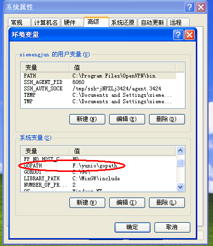
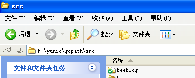

# 项目规划
做任何事情都需要做好规划，那么我们在开发博客系统之前，同样需要做好项目的规划，如何设置目录结构，如何理解整个项目的流程图，当我们理解了应用的执行过程，那么接下来的设计编码就会变得相对容易了
## gopath以及项目设置
假设指定gopath是文件系统的普通目录名，当然我们可以随便设置一个目录名，然后将其路径存入GOPATH。前面介绍过GOPATH可以是多个目录：在window系统设置环境变量；在linux/MacOS系统只要输入终端命令`export gopath=/home/astaxie/gopath`，但是必须保证gopath这个代码目录下面有三个目录pkg、bin、src。新建项目的源码放在src目录下面，现在暂定我们的博客目录叫做beeblog，下面是在window下的环境变量和目录结构的截图：

## 应用程序流程图
博客系统是基于模型-视图-控制器这一设计模式的。MVC是一种将应用程序的逻辑层和表现层进行分离的结构方式。在实践中，由于表现层从Go中分离了出来，所以它允许你的网页中只包含很少的脚本。
* 模型 (Model) 代表数据结构。通常来说，模型类将包含取出、插入、更新数据库资料等这些功能。
* 视图 (View) 是展示给用户的信息的结构及样式。一个视图通常是一个网页，但是在Go中，一个视图也可以是一个页面片段，如页头、页尾。它还可以是一个 RSS 页面，或其它类型的“页面”，Go实现的template包已经很好的实现了View层中的部分功能。
* 控制器 (Controller) 是模型、视图以及其他任何处理HTTP请求所必须的资源之间的中介，并生成网页。

下图显示了项目设计中框架的数据流是如何贯穿整个系统:

1. main.go作为应用入口，初始化一些运行博客所需要的基本资源，配置信息，监听端口。
2. 路由功能检查HTTP请求，根据URL以及method来确定谁(控制层)来处理请求的转发资源。
3. 如果缓存文件存在，它将绕过通常的流程执行，被直接发送给浏览器。
4. 安全检测：应用程序控制器调用之前，HTTP请求和任一用户提交的数据将被过滤。
5. 控制器装载模型、核心库、辅助函数，以及任何处理特定请求所需的其它资源，控制器主要负责处理业务逻辑。
6. 输出视图层中渲染好的即将发送到Web浏览器中的内容。如果开启缓存，视图首先被缓存，将用于以后的常规请求。

## 目录结构
根据上面的应用程序流程设计，博客的目录结构设计如下：

	|——main.go         入口文件
	|——conf            配置文件和处理模块
	|——controllers     控制器入口
	|——models          数据库处理模块
	|——utils           辅助函数库
	|——static          静态文件目录
    |——views           视图库

## 框架设计
为了实现博客的快速搭建，打算基于上面的流程设计开发一个最小化的框架，框架包括路由功能、支持REST的控制器、自动化的模板渲染，日志系统、配置管理等。

## 总结
本小节介绍了博客系统从设置GOPATH到目录建立这样的基础信息，也简单介绍了框架结构采用的MVC模式，博客系统中数据流的执行流程，最后通过这些流程设计了博客系统的目录结构，至此，我们基本完成一个框架的搭建，接下来的几个小节我们将会逐个实现。