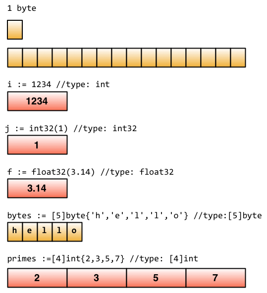

# 定义变量
Go语言里面定义变量有多种方式。

使用var关键字是Go最基本的定义变量方式，与C语言不同的是Go把变量类型放在变量名后面：
```go
//定义一个名称为“variableName”，类型为"type"的变量
var variableName type
```

定义多个变量
```go
//定义三个类型都是“type”的变量
var vname1, vname2, vname3 type
```

定义变量并初始化值
```go
//初始化“variableName”的变量为“value”值，类型是“type”
var variableName type = value
```

同时初始化多个变量
```go
/*
定义三个类型都是"type"的变量,并且分别初始化为相应的值
vname1为v1，vname2为v2，vname3为v3
*/
var vname1, vname2, vname3 type= v1, v2, v3
```

也可以直接忽略类型声明，那么上面的代码变成这样了：
```go
/*
	定义三个变量，它们分别初始化为相应的值
	vname1为v1，vname2为v2，vname3为v3
	然后Go会根据其相应值的类型来帮你初始化它们
*/
var vname1, vname2, vname3 = v1, v2, v3
```

继续简化：
```go
/*
定义三个变量，它们分别初始化为相应的值
vname1为v1，vname2为v2，vname3为v3
编译器会根据初始化的值自动推导出相应的类型
*/
vname1, vname2, vname3 := v1, v2, v3
```

`:=`这个符号直接取代了var和type,这种形式叫做简短声明。不过它有一个限制，那就是它只能用在函数内部；在函数外部使用则会无法编译通过，所以一般用var方式来定义全局变量。

_（下划线）是个特殊的变量名，任何赋予它的值都会被丢弃。在这个例子中，我们将值35赋予b，并同时丢弃34：
```go
_, b := 34, 35
```
> Go对于已声明但未使用的变量会在编译阶段报错，此时可以用下划线代替。

# 常量
所谓常量，也就是在程序编译阶段就确定下来的值，而程序在运行时无法改变该值。在Go程序中，常量可定义为数值、布尔值或字符串等类型。

它的语法如下：
```go
const constantName = value
//如果需要，也可以明确指定常量的类型：
const Pi float32 = 3.1415926
```

下面是一些常量声明的例子：
```go
const Pi = 3.1415926
const i = 10000
const MaxThread = 10
const prefix = "astaxie_"
```
Go 常量和一般程序语言不同的是，可以指定相当多的小数位数(例如200位)， 若指定給float32自动缩短为32bit，指定给float64自动缩短为64bit

# 内置基础类型
## Boolean
在Go中，布尔值的类型为bool，值是true或false，默认为false。
```go
//示例代码
var isActive bool  // 全局变量声明
var enabled, disabled = true, false  // 忽略类型的声明
func test() {
	var available bool  // 一般声明
	valid := false      // 简短声明
	available = true    // 赋值操作
}
```

# 数值类型
整数类型有无符号和带符号两种。Go同时支持int和uint，这两种类型的长度相同，但具体长度取决于不同编译器的实现。Go里面也有直接定义好位数的类型：rune, int8, int16, int32, int64和byte, uint8, uint16, uint32, uint64。其中rune是int32的别称，byte是uint8的别称。

> 需要注意的一点是，这些类型的变量之间不允许互相赋值或操作，不然会在编译时引起编译器报错。  
> 如下的代码会产生错误：invalid operation: a + b (mismatched types int8 and int32)
> > var a int8  
> > var b int32  
> > c:=a + b
> 另外，尽管int的长度是32 bit, 但int 与 int32并不可以互用。

浮点数的类型有float32和float64两种（没有float类型），默认是float64。

Go还支持复数。它的默认类型是complex128（64位实数+64位虚数）。如果需要小一些的，也有complex64(32位实数+32位虚数)。复数的形式为RE + IMi，其中RE是实数部分，IM是虚数部分，而最后的i是虚数单位。下面是一个使用复数的例子：
```go
var c complex64 = 5+5i
//output: (5+5i)
fmt.Printf("Value is: %v", c)
```

# 字符串
Go中的字符串都是采用UTF-8字符集编码。字符串是用一对双引号（""）或反引号（` `）括起来定义，它的类型是string。
```go
//示例代码
var frenchHello string  // 声明变量为字符串的一般方法
var emptyString string = ""  // 声明了一个字符串变量，初始化为空字符串
func test() {
	no, yes, maybe := "no", "yes", "maybe"  // 简短声明，同时声明多个变量
	japaneseHello := "Konichiwa"  // 同上
	frenchHello = "Bonjour"  // 常规赋值
}
```

在Go中字符串是不可变的，例如下面的代码编译时会报错：cannot assign to s[0]
```go
var s string = "hello"
s[0] = 'c'
```

如果真的想要修改怎么办呢？下面的代码可以实现：
```go
s := "hello"
c := []byte(s)  // 将字符串 s 转换为 []byte 类型
c[0] = 'c'
s2 := string(c)  // 再转换回 string 类型
fmt.Printf("%s\n", s2)
```

Go中可以使用+操作符来连接两个字符串：
```go
s := "hello,"
m := " world"
a := s + m
fmt.Printf("%s\n", a)
```

修改字符串也可写为：
```go
s := "hello"
s = "c" + s[1:] // 字符串虽不能更改，但可进行切片操作
fmt.Printf("%s\n", s)
```

如果要声明一个多行的字符串可以通过`来声明：
```go
m := `hello
	world`
```

` 括起的字符串为Raw字符串，即字符串在代码中的形式就是打印时的形式，它没有字符转义，换行也将原样输出。例如本例中会输出：
```shell
hello
	world
```

# 错误类型
Go内置有一个error类型，专门用来处理错误信息，Go的package里面还专门有一个包errors来处理错误：
```go
err := errors.New("emit macho dwarf: elf header corrupted")
if err != nil {
	fmt.Print(err)
}
```

# Go数据底层的存储
下面这张图来源于Russ Cox Blog中一篇介绍Go数据结构的文章，大家可以看到这些基础类型底层都是分配了一块内存，然后存储了相应的值。


# 一些技巧


