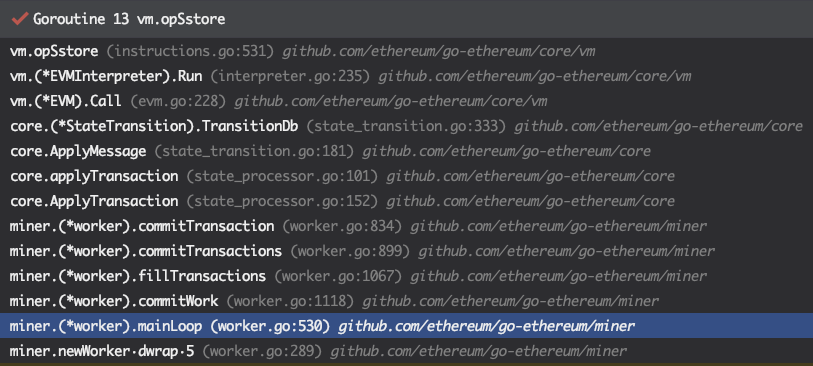

# 交易 (Transaction)
## 概述
前面的章节中，我们简述了一下Account/Contract的基本数据结构。在本章我们就来探索一下，Ethereum 中的一个基本数据结构 Transaction。在本文中，我们提到的交易指的是在Ethereum Layer-1层面上构造的交易。

交易(Transaction)是指由一个外部账户转移一定资产给某个账户， 或者发出一个消息指令到某个智能合约。

在以太坊网络中，交易执行属于一个事务。具有原子性、一致性、隔离性、持久性特点。
- 原子性： 是不可分割的最小执行单位，要么做，要么不做。
- 一致性： 同一笔交易执行，必然是将以太坊账本从一个一致性状态变到另一个一致性状态。
- 隔离性： 交易执行途中不会受其他交易干扰。
- 持久性： 一旦交易提交，则对以太坊账本的改变是永久性的。后续的操作不会对其有任何影响

因为是事务型，因此我们需确保在执行事务前让交易符合一些设计要求。
- 交易必须唯一，能区分不同交易且同一笔交易不能重复提交到账本中。
- 交易内容不得变化，每个节点收到的交易都必须一致，交易执行时账本状态变化也是一致的。
- 交易必须被合法签名，只有已正确签名的交易才能被执行。
- 交易不能占用过多系统资源，影响其他交易执行。

首先，Transaction 是 Ethereum 执行数据操作的媒介，它主要起到下面的几个作用:
1. 在Layer-1网络上的Account之间进行 Native Token 的转账。
2. 创建新的Contract。
3. 调用Contract中会修改目标Contract中持久化数据或者间接修改其他Account/Contract数据的函数。

这里我们对 Transaction 的功能性的细节再进行一些额外的补充。 
- <font color="green">Transaction 只能创建合约(Contract)账户，而不能用于创建外部账户(EOA)</font>。
- 如果调用Contract中的只读函数，是不需要构造Transaction的。相对的，所有参与Account/Contract数据修改的操作都需要通过Transaction来进行。
- 广义上的Transaction只能由外部账户(EOA)构建。Contract是没有办法显式构造Layer-1层面的交易的。在某些合约函数的执行过程中，Contract在可以通过构造internal transaction来与其他的合约进行交互，但是这种Internal transaction与我们提到的Layer-1层面的交易有所不同，我们会在之后的章节介绍。

## LegacyTx & AccessListTX & DynamicFeeTx
下面我们根据源代码中的定义来了解一下Transaction的数据结构。Transaction结构体的定义位于*core/types/transaction.go*中。Transaction的结构体如下所示。
```go
type Transaction struct {
    inner TxData    // Consensus contents of a transaction
    time  time.Time // Time first seen locally (spam avoidance)
    
    // caches
    hash atomic.Value
    size atomic.Value
    from atomic.Value
}
```

从代码定义中我们可以看到，`Transaction`的结构体是非常简单的，它只包含了五个变量分别是, `TxData`类型的inner，`Time`类型的time，以及三个`atomic.Value`类型的hash，size，以及from，缓存的原因是使用频次高且CPU计算量大。。这里我们需要重点关注一下`inner`这个变量。目前与Transaction直接相关的数据都由这个变量来维护。
> 需要注意，上面三个缓存使用都在有一个前提条件：交易对象一旦创建，交易内容不得修改。这也是为何交易对象中单独定义在私有的 txdata 中，而非直接定义在 Transaction 中的原因之一。

目前，`TxData`类型是一个接口，它的定义如下面的代码所示。
```go
type TxData interface {
    txType() byte // returns the type ID
    copy() TxData // creates a deep copy and initializes all fields
    
    chainID() *big.Int
    accessList() AccessList
    data() []byte
    gas() uint64
    gasPrice() *big.Int
    gasTipCap() *big.Int
    gasFeeCap() *big.Int
    value() *big.Int
    nonce() uint64
    to() *common.Address
    
    rawSignatureValues() (v, r, s *big.Int)
    setSignatureValues(chainID, v, r, s *big.Int)
}
```

这里注意，在目前版本的geth中(1.10.*)，根据EIP-2718的设计，原来的TxData现在被声明成了一个interface，而不是定义了具体的结构 <font color="red">（以太坊技术与实现引用的这部分代码中，就是使用的`txdata`类型的结构体）</font>。这样的设计好处在于，后续版本的更新中可以对Transaction类型进行更加灵活的修改。

目前，在Ethereum中定义了三种类型的Transaction来实现TxData这个接口。按照时间上的定义顺序来说，这三种类型的Transaction分别是，LegacyT，AccessListTx，DynamicFeeTx。
- LegacyTx：顾名思义，是原始的Ethereum的Transaction设计，目前市面上大部分早年关于Ethereum Transaction结构的文档实际上都是在描述LegacyTx的结构。
- AccessListTX：是基于EIP-2930(Berlin分叉)的Transaction。
- DynamicFeeTx：是[EIP-1559](https://eips.ethereum.org/EIPS/eip-1559)(伦敦分叉)生效之后的默认的Transaction。

(PS:目前Ethereum的黄皮书只更新到了Berlin分叉的内容，还没有添加London分叉的更新, 2022.3.10)

### LegacyTx
LegacyTx 是最原始的以太坊交易的定义。
```go
type LegacyTx struct {
    Nonce    uint64          // nonce of sender account
    GasPrice *big.Int        // wei per gas
    Gas      uint64          // gas limit
    To       *common.Address `rlp:"nil"` // nil means contract creation
    Value    *big.Int        // wei amount
    Data     []byte          // contract invocation input data
    V, R, S  *big.Int        // signature values
}
```

### AccessListTX
AccessListTx 在 LegacyTx 基础上多了 `ChainID` 和 `AccessList` 这两个变量。
```go
type AccessListTx struct {
    ChainID    *big.Int        // destination chain ID
    Nonce      uint64          // nonce of sender account
    GasPrice   *big.Int        // wei per gas
    Gas        uint64          // gas limit
    To         *common.Address `rlp:"nil"` // nil means contract creation
    Value      *big.Int        // wei amount
    Data       []byte          // contract invocation input data
    AccessList AccessList      // EIP-2930 access list
    V, R, S    *big.Int        // signature values
}
```

### DynamicFeeTx
如果我们观察DynamicFeeTx就会发现，DynamicFeeTx的定义其实就是在LegacyTx/AccessListTX的定义的基础上额外的增加了GasTipCap与GasFeeCap这两个字段。
```go
type DynamicFeeTx struct {
    ChainID    *big.Int
    Nonce      uint64
    GasTipCap  *big.Int // a.k.a. maxPriorityFeePerGas
    GasFeeCap  *big.Int // a.k.a. maxFeePerGas
    Gas        uint64
    To         *common.Address `rlp:"nil"` // nil means contract creation
    Value      *big.Int
    Data       []byte
    AccessList AccessList
    
    // Signature values
    V *big.Int `json:"v" gencodec:"required"`
    R *big.Int `json:"r" gencodec:"required"`
    S *big.Int `json:"s" gencodec:"required"`
}
```

## Transaction实现的接口
### 实现了rlp包中的Encoder和Decoder两个接口
```go
func (tx *Transaction) EncodeRLP(w io.Writer) error

func (tx *Transaction) DecodeRLP(s *rlp.Stream) error
```

### JSON接口
以太坊技术与实现中引用的版本实现了JSON接口的两个方法`MarshalJSON`和`UnmarshalJSON`，当前最新版本改为了`MarshalBinary`和`UnmarshalBinary`

## Transaction的生命周期
下图是一笔交易从出生到交易进入区块的关键流程。

1. 发起交易：此过程应该分为发起交易、交易签名、提交交易三步，用户可通过以太坊钱包或者其他调用以太坊节点API (eth_sendRawTransaction等)发送交易到一个运行中的以太坊 geth 节点。
2. 广播交易：此时，因为交易时通过节点的API接收，因此此交易被视为一笔来自本地(local)（图中用红球表示），在经过一系列校验和处理后。交易成功进入交易池，随后向已连接的邻近节点发送此交易。

当邻近节点，如矿工节点从邻近节点接收到此交易时，在进入交易池之前。会将交易标记为来自远方（remote）的交易（图中用绿球表示）。也需要经过校验和处理后，进入矿工节点的交易池，等待矿工打包到区块中。

如果邻近节点，不是矿工，也无妨。因为任何节点会默认将接受到得合法交易及时发送给邻近节点。得益于P2P网络，一笔交易平均在6s内扩散到整个以太坊公链网络的各个节点中。

> 进入以太坊交易池的交易被区分本地还是远方的目的是因为，节点对待local的交易和remote的交易有所差异。简单地说是 local 交易优先级高于 remote 交易。

## Transaction的执行
Transaction的执行主要在发生在两个Workflow中:
1. Miner(矿工)在打包新的Block时：此时Miner会按Block中Transaction的打包顺序来执行其中的Transaction。
2. 其他节点添加Block到Blockchain时：当节点从网络中监听并获取到新的Block时，它们会执行Block中的Transaction，来更新本地的State Trie的 Root，并与Block Header中的State Trie Root进行比较，来验证Block的合法性。

一条Transaction执行，可能会涉及到多个Account/Contract的值的变化，最终造成一个或多个Account的State的发生转移。在Byzantium分叉之前的Geth版本中，在每个Transaction执行之后，都会计算一个当前的State Trie Root，并写入到对应的`Transaction Receipt`中。这符合以太坊黄皮书中的原始设计。即交易是使得Ethereum状态机发生状态状态转移的最细粒度单位。读者们可能已经来开产生疑惑了，“每个Transaction都会重算一个State Trie Root”的方式岂不是会带来大量的计算(重算一次一个MPT Path上的所有Node)和读写开销(新生成的MPT Node是很有可能最终被持久化到LevelDB中的)？结论是显然的。因此在Byzantium分叉之后，在一个Block的验证周期中只会计算一次的`State Root`。我们仍然可以在`state_processor.go`找寻到早年代码的痕迹。最终，一个Block中所有Transaction执行的结果使得World State发生状态转移。下面我们就来根据geth代码库中的调用关系，从Miner的视角来探索一个Transaction的生命周期。

> 区块头数据解释：
> 
> - `miner`：是一个地址，表示区块是此账户的矿工挖出，挖矿奖励将下发到此账户。
> - `stateRoot`：是一个哈希值，表示执行完此区块中的所有交易后以太坊状态快照ID。因为以太坊描述为一个状态机系统，因此快照ID称之为状态哈希值。又因为状态哈希是由所有账户状态按默克尔前缀树算法生成，因此称为状态默克尔树根值。
> - `transactionsRoot`：是一个哈希值，表示该区块中所有交易生成一颗默克尔树根节点哈希值。是一个密码学保证交易集合摘要。通过此Root可以直接校验某交易是否包含在此区块中。
> - `receiptRoot`：是一个哈希值，同样是默克尔树根节点哈希值。由区块交易在执行完成后生成的交易回执信息集合生成。

### Transaction执行过程(?)
在Ethereum中，当Miner开始构造新的区块的时候，首先会启动*miner/worker.go*的 `mainLoop()`函数。具体的函数如下所示。
```go
func (w *worker) mainLoop() {
    ....
    // 设置接受该区块中挖矿奖励的账户地址
    coinbase := w.coinbase
    w.mu.RUnlock()

    txs := make(map[common.Address]types.Transactions)
    for _, tx := range ev.Txs {
        acc, _ := types.Sender(w.current.signer, tx)
        txs[acc] = append(txs[acc], tx)
    }
    // 这里看到，通过NewTransactionsByPriceAndNonce获取一部分的Tx并打包
    txset := types.NewTransactionsByPriceAndNonce(w.current.signer, txs, w.current.header.BaseFee)
    tcount := w.current.tcount
    //提交打包任务
    w.commitTransactions(txset, coinbase, nil)        
    ....
}
```
> 最新版代码有修改

调用链如下：
```
backend.go : func New(stack *node.Node, config *ethconfig.Config) (*Ethereum, error)
miner.go : func New(...) *Miner
worker.go : func newWorker(...) *worker
worker.go : func (w *worker) mainLoop()
```

在Mining新区块前，Worker首先需要决定，哪些Transaction会被打包到新的Block中。这里选取Transaction其实经历了两个步骤。首先，`txs`变量保存了从Transaction Pool中拿取到的合法的以及准备好被打包的交易。

这里举一个例子，来说明什么是**准备好被打包的交易**，比如Alice先后发了新三个交易到网络中，对应的Nonce分别是100和101，102。假如Miner只收到了100和102号交易。那么对于此刻的Transaction Pool来说Nonce 100的交易就是**准备好被打包的交易**，交易Nonce 是102需要等待Nonce 101的交易被确认之后才能提交。

在Worker从Transaction Pool中拿出若干的transaction, 赋值给*txs*之后, 然后调用`NewTransactionsByPriceAndNonce`函数按照Gas Price和Nonce对*txs*进行排序，并将结果赋值给*txset*。此外在Worker的实例中，还存在`fillTransactions`函数，为了未来定制化的给Transaction的执行顺序进行排序。

在拿到*txset*之后，mainLoop函数会调用`commitTransactions`函数，<font color="pink">正式进入Mining新区块的流程</font>。`commitTransactions`函数如下所示。

```go
func (w *worker) commitTransactions(txs *types.TransactionsByPriceAndNonce, coinbase common.Address, interrupt *int32) bool {
    // 首先给Block设置最大可以使用的Gas的上限
	gasLimit := env.header.GasLimit
    if env.gasPool == nil {
        env.gasPool = new(core.GasPool).AddGas(gasLimit)
    }
    var coalescedLogs []*types.Log
	
    // 函数的主体是一个For循环
    for{
        .....
			
        // params.TxGas表示了transaction 需要的最少的Gas的数量
        // w.current.gasPool.Gas()可以获取当前block剩余可以用的Gas的Quota，如果剩余的Gas不足以开启一个新的Tx，那么循环结束
	    if env.gasPool.Gas() < params.TxGas {
            log.Trace("Not enough gas for further transactions", "have", env.gasPool, "want", params.TxGas)
            break
        }
        // 获取下一个交易，如果全部完成则中止。
        tx := txs.Peek()
        if tx == nil {
            break
        }
        ....
		// 开始执行交易。
		env.state.SetTxContext(tx.Hash(), env.tcount)
        // 提交单条Transaction 进行验证
        logs, err := w.commitTransaction(tx, coinbase)
        ....
	}
}
```

`commitTransactions` 函数的主体是一个 for 循环，每次获取结构体切片头部的txs.Peek()的transaction，并作为参数调用函数miner/worker.go的`commitTransaction()`。`commitTransaction()`函数如下所示。
```go
func (w *worker) commitTransaction(tx *types.Transaction, coinbase common.Address) ([]*types.Log, error){
    // 在每次commitTransaction执行前都要记录当前StateDB的Snapshot,一旦交易执行失败则基于这个Snapshot进行回滚。
    // TODO StateDB如何进行快照(Snapshot)和回滚的
	var (
	    snap = env.state.Snapshot()
        gp   = env.gasPool.Gas()
    )
    // 调用执行Transaction的函数
    receipt, err := core.ApplyTransaction(w.chainConfig, w.chain, &env.coinbase, env.gasPool, env.state, env.header, tx, &env.header.GasUsed, *w.chain.GetVMConfig())
    ....
}
```

Blockchain系统中的Transaction和DBMS中的Transaction一样，要么完成要么失败。所以在调用执行Transaction的函数前，首先记录了一下当前world state的Snapshot，用于交易失败时回滚操作。之后调用core/state_processor.go/ApplyTransaction()函数。
```go
func ApplyTransaction(config *params.ChainConfig, bc ChainContext, author *common.Address, gp *GasPool, statedb *state.StateDB, header *types.Header, tx *types.Transaction, usedGas *uint64, cfg vm.Config) (*types.Receipt, error) {
    // 将Transaction 转化为Message的形式
	msg, err := TransactionToMessage(tx, types.MakeSigner(config, header.Number, header.Time), header.BaseFee)
    if err != nil {
        return nil, err
    }
    // Create a new context to be used in the EVM environment
	blockContext := NewEVMBlockContext(header, bc, author)
    vmenv := vm.NewEVM(blockContext, vm.TxContext{}, statedb, config, cfg)
    // 调用执行Contract的函数
    return applyTransaction(msg, config, gp, statedb, header.Number, header.Hash(), tx, usedGas, vmenv)
}
```

在 ApplyTransaction()函数中首先Transaction会被转换成Message的形式。在执行每一个Transaction的时候，都会生成一个新的EVM来执行。之后调用 `core/state_processor.go/applyTransaction()` 函数来执行Message。
```go
func applyTransaction(msg types.Message, config *params.ChainConfig, bc ChainContext, author *common.Address, gp *GasPool, statedb *state.StateDB, blockNumber *big.Int, blockHash common.Hash, tx *types.Transaction, usedGas *uint64, evm *vm.EVM) (*types.Receipt, error) {
    ....
    // 将交易应用于当前状态（包含在环境中）。
    result, err := ApplyMessage(evm, msg, gp)
    ....

}
```

之后调用 core/state_transition.go/ApplyMessage() 函数。
```go
func ApplyMessage(evm *vm.EVM, msg *Message, gp *GasPool) (*ExecutionResult, error) {
	return NewStateTransition(evm, msg, gp).TransitionDb()
}
```

之后调用 core/state_transition.go/TransitionDb() 函数。
```go
func (st *StateTransition) TransitionDb() (*ExecutionResult, error) {
	var (
	    contractCreation = msg.To == nil
    )
    ......
    var (
        ret   []byte
        vmerr error // 虚拟机错误不影响共识，因此不会被分配到err。
    )
	
	if contractCreation {
        // 创建合约
        ret, _, st.gasRemaining, vmerr = st.evm.Create(sender, msg.Data, st.gasRemaining, msg.Value)
    } else {
        // 为下一个交易增加nonce。
        st.state.SetNonce(msg.From, st.state.GetNonce(sender.Address())+1)
        ret, st.gasRemaining, vmerr = st.evm.Call(sender, st.to(), msg.Data, st.gasRemaining, msg.Value)
    }
    ......
}
```

之后调用 core/vm/evm.go/Call() 函数。
```go
func (evm *EVM) Call(caller ContractRef, addr common.Address, input []byte, gas uint64, value *big.Int) (ret []byte, leftOverGas uint64, err error) {
    ....
	if isPrecompile {
        ret, gas, err = RunPrecompiledContract(p, input, gas)
    } else {
        // 初始化一个新的合约，并设置EVM要使用的代码。该合约仅用于此执行上下文的作用域环境。
        code := evm.StateDB.GetCode(addr)
        if len(code) == 0 {
            ret, err = nil, nil // gas is unchanged
        } else {
            addrCopy := addr
            // 如果账户没有代码，我们可以在这里中止。深度检查已经完成，并且预编译处理在上面完成。
            contract := NewContract(caller, AccountRef(addrCopy), value, gas)
            contract.SetCallCode(&addrCopy, evm.StateDB.GetCodeHash(addrCopy), code)
            ret, err = evm.interpreter.Run(contract, input, false)
            gas = contract.Gas
        }
    }
    ....
}
```

之后调用 core/vm/interpreter.go/Run() 函数。
```go
// 运行循环并使用给定的输入数据评估合约的代码，并返回返回字节切片和发生错误（如果有）。
// 需要注意的是，解释器返回的任何错误都应被视为回滚并消耗所有燃气的操作，除了ErrExecutionReverted，它表示回滚并保留剩余燃气。
func (in *EVMInterpreter) Run(contract *Contract, input []byte, readOnly bool) (ret []byte, err error) {
    // 增加调用深度，其限制为1024。
    in.evm.depth++
	defer func() { in.evm.depth-- }()
    ...
	for {
		...
		// 从jump table中获取操作，并验证堆栈以确保有足够的堆栈项可用于执行操作。
		op = contract.GetOp(pc)
		operation := in.table[op] // table类型为JumpTable [256]*operation
        cost = operation.constantGas // For tracing
        // Validate stack
        if sLen := stack.len(); sLen < operation.minStack {
            return nil, &ErrStackUnderflow{stackLen: sLen, required: operation.minStack}
        } else if sLen > operation.maxStack {
            return nil, &ErrStackOverflow{stackLen: sLen, limit: operation.maxStack}
        }
        // UseGas 函数：当前剩余的gas quota减去input 参数。
        // 剩余的gas 小于input直接返回false
        // 否则当前的gas quota减去input并返回true
        if !contract.UseGas(cost) {
            return nil, ErrOutOfGas
        }
        ...
        // execute the operation
        res, err = operation.execute(&pc, in, callContext) // operation := in.table[op]
    }
}
```

在更细粒度的层面，每个opcode循环调用core/vm/jump_table.go中的execute函数。这里值得一提的是，获取Contract中每条Operate的方式，是从Contact中的code数组中按照第n个拿取。
```go
// GetOp returns the n'th element in the contract's byte array
func (c *Contract) GetOp(n uint64) OpCode {
    if n < uint64(len(c.Code)) {
        return OpCode(c.Code[n])
    }
    return STOP
}

// GetByte returns the n'th byte in the contract's byte array
func (c *Contract) GetByte(n uint64) byte {
    if n < uint64(len(c.Code)) {
       return c.Code[n]
    }

    return 0
}
```

OPCODE的具体实现代码位于`core/vm/instructor.go`文件中。比如，对Contract中持久化数据修改的OPSSTORE指令的实现位于opStore()函数中。而opStore的函数的具体操作又是调用了StateDB中的SetState函数，将Go-ethereum中的几个主要的模块串联了起来。
```go
func opSstore(pc *uint64, interpreter *EVMInterpreter, scope *ScopeContext) ([]byte, error) {
    loc := scope.Stack.pop()
    val := scope.Stack.pop()
    //根据指令跟地址来修改StateDB中某一存储位置的值。
    interpreter.evm.StateDB.SetState(scope.Contract.Address(),loc.Bytes32(), val.Bytes32())
    return nil, nil
}

//core/state/stateDB
func (s *StateDB) SetState(addr common.Address, key, value common.Hash) {
    stateObject := s.GetOrNewStateObject(addr)
    if stateObject != nil {
    stateObject.SetState(s.db, key, value)
    }
}
```

> TODO:这里代码发生了变化，暂时没看懂

对于一条调用合约函数的交易，其中必然会存在修改StateDB的操作。通过上述的函数调用关系，我们就完成了在一个新区块的形成过程中，Transaction如何修改StateDB的Workflow。




## 验证节点是如何执行 Transaction 来更新 World State


