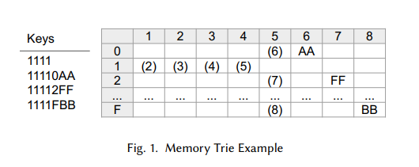
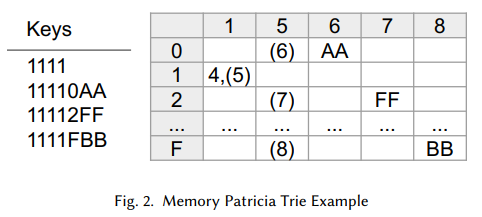
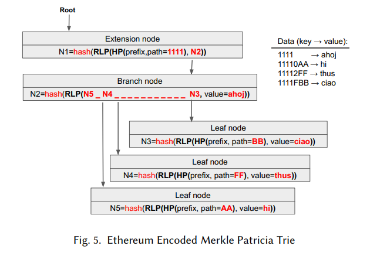

# Ethereum Data Structures
### KAMIL JEZEK, University of Sydney
以太坊平台运作时使用了丰富的数据结构、哈希和编码函数。主要的参考资料是黄皮书，此外还有很多非正式的博客。这些资料在某种程度上存在一定的限制。特别是黄皮书在简洁性和详细性之间没有达到理想的平衡，在某些部分过于详细，而在其他部分则过于浅显。而博客则常常过于模糊，有时还包含错误信息。为解决这个问题，我们提供了这份文档，总结了以太坊中使用的数据结构。目标是在保持简洁性的同时提供足够的详细信息。充分详细的正式视图通过示例来增强清晰度。

CCS概念：
- 通用与参考 → 调查和概述；
- 计算机系统组织 → 对等体系结构；
- 软件及其工程 → 虚拟机；对等体系结构；完整性；数据类型和结构；
- 计算理论 → 数据压缩；排序和搜索。

附加关键词和短语：以太坊、区块链、数据结构、Merkle、Patricia、树

## 1 介绍
区块链服务器作为一个自动分布式账本，包括所有的交易和状态。当区块链中的区块被执行时，它会不断修改状态，改变账户余额，生成交易收据等。这个系统是不停止的，接受新的交易，创建新的区块，不断增长状态。为了处理这种复杂性，尤其是不断增长的数据量，区块链架构师重新利用了计算机科学历史上已知的基本数据结构，但以新的形式组合它们。

由于区块链平台中使用的数据结构有时很复杂，有时只适用于以太坊，因此了解它们以能够理解平台本身非常重要。这对于希望扩展、修改、构建、进行研究等以太坊的研究人员和从业者尤为重要。在这个领域，存在两个主要的知识来源，第一个是官方文件，如黄皮书[49]，另一个是无尽的互联网博客。

我们认为，与数据结构特别相关的信息来源是有限的。合理的出版物涵盖了区块链和以太坊作为一个平台的更广泛的视角。让我们提到Kolb等人的工作[29]。他的工作向初学者介绍了区块链，涵盖了我们不涉及的挖矿、激励等方面，并比较了各种区块链平台。然而，当涉及到数据结构时，它相对肤浅，提供的细节不如在线博客。Lao等人[30]或Zhu等人[54]提供了更广泛的视角。这两篇论文都在有限的程度上概述了区块链的结构。从安全角度来看，张等人[53]讨论了区块链平台。

两篇学生论文，一篇是由Voulgari [48]撰写的，另一篇是由Hefele [19]撰写的，它们都详细描述了以太坊数据结构。特别是Hefele的工作非常相关，他使用UML图表对以太坊数据结构进行建模。根据我们的判断，这可能会在复杂的以太坊数据结构中带来清晰度。然而，这两篇论文只是将数据结构描述为分析存储在这些结构中的数据量的手段，本身并没有描述这些结构到展示数据如何在内存或磁盘中编码的程度。

Antonopoulos和Wood，以太坊的创始人，在他们的书[4]中提供了丰富的信息，或者在Bashir的另一本书[5]中也有。这两本出版物似乎主要面向以太坊的最终用户，因为它们详细介绍了所有周围的工具，但没有深入研究内部结构。

综上所述，唯一详尽的信息来源是黄皮书[49]。我们认为这本出版物并不理想，无法理解以太坊的数据结构。特别是，它将信息分散在出版物的附录中，有关数据编码的细节有时不清楚其与部分部分的关系。此外，这本出版物省略了智能合约数据在内存槽中的结构和存储信息。虽然他们这样做是有意的，因为数据格式留给了智能合约编译器，但我们认为这部分对于理解以太坊的数据组织至关重要。因此，我们还研究了Solidity编译器，以提供数据格式，并在本出版物中进行总结。

为了填补黄皮书各个部分缺失或不清晰的信息，我们不得不依赖于互联网博客。然而，它们的问题在于质量差异很大，因为它们更多地反映了人们的理解。为了应对这个限制，在某些情况下，我们不得不查阅以太坊客户端的源代码实现，即Parity[47]和Geth[15]，以确认某些细节。我们的目标是提供足够的细节，避免不必要的正式方法，就像黄皮书中的情况一样，但我们的目标是使用比许多博客提供的更好的细节。为了增加清晰度，我们提供了大量的例子和插图。

本论文的范围仅限于以太坊中使用的数据结构。我们不会详细讨论诸如区块挖掘、验证、执行、智能合约创建等领域。然而，在某些情况下，我们也会提及这些领域，以支持对数据结构的解释。

本文的结构如下所示。首先描述了基本数据结构，然后阐述了以Merkle Patricia Trie形式扩展这些结构。之后提供了区块的结构，接下来详细介绍了用于以太坊数据表示的Trie结构。

## 2 TREES AND TRIES
区块链平台需要从底层数据源中查找大量的密钥。由于分布式的性质，它们还需要具备可信赖性。因此，区块链平台试图采用高效的搜索和加密算法。它们主要使用和扩展以下章节中提到的数据结构。

### 2.1 Search Trees
树是一种有效搜索的标准方法之一。它们有各种形式，其中一些在Knuth的著名书籍《计算机程序设计艺术》第3卷[27]中有描述，其中在第6.2.2节中描述了一个非常常见的二叉搜索树。

二叉搜索树可以形成一个前缀树，其中具有相同前缀的键共享从根到叶子的相同路径。在这样的树中搜索键时，键从第一个字符迭代到最后一个字符，并且对于每个字符，检查树中是否存在与该字符匹配的子节点。树的遍历下降到子节点，选择下一个字符，并重复相同的步骤。

让我们详细讨论一下树的二进制编码算法。在这种情况下，每个节点可以根据二进制的0或1分支到左侧或右侧。所有可能的有效键都可以以其二进制形式存储在这样的键中。节点由根到子节点组成，以表示存储在此树中的所有键，对于每个节点，左侧或右侧分支以在键中的当前位置编码二进制的1和0。图3（左侧）显示了这样一个前缀树的示例。它编码了四个二进制键（作为图例显示）。这些键形成了从根节点到叶子点的四条路径（着色节点）。与示例中的键相反，诸如100、101之类的备选键在此树中没有编码，因为没有从根到叶子节点表示它们的路径。

这种数据结构在键经常具有相同前缀的数据中具有节省内存的好处。例如，存储IP4地址，因为这些地址对于相同的IP段具有相同的前缀。例如，IP4 CIDR块 192.168.56.0/30 包含一个始终相同且仅在剩余的2位上有所不同的30位值。在这种情况下，将该网络的所有可能主机（实际上只有四个可能的主机）存储在前缀树中是有效的。前缀树将需要 $30 + 2^2 = 34$ bits，而独立存储每个地址将需要 $32 × 2^2 = 128$ bits。

### 2.2 Patricia Trie
搜索树的明显缺点是，当没有分支时（即节点只有一个子节点），它必须通过多个子节点进行下降。例如，在图3的示例中，需要遍历两个节点才能重构所有以'11'为前缀的键。尽管示例展示了一个简单的二叉树，但对于N叉树同样存在这个问题。总会出现只有一个分支存在的情况。当键具有长的共同部分时，问题会增加，因为它在树中创建了长的单分支路径。

为了解决这个问题，Fredkin在他的论文[16]中提出了Trie Memory。他将这种新结构称为Trie，因为它用于信息检索。他将数据表示为一个表格，其中表格的列是节点，行是分支。行数取决于分支的数量。例如，表示二进制数据需要两行。相反，表示十六进制字符串需要0到F行。列数根据分支数量而变化。如果相同的数据在树中表示，那么树的深度等于列数。

这个表格的每个单元格可以包含一个子节点的引用或一个字符串。对于子节点的引用通过跳转到一个列的编号来表示。如果存储了字符串，那么它等价于键的后缀。它还终止了当前路径。

查找从输入键通过字符遍历开始。首先在行中找到当前位置的字符。如果该行包含一个字符串，该路径终止，并找到一个键。如果单元格包含指向另一个节点的链接（即另一列），则该列包含所有编码键的所有可能分支。要找到特定的键，需要取下一个输入键的字符，并找到与该字符匹配的行。这行与当前列确定了一个表格单元格。再次分析该单元格，并进行递归算法。如果单元格为空（即既没有下一列也没有字符串），则输入键未编码在表格中。

图1展示了一个内存Trie的示例，其中编码了四个具有十六进制字符的键。所有键的前四个字符（一个数字'1'）都是相同的。因此，前四列只是指向下一列。

然后分叉发生，即标记为‘5’的列包含对列‘6’、‘7’和‘8’的引用。列‘5’本身表示各行中键的下一个字符 - 行‘0’、‘2’和‘F’对应所有编码键中的第五个字符。最后，列‘6,7,8’包含键的后缀，因为不再需要分叉。

这种数据结构在速度方面非常有效，因为它可以表示为二维数组，并且可以通过该数组中的索引进行访问。另一方面，它具有很大的内存开销，尤其是当结构稀疏时。这个问题可以通过像Briandais [10]提出的将路径表示为链表来解决，这样一个节点的所有可能分支都被表示为树，从而组成了所有节点的Trie森林。

原始Trie结构的另一个缺点是它仅仅分组键的公共后缀。换句话说，它加快了以相同后缀结尾的键的查找速度。当然，具有相同前缀的键的数据集也可以简单地通过以相反顺序保存数据来建模。然而，这并没有解决键在一般情况下趋向于具有共同路径（在键的中间）的情况。

Morrison在他的名为“编码为字母数字的实用检索信息算法”的工作中（即Patricia）解决了这个缺点。这种结构是使用一种更多优化的Trie。每个节点包含一定数量的位，当匹配一个键时，可以跳过这些位，因为数据集中的所有键都具有相同的路径。当跳过了这些位时，树会根据下一个位向左或向右分支。

图3中的示例在右侧可视化了一个Patricia Trie。数据集中的所有键都以11开头，因此可以跳过两个位（我们将其可视化为从根节点出发的标记为11的边）。因此，分叉从键的第三位开始。键的后缀11和110也被分组，但这已经是原始Trie设计的一个特点，我们在这里只是将其可视化为树而不是表格。

需要注意的是，Patricia Trie最初是为二叉树提出的，但现在实际上用于N叉树。例如，可以轻松地将图1中的示例表示为Patricia格式。在图2中进行了可视化，其中元组“4(5)”表示在访问列‘5’之前，已经跳过了四列（即相同的字符）。

### 2.3 Merkle Trees
Ralph Merkle 开发并描述了一种用于数字签名数据集并希望快速验证数据一致性的数据结构。他称之为 Merkle 树[32]。Merkle 树计算密码哈希，使得树中的每个节点都包含其子节点的哈希。树的叶子节点链接了编码数据集的值。自然地，使用非对称哈希以防止恢复原始值。

这种数据结构的目的是允许各方在不需要交换数据集本身的情况下验证数据集的一致性。在分布式环境中特别有用，因为由于数据集的大小，对物理数据进行分析是不切实际的。

Merkle 树，有时称为 Merkle 证明，通过提供一个唯一的哈希来防止数据被恶意或无意地修改，从而标识数据集。只有当另一个数据集计算出相同的哈希时，才能证明这两个数据集是相同的，否则它们是不同的。由于这个特性，在任何数据交换中，参与者可以轻松验证他们获得了他们期望的数据，或者在同步数据集时，参与者可以轻松验证他们最终获得了相同的结果。

由于每个数据子集也被哈希，如果参与者不需要处理完整的数据集，他们可以只交换子哈希。如果任何节点的值被篡改，从该节点到根节点的所有哈希都不匹配，并且无需遍历完整的数据集即可揭示此错误。

区块链平台本质上涉及不信任的分布式参与方，同时需要管理共享数据。在这种情况下，Merkle 树作为理想的解决方案，因为它们提供了哈希的有效性证明。此外，哈希值较小，因此非常适合在互联网上传输。

图6中间的树展示了这个原则在一个二叉树上的应用。正如可以看到的那样，从下往上的每个节点都被哈希，通过一个名为𝑎𝑠ℎ的函数在抽象层面上可视化。叶子节点只对自身进行哈希，而所有其他父节点则对其子节点的递归哈希进行哈希。当需要在各方之间验证数据一致性时，可以验证任何节点的哈希。
Merkle树最初只包含哈希值，而数据集的值则存储在外部。这意味着树是建立在一个数据集之上的，这个数据集可以由任何其他的数据结构来建模。区块链和以太坊提出了一种结构，将所有的哈希和数据包装在一个树中。其描述将在下一节中给出。

## 3 MERKLE PATRICIA TRIE
MPT（Merkle Patricia Trie）[49，附录D]是一种结合和扩展了帕特里夏树（Patricia trie）和默克尔树（Merkle tree）的数据结构。与Patricia Trie的设计方式相同，它有效地存储主键，并将它们的共同路径分组在一个节点中。作为一种防篡改的数据验证，它使用了默克尔树。这种新的数据结构在将这两种数据结构结合在一起方面是独特的。它被组织为一棵树，每个节点都被默克尔证明的意义下进行哈希，并且根据Patricia Trie的意义下分组共同路径。

以数据持久性为目标，以太坊的作者提出了具有持久性的Merkle Patricia Trie。从读取黄皮书就可以看出这一点。尽管在附录D的第D1段中写道：“没有明确假设存储了什么数据”，但接下来的段落中写道：“实现将维护一个节点数据库”。由于他们预期实现将存储树节点，这就解释了为什么所有的键、数据和哈希都存储在一个树结构中。换句话说，Merkle Patricia Trie不仅代表一种数据结构，还代表了数据库模式。

将数据结构与数据库方案紧密耦合的设计使得在非结构化数据库中存储结构化数据变得容易，例如键值数据库。这一意图在两个主要客户端Parity和Geth中都是明显的，它们分别使用键值存储RocksDB[7]和LevelDB[31]。然而，这样的设计通常很难进行优化。研究人员已经讨论过以太坊存在存储膨胀[25，37，42]和由于连续计算哈希引起的读写放大而导致性能下降的问题[40]。

这种新的结构允许将键和后缀的共同部分存储在一个节点中，并且只在需要分支时才使用节点进行分支。这些想法是从Patricia Trie中重用的，然而，这种新的数据结构允许16个分支，并且存储十六进制字符串而不是位。当键具有共同部分时，该部分直接存储在节点中，而不仅仅存储要跳过的位数，这是最初为Patricia Trie发明的。为了使用默克尔证明，当Merkle Patricia Trie引用子节点时，它引用其哈希值。

Merkle Patricia Trie定义了三种类型的节点，其结构如下：
- Branch – a 17-item node [𝑖0,𝑖1, ...,𝑖15, 𝑣𝑎𝑙𝑢𝑒]
- Extension – A 2-item node [𝑝𝑎𝑡ℎ, 𝑣𝑎𝑙𝑢𝑒]
- Leaf – A 2-item node [𝑝𝑎𝑡ℎ, 𝑣𝑎𝑙𝑢𝑒]

分支节点用于分支发生的地方，即在某个字符位置上，键开始有所不同。前16个项目用于分支，这意味着该节点允许0-𝐹十六进制字符有16个可能的分支。这个概念在内存Trie结构中是熟悉的，其中分支被构建为表中的一列。当子节点存在时，第𝑖个位置包含对子节点的链接，即该位置对应于键中的下一个字符（十六进制0-𝐹）。第17个项目存储一个值，仅在该节点终止（对于某个键）时使用。

扩展节点是压缩发生的地方。每当有多个键共有的部分时，该部分存储在此节点中。换句话说，它防止了在只有一条路径的情况下多次下降。这个节点类似于Patricia跳过位数的特性。

叶节点终止了树中的路径。它也使用压缩，将键的共同后缀分组存储在路径中，这是从内存Trie中重新使用的概念。

Merkle-Patricia Trie的示例如图4所示。与图3中的先前示例相比，该示例将键显示为十六进制数。如示例所示，所有键都具有相同的前缀1111，因此创建了扩展节点作为根节点-它将此前缀分组。然后键开始有所不同，通过创建分支节点来捕获。该节点在所有键的相同位置上的字符上分支。特别地，为字符'0'，'2'和'𝐹'创建了分支。仅具有'1111'的键在此处终止，这意味着该键的值存储在此分支节点中。其余的键形成叶节点，因为没有更多的分支。叶节点存储每个键的后缀，并存储键的值。

此示例未详细说明哈希计算，仅集中于此数据结构的“Patricia部分”，以更好地可视化节点形式。实际上，来自父节点的每个链接（即图像中的箭头）必须指向子节点的哈希表示。这个概念已经在Merkle树的图3中展示过。我们可以在高层次上写下一个指向子节点的链接是ℎ𝑎𝑠ℎ(𝑛𝑜𝑑𝑒)。然而，Merkle Patricia Trie结构的节点是多元素（结构化）记录，而哈希函数计算的是二进制字符串的哈希值。因此，节点必须从结构化形式编码为字节数组。这将在下一节中详细说明。

## 4 DATA STRUCTURES ENCODING
本节详细介绍了Trie结构的编码，它允许将Trie节点的结构化格式表示为字节数组。这使得节点适合进行哈希和持久化。将结构化节点转换为数组有两个主要步骤：十六进制前缀编码和递归长度前缀。

### 4.1 十六进制前缀编码（Hex Prefix Encoding）
Merkle-Patricia trie中存储的数据被编码为一系列字节。Leaf和Extension节点使用HP Hex-Prefix-Encoding函数进行编码。HP在Yellow Paper [49，附录C]中有正式定义，其目的是将任意一系列nibble编码为二进制流，以使两个（4位）nibble组成一个（8位）字节。

更正式地说，nibble被编码为以下序列：$\{16x_i + x_{i+1} | i ∈ [0, . . . , ||x || − 1)\}$。

此外，该序列前缀为一个nibble，具有两个目的。次低位是一个标志位，表示节点是Leaf还是Extension。对于Extension节点，该位被设置为'0'，对于Leaf节点，该位被设置为'1'。同一个nibble的最低位是一个标志位，对于编码数据的长度为偶数，该位被设置为'0'，对于奇数长度，该位被设置为'1'。如下表所示：

| Hex | Bits| Node Type | Path |
|---|---|---|------|
| 0 | 0000 | Extension | even |
| 1 | 0001 | Extension | odd|
| 2 | 0010 | Leaf | even|
| 3 | 0011 | Leaf | odd|

判断字节的数量是奇数还是偶数对于填充以便能够重新构建原始值进行解码是很重要的。持久化的字节必须始终是偶数，因为结果的字节数组将始终存储为偶数长度（因为标准计算机无法只存储半个字节）。例如，如果不能确保长度为偶数，并且编码了一个十六进制值'0𝑥10'，那么将无法确定原始字节是两个值为'1'和'0'的字节，还是一个值为'1'的字节。另一方面，如果已知字节的数量始终是偶数，值'0𝑥10'只能表示两个值：'1'和'0'。

在第一个前缀字节之后，如果字节的数量是奇数，则插入另一个值为'0'的字节。这个零是填充位，将字节的数量扩展为偶数。如果字节的数量已经是偶数，则不使用这个额外的字节，并且编码路径在第一个字节之后立即继续。

以下是对HP的几个示例总结。括号表示一个字节，包含两个字节。正如可以看到的，对于偶数长度，添加了一个填充零作为第二个字节，而对于奇数长度，数据直接跟随第一个字节：

| Prefix    |   Payload           |Node Type|    Path Length|
|-----------|---|---|---|
| [0, 0]    |   [$𝑥_1𝑥_2$][$𝑥_3𝑥_4$]      |Extension|    偶数|
| [1, $𝑥_1$] |   [$𝑥_2𝑥_3$][$𝑥_4𝑥_5$]      |Extension|    奇数|
| [2, 0]    |   [$𝑥_1𝑥_2$][$𝑥_3𝑥_4$]      |Leaf     |    偶数|
| [3, $𝑥_1$]  |   [$𝑥_2𝑥_3$][$𝑥_4, 𝑥_5$]    |Leaf     |    奇数|

让我们通过两个示例总结一下，展示使用HP编码的一个偶数字符串和一个奇数字符串。第一个示例编码了奇数个字符。因此，前缀'1'（也可以是'3'）紧随其后，然后是有效载荷，两个字符存储在一个字节中。第二个示例包含偶数个字符。因此，前缀'0'（或可能是'2'）后面跟随额外的填充'0'，然后是有效载荷。

$$[5, 6, 7, 8, 9] → [15, 67, 89] ∨ [35, 67, 89]$$

$$[4, 5, 6, 7, 8, 9] → [00, 45, 67, 89] ∨ [20, 45, 67, 89]$$

### 4.2 递归长度前缀（Recursive Length Prefix，简称RLP）
在使用HP之后，它会将节点结构编码为压缩的字节数组。然而，Trie节点仍然包含更多的数组（即扩展节点是一个包含17个值/数组的结构，因此包含17个值/数组，叶子节点和扩展节点包含两个数组）。将这些数组展平为一个字节数组结构，以便稍后在键值存储中持久化是实际可行的。为了计算哈希值，必须将数组展平，因为哈希函数无法应用于结构化形式。

黄皮书[49，附录B]定义了一个RLP函数，它将一组输入数组序列化为一个数组。因此，使用此函数可以将Trie中的一个节点转换为扁平的字节数组，并将其作为一个值持久化到键值存储中。黄皮书详细说明了RLP函数的形式，但本质上，该函数将数组序列化，以便将所有子数组输出到一个长数组中。表示原始子数组的每个序列都以其长度和一个位掩码作为前缀，以确定子数组最初是数组还是字符串。展平结构的每个级别也以所有子数组的总长度作为前缀。以下是RLP编码的详细信息：

字节值最高为127。这样的单个字节会直接存储，不做修改。我们可以简单地写出输入字节𝑏的转换方式：

$$ 𝑅𝐿𝑃 : 𝑏 → 𝑏 $$

字符串长度最长为55个字符。对于编码输入字符串𝑠，使用的转换方式是：

$$ 𝑅𝐿𝑃 : 𝑠 → [0x80 + ||𝑠||,𝑠] $$

其中，值$||𝑠||$表示字符串𝑠的长度，字符串本身跟随这个前缀。正如可以看到的，这种短字符串（最多55个字符）的转换非常高效，因为它只需要一个额外的字节，该字节存储了前缀和字符串长度。

总长度最长为55个字符的数组。对于累计长度最多为55个字符的数组，包括可能的嵌套数组，RLP函数将一组数组 𝑆 转换如下：

$$ 𝑅𝐿𝑃 : 𝑆 → [0xc0 + ||𝑒𝑥(𝑆)||, 𝑒𝑥(𝑆)] $$

函数𝑒𝑥扩展了集合𝑆，以便对该集合中的每个数组进行RLP编码的计算。

$$ 𝑒𝑥 : 𝑆 → (𝑅𝐿𝑃(𝑠𝑖)|𝑠𝑖 ∈ 𝑆) $$

正如可以看到的，对于这样的数组编码是高效的，只需要一个字节来存储前缀和总长度。

长度不超过$2^{64}$个字符的字符串。对于长度超过55个字符的字符串，String 𝑠的RLP函数计算如下：

$$ 𝑅𝐿𝑃 : 𝑠 → [0xb7 + 𝑛𝑢𝑚𝐵(||𝑠||), ||𝑠||,𝑠] $$

函数𝑛𝑢𝑚𝐵：𝑁 → 𝑁 计算存储输入值所需的字节数。换句话说，对于字符串𝑠的长度，这个函数告诉我们需要多少字节来存储这个长度。例如，长度不超过0xFF个字符的字符串需要一个字节来表示它们的长度，长度在0xFF和0xFFFF之间的字符串需要两个字节，依此类推。此外，这个变种的RLP函数先产生𝑠的长度，最后跟着字符串本身。

这个变种的RLP函数需要更多的字节来表示前缀。除非字符串非常大，否则这个函数仍然是相当高效的。例如，长度不超过0xFFFF的字符串需要额外的三个字节来进行编码（1个字节用于前缀，2个字节用于长度）。

长度不超过$2^{64}$个字符的数组。对于累积长度超过55个字符的嵌套数组，类似于前面的情况，RLP函数打印一个前缀，表示长度所需的字节数，长度本身，然后是递归地RLP编码的有效负载。形式上，数组𝑆被编码为：

$$ 𝑅𝐿𝑃 : 𝑆 → [0xf7 + 𝑛𝑢𝑚𝐵(||𝑒𝑥(𝑆)||), ||𝑒𝑥(𝑆)||, 𝑒𝑥(𝑆)] $$

长度超过$2^{64}$的有效负载。这样大小的字符串或数组都无法进行编码。
让我们用四个例子来说明RLP函数。第一个例子是对简单字符串𝐴𝐵𝐶𝐷进行编码-它使用了前缀0x80加上字符串的大小：4：

$$ 𝐴𝐵𝐶𝐷 →[0x80 + 4, 𝐴, 𝐵,𝐶, 𝐷] $$

第二个例子是对包含𝐴𝐵和𝐶𝐷𝐸两个数组进行编码-使用了前缀0xc0，加上剩余编码有效负载的长度：

$$ [𝐴𝐵][𝐶𝐷𝐸] →[0xc0 + 7, 0x80 + 2, 𝐴, 𝐵, 0x80 + 3,𝐶, 𝐷, 𝐸] $$

第三个例子是对一个长字符串进行编码。假设我们有一个长度为300个字符的字符串，为了节省空间，我们将这个字符串进行简写，只写出：𝐴 · · · 𝐵。为了表示长度，我们需要用十六进制形式表示0x12C ≡ 300。这个数字需要两个字节来表示。我们使用长字符串的前缀：0xb7，并添加2，表示长度的两个字节紧随其后，然后是字符串本身：

$$ 𝐴 · · · 𝐵 →[0xb7 + 2, 0x1, 0x2C, 𝐴, · · · , 𝐵] $$

最后一个例子中，递归地存储了两个数组 [𝐴 · · · 𝐵][𝐴𝐵𝐶𝐷]，其中一个包含一个长字符串，而另一个包含一个短字符串。我们从底向上进行编码，即应用在先前例子中使用的长字符串和短字符串的两个规则。它创建了两个字节序列 [0xb7 + 2, 0x1, 0x2C, 𝐴, · · · , 𝐵] 和 [0x80 + 4, 𝐴, 𝐵,𝐶, 𝐷]，这些在先前例子中已经知道。为了完成编码，我们首先使用长数组的前缀：0xf7。然后我们计算新负载的长度，即0x134 ≡ 308。仍然需要两个字节来存储。最终的编码将包含前缀0xf7加2，字节0x1，0x34，最后是两个已经编码的数组，总共：

$$
\begin{equation}\begin{split}
[𝐴 · · · 𝐵][𝐴𝐵𝐶𝐷] →&[0xf7 + 2, 0x1, 0x34,\\
&0xb7 + 2, 0x1, 0x2C, 𝐴, · · · , 𝐵,\\
&0x80 + 4, 𝐴, 𝐵,𝐶, 𝐷] \\
\end{split}\end{equation}
$$

RLP函数的目的是将结构化的节点形式转换为单个字节数组。对于JavaScript和Web开发人员来说，这个概念类似于JSON的一种变体。然而，RLP被设计为更节省内存，因为它只需要几个前缀字节。相比之下，JSON是一种文本标记语言，其中包含特殊字符来标记结构的开始和结束（例如数组、对象等）。例如，JSON始终需要至少两个字节来标记数组的开始和结束，使用'['和']'字符。另一方面，由于重复字符的存在，JSON通常可以被广泛压缩[1]。

RLP函数还是将节点哈希化的先决条件。一旦节点被转换为字节数组，就可以应用非对称哈希函数。这从根本上实现了Merkle Patricia Trie中的Merkle证明。

图5中的示例补充了先前的图4，用于可视化以太坊中使用的节点编码。图像显示，扩展节点和叶节点中的路径首先通过HP进行编码，然后每个节点通过RLP编码转换为字节数组。然后，整个节点可以进行哈希处理。之后，每个父节点通过添加Merkle证明引用其子节点。

### 4.3 持久化在键-值存储中的意义
一旦字典树中的节点通过HP和RLP进行编码，每个节点就只表示为一组字节数组。这使得它适用于存储在键值数据库中，因为这些数据库通常设计用于将键和值表示为简单的数据结构，即字节数组。

由于所有节点都经过了哈希处理，无法揭示它们的原始值。因此，不可能只在数据库中存储哈希值。以太坊通过在数据库中同时存储哈希值和纯文本（仅RLP编码）值来解决这个问题。以太坊使用哈希函数Keccak [38]，它是SHA3正式发布之前提供的原始实现。

每个节点在数据库中存储为一个键值对，其中键是节点的哈希RLP表示，值是RLP编码的节点。我们可以将一个节点在数据库中表示为：

$$𝑘𝑒𝑐𝑐𝑎𝑘(𝑅𝐿𝑃(𝑛𝑜𝑑𝑒)) → 𝑅𝐿𝑃(𝑛𝑜𝑑𝑒)$$

在键值存储格式中： $𝑘𝑒𝑦 ≡ 𝑘𝑒𝑐𝑐𝑎𝑘(𝑅𝐿𝑃(𝑛𝑜𝑑𝑒))$ 和 $𝑣𝑎𝑙𝑢𝑒 ≡ 𝑅𝐿𝑃(𝑛𝑜𝑑𝑒)$。根据节点类型，每个节点的内容有所不同：
- 扩展节点 𝑛𝑜𝑑𝑒 ≡ [𝐻𝑃(𝑝𝑟𝑒𝑓 𝑖𝑥 + 𝑝𝑎𝑡ℎ), 𝑘𝑒𝑦]
- 分支节点 𝑛𝑜𝑑𝑒 ≡ [𝑏𝑟𝑎𝑛𝑐ℎ𝑒𝑠, 𝑣𝑎𝑙𝑢𝑒]
- 叶子节点 𝑛𝑜𝑑𝑒 ≡ [𝐻𝑃(𝑝𝑟𝑒𝑓 𝑖𝑥 + 𝑝𝑎𝑡ℎ), 𝑣𝑎𝑙𝑢𝑒]

其中扩展节点中的𝑘𝑒𝑦是子节点的哈希键。在分支节点中，$𝑏𝑟𝑎𝑛𝑐ℎ𝑒𝑠 = (𝑘𝑒𝑦𝑖 |0 ≤ 𝑖 ≤ 15)$，𝑘𝑒𝑦𝑖是子节点的哈希键（如果分支存在），否则为空。对于这两种节点类型，键由前面提到的公式计算得出：$𝑘𝑒𝑦 = 𝑘𝑒𝑐𝑐𝑎𝑘(𝑅𝐿𝑃(𝑛𝑜𝑑𝑒𝑐))$，𝑛𝑜𝑑𝑒𝑐是子节点。

需要注意的是，键的哈希表示是根据节点的整个RLP表示计算得出的。
ii
由于节点包含子节点的哈希（除非它是叶子节点），这实际上构建了此数据结构的默克尔部分，因为当前节点的哈希是基于子节点哈希计算的。

最后，以太坊使用了另一种优化：节点内联。如果子节点的RLP编码长度小于32字节，则不计算哈希，并且该节点直接存储在父节点中。这种技术进一步压缩了短节点的数据结构。

