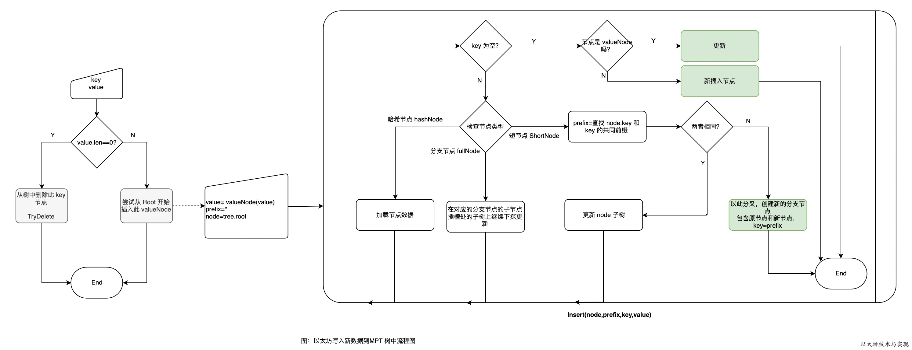
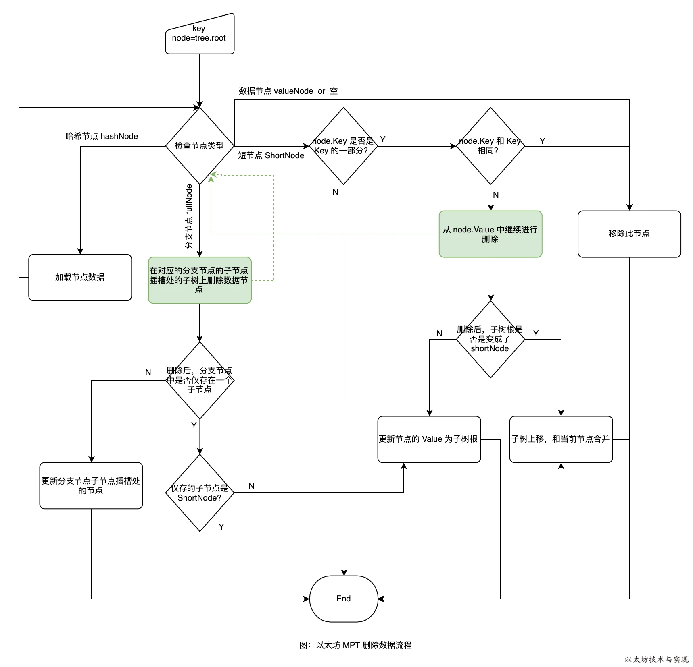
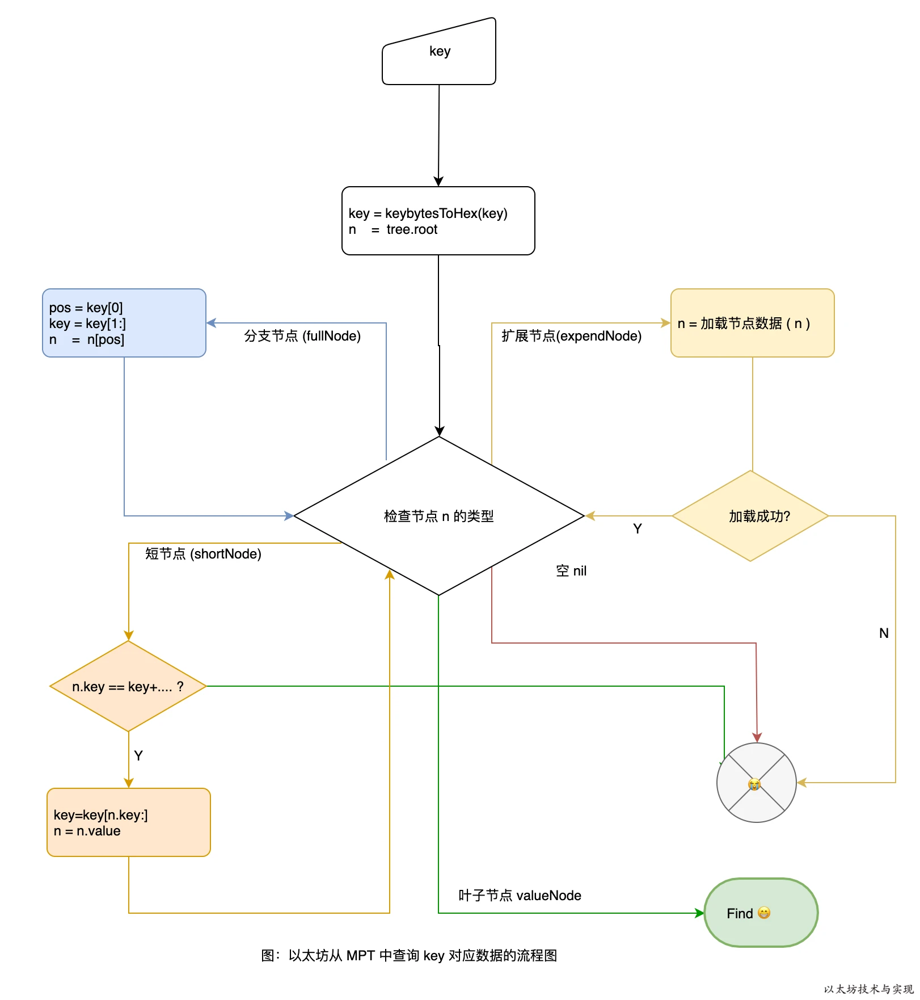

包trie 实现了Merkle Patricia Tries，这里用简称MPT来称呼这种数据结构，这种数据结构实际上是一种Trie树变种，MPT是以太坊中一种非常重要的数据结构，用来存储`用户账户的状态及其变更`、`交易信息`、`交易的收据信息`。<font color="pink">MPT实际上是三种数据结构的组合，分别是Trie树， Patricia Trie， 和Merkle树。</font>下面分别介绍这三种数据结构。Merkle Tree(默克尔树) 用于保证数据安全，Patricia Tree(基数树,也叫基数特里树或压缩前缀树) 用于提升树的读写效率。

## 简述
以太坊不同于比特币的 UXTO 模型，在账户模型中，账户存在多个属性（余额、代码、存储信息），属性（状态）需要经常更新。因此需要一种数据结构来满足几点要求：
- ①在执行插入、修改或者删除操作后能快速计算新的树根，而无需重新计算整个树。
- ②即使攻击者故意构造非常深的树，它的深度也是有限的。否则，攻击者可以通过特意构建足够深的树使得每次树更新变得极慢，从而执行拒绝服务攻击。
- ③树的根值仅取决于数据，而不取决于更新的顺序。以不同的顺序更新，甚至是从头重新计算树都不会改变树的根值。
要求①是默克尔树特性，但要求②③则非默克尔树的优势。 对于要求②，可将数据 Key 进行一次哈希计算，得到确定长度的哈希值参与树的构建。而要求③则是引入位置确定的压缩前缀树并加以改进。

## Trie树
在计算机科学中,Trie树，又称字典树，单词查找树或者前缀树，是一种用于快速检索的多叉树结构，如英文字母的字典树是一个26叉树，数字的字典树是一个10叉树。是一种有序树，用于保存关联数组，其中的键通常是字符串。 与二叉查找树不同，键不是直接保存在节点中，而是由节点在树中的位置决定。 一个节点的所有子孙都有相同的前缀，也就是这个节点对应的字符串，而根节点对应空字符串。 一般情况下，不是所有的节点都有对应的值，只有叶子节点和部分内部节点所对应的键才有相关的值。

Trie树可以利用字符串的公共前缀来节约存储空间。如下图所示，该trie树用10个节点保存了6个字符串：tea，ten，to，in，inn，int：


在该trie树中，字符串in，inn和int的公共前缀是“in”，因此可以只存储一份“in”以节省空间。当然，如果系统中存在大量字符串且这些字符串基本没有公共前缀，则相应的trie树将非常消耗内存，这也是trie树的一个缺点。

Trie树的基本性质可以归纳为：
- 根节点不包含字符，除根节点以外每个节点只包含一个字符。
- 从根节点到某一个节点，路径上经过的字符连接起来，为该节点对应的字符串。
- 每个节点的所有子节点包含的字符串不相同。

## Patricia Tries (压缩前缀树)
`前缀树`跟`Trie树`的不同之处在于Trie树给每一个字符串分配一个节点，这样将使那些很长但又没有公共节点的字符串的Trie树退化成数组。在以太坊里面会由黑客构造很多这种节点造成拒绝服务攻击。前缀树的不同之处在于如果节点公共前缀，那么就使用公共前缀，否则就把剩下的所有节点插入同一个节点。Patricia相对Tire的优化正如下图：


上图存储的8个Key Value对，可以看到前缀树的特点。(路径是key，叶子结点是value)

|Key|value|
| ------------- | ---: |
|6c0a5c71ec20bq3w|5|
|6c0a5c71ec20CX7j|27|
|6c0a5c71781a1FXq|18|
|6c0a5c71781a9Dog|64|
|6c0a8f743b95zUfe|30|
|6c0a8f743b95jx5R|2|
|6c0a8f740d16y03G|43|
|6c0a8f740d16vcc1|48|

## Merkle树
Merkle Tree，通常也被称作Hash Tree，顾名思义，就是存储hash值的一棵树。Merkle树的<font color="pink">叶子</font>包含存储数据或其哈希值。<font color="pink">非叶节点</font>是其对应子节点串联字符串的hash。


Merkle Tree的主要作用是当我拿到Top Hash的时候，<font color="pink">这个hash值代表了整颗树的信息摘要，当树里面任何一个数据发生了变动，都会导致Top Hash的值发生变化。</font>而Top Hash的值是会存储到区块链的区块头里面去的， 区块头是必须经过工作量证明。 这也就是说我只要拿到一个区块头，就可以对区块信息进行验证。 ~~更加详细的信息请参考[这个博客](http://blog.csdn.net/wo541075754/article/details/54632929)。有详细的介绍。~~

### 以太坊的MPT
每一个以太坊的区块头包含三颗MPT树，分别是
1. 世界状态树包括了从地址到账户状态之间的映射。 世界状态树的根节点哈希值由区块保存（stateRoot 字段），它标识了区块创建时的当前状态。整个网络中只有一个世界状态树。
3. 交易树记录了一个区块中的所有交易信息。交易树的根节点哈希值由区块保存（transactionsRoot 字段），它是当前区块内所有交易组成的树。每个区块都有一棵交易树。
4. 交易收据树记录了一个区块中的所有交易收据信息。同样由区块保存（receiptsRoot 字段），它是当前区块内所有交易收据组成的树。每个区块都有一棵交易收据树。

> 账户存储树保存了与某一智能合约相关的数据信息。账户存储树的根节点由账户状态保存（storageRoot 字段）。每个账户都有一个账户存储树。


下图中是两个区块头，区块头构成如下


其中`state root`，`tx root`，`receipt root`分别存储了这三棵树的树根，第二个区块显示了当账号175的数据变更(27 -> 45)的时候，只需要存储跟这个账号相关的部分数据，而且老的区块中的数据还是可以正常访问。(这个有点类似与函数式编程语言中的不可变的数据结构的实现)


结构为


为了解决基数树的效率问题，以太坊对基数树的最大改动是丰富了节点类型，围绕不同节点类型的不同操作来解决效率：
1. 空白节点 NULL
2. 分支节点 branch Node [0,1,…,16,value]
3. 叶子节点 leaf Node : [key,value]
4. 扩展节点 extension Node: [key,value]

多种节点类型的不同操作方式，虽然提升了效率，但复杂度被加大。而在 geth 中，为了适应实现，节点类型的设计稍有不同：
```go
type (
	fullNode struct {
		Children [17]node // 需要进行编码/解码的实际Trie节点数据（需要编写自定义编码器）
		flags    nodeFlag
	}
	shortNode struct {
		Key   []byte
		Val   node
		flags nodeFlag
	}
	hashNode  []byte
	valueNode []byte
)

// 当折叠内部Trie节点进行哈希处理时，使用nilValueNode，因为未设置的子节点需要正确地序列化。
var nilValueNode = valueNode(nil)
```

- `fullNode`: 分支节点，fullNode[16]的类型是 valueNode。前 16 个元素对应键中可能存在的一个十六进制字符。如果键[key,value]在对应的分支处结束，则在列表末尾存储 value 。
- `shortNode`: 叶子节点或者扩展节点，当 shortNode.Key的末尾字节是终止符 16 时表示为叶子节点。当 shortNode 是叶子节点是，Val 是 valueNode。
- `hashNode`: 应该取名为 collapsedNode 折叠节点更合适些，但因为其值是一个哈希值当做指针使用，所以取名 hashNode。使用这个哈希值可以从数据库读取节点数据展开节点。
- `valueNode`: 数据节点，实际的业务数据值，严格来说他不属于树中的节点，它只存在于 fullNode.Children 或者 shortNode.Val 中。

## 黄皮书形式化定义(Appendix D. Modified Merkle Patricia Tree)
正式地，我们假设输入值J，包含Key Value对的集合（Key Value都是字节数组）：


当处理这样一个集合的时候，我们使用下面的这样标识表示数据的 Key和Value(对于J集合中的任意一个I， I0表示Key， I1表示Value)


对于任何特定的字节，我们可以表示为对应的半字节（nibble），其中Y集合在Hex-Prefix Encoding中有说明，意为半字节（4bit）集合（之所以采用半字节，其与后续说明的分支节点branch node结构以及key中编码flag有关）


我们定义了TRIE函数，用来表示树根的HASH值（其中c函数的第二个参数，意为构建完成后树的层数。root的值为0）


我们还定义一个函数n，这个trie的节点函数。 当组成节点时，我们使用RLP对结构进行编码。 作为降低存储复杂度的手段，<font color="pink">对于RLP少于32字节的节点，我们直接存储其RLP值， 对于那些较大的，我们存储其HASH节点。</font>

我们用c来定义节点组成函数：


以类似于基数树的方式，当Trie树从根遍历到叶时，可以构建单个键值对。 Key通过遍历累积，从每个分支节点获取单个半字节（与基数树一样）。 与基数树不同，在共享相同前缀的多个Key的情况下，或者在具有唯一后缀的单个Key的情况下，提供两个优化节点。的情况下，或者在具有唯一后缀的单个密钥的情况下，提供两个优化节点。 因此，当遍历时，可能从其他两个节点类型，扩展和叶中的每一个潜在地获取多个半字节。在Trie树中有三种节点：

- **叶子节点(Leaf):** 叶子节点包含两个字段， 第一个字段是剩下的Key的半字节编码,而且半字节编码方法的第二个参数为true， 第二个字段是Value
- **扩展节点(Extention):** 扩展节点也包含两个字段， 第一个字段是剩下的Key的可以至少被两个剩下节点共享的部分的半字节编码，第二个字段是n(J,j)
- **分支节点(Branch):** 分支节点包含了17个字段，其前16个项目对应于这些点在其遍历中的键的十六个可能的半字节值中的每一个。第17个字段是存储那些在当前结点结束了的节点(例如， 有三个key,分别是 (abc ,abd, ab) 第17个字段储存了ab节点的值)

分支节点只有在需要的时候使用， 对于一个只有一个非空 key value对的Trie树，可能不存在分支节点。 如果使用公式来定义这三种节点， 那么公式如下：
图中的HP函数代表Hex-Prefix Encoding，是一种半字节编码格式，RLP是使用RLP进行序列化的函数。


对于上图的三种情况的解释

- 如果当前需要编码的KV集合只剩下一条数据，那么这条数据按照第一条规则进行编码。
- 如果当前需要编码的KV集合有公共前缀，那么提取最大公共前缀并使用第二条规则进行处理。
- 如果不是上面两种情况，那么使用分支节点进行集合切分，因为key是使用HP进行编码的，所以可能的分支只有0-15这16个分支。可以看到u的值由n进行递归定义，而如果有节点刚好在这里完结了，那么第17个元素v就是为这种情况准备的。

对于数据应该如何存储和不应该如何存储， 黄皮书中说明没有显示的定义。所以这是一个实现上的问题。我们简单的定义了一个函数来把J映射为一个Hash。 我们认为对于任意一个J，只存在唯一一个Hash值。

### 黄皮书的形式化定义(Hex-Prefix Encoding)--十六进制前缀编码
十六进制前缀编码是将任意数量的半字节编码为字节数组的有效方法。它能够存储附加标志，当在Trie树中使用时(唯一会使用的地方)，会在节点类型之间消除歧义。

它被定义为从一系列半字节（由集合Y表示）与布尔值一起映射到字节序列（由集合B表示）的函数HP：


因此，第一个字节的高半字节包含两个标志; 最低bit位编码了长度的奇偶位，第二低的bit位编码了flag的值。 在偶数个半字节的情况下，第一个字节的低半字节为零，在奇数的情况下为第一个半字节。 所有剩余的半字节（现在是偶数）适合其余的字节。

## 源码实现
### trie/encoding.go
encoding.go主要处理trie树中的三种编码格式的相互转换的工作。 三种编码格式分别为下面的三种编码格式。
1. <font color="pink">KEYBYTES：</font>
这种编码格式就是原生的key字节数组，大部分的Trie的API都是使用这边编码格式，这种编码方式的 Key，是MPT对外提供接口的默认编码方式。
   > 比如，外部输入的一个键值对为｛“cat”: “dog”｝，那么这个数据 Key 值的编码为 [‘c’，‘a’，‘t’] ，转换成 ASCII 码的表示方式就是 [63，61，74]。
   > 
   > 另外，需要注意的是，外部输入的数据通常不是简单的字符串形式，它可能是一个复杂的数据结构。因此，这些输入数据通常会经过 RLP 编码之后，才能作为传入 Hex 编码的键值对。举个例子，一个外部输入可能是｛Address(0x123456)：100｝，它的 Key 值为 Address(0x123456)，假设它经过 RLP 编码后的结果为 0xC2123456，那么其实在将它传入 Hex 编码所用到的 Key 值为 0xC2123456 而不是 Address(0x123456)。同样地，不仅 Key 值的部分需要进行 RLP 编码，最终记录的 Value 值部分也需要进行 RLP 编码。

2. <font color="pink">HEX：</font> 
这种编码格式每一个字节包含了Key的一个半字节，尾部接上一个可选的`终结符`,`终结符`代表这个节点到底是叶子节点还是扩展节点。当节点被加载到内存里面的时候使用的是这种节点，因为它的方便访问。
   
    Raw编码向Hex编码的转换规则如下：
   * 将Raw编码的每个字符，根据高4位低4位拆成两个字节；
   * 若该 Key 对应的节点存储的是真实的数据项内容（即该节点是叶子节点），则在末位添加一个ASCII值为16的字符作为终止标志符；
   * 若该 Key 对应的节点存储的是另外一个节点的哈希索引（即该节点是扩展节点），则不加任何字符；
   
   举个例子，Key为 [‘c’，‘a’，‘t’]（[63，61，74]），Value为数据项，其Hex编码为[3, 15, 3, 13, 4, 10, 16]；若 Value 为另一个节点的哈希索引，其Hex编码为[3, 15, 3, 13, 4, 10]。

   > 在以太坊的Trie模块中，Key和Value都是 []byte 类型。如果要使用其它类型，需要将其转换成 []byte 类型（RLP编码进行转换）。但是，在内存中Key的最小单位不是 byte 而是 nibble，而 nibble 实际上就是一个4位的二进制数。因此，byte型的Key值当存储在内存中时，需要将其转变为nibble型，也就是上面说的Raw编码向Hex编码转换，即根据高4位低4位进行拆成。由于go语言中实际上是没有nibble 类型的，因此 niblle 实际上也是用 byte 进行表示，只不过它的高4位都为0。

3. <font color="pink">COMPACT：</font>
这种编码格式就是上面黄皮书里面说到的Hex-Prefix Encoding。在介绍叶子节点和扩展节点时，我们介绍了这两种节点定义是共享的（它们是由同一个数据结构 shortNode 表示的），即便持久化到数据库中，存储的方式也是一致的。那么当节点加载到内存是，同样需要通过一种额外的机制来区分节点的类型。于是以太坊就提出了一种HP编码对存储在数据库中的叶子和扩展节点的 Key 进行编码区分。同时，将这两类节点从内存中持久化到磁盘中之前，需要进行相应的编码转换：

   Hex编码向HP编码的转换规则如下：
   1. 若原Key的末尾字节的值为16（即该节点是叶子节点），去掉该字节；
   2. 在Key之前增加一个nibble（半字节），其中最低位用来编码原本Key长度的奇偶信息，Key长度为奇数，则该位为1；低2位中编码一个特殊的终止标记符，若该节点为叶子节点，则该位为1；具体内容如下：
   ·
       | 比特 | 节点类型 | 奇偶|
       | ---- | ---- | ----|
       | 0000 | 扩展节点| 偶数|
       | 0001 | 扩展节点| 奇数|
       | 0010 | 叶子节点| 偶数|
       | 0011 | 叶子节点| 奇数|
   3. 若原本Key的长度为奇数（原本为奇数个nibble，那么去掉末尾 nibble 16 再增加一个 nibble 之后仍然是奇数个nibble，无法合并成byte，因此需要添加额外的半字节），则在Key之前再增加一个值为0x0的半字节；
   4. 最后将Key的内容作压缩，两个nibble合并为一个字节；

简单的理解为：将普通的字节序列`keybytes`编码为带有t标志与奇数个半字节nibble标志位的keybytes
- `keybytes` 为按完整字节（8bit）存储的正常信息
- `hex` 为按照半字节nibble（4bit）储存信息的格式。供compact使用
- 为了便于作黄皮书中Modified Merkle Patricia Tree的节点的key，编码为偶数字节长度的hex格式。其第一个半字节nibble会在低的2个bit位中，由高到低分别存放t标志与奇数标志。经compact编码的keybytes，在增加了hex的t标志与半字节nibble为偶数个（即完整的字节）的情况下，便于存储。

代码实现，主要是实现了这三种编码的相互转换，以及一个求取公共前缀的方法。
```go
func hexToCompact(hex []byte) []byte {
	terminator := byte(0)
	if hasTerm(hex) {
		terminator = 1
		hex = hex[:len(hex)-1]
	}
	buf := make([]byte, len(hex)/2+1)
	buf[0] = terminator << 5 // the flag byte
	if len(hex)&1 == 1 {
		buf[0] |= 1 << 4 // odd flag
		buf[0] |= hex[0] // first nibble is contained in the first byte
		hex = hex[1:]
	}
	decodeNibbles(hex, buf[1:])
	return buf
}

// 将compact key放置在输入缓冲区中，并返回密钥表示所需的长度。
func hexToCompactInPlace(hex []byte) int {
	var (
		hexLen    = len(hex) // length of the hex input
		firstByte = byte(0)
	)
	// 检查是否有终止符
	if hexLen > 0 && hex[hexLen-1] == 16 {
		firstByte = 1 << 5
		hexLen-- // last part was the terminator, ignore that
	}
	var (
		binLen = hexLen/2 + 1
		ni     = 0 // index in hex
		bi     = 1 // index in bin (compact)
	)
	if hexLen&1 == 1 {
		firstByte |= 1 << 4 // odd flag
		firstByte |= hex[0] // first nibble is contained in the first byte
		ni++
	}
	for ; ni < hexLen; bi, ni = bi+1, ni+2 {
		hex[bi] = hex[ni]<<4 | hex[ni+1]
	}
	hex[0] = firstByte
	return binLen
}

func compactToHex(compact []byte) []byte {
	if len(compact) == 0 {
		return compact
	}
	base := keybytesToHex(compact)
	// delete terminator flag
	if base[0] < 2 {
		base = base[:len(base)-1]
	}
	// apply odd flag
	chop := 2 - base[0]&1
	return base[chop:]
}

func keybytesToHex(str []byte) []byte {
	l := len(str)*2 + 1
	var nibbles = make([]byte, l)
	for i, b := range str {
		nibbles[i*2] = b / 16
		nibbles[i*2+1] = b % 16
	}
	nibbles[l-1] = 16
	return nibbles
}

// hexToKeybytes 将十六进制数位转换为密钥字节
// 这只能用于偶数长度的密钥。
func hexToKeybytes(hex []byte) []byte {
	if hasTerm(hex) {
		hex = hex[:len(hex)-1]
	}
	if len(hex)&1 != 0 {
		panic("can't convert hex key of odd length")
	}
	key := make([]byte, len(hex)/2)
	decodeNibbles(hex, key)
	return key
}

func decodeNibbles(nibbles []byte, bytes []byte) {
	for bi, ni := 0, 0; ni < len(nibbles); bi, ni = bi+1, ni+2 {
		bytes[bi] = nibbles[ni]<<4 | nibbles[ni+1]
	}
}

// 返回 a 和 b 的公共前缀长度。
func prefixLen(a, b []byte) int {
	var i, length = 0, len(a)
	if len(b) < length {
		length = len(b)
	}
	for ; i < length; i++ {
		if a[i] != b[i] {
			break
		}
	}
	return i
}

// 返回十六进制密钥是否具有终止标志。
func hasTerm(s []byte) bool {
	return len(s) > 0 && s[len(s)-1] == 16
}
```

### 数据结构
node的结构，可以看到node分为4种类型， fullNode对应了黄皮书里面的分支节点，shortNode对应了黄皮书里面的扩展节点和叶子节点(通过shortNode.Val的类型来判断当前节点是叶子节点(shortNode.Val为valueNode)还是拓展节点(通过shortNode.Val指向下一个node))。
```go
type node interface {
	cache() (hashNode, bool)
	encode(w rlp.EncoderBuffer)
	fstring(string) string
}

type (
	fullNode struct {
		Children [17]node // Actual trie node data to encode/decode (needs custom encoder)
		flags    nodeFlag
	}
	shortNode struct {
		Key   []byte
		Val   node
		flags nodeFlag
	}
	hashNode  []byte
	valueNode []byte
)
```

~~trie的结构， root包含了当前的root节点， db是后端的KV存储，trie的结构最终都是需要通过KV的形式存储到数据库里面去，然后启动的时候是需要从数据库里面加载的。 originalRoot 启动加载的时候的hash值，通过这个hash值可以在数据库里面恢复出整颗的trie树。cachegen字段指示了当前Trie树的cache时代，每次调用Commit操作的时候，会增加Trie树的cache时代。 cache时代会被附加在node节点上面，如果当前的cache时代 - cachelimit参数 大于node的cache时代，那么node会从cache里面卸载，以便节约内存。 其实这就是缓存更新的LRU算法， 如果一个缓存在多久没有被使用，那么就从缓存里面移除，以节约内存空间。~~
```go
// Trie是一种Merkle Patricia Trie。
// 使用New创建一个Trie，该Trie位于数据库之上。
// 每当Trie执行提交操作时，生成的节点将被收集并以集合的形式返回。
// 一旦Trie被提交，它将不再可用。调用者必须基于更新后的Trie数据库重新创建Trie的新根。
//
// Trie不适用于并发使用。
type Trie struct {
	root  node
	owner common.Hash

	// 跟踪自上次哈希操作以来插入的叶子节点数量。
	// 这个数字不会直接映射到实际未哈希节点的数量。
	unhashed int

	// reader是Trie可以从中检索节点的处理程序。
	reader *trieReader

	// tracer是跟踪Trie更改的工具。
	// 每次提交操作后，它都会被重置。
	tracer *tracer
}
```

### Trie树的插入、查找和删除
##### 初始化
~~Trie树的初始化调用New函数，函数接受一个hash值和一个Database参数，如果hash值不是空值的化，就说明是从数据库加载一个已经存在的Trie树， 就调用trei.resolveHash方法来加载整颗Trie树，这个方法后续会介绍。 如果root是空，那么就新建一颗Trie树返回。~~

Trie树的初始化调用New函数，函数接受一个ID类型和一个NodeReader类型参数，ID是用于唯一标识Trie的标识符，NodeReader包装了访问Trie节点所需的所有必要函数。先新建一颗Trie树，如果`id.Root`不是空值的话，就说明是从数据库加载一个已经存在的Trie树， 就调用`trie.resolveAndTrack()`方法来加载整颗Trie树，如果root是空，那么就直接返回。
```go
// New使用提供的Trie ID和只读数据库创建Trie实例。
// Trie ID指定的状态必须可用，否则将返回错误。
// Trie ID指定的Trie根节点可以是零哈希或空字符串的sha3哈希，此时Trie最初为空，
// 否则，根节点必须存在于数据库中，否则会返回MissingNodeError。
func New(id *ID, db NodeReader) (*Trie, error) {
	// 使用给定的节点读取器初始化Trie读取器。
	reader, err := newTrieReader(id.StateRoot, id.Owner, db)
	if err != nil {
		return nil, err
	}
	trie := &Trie{
		owner:  id.Owner,
		reader: reader,
		tracer: newTracer(),
	}
	if id.Root != (common.Hash{}) && id.Root != types.EmptyRootHash {
		// 从底层存储中使用给定的节点哈希和路径前缀加载节点，并在tracer中跟踪已加载的节点blob，被视为节点的原始值。
		// 最好从数据库中加载RLP编码的blob，因为解码节点非常容易，而将节点编码为blob则非常复杂。
		rootnode, err := trie.resolveAndTrack(id.Root[:], nil)
		if err != nil {
			return nil, err
		}
		trie.root = rootnode
	}
	return trie, nil
}

// ID是用于唯一标识Trie的标识符。
type ID struct {
    StateRoot common.Hash // 对应状态的根（block.root）
    Owner     common.Hash // Trie所属的合约地址哈希
    Root      common.Hash // Trie的根哈希
}

// NodeReader包装了访问Trie节点所需的所有必要函数。
type NodeReader interface {
    // Reader返回一个用于访问所有Trie节点的读取器，该读取器使用提供的状态根。
	// 如果状态不可用，则返回Nil。
    Reader(root common.Hash) Reader
}
```

#### 更新
trie的更新比较简单，代码如下
```go
// Update函数将键与值关联在Trie中。
// 后续对Get的调用将返回该值。
// 如果值的长度为零，则会从Trie中删除任何现有值，并且对Get的调用将返回nil。
// 在存储在Trie中的值字节保留期间，调用方不能修改它们。
// 如果请求的节点不存在于Trie中，则不会返回错误。
// 如果Trie已损坏，则返回MissingNodeError。
func (t *Trie) Update(key, value []byte) error {
return t.update(key, value)
}

func (t *Trie) update(key, value []byte) error {
    t.unhashed++
    k := keybytesToHex(key)
    if len(value) != 0 {
        _, n, err := t.insert(t.root, nil, k, valueNode(value))
        if err != nil {
            return err
        }
        t.root = n
    } else {
        _, n, err := t.delete(t.root, nil, k)
        if err != nil {
            return err
        }
        t.root = n
    }
    return nil
}
```
首先，插入空节点是无意义的，反而会使树变得臃肿。 因此，当数据为空时，需从树中删除该数据节点。 否则需要根据数据节点的路径从树根开始查找到数据节点所在位置来更新节点，这里是通过调用`insert`方法来实现的。

#### 插入
这是一个递归调用的方法，从根节点开始，一直往下找，直到找到可以插入的点，进行插入操作。  

参数：`node`是当前插入的节点， `prefix`是当前已经处理完的部分key， `key`是还没有处理完的部分key, `完整的key = prefix + key`。 `value`是需要插入的值。   

返回值：bool是操作是否改变了Trie树(dirty)，node是插入完成后的子树的根节点， error是错误信息。

流程图如下：



> 注意`insert`方法的入口在 `update(key, value []byte)` 中

执行流程如下：
1. 当到达数据节点时，数据节点的 Key 是不存在的，节点本身即是数据。如果节点不含数据，则说明插入的节点是第一次出现，属于新增。在树中加入此数据节点即可。 如果存在数据，则说明属于更新旧数据，覆盖即可。
2. 如果当前的根节点类型是shortNode(也就是叶子节点)，则需匹配相同前缀。如果前缀刚好等于原节点key，则说明需要将原节点的 value 进行更新。 否则，说明此路径处需要分叉才能容纳这个两个节点。分叉时，是构建新的分支节点，新节点的 key 为相同前缀部分，将原节点下移到新节点下对应的子节点插槽中。 数据节点则也存放在新节点对应的插槽中。
  - 首先计算公共前缀，如果公共前缀就等于key，那么说明这两个key是一样的，如果value也一样的(dirty == false)，那么返回错误。 如果没有错误就更新shortNode的值然后返回。
  - 如果公共前缀不完全匹配，那么就需要把公共前缀提取出来形成一个独立的节点(扩展节点),扩展节点后面连接一个branch节点，branch节点后面看情况连接两个short节点。
    - 首先构建一个branch节点(branch := &fullNode{flags: t.newFlag()}),
    - 然后再branch节点的Children位置调用t.insert插入剩下的两个short节点。这里有个小细节，key的编码是HEX encoding,而且末尾带了一个终结符。考虑我们的根节点的key是abc0x16，我们插入的节点的key是ab0x16。下面的branch.Children[key[matchlen]]才可以正常运行，0x16刚好指向了branch节点的第17个孩子。如果匹配的长度是0，那么直接返回这个branch节点，否则返回shortNode节点作为前缀节点。
3. 如果当前的节点是fullNode(也就是branch节点)，那么直接往对应的孩子节点调用insert方法,然后把对应的孩子节点只想新生成的节点。
4. 如果节点类型是nil（一颗全新的Trie树的节点就是nil的）,这个时候整颗树是空的，直接返回shortNode{key, value, t.newFlag()}， 这个时候整颗树的跟就含有了一个shortNode节点。
5. 如果当前节点是hashNode, hashNode的意思是当前节点还没有加载到内存里面来，还是存放在数据库里面，那么首先调用 t.resolveHash(n, prefix)来加载到内存，还原成一颗子树后对加载出来的节点调用insert方法来进行插入。

插入代码：
```go
func (t *Trie) insert(n node, prefix, key []byte, value node) (bool, node, error) {
	// key为空，理解为当前节点是数据节点
	if len(key) == 0 {
		if v, ok := n.(valueNode); ok {
			return !bytes.Equal(v, value.(valueNode)), value, nil
		}
		return true, value, nil
	}
	switch n := n.(type) {
	case *shortNode:
		// 返回key和n.Key的公共前缀的长度。
		matchlen := prefixLen(key, n.Key)
		// 如果整个键匹配，则保持此短节点不变，仅更新其值。
		if matchlen == len(n.Key) {
			dirty, nn, err := t.insert(n.Val, append(prefix, key[:matchlen]...), key[matchlen:], value)
			if !dirty || err != nil {
				return false, n, err
			}
			return true, &shortNode{n.Key, nn, t.newFlag()}, nil
		}
		// 否则，在它们不同的索引处分支。
		// 以此分叉，创建新的分支节点，包含原节点和新节点，key=prefix
		branch := &fullNode{flags: t.newFlag()}
		var err error
		// 这里n为nil，表示这里插入的是shortNode
		_, branch.Children[n.Key[matchlen]], err = t.insert(nil, append(prefix, n.Key[:matchlen+1]...), n.Key[matchlen+1:], n.Val)
		if err != nil {
			return false, nil, err
		}
		_, branch.Children[key[matchlen]], err = t.insert(nil, append(prefix, key[:matchlen+1]...), key[matchlen+1:], value)
		if err != nil {
			return false, nil, err
		}
		// 如果此短节点出现在索引0处，则用该分支替换此节点。
		if matchlen == 0 {
			return true, branch, nil
		}
		// 新的分支节点作为原始短节点的子节点创建。
		// 在跟踪器中跟踪新插入的节点。
		// 传递的节点标识符是从根节点的路径。
		t.tracer.onInsert(append(prefix, key[:matchlen]...))

		// 用通向该分支的短节点替换它
		return true, &shortNode{key[:matchlen], branch, t.newFlag()}, nil

	case *fullNode:
		// 在对应的分支节点的子节点插槽处的子树上继续下探更新
		dirty, nn, err := t.insert(n.Children[key[0]], append(prefix, key[0]), key[1:], value)
		if !dirty || err != nil {
			return false, n, err
		}
		n = n.copy()
		n.flags = t.newFlag()
		n.Children[key[0]] = nn
		return true, n, nil

	case nil:
		// 创建新的短节点并在跟踪器中跟踪它。
		// 传递的节点标识符是从根节点的路径。
		// 请注意，由于该值节点始终嵌入在其父节点中，因此不会跟踪它。
		t.tracer.onInsert(prefix)

		return true, &shortNode{key, value, t.newFlag()}, nil

	case hashNode:
		// 我们已经到达尚未加载的Trie的部分。
		// **加载该节点并将其插入。**
		// 这将使Trie中到值的路径上的所有子节点保持不变。
		rn, err := t.resolveAndTrack(n, prefix)
		if err != nil {
			return false, nil, err
		}
		dirty, nn, err := t.insert(rn, prefix, key, value)
		if !dirty || err != nil {
			return false, rn, err
		}
		return true, nn, nil

	default:
		panic(fmt.Sprintf("%T: invalid node: %v", n, n))
	}
}
```

插入数据的过程，是深度递归遍历方式。先深度查找，抵达数据应处位置，再从下向上依次更新此路径上的节点。 虽然只更新了路径中的相关节点，但这毕竟涉及多个节点的更新。从这一点上看，MPT 性能并不出色。

#### 删除数据
从 MPT 中删除数据节点，这比插入数据更加复杂。从树中删除一个节点是容易的，但在 MPT 中删除节点后需要根据前面的改进方案调整结构。 比如，原本是一个分支节点下有两个子节点，现在删除一个子节点后，只有一个子节点的分支节点的存储是无意义的，需要移除并将剩余的子节点上移。 下图是 MPT 中删除数据的流程图。



同样，删除数据也是深度递归遍历。先深度查找，抵达数据应处位置，再从下向上依次更新此路径上的节点。 在删除过程中，主要是对删除后节点的调整。有两个原则：
1. 分支节点至少要有两个子节点，如果只有一个子节点或者没有则需要调整。
2. shortNode 的 value 是 shortNode 时可合并。

删除数据也涉及路径上节点的更新，图中的绿色虚线是表示递归删除节点。

代码暂不分析

#### 查询数据
即使在修改某项数据时，也会涉及到查询，因此我先讲讲 MPT 树的查询逻辑。 在树中查找数据，需要考虑性能，省时和低 IO 是关键。 因为数据项 [Key,Value] 的 Key 是确定的，那么数据在 MPT 中的树路径也是确定的。 因此，达到数据项的路径是唯一的，是效率最高的最短路径查找。

下图是以太坊从 MPT 中查询查找某 Key 对应数据的流程图。



图中流程中，有几点需要稍微说明：
1. 查找时依赖节点的类型，不同类型的节点所包含的值属性不同。
2. 要找的数据虽然并不一定对应一个存储，但要查找的数据存在于叶子节点的 shortNode.Value 中，value 实际 valueNode 。
3. 在分支节点中继续向下查找时，分支节点的子节点插槽也属于路径的一部分，占用一个字节。根据 pos= key[0] 便可在确定的插槽 pos 中继续查找。
4. 短节点 shortNode [key,value] 中只有在 数据 key 是 node.key 的前缀时，才能说明数据项属于 node 子树的一部分，可以继续查找。
5. 当节点是哈希节点时，node 就是节点数据持久化到 KV 数据库时所用的键。根据此键可以从数据库中读取节点原始数据。加载节点数据到内存后，可以继续判断节点类型。

源码如下：
```go
func (t *Trie) Get(key []byte) ([]byte, error) {
	value, newroot, didResolve, err := t.get(t.root, keybytesToHex(key), 0)
	if err == nil && didResolve {
		t.root = newroot
	}
	return value, err
}

func (t *Trie) get(origNode node, key []byte, pos int) (value []byte, newnode node, didResolve bool, err error) {
    switch n := (origNode).(type) {
    case nil:
        return nil, nil, false, nil
    case valueNode:
        return n, n, false, nil
    case *shortNode:
        if len(key)-pos < len(n.Key) || !bytes.Equal(n.Key, key[pos:pos+len(n.Key)]) {
            // key not found in trie
            return nil, n, false, nil
        }
        value, newnode, didResolve, err = t.get(n.Val, key, pos+len(n.Key))
        if err == nil && didResolve {
            n = n.copy()
            n.Val = newnode
        }
        return value, n, didResolve, err
    case *fullNode:
        value, newnode, didResolve, err = t.get(n.Children[key[pos]], key, pos+1)
        if err == nil && didResolve {
            n = n.copy()
            n.Children[key[pos]] = newnode
        }
        return value, n, didResolve, err
    case hashNode:
        child, err := t.resolveAndTrack(n, key[:pos])
        if err != nil {
            return nil, n, true, err
        }
        value, newnode, _, err := t.get(child, key, pos)
        return value, newnode, true, err
    default:
        panic(fmt.Sprintf("%T: invalid node: %v", origNode, origNode))
    }
}
```


