包trie 实现了Merkle Patricia Tries，这里用简称MPT来称呼这种数据结构，这种数据结构实际上是一种Trie树变种，MPT是以太坊中一种非常重要的数据结构，用来存储`用户账户的状态及其变更`、`交易信息`、`交易的收据信息`。<font color="pink">MPT实际上是三种数据结构的组合，分别是Trie树， Patricia Trie， 和Merkle树。</font>下面分别介绍这三种数据结构。Merkle Tree(默克尔树) 用于保证数据安全，Patricia Tree(基数树,也叫基数特里树或压缩前缀树) 用于提升树的读写效率。

## 简述
以太坊不同于比特币的 UXTO 模型，在账户模型中，账户存在多个属性（余额、代码、存储信息），属性（状态）需要经常更新。因此需要一种数据结构来满足几点要求：
- ①在执行插入、修改或者删除操作后能快速计算新的树根，而无需重新计算整个树。
- ②即使攻击者故意构造非常深的树，它的深度也是有限的。否则，攻击者可以通过特意构建足够深的树使得每次树更新变得极慢，从而执行拒绝服务攻击。
- ③树的根值仅取决于数据，而不取决于更新的顺序。以不同的顺序更新，甚至是从头重新计算树都不会改变树的根值。
要求①是默克尔树特性，但要求②③则非默克尔树的优势。 对于要求②，可将数据 Key 进行一次哈希计算，得到确定长度的哈希值参与树的构建。而要求③则是引入位置确定的压缩前缀树并加以改进。

## Trie树
在计算机科学中,Trie树，又称字典树，单词查找树或者前缀树，是一种用于快速检索的多叉树结构，如英文字母的字典树是一个26叉树，数字的字典树是一个10叉树。是一种有序树，用于保存关联数组，其中的键通常是字符串。 与二叉查找树不同，键不是直接保存在节点中，而是由节点在树中的位置决定。 一个节点的所有子孙都有相同的前缀，也就是这个节点对应的字符串，而根节点对应空字符串。 一般情况下，不是所有的节点都有对应的值，只有叶子节点和部分内部节点所对应的键才有相关的值。

Trie树可以利用字符串的公共前缀来节约存储空间。如下图所示，该trie树用10个节点保存了6个字符串：tea，ten，to，in，inn，int：


在该trie树中，字符串in，inn和int的公共前缀是“in”，因此可以只存储一份“in”以节省空间。当然，如果系统中存在大量字符串且这些字符串基本没有公共前缀，则相应的trie树将非常消耗内存，这也是trie树的一个缺点。

Trie树的基本性质可以归纳为：
- 根节点不包含字符，除根节点以外每个节点只包含一个字符。
- 从根节点到某一个节点，路径上经过的字符连接起来，为该节点对应的字符串。
- 每个节点的所有子节点包含的字符串不相同。

## Patricia Tries (压缩前缀树)
`前缀树`跟`Trie树`的不同之处在于Trie树给每一个字符串分配一个节点，这样将使那些很长但又没有公共节点的字符串的Trie树退化成数组。在以太坊里面会由黑客构造很多这种节点造成拒绝服务攻击。前缀树的不同之处在于如果节点公共前缀，那么就使用公共前缀，否则就把剩下的所有节点插入同一个节点。Patricia相对Tire的优化正如下图：

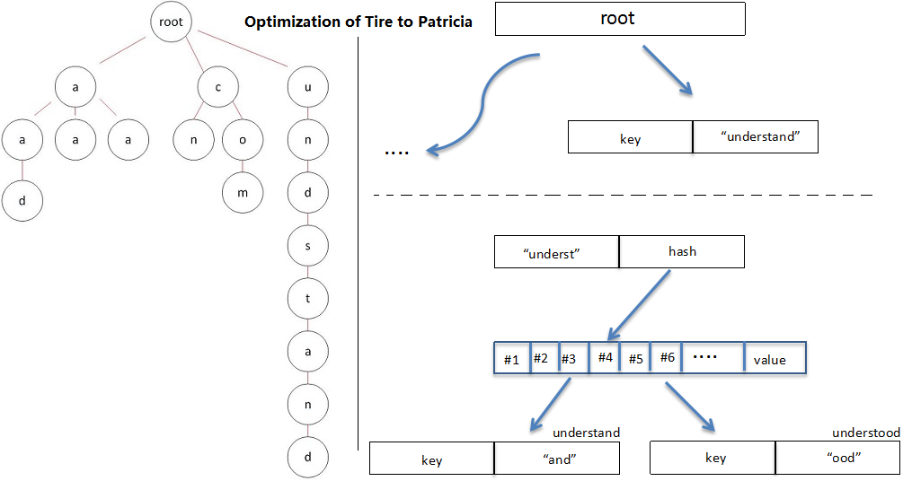
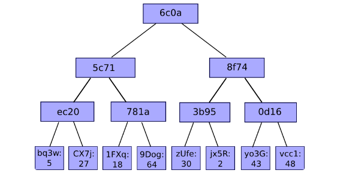

上图存储的8个Key Value对，可以看到前缀树的特点。(路径是key，叶子结点是value)

|Key|value|
| ------------- | ---: |
|6c0a5c71ec20bq3w|5|
|6c0a5c71ec20CX7j|27|
|6c0a5c71781a1FXq|18|
|6c0a5c71781a9Dog|64|
|6c0a8f743b95zUfe|30|
|6c0a8f743b95jx5R|2|
|6c0a8f740d16y03G|43|
|6c0a8f740d16vcc1|48|

## Merkle树
Merkle Tree，通常也被称作Hash Tree，顾名思义，就是存储hash值的一棵树。Merkle树的<font color="pink">叶子</font>是数据块(例如，文件或者文件的集合)的hash值。<font color="pink">非叶节点</font>是其对应子节点串联字符串的hash。

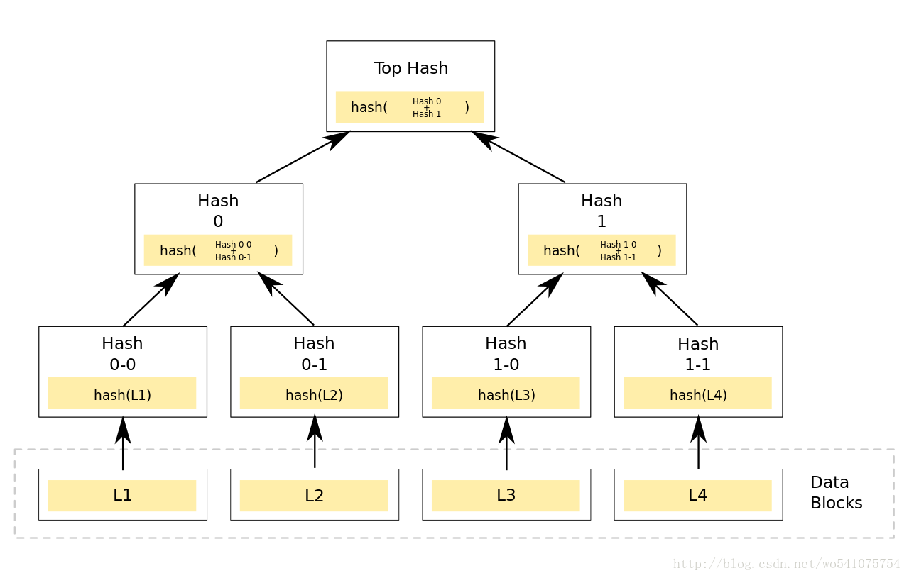

Merkle Tree的主要作用是当我拿到Top Hash的时候，<font color="pink">这个hash值代表了整颗树的信息摘要，当树里面任何一个数据发生了变动，都会导致Top Hash的值发生变化。</font>而Top Hash的值是会存储到区块链的区块头里面去的， 区块头是必须经过工作量证明。 这也就是说我只要拿到一个区块头，就可以对区块信息进行验证。 ~~更加详细的信息请参考[这个博客](http://blog.csdn.net/wo541075754/article/details/54632929)。有详细的介绍。~~

### 以太坊的MPT
每一个以太坊的区块头包含三颗MPT树，分别是
- 交易树
- 收据树(交易执行过程中的一些数据)
- 状态树(账号信息， 合约账户和用户账户)

下图中是两个区块头，区块头构成如下

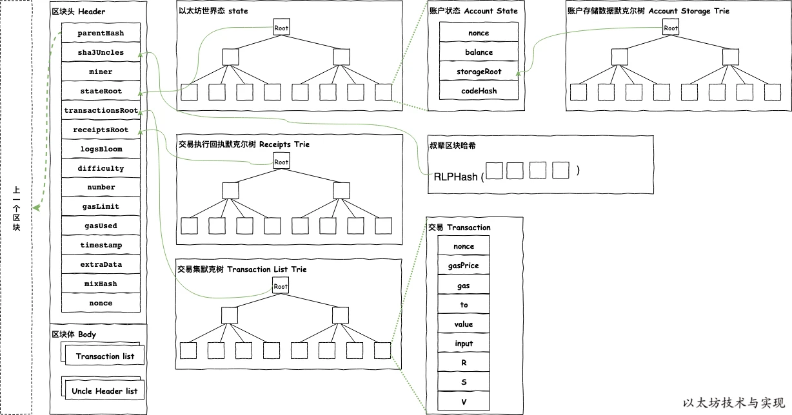

其中`state root`，`tx root`，`receipt root`分别存储了这三棵树的树根，第二个区块显示了当账号175的数据变更(27 -> 45)的时候，只需要存储跟这个账号相关的部分数据，而且老的区块中的数据还是可以正常访问。(这个有点类似与函数式编程语言中的不可变的数据结构的实现)

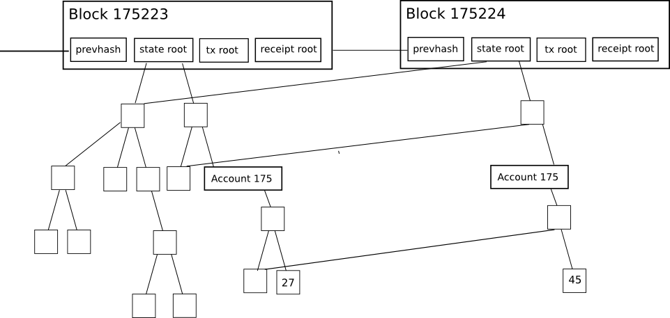

结构为


为了解决基数树的效率问题，以太坊对基数树的最大改动是丰富了节点类型，围绕不同节点类型的不同操作来解决效率：
1. 空白节点 NULL
2. 分支节点 branch Node [0,1,…,16,value]
3. 叶子节点 leaf Node : [key,value]
4. 扩展节点 extension Node: [key,value]

多种节点类型的不同操作方式，虽然提升了效率，但复杂度被加大。而在 geth 中，为了适应实现，节点类型的设计稍有不同：
```go
type (
	fullNode struct {
		Children [17]node // 需要进行编码/解码的实际Trie节点数据（需要编写自定义编码器）
		flags    nodeFlag
	}
	shortNode struct {
		Key   []byte
		Val   node
		flags nodeFlag
	}
	hashNode  []byte
	valueNode []byte
)

// 当折叠内部Trie节点进行哈希处理时，使用nilValueNode，因为未设置的子节点需要正确地序列化。
var nilValueNode = valueNode(nil)
```

- `fullNode`: 分支节点，fullNode[16]的类型是 valueNode。前 16 个元素对应键中可能存在的一个十六进制字符。如果键[key,value]在对应的分支处结束，则在列表末尾存储 value 。
- `shortNode`: 叶子节点或者扩展节点，当 shortNode.Key的末尾字节是终止符 16 时表示为叶子节点。当 shortNode 是叶子节点是，Val 是 valueNode。
- `hashNode`: 应该取名为 collapsedNode 折叠节点更合适些，但因为其值是一个哈希值当做指针使用，所以取名 hashNode。使用这个哈希值可以从数据库读取节点数据展开节点。
- `valueNode`: 数据节点，实际的业务数据值，严格来说他不属于树中的节点，它只存在于 fullNode.Children 或者 shortNode.Val 中。

## 黄皮书形式化定义(Appendix D. Modified Merkle Patricia Tree)
正式地，我们假设输入值J，包含Key Value对的集合（Key Value都是字节数组）：
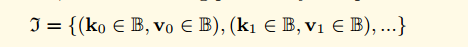

当处理这样一个集合的时候，我们使用下面的这样标识表示数据的 Key和Value(对于J集合中的任意一个I， I0表示Key， I1表示Value)

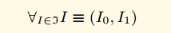

对于任何特定的字节，我们可以表示为对应的半字节（nibble），其中Y集合在Hex-Prefix Encoding中有说明，意为半字节（4bit）集合（之所以采用半字节，其与后续说明的分支节点branch node结构以及key中编码flag有关）

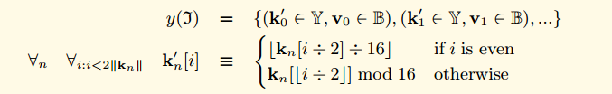

我们定义了TRIE函数，用来表示树根的HASH值（其中c函数的第二个参数，意为构建完成后树的层数。root的值为0）

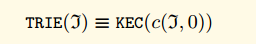

我们还定义一个函数n，这个trie的节点函数。 当组成节点时，我们使用RLP对结构进行编码。 作为降低存储复杂度的手段，对于RLP少于32字节的节点，我们直接存储其RLP值， 对于那些较大的，我们存储其HASH节点。
我们用c来定义节点组成函数：

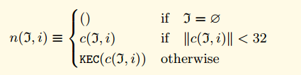

以类似于基数树的方式，当Trie树从根遍历到叶时，可以构建单个键值对。 Key通过遍历累积，从每个分支节点获取单个半字节（与基数树一样）。 与基数树不同，在共享相同前缀的多个Key的情况下，或者在具有唯一后缀的单个Key的情况下，提供两个优化节点。的情况下，或者在具有唯一后缀的单个密钥的情况下，提供两个优化节点。 因此，当遍历时，可能从其他两个节点类型，扩展和叶中的每一个潜在地获取多个半字节。在Trie树中有三种节点：

- **叶子节点(Leaf):** 叶子节点包含两个字段， 第一个字段是剩下的Key的半字节编码,而且半字节编码方法的第二个参数为true， 第二个字段是Value
- **扩展节点(Extention):** 扩展节点也包含两个字段， 第一个字段是剩下的Key的可以至少被两个剩下节点共享的部分的半字节编码，第二个字段是n(J,j)
- **分支节点(Branch):** 分支节点包含了17个字段，其前16个项目对应于这些点在其遍历中的键的十六个可能的半字节值中的每一个。第17个字段是存储那些在当前结点结束了的节点(例如， 有三个key,分别是 (abc ,abd, ab) 第17个字段储存了ab节点的值)

分支节点只有在需要的时候使用， 对于一个只有一个非空 key value对的Trie树，可能不存在分支节点。 如果使用公式来定义这三种节点， 那么公式如下：
图中的HP函数代表Hex-Prefix Encoding，是一种半字节编码格式，RLP是使用RLP进行序列化的函数。

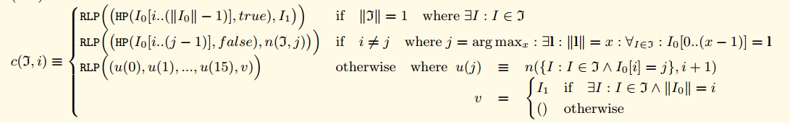

对于上图的三种情况的解释

- 如果当前需要编码的KV集合只剩下一条数据，那么这条数据按照第一条规则进行编码。
- 如果当前需要编码的KV集合有公共前缀，那么提取最大公共前缀并使用第二条规则进行处理。
- 如果不是上面两种情况，那么使用分支节点进行集合切分，因为key是使用HP进行编码的，所以可能的分支只有0-15这16个分支。可以看到u的值由n进行递归定义，而如果有节点刚好在这里完结了，那么第17个元素v就是为这种情况准备的。

对于数据应该如何存储和不应该如何存储， 黄皮书中说明没有显示的定义。所以这是一个实现上的问题。我们简单的定义了一个函数来把J映射为一个Hash。 我们认为对于任意一个J，只存在唯一一个Hash值。

### 黄皮书的形式化定义(Hex-Prefix Encoding)--十六进制前缀编码
十六进制前缀编码是将任意数量的半字节编码为字节数组的有效方法。它能够存储附加标志，当在Trie树中使用时(唯一会使用的地方)，会在节点类型之间消除歧义。

它被定义为从一系列半字节（由集合Y表示）与布尔值一起映射到字节序列（由集合B表示）的函数HP：

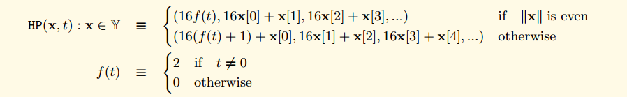

因此，第一个字节的高半字节包含两个标志; 最低bit位编码了长度的奇偶位，第二低的bit位编码了flag的值。 在偶数个半字节的情况下，第一个字节的低半字节为零，在奇数的情况下为第一个半字节。 所有剩余的半字节（现在是偶数）适合其余的字节。


