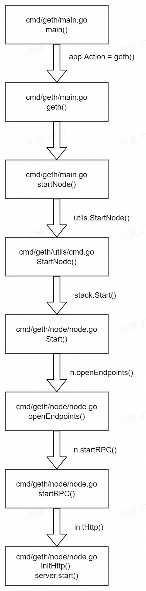
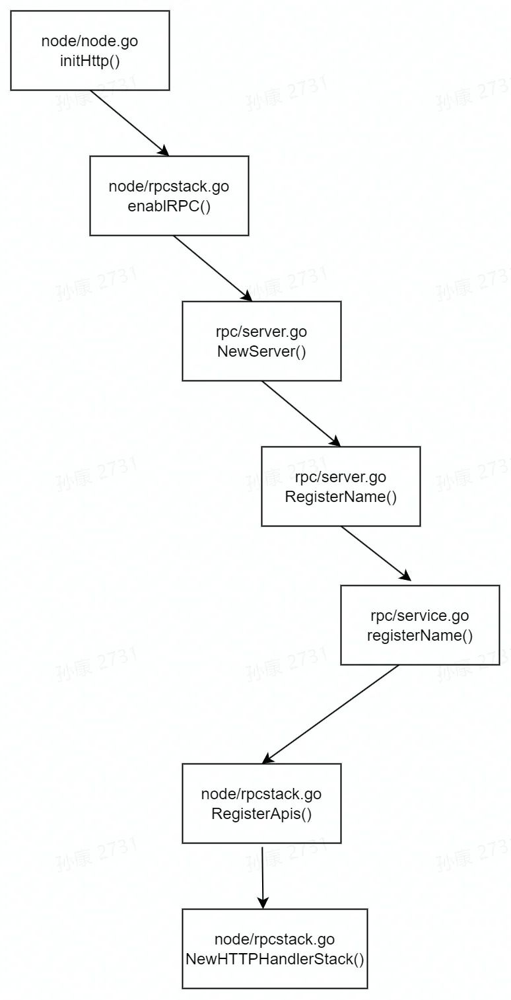
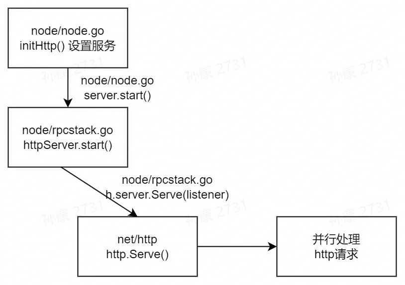

## RPC包的打大致结构
网络协议 channels和Json格式的 请求和回应的 编码和解码 都是同时与 服务端和客户端 打交道的类。

网络协议channels主要提供连接和数据传输的功能。 json格式的编码和解码主要提供请求和回应的序列化和反序列化功能(Json -> Go的对象)。


## 源码解析
### 启动流程
以太坊节点是如何实现RPC服务的呢，我们先从节点启动流程分析一下。如下图所示：



上图所示流程是以太坊节点从命令行执行启动后，一路初始化过程，先启动Node，在Node下面有一系列服务，RPC是其中之一，http协议的RPC又是几种RPC服务之一。

geth的startNode方法中，通过层层跟踪可以进入到了Node.Start()方法，在start方法中，有一个startRPC方法，启动节点的RPC。
```go
// startRPC is a helper method to configure all the various RPC endpoints during node
// startup. It's not meant to be called at any time afterwards as it makes certain
// assumptions about the state of the node.
func (n *Node) startRPC() error {
    ...
	
    initHttp := func(server *httpServer, port int) error {
    if err := server.setListenAddr(n.config.HTTPHost, port); err != nil {
        return err
    }
    if err := server.enableRPC(openAPIs, httpConfig{
        CorsAllowedOrigins: n.config.HTTPCors,
        Vhosts:             n.config.HTTPVirtualHosts,
        Modules:            n.config.HTTPModules,
        prefix:             n.config.HTTPPathPrefix,
        rpcEndpointConfig:  rpcConfig,
    }); err != nil {
        return err
    }
    servers = append(servers, server)
    return nil
    }
	
	...
}
```

`initHttp`完成了Http RPC服务器的初始化工作。首先设置侦听地址和端口，默认端口8545。然后设置服务器配置信息，包括对外开放的api，http跨域访问，虚拟主机等。设置完成后，将server结构放入到server列表，后续会一一调用start()启动服务。

接下来的流程如下图所示:



其中`server.enableRPC()`传入的第一个参数openAPIs就是对外开放服务的api。通过node.apis()方法获得。来看一下apis()的定义。
```go
// apis返回内置的RPC API集合。
func (n *Node) apis() []rpc.API {
	return []rpc.API{
		{
			Namespace: "admin",
			Service:   &adminAPI{n},
		}, {
			Namespace: "debug",
			Service:   debug.Handler,
		}, {
			Namespace: "web3",
			Service:   &web3API{n},
		},
	}
}

// adminAPI is the collection of administrative API methods exposed over
// both secure and unsecure RPC channels.
type adminAPI struct {
    node *Node // Node interfaced by this API
}

// AddPeer requests connecting to a remote node, and also maintaining the new
// connection at all times, even reconnecting if it is lost.
func (api *adminAPI) AddPeer(url string) (bool, error) {
    // Make sure the server is running, fail otherwise
    server := api.node.Server()
    if server == nil {
        return false, ErrNodeStopped
    }
    // Try to add the url as a static peer and return
    node, err := enode.Parse(enode.ValidSchemes, url)
    if err != nil {
        return false, fmt.Errorf("invalid enode: %v", err)
    }
    server.AddPeer(node)
    return true, nil
}

// Peers retrieves all the information we know about each individual peer at the
// protocol granularity.
func (api *adminAPI) Peers() ([]*p2p.PeerInfo, error) {
    server := api.node.Server()
    if server == nil {
        return nil, ErrNodeStopped
    }
    return server.PeersInfo(), nil
}
```
可以看到，定义了3组API，其中Namespace可认为是API的前缀,一般都是通过`Namespace_方法名`的形式访问。实际上RPC服务的解析过程就是拿到`Namespace_方法名`形式的字符串，然后根据"_"分成两部分，然后从函数映射表中找到`Namespace`路径下的对应的方法地址，执行过程调用返回结果。

Service是接口类型，以`admin`为例，凡是adminAPI类型下的方法，都可以通过Service入口调用，即运行时通过Service的入口，可以找到并执行对应的方法。

比如执行Peers()方法，可以执行
```
curl -XPOST http://localhost:8545 -H 'Content-Type: application/json' -d '{"method": "admin_peers", "params": [], "id":1}'
```

弄清apis的来源后，再来看enableRPC()里面执行了什么。
```go
type rpcHandler struct {
    http.Handler
    server *rpc.Server
}

// enableRPC turns on JSON-RPC over HTTP on the server.
func (h *httpServer) enableRPC(apis []rpc.API, config httpConfig) error {
	h.mu.Lock()
	defer h.mu.Unlock()

	if h.rpcAllowed() {
		return fmt.Errorf("JSON-RPC over HTTP is already enabled")
	}

	// Create RPC server and handler.
	srv := rpc.NewServer()
	srv.SetBatchLimits(config.batchItemLimit, config.batchResponseSizeLimit)
	if err := RegisterApis(apis, config.Modules, srv); err != nil {
		return err
	}
	h.httpConfig = config
	h.httpHandler.Store(&rpcHandler{
		Handler: NewHTTPHandlerStack(srv, config.CorsAllowedOrigins, config.Vhosts, config.jwtSecret),
		server:  srv,
	})
	return nil
}
```
`RegisterApis`将对外服务的api函数名称、地址写进srv内部的映射表。

`httpHandler.Store`是一个原子写入操作，中间不可打断。这一步将`rpcHanlder`地址写入到`httpHandler`中。其中`http.Handler`是一个接口，定义了一个方法`ServeHTTP()`。因为golang支持鸭子类型（即对行为建模），任何实现了这个方法的类型都属于这个接口。只要`NewHTTPHandlerStack`返回的类型实现了ServeHTTP() 方法，就属于这个接口。

`NewHTTPHandlerStack` 实际是创建了一个链表，针对不同http请求的Header信息，用不同的handler处理。

### server.go
`server.go`主要实现了RPC服务端的核心逻辑。 包括RPC方法的注册， 读取请求，处理请求，发送回应等逻辑。 

server的核心数据结构是Server结构体。其中，
- `services`字段是一个结构体，包含了一个map和一个锁，记录了所有注册的方法和类。 
- `run`参数是用来控制Server的运行和停止的。 
- `codecs`是一个set， 用来存储所有的编码解码器，其实就是所有的连接。
- `mutex`是用来保护多线程访问codecs的锁。

`services`字段的value类型是service类型。 service代表了一个注册到Server的实例， 是一个对象和方法的组合。 service字段的name代表了service的namespace， callbacks是实例的回调方法， subscriptions是实例的订阅方法。
```go
// Server is an RPC server.
type Server struct {
	services serviceRegistry
	idgen    func() ID

	mutex              sync.Mutex
	codecs             map[ServerCodec]struct{}
	run                atomic.Bool
	batchItemLimit     int
	batchResponseLimit int
}

type serviceRegistry struct {
    mu       sync.Mutex
    services map[string]service
}

// service represents a registered object.
type service struct {
    name          string               // 服务的名称
    callbacks     map[string]*callback // 已注册的处理程序
    subscriptions map[string]*callback // 可用的订阅/通知
}
```

#### Server的创建
Server创建的时候通过调用server.RegisterName把自己的实例注册上来，提供一些RPC服务的元信息。

调用栈：initHttp()->enableRPC()->rpc.NewSever()->Server.RegisterName()->serviceRegistry.registerName()

```go
// NewServer creates a new server instance with no registered handlers.
func NewServer() *Server {
	server := &Server{
		idgen:  randomIDGenerator(),
		codecs: make(map[ServerCodec]struct{}),
	}
	server.run.Store(true)
	// 注册默认服务，提供有关RPC服务的元信息，例如它提供的服务和方法。
	rpcService := &RPCService{server}
	server.RegisterName(MetadataApi, rpcService)
	return server
}
```

服务注册`server.RegisterName`，`RegisterName`方法会通过传入的参数来创建一个service对象，如果传入的receiver实例没有找到任何合适的方法，那么会返回错误。 如果没有错误，就把创建的service实例加入serviceRegistry。  
执行流程：
1. 首先，使用了golang的反射，reflect.ValueOf()是运行时动态获取接口rcvr具体值。
2. 调用`suitableCallbacks`进行合法性检查，检查rcvrVal的值是不是符合callback函数的要求。
3. 从`r.mu.Lock()`开始，构建映射表，因为golang的map不是协程安全的，因此操作前要加锁。然后创建方法映射表。这里name="rpc"，函数`callbacks` 从 `suitableCallbacks()`中解析而出。
```go
// RegisterName函数会根据给定的名称和接收器类型创建一个服务。
// 当给定接收器没有匹配到符合RPC方法或订阅的条件时，函数会返回一个错误。
// 否则，函数会创建一个新的服务并将其添加到该服务器提供给客户端的服务集合中。
func (s *Server) RegisterName(name string, receiver interface{}) error {
	return s.services.registerName(name, receiver)
}

func (r *serviceRegistry) registerName(name string, rcvr interface{}) error {
    rcvrVal := reflect.ValueOf(rcvr)
    if name == "" {
        return fmt.Errorf("no service name for type %s", rcvrVal.Type().String())
    }
    callbacks := suitableCallbacks(rcvrVal)
    if len(callbacks) == 0 {
        return fmt.Errorf("service %T doesn't have any suitable methods/subscriptions to expose", rcvr)
    }
    
    r.mu.Lock()
    defer r.mu.Unlock()
    if r.services == nil {
        r.services = make(map[string]service)
    }
    // 如果这个名字当前没有被注册过，那么直接初始化并插入。
    svc, ok := r.services[name]
    if !ok {
        svc = service{
            name:          name,
            callbacks:     make(map[string]*callback),
            subscriptions: make(map[string]*callback),
        }
        r.services[name] = svc
    }
    for name, cb := range callbacks {
        if cb.isSubscribe {
            svc.subscriptions[name] = cb
        } else {
            svc.callbacks[name] = cb
        }
    }
    return nil
}
```

再来看`suitableCallbacks()`方法：
1. `suitableCallbacks` 首先获取receiver的类型，应该是`*RPCService`类型（RPCService的指针）。
2. 接着遍历`*RPCService`的类型定义的方法，根据源代码实现，这个类型只有一个方法即`Modules()`，定义在`rpc/server.go`中。对`*RPCService`每个方法，做合法性检查，然后将method对应的方法转换成一个callback对象赋值给cb。
3. formatName将首字母变成小写，然后加入到callback映射表。

```go
// suitableCallbacks函数会遍历给定类型的方法。
// 它会确定一个方法是否满足RPC回调或订阅回调的条件，并将其添加到回调集合中。
func suitableCallbacks(receiver reflect.Value) map[string]*callback {
    typ := receiver.Type()
    callbacks := make(map[string]*callback)
    for m := 0; m < typ.NumMethod(); m++ {
        method := typ.Method(m)
        if method.PkgPath != "" {
            continue // method not exported
        }
		// 将fn（一个函数）转换为一个回调对象。如果该函数不适合作为RPC回调，则返回nil。
        cb := newCallback(receiver, method.Func)
        if cb == nil {
            continue // function invalid
        }
        name := formatName(method.Name)
        callbacks[name] = cb
    }
    return callbacks
}
```

回到enableRPC()，完成一个RPCServer结构创建后，会执行`RegisterApis`，将对外开放的API方法（`apis()`）写入到映射表中，在服务运行时，根据请求参数查表执行对应的服务API。具体来看`RegisterApis`：
1. 检查Module的可用性
2. 根据开放的模块（namespace？）设置开放列表，这个参数可以通过命令行传递，启动时指定Geth节点开放哪些模块的RPC服务。
3. 对于每个`rpc.API`结构体，满足开放条件的话，就写入到映射列表。其中名字是Namesapce定义的名字，`api.Service`是前面提到的接口。RegietgerName里面会利用反射机制，遍历每个api.Service结构拥有的方法，将方法名和入口地址写入到映射表（方法名第一个字母小写）。

再回顾前面给出的例子。这里就理解了为什么`admin` Namespace空间下，类型`adminAPI` 拥有的方法`func (api *adminAPI) Peers() ([]*p2p.PeerInfo, error)` ，在RPC调用下，传入的参数是`admin_peers`了。
```go
// RegisterApis检查给定模块的可用性，基于允许的模块生成一个允许列表，然后注册所有由服务暴露的API。
func RegisterApis(apis []rpc.API, modules []string, srv *rpc.Server) error {
	if bad, available := checkModuleAvailability(modules, apis); len(bad) > 0 {
		log.Error("Unavailable modules in HTTP API list", "unavailable", bad, "available", available)
	}
	// 根据允许的模块生成允许列表。
	allowList := make(map[string]bool)
	for _, module := range modules {
		allowList[module] = true
	}
	// 注册所有由服务暴露的API。
	for _, api := range apis {
		if allowList[api.Namespace] || len(allowList) == 0 {
			if err := srv.RegisterName(api.Namespace, api.Service); err != nil {
				return err
			}
		}
	}
	return nil
}
```

#### server启动和服务
完成设置后，启动HTTP服务，先给出设置完服务RPC服务后，启动服务的流程框图。



启动Http服务：rpcstack.go/start()
```go
// 如果启用并且尚未运行，则start函数会启动HTTP服务器。
func (h *httpServer) start() error {
	h.mu.Lock()
	defer h.mu.Unlock()

	if h.endpoint == "" || h.listener != nil {
		return nil // 已经在运行或未配置。
	}

	// Initialize the server.
	h.server = &http.Server{Handler: h}
	if h.timeouts != (rpc.HTTPTimeouts{}) {
		CheckTimeouts(&h.timeouts)
		h.server.ReadTimeout = h.timeouts.ReadTimeout
		h.server.ReadHeaderTimeout = h.timeouts.ReadHeaderTimeout
		h.server.WriteTimeout = h.timeouts.WriteTimeout
		h.server.IdleTimeout = h.timeouts.IdleTimeout
	}

	// Start the server.
	listener, err := net.Listen("tcp", h.endpoint)
	if err != nil {
		// 如果服务器启动失败，我们需要清除RPC和WS配置，以便可以重新配置它们。
		h.disableRPC()
		h.disableWS()
		return err
	}
	h.listener = listener
	go h.server.Serve(listener)

	if h.wsAllowed() {
		url := fmt.Sprintf("ws://%v", listener.Addr())
		if h.wsConfig.prefix != "" {
			url += h.wsConfig.prefix
		}
		h.log.Info("WebSocket enabled", "url", url)
	}
	// 如果服务器只支持WebSocket，记录日志后返回。
	if !h.rpcAllowed() {
		return nil
	}
	// Log http endpoint.
	h.log.Info("HTTP server started",
		"endpoint", listener.Addr(), "auth", (h.httpConfig.jwtSecret != nil),
		"prefix", h.httpConfig.prefix,
		"cors", strings.Join(h.httpConfig.CorsAllowedOrigins, ","),
		"vhosts", strings.Join(h.httpConfig.Vhosts, ","),
	)

	// 记录服务器上挂载的所有处理程序。
	var paths []string
	for path := range h.handlerNames {
		paths = append(paths, path)
	}
	sort.Strings(paths)
	logged := make(map[string]bool, len(paths))
	for _, path := range paths {
		name := h.handlerNames[path]
		if !logged[name] {
			log.Info(name+" enabled", "url", "http://"+listener.Addr().String()+path)
			logged[name] = true
		}
	}
	return nil
}
```
这段代码只需要重点关注2行内容:
1. `h.server = &http.Server{Handler: h}` ：这里比较重要，用go自带的http包，声明了http.Server，并将handler设置为h。根据go语言对行为建模的特性，http.Handler是一个接口，定义了ServeHTTP()方法，只要h指向的结构体实现了这个方法，它就属于这个接口。h指向httpServer，httpServer实现的ServeHTTP()方法就在node/rpcstack.go中定义。

2. `go h.server.Serve(listener)` ：启动一个go协程，调用go语言自带的http.Serve()方法。这个方法侦听listener中设置的端口，对于每一个新进入的请求，都会创建一个新的go协程处理。创建的处理协程会调用在上一步注册的`ServeHTTP()`方法，用户的自定义处理逻辑直接是现在ServeHTTP()。

到了这里，整个http的RPC服务运行框架就基本明了了。后面深入到`ServeHTTP()`看一下具体的RPC运行机制：如何解析请求的参数，找到请求的方法，然后执行相应的服务返回结果。

#### RPC运行的机制
分析一下RPC处理http请求的具体工作机制
```go
// rpcstack.go
func (h *httpServer) ServeHTTP(w http.ResponseWriter, r *http.Request) {
	// check if ws request and serve if ws enabled
	ws := h.wsHandler.Load().(*rpcHandler)
	if ws != nil && isWebsocket(r) {
		if checkPath(r, h.wsConfig.prefix) {
			ws.ServeHTTP(w, r)
		}
		return
	}

	// 如果启用了HTTP-RPC，则尝试处理请求。
	rpc := h.httpHandler.Load().(*rpcHandler) // 类型断言
	if rpc != nil {
		// 首先尝试在mux中路由。
		// 路径在根路径下的请求由mux处理，
		// 它包含了通过Node.RegisterHandler注册的所有处理程序。
		// 当启用RPC时，这些处理程序将可用。
		muxHandler, pattern := h.mux.Handler(r)
		if pattern != "" {
			muxHandler.ServeHTTP(w, r)
			return
		}

		if checkPath(r, h.httpConfig.prefix) {
			rpc.ServeHTTP(w, r)
			return
		}
	}
	w.WriteHeader(http.StatusNotFound)
}
```
http服务启动后，对于每一个新进入的请求，程序会创建新的go协程，并执行ServeHTTP()。

1. 首先是websocket协议相关处理，略过。
2. 接下来，回忆前文所述，h.httpHandler是一个atomic.Value类型，通过Load()执行原子读操作，拿到了一个指针，然后做一个类型断言，获得一个指向rpcHandler的指针。
3. 根据根路径的前缀寻找对应的方法，多数情况下这部分会跳过到`checkPath(r, h.httpConfig.prefix)`这里
4. `checkPath(r, h.httpConfig.prefix)`实际上就是执行第二步的rpc.ServHTTP()，传入的参数r是http请求http.Request。

```go
// http.go
const (
    maxRequestContentLength = 1024 * 1024 * 5
    contentType             = "application/json"
)

// https://www.jsonrpc.org/historical/json-rpc-over-http.html#id13
var acceptedContentTypes = []string{contentType, "application/json-rpc", "application/jsonrequest"}

// ServeHTTP serves JSON-RPC requests over HTTP.
func (s *Server) ServeHTTP(w http.ResponseWriter, r *http.Request) {
    // 允许用于远程健康检查（如AWS）的空请求。
    if r.Method == http.MethodGet && r.ContentLength == 0 && r.URL.RawQuery == "" {
        w.WriteHeader(http.StatusOK)
        return
    }
    if code, err := validateRequest(r); err != nil {
        http.Error(w, err.Error(), code)
        return
    }
    
    // Create request-scoped context.
    connInfo := PeerInfo{Transport: "http", RemoteAddr: r.RemoteAddr}
    connInfo.HTTP.Version = r.Proto
    connInfo.HTTP.Host = r.Host
    connInfo.HTTP.Origin = r.Header.Get("Origin")
    connInfo.HTTP.UserAgent = r.Header.Get("User-Agent")
    ctx := r.Context()
    ctx = context.WithValue(ctx, peerInfoContextKey{}, connInfo)
    
    // 所有检查通过，创建一个编解码器，直接从请求主体读取数据直到EOF，
	// 将响应写入w，并要求服务器处理单个请求。
    w.Header().Set("content-type", contentType)
    codec := newHTTPServerConn(r, w)
    defer codec.close()
    s.serveSingleRequest(ctx, codec)
}
```
调用栈：http.Serve()->ServeHTTP()->Sever.ServeHTTP()
接上文，rpc.ServeHTTP()实际上是调用了rpc/http.go中的Serve.ServeHTTP()，逐步分析：
1. 首先是做检查，对无内容的GET请求返回OK状态（status 200）。
2. 请求检查和属性设置，设定go协程上下文，用于go协程的数据传递。
3. 注意传入content-type被设定为`applcation/json` （前面定义的常量）。
4. 处理请求，包括解析json格式的请求数据，并做执行具体的处理。

再来看看`serveSingleRequest`
```go
// rpc/server.go
// serveSingleRequest从给定的编解码器读取并处理单个RPC请求。
// 这用于提供HTTP连接。在此模式下，不允许订阅和反向调用。
func (s *Server) serveSingleRequest(ctx context.Context, codec ServerCodec) {
	// Don't serve if server is stopped.
	if !s.run.Load() {
		return
	}

	// 1
	h := newHandler(ctx, codec, s.idgen, &s.services, s.batchItemLimit, s.batchResponseLimit)
	h.allowSubscribe = false
	defer h.close(io.EOF, nil)

	// 2
	reqs, batch, err := codec.readBatch()
	if err != nil {
		if err != io.EOF {
			resp := errorMessage(&invalidMessageError{"parse error"})
			codec.writeJSON(ctx, resp, true)
		}
		return
	}
	if batch {
		h.handleBatch(reqs)
	} else {
		// 3
		h.handleMsg(reqs[0])
	}
}
```
1. 这里重要的结构是s.services，这个数据结构包含了前面代码`registerName()`中构建的函数中注册表。
2. json 编码/解码器 读取 http request 请求信息，然后做解码，再传递给parseMessage
3. 处理请求，假设当前是非批量处理情景下。

parseMessage代码如下
```go
// rpc/json.go
// 这种类型的值可以是JSON-RPC请求、通知、成功响应或错误响应。
// 它的类型取决于字段的内容。
type jsonrpcMessage struct {
	// 版本号字段，请求时可以忽略，返回时会有，一般会是 "jsonrpc": "2.0"
    Version string          `json:"jsonrpc,omitempty"`
    // 请求的ID，请求和应答的ID要一一对应。请求时这个字段一般不会忽略，根据需要设置，可以递增形式。
    ID      json.RawMessage `json:"id,omitempty"`
    // 请求方法名，格式是 模块名_方法名，其中方法名首字母小写（但代码实现中方法名首字母通常大写，
	// 因为go语言首字母小写的变量和方法对模块外是不开放的），
	// 模块名和方法名中间用下划线“_"连接，比如"eth_blockNumber"方法。
    Method  string          `json:"method,omitempty"`
	// 参数列表，请求方法的参数，通常是字典列表形式。
    Params  json.RawMessage `json:"params,omitempty"`
    // 错误信息，返回信息中才有的字段。
    Error   *jsonError      `json:"error,omitempty"`
	// 结果信息，返回信息中才有的字段。
    Result  json.RawMessage `json:"result,omitempty"`
}

// parseMessage函数将原始字节解析为一个或多个JSON-RPC消息。
// 此函数中没有错误检查，因为在调用该函数时，原始消息已经通过语法检查。
// 输入中的任何非JSON-RPC消息都将返回jsonrpcMessage的零值。
func parseMessage(raw json.RawMessage) ([]*jsonrpcMessage, bool) {
	if !isBatch(raw) {
		msgs := []*jsonrpcMessage{{}}
		json.Unmarshal(raw, &msgs[0])
		return msgs, false
	}
	dec := json.NewDecoder(bytes.NewReader(raw))
	dec.Token() // skip '['
	var msgs []*jsonrpcMessage
	for dec.More() {
		msgs = append(msgs, new(jsonrpcMessage))
		dec.Decode(&msgs[len(msgs)-1])
	}
	return msgs, true
}
```
调用栈：http.Serve()->ServeHTTP()->Sever.ServeHTTP()->Server.serveSingleRequest()->codec.ReadBatch()->parseMessage()

结合上面代码来看一下消息解析部分：
1. 如果是非批量模式下，直接对json字节串做Unmarshal，将结果映射到jsonrpcMessage结构体中。
2. 由类型jsonrpcMessage类型定义可见，这些字段跟我们之前rpc例子中传递的内容都能一一对应。实际上，RPC请求和应答返回的数据结构都是这个jsonrpcMessage结构。

再回到`serveSingleRequest()`，继续看`handleMsg()`方法
```go
// 执行消息处理
// handleMsg handles a single non-batch message.
func (h *handler) handleMsg(msg *jsonrpcMessage) {
	msgs := []*jsonrpcMessage{msg}
	h.handleResponses(msgs, func(msg *jsonrpcMessage) {
		h.startCallProc(func(cp *callProc) {
			h.handleNonBatchCall(cp, msg)
		})
	})
}

// startCallProc runs fn in a new goroutine and starts tracking it in the h.calls wait group.
func (h *handler) startCallProc(fn func(*callProc)) {
    h.callWG.Add(1)
    go func() {
        ctx, cancel := context.WithCancel(h.rootCtx)
        defer h.callWG.Done()
        defer cancel()
        fn(&callProc{ctx: ctx})
    }()
}

// handleCallMsg executes a call message and returns the answer.
func (h *handler) handleCallMsg(ctx *callProc, msg *jsonrpcMessage) *jsonrpcMessage {
    start := time.Now()
    switch {
    case msg.isNotification():
        h.handleCall(ctx, msg)
        h.log.Debug("Served "+msg.Method, "duration", time.Since(start))
        return nil
        
    case msg.isCall():
        resp := h.handleCall(ctx, msg)
        var ctx []interface{}
        ctx = append(ctx, "reqid", idForLog{msg.ID}, "duration", time.Since(start))
        if resp.Error != nil {
            ctx = append(ctx, "err", resp.Error.Message)
            if resp.Error.Data != nil {
                ctx = append(ctx, "errdata", resp.Error.Data)
            }
            h.log.Warn("Served "+msg.Method, ctx...)
        } else {
            h.log.Debug("Served "+msg.Method, ctx...)
        }
        return resp
        
    case msg.hasValidID():
        return msg.errorResponse(&invalidRequestError{"invalid request"})
    
    default:
        return errorMessage(&invalidRequestError{"invalid request"})
    }
}

// handleCall processes method calls.
func (h *handler) handleCall(cp *callProc, msg *jsonrpcMessage) *jsonrpcMessage {
    if msg.isSubscribe() {
        return h.handleSubscribe(cp, msg)
    }
    var callb *callback
    if msg.isUnsubscribe() {
        callb = h.unsubscribeCb
    } else {
        callb = h.reg.callback(msg.Method)
    }
    if callb == nil {
        return msg.errorResponse(&methodNotFoundError{method: msg.Method})
    }
    
    args, err := parsePositionalArguments(msg.Params, callb.argTypes)
    if err != nil {
        return msg.errorResponse(&invalidParamsError{err.Error()})
    }
    start := time.Now()
    answer := h.runMethod(cp.ctx, msg, callb, args)
    
    // Collect the statistics for RPC calls if metrics is enabled.
    // We only care about pure rpc call. Filter out subscription.
    if callb != h.unsubscribeCb {
        rpcRequestGauge.Inc(1)
        if answer.Error != nil {
            failedRequestGauge.Inc(1)
        } else {
            successfulRequestGauge.Inc(1)
        }
        rpcServingTimer.UpdateSince(start)
        updateServeTimeHistogram(msg.Method, answer.Error == nil, time.Since(start))
    }
    
    return answer
}
```

显然，handleMsg是专门处理单条信息的。

`h.startCallProc()` 接受一个函数作为参数。这个函数定义直接写在了参数列表中。首先协程同步的WaitGroup增加1，这个变量用于协程计数，完成后调用WaitGroup.Done()减1，主线程如果处于等待，需要等WaitGroup所有写成结束，计数归零后才继续运行。`fn(&callProc{ctx: ctx})` 调用传入的函数fn，参数是callProc类型。看一下定义，实际上就是传入了上下文ctx。

执行`handleCallMsg()`方法，在这里，大部分情况下的方法调用是`isCall()`类型，那么就执行`handleCall()` 方法

这时，查找具体方法入口，见`callb = h.reg.callback(msg.Method)`。这个查找过程在下面代码中单独给出。可以看到，将jsonrpcMessage的method字段做分割处理，这个分隔符serviceMethodSeprator 的值是下划线"_"。假设传入method字段是"admin_peers"，经过下面代码的第3行处理，就会变成：elem[0] = "admin"， elem[1] = "peers"。然后最后一行是个查表操作，注意对map结构协程安全的操作方法是加锁。查找映射表找到了对应方法的入口地址，这个地址在`registerName()`中的初始化时已经设置好。

```go
// RPC服务查表寻找方法过程
// callback returns the callback corresponding to the given RPC method name.
func (r *serviceRegistry) callback(method string) *callback {
	elem := strings.SplitN(method, serviceMethodSeparator, 2)
	if len(elem) != 2 {
		return nil
	}
	r.mu.Lock()
	defer r.mu.Unlock()
	return r.services[elem[0]].callbacks[elem[1]]
}
```

方法入口和参数都准备好后，直接调用即可完成一次RPC服务。见`answer := h.runMethod(cp.ctx, msg, callb, args)`

至此，RPC服务的执行过程我们也从头到尾过了一遍。最后再分析一下方法调用中的参数解析，这里用到了一些golang的反射机制。见下方代码：
```go
// rpc/service.go
// callback is a method callback which was registered in the server
type callback struct {
	fn          reflect.Value  // the function
	rcvr        reflect.Value  // receiver object of method, set if fn is method
	argTypes    []reflect.Type // input argument types
	hasCtx      bool           // method's first argument is a context (not included in argTypes)
	errPos      int            // err return idx, of -1 when method cannot return error
	isSubscribe bool           // true if this is a subscription callback
}

// rpc/json.go
// parsePositionalArguments tries to parse the given args to an array of values with the
// given types. It returns the parsed values or an error when the args could not be
// parsed. Missing optional arguments are returned as reflect.Zero values.
func parsePositionalArguments(rawArgs json.RawMessage, types []reflect.Type) ([]reflect.Value, error) {
    dec := json.NewDecoder(bytes.NewReader(rawArgs))
    var args []reflect.Value
    tok, err := dec.Token()
    switch {
    case err == io.EOF || tok == nil && err == nil:
        // "params" is optional and may be empty. Also allow "params":null even though it's
        // not in the spec because our own client used to send it.
    case err != nil:
        return nil, err
    case tok == json.Delim('['):
        // Read argument array.
        if args, err = parseArgumentArray(dec, types); err != nil {
            return nil, err
        }
    default:
        return nil, errors.New("non-array args")
    }
    // Set any missing args to nil.
    for i := len(args); i < len(types); i++ {
        if types[i].Kind() != reflect.Ptr {
            return nil, fmt.Errorf("missing value for required argument %d", i)
        }
        args = append(args, reflect.Zero(types[i]))
    }
    return args, nil
}

func parseArgumentArray(dec *json.Decoder, types []reflect.Type) ([]reflect.Value, error) {
    args := make([]reflect.Value, 0, len(types))
    for i := 0; dec.More(); i++ {
        if i >= len(types) {
            return args, fmt.Errorf("too many arguments, want at most %d", len(types))
        }
        argval := reflect.New(types[i]) // 初始化一个type类型的空值
        if err := dec.Decode(argval.Interface()); err != nil { // 解析参数填入
            return args, fmt.Errorf("invalid argument %d: %v", i, err)
        }
        if argval.IsNil() && types[i].Kind() != reflect.Ptr { // 空值报错
            return args, fmt.Errorf("missing value for required argument %d", i)
        }
        args = append(args, argval.Elem()) // 填入Value
    }
    // Read end of args array.
    _, err := dec.Token()
    return args, err
}
```
以上代码是参数解析的过程：
1. `parsePositionalArguments`中第一行是解码json串，参数列表是以'['开头，因此如果正常参数列表，就会进入`parseArgumentArray()`。
2. `parseArgumentArray`是参数列表解析函数。types目标方法的参数类型列表，具体在`rpc/sevice.go`中定义，见`type callback struct`。这里创建一个参数队列，类型是是反射Value值，是一个动态值，实际上是一个空接口。
3. 接下来对解析的参数列表，逐个遍历。`argval := reflect.New(types[i])`创建了一个空值，类型是types[i]中定义的类型，然后将json值解码到argval类型的接口中，如果能成功动态转换赋值就解析出一个参数，否则出错，解析成功后，将参数值填入到args切片中。这种参数结构一个缺点是调用传参顺序必须与方法声明的参数顺序一致，如果想用任意顺序和字典形式传参，需要将函数接收的参数声明称结构struct形式，用json编码机制传传递。

整个解析的过程都是通过反射这一动态类型解析机制实现的，特点是灵活，所有类型都是运行时才确定，缺点当然是性能较差，反射机制性能肯定比静态数据解析差很多，但也是为了灵活性牺牲了一定性能。


