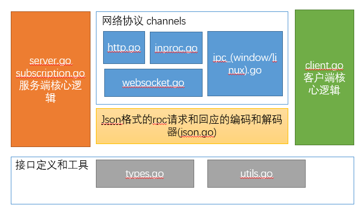

## RPC包的打大致结构
网络协议 channels和Json格式的 请求和回应的 编码和解码 都是同时与 服务端和客户端 打交道的类。

网络协议channels主要提供连接和数据传输的功能。 json格式的编码和解码主要提供请求和回应的序列化和反序列化功能(Json -> Go的对象)。



## 源码解析
### server.go
`server.go`主要实现了RPC服务端的核心逻辑。 包括RPC方法的注册， 读取请求，处理请求，发送回应等逻辑。 

server的核心数据结构是Server结构体。其中，
- `services`字段是一个结构体，包含了一个map和一个锁，记录了所有注册的方法和类。 
- `run`参数是用来控制Server的运行和停止的。 
- `codecs`是一个set， 用来存储所有的编码解码器，其实就是所有的连接。
- `mutex`是用来保护多线程访问codecs的锁。

`services`字段的value类型是service类型。 service代表了一个注册到Server的实例， 是一个对象和方法的组合。 service字段的name代表了service的namespace， callbacks是实例的回调方法， subscriptions是实例的订阅方法。
```go
// Server is an RPC server.
type Server struct {
	services serviceRegistry
	idgen    func() ID

	mutex              sync.Mutex
	codecs             map[ServerCodec]struct{}
	run                atomic.Bool
	batchItemLimit     int
	batchResponseLimit int
}

type serviceRegistry struct {
    mu       sync.Mutex
    services map[string]service
}

// service represents a registered object.
type service struct {
    name          string               // name for service
    callbacks     map[string]*callback // registered handlers
    subscriptions map[string]*callback // available subscriptions/notifications
}
```

#### Server的创建
Server创建的时候通过调用server.RegisterName把自己的实例注册上来，提供一些RPC服务的元信息。
```go
// NewServer creates a new server instance with no registered handlers.
func NewServer() *Server {
	server := &Server{
		idgen:  randomIDGenerator(),
		codecs: make(map[ServerCodec]struct{}),
	}
	server.run.Store(true)
	// Register the default service providing meta information about the RPC service such
	// as the services and methods it offers.
	rpcService := &RPCService{server}
	server.RegisterName(MetadataApi, rpcService)
	return server
}
```


