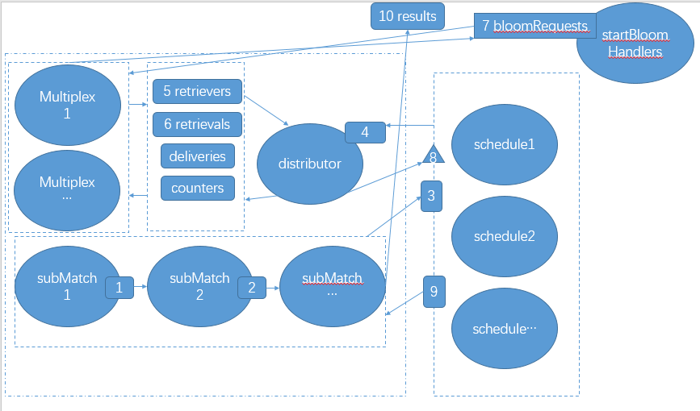

## core/bloombits/scheduler.go
scheduler是基于section的布隆过滤器的单个bit值检索的调度。 除了调度检索操作之外，这个结构还可以对请求进行重复数据删除并缓存结果，从而即使在复杂的过滤情况下也可以将网络/数据库开销降至最低。

### 数据结构
request表示一个bloom检索任务，以便优先从本地数据库中或从网络中剪检索。 section 表示区块段号，每段4096个区块， bit代表检索的是布隆过滤器的哪一位(一共有2048位)。这个在之前的(eth-bloombits和filter源码分析.md)中有介绍。
```go
// 请求表示一个布隆过滤器检索任务，可以优先从本地数据库中获取，或者从网络中远程获取。
type request struct {
	section uint64 // 要从中检索位向量的部分索引
	bit     uint   // 要检索向量的位索引在部分内部。
}
```

response当前调度的请求的状态。 没发送一个请求，会生成一个response对象来最终这个请求的状态。 cached用来缓存这个section的结果。
```go
// 响应表示通过调度器请求的位向量的状态。
type response struct {
	cached []byte        // 使用缓存位来去重多个请求
	done   chan struct{} // 使用通道等待完成。
}
```

scheduler
```go
// 调度器负责对属于单个布隆位的整个部分批次进行布隆过滤器检索操作的调度。
// 除了调度检索操作外，该结构体还对请求进行去重，并缓存结果，
// 以在复杂的过滤场景中最小化网络/数据库开销。
type scheduler struct {
	bit       uint                 // 该调度器负责的布隆过滤器中的位的索引
	responses map[uint64]*response // 当前待处理的检索请求或已缓存的响应
	lock      sync.Mutex           // 用于保护响应免受并发访问的锁
}
```

### 构造函数
```go
// newScheduler为特定的位索引创建一个新的布隆过滤器检索调度器。
func newScheduler(idx uint) *scheduler {
	return &scheduler{
		bit:       idx,
		responses: make(map[uint64]*response),
	}
}
```

reset方法
```go
// reset清理之前运行中的任何残留物。在重新启动之前，
// 这是必需的，以确保之前请求但从未交付的状态不会导致死锁。
func (s *scheduler) reset() {
	s.lock.Lock()
	defer s.lock.Unlock()

	for section, res := range s.responses {
		if res.cached == nil {
			delete(s.responses, section)
		}
	}
}
```

### 运行run方法
run方法创建了一个流水线， 从sections channel来接收需要请求的sections，通过done channel来按照请求的顺序返回结果。 并发的运行同样的scheduler是可以的，这样会导致任务重复。
```go
// run创建一个检索流水线，从部分接收部分索引，并通过done通道以相同的顺序返回结果。
// 允许同时运行相同的调度器，以实现检索任务的去重。
func (s *scheduler) run(sections chan uint64, dist chan *request, done chan []byte, quit chan struct{}, wg *sync.WaitGroup) {
    // 创建一个与分发通道大小相同的请求和响应之间的转发通道（因为无论如何，它都会阻塞流水线）。
    pend := make(chan uint64, cap(dist))
    
    // 启动流水线调度器，将用户 -> 分发器 -> 用户之间进行转发。
    wg.Add(2)
    go s.scheduleRequests(sections, dist, pend, quit, wg)
    go s.scheduleDeliveries(pend, done, quit, wg)
}
```

### scheduler的流程图


矩形代表了channel. 三角形代表外部的方法调用。

1. scheduleRequests goroutine从sections接收到section消息
2. scheduleRequests把接收到的section组装成requtest发送到dist channel，并构建对象response[section]
3. scheduleRequests把上一部的section发送给pend队列。scheduleDelivers接收到pend消息，阻塞在response[section].done上面
4. 外部调用deliver方法，把seciton的request请求结果写入response[section].cached.并关闭response[section].done channel
5. scheduleDelivers接收到response[section].done 信息。 把response[section].cached 发送到done channel

### scheduleRequests
```go
// scheduleRequests从输入通道读取部分检索请求，对流进行去重，
// 并将唯一的检索任务推送到分发通道，以供数据库或网络层处理。
func (s *scheduler) scheduleRequests(reqs chan uint64, dist chan *request, pend chan uint64, quit chan struct{}, wg *sync.WaitGroup) {
	// Clean up the goroutine and pipeline when done
	defer wg.Done()
	defer close(pend)

	// Keep reading and scheduling section requests
	// 持续读取并安排部分请求。
	for {
		select {
		case <-quit:
			return

		case section, ok := <-reqs:
			// New section retrieval requested
			// 收到新的section检索请求。
			if !ok {
				return
			}
			// Deduplicate retrieval requests
			unique := false

			s.lock.Lock()
			if s.responses[section] == nil {
				s.responses[section] = &response{
					done: make(chan struct{}),
				}
				unique = true
			}
			s.lock.Unlock()

			// Schedule the section for retrieval and notify the deliverer to expect this section
			// 安排该部分进行检索，并通知交付员期待该部分的到达。
			if unique {
				select {
				case <-quit:
					return
				case dist <- &request{bit: s.bit, section: section}:
				}
			}
			select {
			case <-quit:
				return
			case pend <- section:
			}
		}
	}
}
```

## generator.go
generator用来产生基于section的布隆过滤器索引数据的对象。 generator内部主要的数据结构是 `bloom[2048][4096]`bit 的数据结构。 输入是4096个header.logBloom数据。 比如第20个header的logBloom存储在 `bloom[0:2048][20]`

数据结构：
```go
const (
	// BloomByteLength表示在头部日志布隆过滤器中使用的字节数。
	BloomByteLength = 256

	// BloomBitLength表示在头部日志布隆过滤器中使用的位数。
	BloomBitLength = 8 * BloomByteLength
)
  
// Generator接收一定数量的布隆过滤器，并生成用于批量过滤的旋转布隆位。
type Generator struct {
	blooms   [types.BloomBitLength][]byte // 旋转布隆用于逐位匹配。
	sections uint                         // 批量处理的部分数量。
	nextSec  uint                         // 添加布隆时设置的下一个部分。
}
```

构造函数：
```go
// NewGenerator创建一个旋转布隆生成器，可以迭代地填充批量布隆过滤器的位。
func NewGenerator(sections uint) (*Generator, error) {
	if sections%8 != 0 {
		return nil, errors.New("section count not multiple of 8")
	}
	b := &Generator{sections: sections}
	for i := 0; i < types.BloomBitLength; i++ {
		b.blooms[i] = make([]byte, sections/8)
	}
	return b, nil
}
```

AddBloom增加一个区块头的logsBloom
```go
// AddBloom接收一个单独的布隆过滤器，并相应地设置内存中的相应位列。
func (b *Generator) AddBloom(index uint, bloom types.Bloom) error {
	// Make sure we're not adding more bloom filters than our capacity
	if b.nextSec >= b.sections {
		return errSectionOutOfBounds
	}
	if b.nextSec != index {
		return errors.New("bloom filter with unexpected index")
	}
	// Rotate the bloom and insert into our collection
    // 将布隆过滤器进行旋转，并插入到我们的集合中。
	byteIndex := b.nextSec / 8
	bitIndex := byte(7 - b.nextSec%8)
	for byt := 0; byt < types.BloomByteLength; byt++ {
		bloomByte := bloom[types.BloomByteLength-1-byt]
		if bloomByte == 0 {
			continue
		}
		base := 8 * byt
		b.blooms[base+7][byteIndex] |= ((bloomByte >> 7) & 1) << bitIndex
		b.blooms[base+6][byteIndex] |= ((bloomByte >> 6) & 1) << bitIndex
		b.blooms[base+5][byteIndex] |= ((bloomByte >> 5) & 1) << bitIndex
		b.blooms[base+4][byteIndex] |= ((bloomByte >> 4) & 1) << bitIndex
		b.blooms[base+3][byteIndex] |= ((bloomByte >> 3) & 1) << bitIndex
		b.blooms[base+2][byteIndex] |= ((bloomByte >> 2) & 1) << bitIndex
		b.blooms[base+1][byteIndex] |= ((bloomByte >> 1) & 1) << bitIndex
		b.blooms[base][byteIndex] |= (bloomByte & 1) << bitIndex
	}
	b.nextSec++
	return nil
}
```

Bitset返回
```go
// Bitset返回在添加了所有布隆过滤器后，属于给定位索引的位向量。
func (b *Generator) Bitset(idx uint) ([]byte, error) {
	if b.nextSec != b.sections {
		return nil, errors.New("bloom not fully generated yet")
	}
	if idx >= types.BloomBitLength {
		return nil, errBloomBitOutOfBounds
	}
	return b.blooms[idx], nil
}
```

## matcher.go
Matcher是一个流水线系统的调度器和逻辑匹配器，它们对比特流执行二进制与/或操作，创建一个潜在块的流来检查数据内容。

数据结构
```go
// partialMatches with a non-nil vector represents a section in which some sub-
// matchers have already found potential matches. Subsequent sub-matchers will
// binary AND their matches with this vector. If vector is nil, it represents a
// section to be processed by the first sub-matcher.
type partialMatches struct {
	section uint64
	bitset  []byte
}

// Retrieval represents a request for retrieval task assignments for a given
// bit with the given number of fetch elements, or a response for such a request.
// It can also have the actual results set to be used as a delivery data struct.
//
// The contest and error fields are used by the light client to terminate matching
// early if an error is encountered on some path of the pipeline.
type Retrieval struct {
    Bit      uint
    Sections []uint64
    Bitsets  [][]byte
    
    Context context.Context
    Error   error
}

// Matcher is a pipelined system of schedulers and logic matchers which perform
// binary AND/OR operations on the bit-streams, creating a stream of potential
// blocks to inspect for data content.
type Matcher struct {
    sectionSize uint64 // Size of the data batches to filter on
    
    filters    [][]bloomIndexes    // Filter the system is matching for
    schedulers map[uint]*scheduler // Retrieval schedulers for loading bloom bits
    
    retrievers chan chan uint       // Retriever processes waiting for bit allocations
    counters   chan chan uint       // Retriever processes waiting for task count reports
    retrievals chan chan *Retrieval // Retriever processes waiting for task allocations
    deliveries chan *Retrieval      // Retriever processes waiting for task response deliveries
    
    running atomic.Bool // Atomic flag whether a session is live or not
}
```

matcher的大体流程图片，途中椭圆代表goroutine. 矩形代表channel。 三角形代表方法调用。



1. 首先Matcher根据传入的filter的个数 创建了对应个数的 subMatch 。 每一个subMatch对应了一个filter对象。 每一个subMatch会把自己的查找结果和上一个查找结果按照位与的方式得到新的结果。 如果新的结果所有的bit位都有置位，就会把这个查找结果传递给下一个。 这是实现对所有的filter的结果求与的短路算法。 如果前面的计算已经不能匹配任何东西，那么就不用进行下面的条件的匹配了。
2. Matcher会根据fiters的布隆过滤器的组合下标的个数来启动对应个数的schedule。
3. subMatch会把请求发送给对应的schedule。
4. schedule会把请求调度后通过dist发送给distributor， 在distributor中管理起来。
5. 会启动多个(16)Multiplex线程，从distributor中获取请求，然后把请求发送给bloomRequests队列, startBloomHandlers会访问数据库，拿到数据然后返回给Multiplex。
6. Multiplex通过deliveries通道把回答告诉distributor。
7. distributor调用schedule的deliver方法，把结果发送给schedule
8. schedule把结果返回给subMatch。
9. subMatch把结果进行计算后发送给下一个subMatch进行处理。如果是最后一个subMatch，那么结果会进行处理后发送给results通道。

### 构造函数
需要特别注意的是输入的filters这个参数。 这个参数是一个三维度的数组 `[][]bloomIndexes === [第一维度][第二维度][3]`。
```go
// 这个是filter.go里面的代码，对于理解filters这个参数比较有用。 filter.go是Matcher的调用者。 

// 可以看到无论有多少个addresses，在filters里面也只占一个位置。 filters[0]=addresses
// filters[1] = topics[0] = 多个topic
// filters[2] = topics[1] = 多个topic
// filters[n] = topics[n] = 多个topic

// filter 的参数addresses 和 topics 的过滤算法是， (含有addresses中任意一个address) 并且 (含有topics[0]里面的任意一个topic) 并且 (含有topics[1]里面任意一个topic) 并且 (含有topics[n]里面的任意一个topic)

// 可以看到 对于filter 实行的是  对第一维的数据 执行 与操作， 对于第二维度的数据， 执行或操作。

// 而在NewMatcher方法中，把第三维的具体数据转换成 布隆过滤器的指定三个位置。 所以在filter.go里面的var filters [][][]byte 在Matcher里面的filters变成了 [][][3]

// NewRangeFilter创建一个新的过滤器，它使用布隆过滤器在区块上确定特定区块是否有趣。
func (sys *FilterSystem) NewRangeFilter(begin, end int64, addresses []common.Address, topics [][]common.Hash) *Filter {
    // 将地址和主题过滤条件合并为一个单独的bloombits过滤器系统。
	// 由于bloombits不是位置相关的，允许使用nil主题，并将其合并为一个nil字节切片。
    var filters [][][]byte
    if len(addresses) > 0 {
        filter := make([][]byte, len(addresses))
        for i, address := range addresses {
            filter[i] = address.Bytes()
        }
        filters = append(filters, filter)
    }
    for _, topicList := range topics {
        filter := make([][]byte, len(topicList))
        for i, topic := range topicList {
            filter[i] = topic.Bytes()
        }
        filters = append(filters, filter)
    }
    size, _ := sys.backend.BloomStatus()
    
    // 创建一个通用过滤器，并将其转换为范围过滤器。
    filter := newFilter(sys, addresses, topics)
    
    filter.matcher = bloombits.NewMatcher(size, filters)
    filter.begin = begin
    filter.end = end
    
    return filter
}

// NewMatcher creates a new pipeline for retrieving bloom bit streams and doing
// address and topic filtering on them. Setting a filter component to `nil` is
// allowed and will result in that filter rule being skipped (OR 0x11...1).
func NewMatcher(sectionSize uint64, filters [][][]byte) *Matcher {
    // Create the matcher instance
    m := &Matcher{
        sectionSize: sectionSize,
        schedulers:  make(map[uint]*scheduler),
        retrievers:  make(chan chan uint),
        counters:    make(chan chan uint),
        retrievals:  make(chan chan *Retrieval),
        deliveries:  make(chan *Retrieval),
    }
    // Calculate the bloom bit indexes for the groups we're interested in
    m.filters = nil
    
    for _, filter := range filters {
        // Gather the bit indexes of the filter rule, special casing the nil filter
        if len(filter) == 0 {
            continue
        }
        bloomBits := make([]bloomIndexes, len(filter))
        for i, clause := range filter {
            if clause == nil {
                bloomBits = nil
                break
            }
            bloomBits[i] = calcBloomIndexes(clause)
        }
        // Accumulate the filter rules if no nil rule was within
        if bloomBits != nil {
            m.filters = append(m.filters, bloomBits)
        }
    }
    // For every bit, create a scheduler to load/download the bit vectors
    for _, bloomIndexLists := range m.filters {
        for _, bloomIndexList := range bloomIndexLists {
            for _, bloomIndex := range bloomIndexList {
                m.addScheduler(bloomIndex)
            }
        }
    }
    return m
}
```


