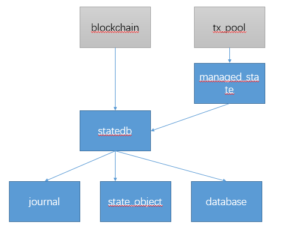

# 以太坊的trie树管理 回滚等操作 state源码分析
`core/state` 包主要为以太坊的state trie提供了一层缓存层(cache)

state的结构主要如下图



蓝色的矩形代表本模块， 灰色的矩形代表外部模块。
- database主要提供了trie树的抽象，提供trie树的缓存和合约代码长度的缓存。
- journal主要提供了操作日志，以及操作回滚的功能。
- state_object是account对象的抽象，提供了账户的一些功能。
- statedb主要是提供了state trie的部分功能。

## database.go
database.go 提供了一个数据库的抽象。

### 数据结构
```go
// Database接口封装了对trie和合约代码的访问。
type Database interface {
	// OpenTrie打开主账户trie。
	OpenTrie(root common.Hash) (Trie, error)

	// OpenStorageTrie打开账户的存储trie。
	OpenStorageTrie(stateRoot common.Hash, addrHash, root common.Hash) (Trie, error)

	// CopyTrie返回给定trie的独立副本。
	CopyTrie(Trie) Trie

	// ContractCode检索特定合约的代码。
	ContractCode(addrHash, codeHash common.Hash) ([]byte, error)

	// ContractCodeSize检索特定合约代码的大小。
	ContractCodeSize(addrHash, codeHash common.Hash) (int, error)

	// DiskDB返回底层的键值对磁盘数据库。
	DiskDB() ethdb.KeyValueStore

	// TrieDB检索用于数据存储的底层trie数据库。
	TrieDB() *trie.Database
}

// NewDatabase函数创建一个用于存储状态的后端存储。
// 返回的数据库可以安全地进行并发使用，但不会在内存中保留任何最近的Trie节点。
// 要在内存中保留一些历史状态，请使用NewDatabaseWithConfig构造函数。
func NewDatabase(db ethdb.Database) Database {
    return NewDatabaseWithConfig(db, nil)
}

type cachingDB struct {
    disk          ethdb.KeyValueStore
    codeSizeCache *lru.Cache[common.Hash, int]
    codeCache     *lru.SizeConstrainedCache[common.Hash, []byte]
    triedb        *trie.Database
}
```

### OpenTrie
~~从缓存里面查找。如果找到了返回缓存的trie的copy， 否则重新构建一颗树返回。~~
```go
// OpenTrie函数用于打开指定根哈希的主账户Trie。
func (db *cachingDB) OpenTrie(root common.Hash) (Trie, error) {
	tr, err := trie.NewStateTrie(trie.StateTrieID(root), db.triedb)
	if err != nil {
		return nil, err
	}
	return tr, nil
}


// NewStateTrie函数从一个后备数据库中创建一个带有现有根节点的trie。
// 
// 如果根节点是零哈希或空字符串的sha3哈希，则trie最初为空。
// 否则，如果db为nil，New将会抛出panic，并且如果找不到根节点，则返回MissingNodeError。
func NewStateTrie(id *ID, db *Database) (*StateTrie, error) {
    if db == nil {
        panic("trie.NewStateTrie called without a database")
    }
    trie, err := New(id, db)
    if err != nil {
        return nil, err
    }
    return &StateTrie{trie: *trie, preimages: db.preimages}, nil
}

// OpenStorageTrie函数打开一个账户的存储trie
func (db *cachingDB) OpenStorageTrie(stateRoot common.Hash, addrHash, root common.Hash) (Trie, error) {
    tr, err := trie.NewStateTrie(trie.StorageTrieID(stateRoot, addrHash, root), db.triedb)
    if err != nil {
        return nil, err
    }
    return tr, nil
}
```

`New` 函数接受一个ID类型和一个NodeReader类型参数，ID是用于唯一标识Trie的标识符，NodeReader包装了访问Trie节点所需的所有必要函数。先新建一颗Trie树，如果`id.Root`不是空值的话，就说明是从数据库加载一个已经存在的Trie树， 就调用`trie.resolveAndTrack()`方法来加载整颗Trie树，如果root是空，那么就直接返回。

### ContractCode 和 ContractCodeSize
ContractCodeSize有缓存。
```go
// ContractCode函数检索特定合约的代码。
func (db *cachingDB) ContractCode(addrHash, codeHash common.Hash) ([]byte, error) {
	code, _ := db.codeCache.Get(codeHash)
	if len(code) > 0 {
		return code, nil
	}
	code = rawdb.ReadCode(db.disk, codeHash)
	if len(code) > 0 {
		db.codeCache.Add(codeHash, code)
		db.codeSizeCache.Add(codeHash, len(code))
		return code, nil
	}
	return nil, errors.New("not found")
}

// ContractCodeSize函数检索特定合约代码的大小。
func (db *cachingDB) ContractCodeSize(addrHash, codeHash common.Hash) (int, error) {
    if cached, ok := db.codeSizeCache.Get(codeHash); ok {
        return cached, nil
    }
    code, err := db.ContractCode(addrHash, codeHash)
    return len(code), err
}
```
`ContractCode` ：先从缓存中获取，没获取到则从磁盘中获取，并将代码和代码大小放到缓存
`ContractCodeSize` ：从缓存中获取代码大小，没获取到则从磁盘获取

### ~~cachedTrie~~ $\Rightarrow$ StateTrie
~~cachedTrie的commit方法commit的时候会调用pushTrie方法把之前的Trie树缓存起来。~~
```go
// SecureTrie is the old name of StateTrie.
// Deprecated: use StateTrie.
type SecureTrie = StateTrie

// StateTrie是一个带有键哈希的trie的封装。
// 在StateTrie中，所有访问操作都使用keccak256对键进行哈希。
// 这可以防止调用代码创建增加访问时间的长节点链。
//
// 与常规trie相反，StateTrie只能通过New创建，并且必须附加一个数据库。
// 数据库还存储了每个键的原像，如果启用了原像记录。
//
// StateTrie不适用于并发使用。
type StateTrie struct {
    trie             Trie
    preimages        *preimageStore
    hashKeyBuf       [common.HashLength]byte
    secKeyCache      map[string][]byte
    secKeyCacheOwner *StateTrie // 指向自身的指针，在不匹配时替换键缓存
}

// Commit函数会收集Trie中的所有脏节点，并用相应的节点哈希替换它们。
// 所有收集到的节点（包括脏叶节点，如果collectLeaf为true）将被封装到一个节点集中返回。
// 如果Trie是干净的（没有需要提交的内容），则返回的节点集可以为nil。
// 如果启用了预映像记录，所有缓存的预映像也将被刷新。一旦Trie被提交，它将不再可用。
// 必须使用新的根和更新的Trie数据库创建一个新的Trie以供后续使用。
func (t *StateTrie) Commit(collectLeaf bool) (common.Hash, *trienode.NodeSet) {
    // Write all the pre-images to the actual disk database
    if len(t.getSecKeyCache()) > 0 {
        if t.preimages != nil {
            preimages := make(map[common.Hash][]byte)
            for hk, key := range t.secKeyCache {
                preimages[common.BytesToHash([]byte(hk))] = key
            }
            t.preimages.insertPreimage(preimages)
        }
        t.secKeyCache = make(map[string][]byte)
    }
    // Commit the trie and return its modified nodeset.
    return t.trie.Commit(collectLeaf)
}
```

## journal.go
journal代表了操作日志， 并针对各种操作的日志提供了对应的回滚功能。 可以基于这个日志来做一些事务类型的操作。

### 类型定义
定义了`journalEntry`这个接口，提供了undo的功能。 journal 就是journalEntry的列表。
```go
// journalEntry is a modification entry in the state change journal that can be
// reverted on demand.
type journalEntry interface {
	// revert undoes the changes introduced by this journal entry.
	revert(*StateDB)

	// dirtied returns the Ethereum address modified by this journal entry.
	dirtied() *common.Address
}
```

各种不同的日志类型以及`revert`方法
```go
type (
	// 账户Trie的更改。
	createObjectChange struct {
		account *common.Address
	}
	resetObjectChange struct {
		account      *common.Address
		prev         *stateObject
		prevdestruct bool
		prevAccount  []byte
		prevStorage  map[common.Hash][]byte
	}
	suicideChange struct {
		account     *common.Address
		prev        bool // 账户是否已自杀
		prevbalance *big.Int
	}

	// 单个账户的更改。
	balanceChange struct {
		account *common.Address
		prev    *big.Int
	}
	nonceChange struct {
		account *common.Address
		prev    uint64
	}
	storageChange struct {
		account       *common.Address
		key, prevalue common.Hash
	}
	codeChange struct {
		account            *common.Address
		prevcode, prevhash []byte
	}

	// 其他状态值的更改。
	refundChange struct {
		prev uint64
	}
	addLogChange struct {
		txhash common.Hash
	}
	addPreimageChange struct {
		hash common.Hash
	}
	touchChange struct {
		account *common.Address
	}
	// 访问列表的更改
	accessListAddAccountChange struct {
		address *common.Address
	}
	accessListAddSlotChange struct {
		address *common.Address
		slot    *common.Hash
	}

	transientStorageChange struct {
		account       *common.Address
		key, prevalue common.Hash
	}
)

func (ch createObjectChange) revert(s *StateDB) {
	delete(s.stateObjects, *ch.account)
	delete(s.stateObjectsDirty, *ch.account)
}

func (ch resetObjectChange) revert(s *StateDB) {
	s.setStateObject(ch.prev)
	if !ch.prevdestruct {
		delete(s.stateObjectsDestruct, ch.prev.address)
	}
	if ch.prevAccount != nil {
		s.snapAccounts[ch.prev.addrHash] = ch.prevAccount
	}
	if ch.prevStorage != nil {
		s.snapStorage[ch.prev.addrHash] = ch.prevStorage
	}
}

func (ch suicideChange) revert(s *StateDB) {
	obj := s.getStateObject(*ch.account)
	if obj != nil {
		obj.suicided = ch.prev
		obj.setBalance(ch.prevbalance)
	}
}

...

```


