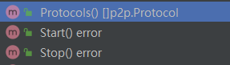

~~node中的服务的定义， eth其实就是实现了一个服务。~~  
原来的`Service`接口相关功能合入了结构体`Ethereum`中，其实现了原来`Service`接口中的四个方法：




go ethereum 的eth目录是以太坊服务的实现。 以太坊协议是通过`cmd/util/flags.go`的Register方法注入的
```go
// RegisterEthService将一个以太坊客户端添加到堆栈中。
// 第二个返回值是完整节点实例，如果节点以轻客户端方式运行，则可能为nil。
func RegisterEthService(stack *node.Node, cfg *ethconfig.Config) (ethapi.Backend, *eth.Ethereum) {
	if cfg.SyncMode == downloader.LightSync {
		backend, err := les.New(stack, cfg)
		if err != nil {
			Fatalf("Failed to register the Ethereum service: %v", err)
		}
		stack.RegisterAPIs(tracers.APIs(backend.ApiBackend))
		if err := lescatalyst.Register(stack, backend); err != nil {
			Fatalf("Failed to register the Engine API service: %v", err)
		}
		return backend.ApiBackend, nil
	}
	backend, err := eth.New(stack, cfg)
	if err != nil {
		Fatalf("Failed to register the Ethereum service: %v", err)
	}
	if cfg.LightServ > 0 {
		_, err := les.NewLesServer(stack, backend, cfg)
		if err != nil {
			Fatalf("Failed to create the LES server: %v", err)
		}
	}
	if err := ethcatalyst.Register(stack, backend); err != nil {
		Fatalf("Failed to register the Engine API service: %v", err)
	}
	stack.RegisterAPIs(tracers.APIs(backend.APIBackend))
	return backend.APIBackend, backend
}
```

以太坊协议的数据结构
```go
// eth/backend.go
// Ethereum实现了以太坊完整节点服务。
type Ethereum struct {
	config *ethconfig.Config                            // 配置

	// Handlers
	txPool *txpool.TxPool                               // 交易池

	blockchain         *core.BlockChain                 // 区块链
	handler            *handler                         // 协议管理
	ethDialCandidates  enode.Iterator
	snapDialCandidates enode.Iterator
	merger             *consensus.Merger

	// DB interfaces
	chainDb ethdb.Database // Block chain database

	eventMux       *event.TypeMux
	engine         consensus.Engine                     // 一致性引擎。 应该是Pow部分
	accountManager *accounts.Manager                    // 账号管理

	bloomRequests     chan chan *bloombits.Retrieval    // 接收布隆数据检索请求的通道。
	bloomIndexer      *core.ChainIndexer                // 布隆索引器在区块导入期间操作。
	closeBloomHandler chan struct{}

	APIBackend *EthAPIBackend                           // 提供给RPC服务使用的API后端

	miner     *miner.Miner                              // 矿工
	gasPrice  *big.Int                                  // 节点接收的gasPrice的最小值。 比这个值更小的交易会被本节点拒绝
	etherbase common.Address                            // 矿工地址

	networkID     uint64                                // 网络ID  testnet是0 mainnet是1 
	netRPCService *ethapi.NetAPI                        // RPC的服务

	p2pServer *p2p.Server

	lock sync.RWMutex // 保护可变字段（例如，燃料价格和以太坊基础地址）。

	shutdownTracker *shutdowncheck.ShutdownTracker // 跟踪节点是否以及何时非正常关闭。
}
```

以太坊协议的创建New. 暂时先不涉及core的内容。 只是大概介绍一下。 core里面的内容后续会分析。
```go
// eth/backend.go
// New创建一个新的以太坊对象（包括常见以太坊对象的初始化）。
func New(stack *node.Node, config *ethconfig.Config) (*Ethereum, error) {
	// 确保配置值是兼容和合理的。
	if config.SyncMode == downloader.LightSync {
		return nil, errors.New("can't run eth.Ethereum in light sync mode, use les.LightEthereum")
	}
	if !config.SyncMode.IsValid() {
		return nil, fmt.Errorf("invalid sync mode %d", config.SyncMode)
	}
	if config.Miner.GasPrice == nil || config.Miner.GasPrice.Cmp(common.Big0) <= 0 {
		log.Warn("Sanitizing invalid miner gas price", "provided", config.Miner.GasPrice, "updated", ethconfig.Defaults.Miner.GasPrice)
		config.Miner.GasPrice = new(big.Int).Set(ethconfig.Defaults.Miner.GasPrice)
	}
	if config.NoPruning && config.TrieDirtyCache > 0 {
		if config.SnapshotCache > 0 {
			config.TrieCleanCache += config.TrieDirtyCache * 3 / 5
			config.SnapshotCache += config.TrieDirtyCache * 2 / 5
		} else {
			config.TrieCleanCache += config.TrieDirtyCache
		}
		config.TrieDirtyCache = 0
	}
	log.Info("Allocated trie memory caches", "clean", common.StorageSize(config.TrieCleanCache)*1024*1024, "dirty", common.StorageSize(config.TrieDirtyCache)*1024*1024)

	// 组装以太坊对象。
	// 创建leveldb。 打开或者新建 chaindata目录
	chainDb, err := stack.OpenDatabaseWithFreezer("chaindata", config.DatabaseCache, config.DatabaseHandles, config.DatabaseFreezer, "eth/db/chaindata/", false)
	if err != nil {
		return nil, err
	}
	if err := pruner.RecoverPruning(stack.ResolvePath(""), chainDb, stack.ResolvePath(config.TrieCleanCacheJournal)); err != nil {
		log.Error("Failed to recover state", "error", err)
	}
	// 将与挖矿相关的配置转移到ethash配置中。
	chainConfig, err := core.LoadChainConfig(chainDb, config.Genesis)
	if err != nil {
		return nil, err
	}
	engine, err := ethconfig.CreateConsensusEngine(chainConfig, chainDb)
	if err != nil {
		return nil, err
	}
	eth := &Ethereum{
		config:            config,
		merger:            consensus.NewMerger(chainDb),
		chainDb:           chainDb,
		eventMux:          stack.EventMux(),
		accountManager:    stack.AccountManager(),
		engine:            engine,
		closeBloomHandler: make(chan struct{}),
		networkID:         config.NetworkId,
		gasPrice:          config.Miner.GasPrice,
		etherbase:         config.Miner.Etherbase,
		bloomRequests:     make(chan chan *bloombits.Retrieval),
		bloomIndexer:      core.NewBloomIndexer(chainDb, params.BloomBitsBlocks, params.BloomConfirms),
		p2pServer:         stack.Server(),
		shutdownTracker:   shutdowncheck.NewShutdownTracker(chainDb),
	}

	bcVersion := rawdb.ReadDatabaseVersion(chainDb)
	var dbVer = "<nil>"
	if bcVersion != nil {
		dbVer = fmt.Sprintf("%d", *bcVersion)
	}
	log.Info("Initialising Ethereum protocol", "network", config.NetworkId, "dbversion", dbVer)

	// 检查数据库里面存储的BlockChainVersion和客户端的BlockChainVersion的版本是否一致
	if !config.SkipBcVersionCheck {
		if bcVersion != nil && *bcVersion > core.BlockChainVersion {
			return nil, fmt.Errorf("database version is v%d, Geth %s only supports v%d", *bcVersion, params.VersionWithMeta, core.BlockChainVersion)
		} else if bcVersion == nil || *bcVersion < core.BlockChainVersion {
			if bcVersion != nil { // only print warning on upgrade, not on init
				log.Warn("Upgrade blockchain database version", "from", dbVer, "to", core.BlockChainVersion)
			}
			rawdb.WriteDatabaseVersion(chainDb, core.BlockChainVersion)
		}
	}
	var (
		vmConfig = vm.Config{
			EnablePreimageRecording: config.EnablePreimageRecording,
		}
		cacheConfig = &core.CacheConfig{
			TrieCleanLimit:      config.TrieCleanCache,
			TrieCleanJournal:    stack.ResolvePath(config.TrieCleanCacheJournal),
			TrieCleanRejournal:  config.TrieCleanCacheRejournal,
			TrieCleanNoPrefetch: config.NoPrefetch,
			TrieDirtyLimit:      config.TrieDirtyCache,
			TrieDirtyDisabled:   config.NoPruning,
			TrieTimeLimit:       config.TrieTimeout,
			SnapshotLimit:       config.SnapshotCache,
			Preimages:           config.Preimages,
		}
	)
	// 使用提供的设置覆盖链配置。
	var overrides core.ChainOverrides
	if config.OverrideCancun != nil {
		overrides.OverrideCancun = config.OverrideCancun
	}
	// 使用数据库创建区块链
	// 同时设置创世区块，如果创世区块尚不存在，则将提供的创世规范提交到数据库，或从数据库加载已存储的创世区块。
	eth.blockchain, err = core.NewBlockChain(chainDb, cacheConfig, config.Genesis, &overrides, eth.engine, vmConfig, eth.shouldPreserve, &config.TxLookupLimit)
	if err != nil {
		return nil, err
	}
	eth.bloomIndexer.Start(eth.blockchain)

	if config.TxPool.Journal != "" {
		config.TxPool.Journal = stack.ResolvePath(config.TxPool.Journal)
	}
	// 创建legacyPool
	legacyPool := legacypool.New(config.TxPool, eth.blockchain)
    // 创建txPool
	eth.txPool, err = txpool.New(new(big.Int).SetUint64(config.TxPool.PriceLimit), eth.blockchain, []txpool.SubPool{legacyPool})
	if err != nil {
		return nil, err
	}
	// 允许下载器在快速同步期间使用trie缓存配额。
	cacheLimit := cacheConfig.TrieCleanLimit + cacheConfig.TrieDirtyLimit + cacheConfig.SnapshotLimit
	// 创建协议管理器
	if eth.handler, err = newHandler(&handlerConfig{
		Database:       chainDb,
		Chain:          eth.blockchain,
		TxPool:         eth.txPool,
		Merger:         eth.merger,
		Network:        config.NetworkId,
		Sync:           config.SyncMode,
		BloomCache:     uint64(cacheLimit),
		EventMux:       eth.eventMux,
		RequiredBlocks: config.RequiredBlocks,
	}); err != nil {
		return nil, err
	}

	// 创建矿工
	eth.miner = miner.New(eth, &config.Miner, eth.blockchain.Config(), eth.EventMux(), eth.engine, eth.isLocalBlock)
	eth.miner.SetExtra(makeExtraData(config.Miner.ExtraData))

	// ApiBackend 用于给RPC调用提供后端支持
	eth.APIBackend = &EthAPIBackend{stack.Config().ExtRPCEnabled(), stack.Config().AllowUnprotectedTxs, eth, nil}
	if eth.APIBackend.allowUnprotectedTxs {
		log.Info("Unprotected transactions allowed")
	}
	
    // gpoParams GPO Gas Price Oracle 的缩写。
	// GasPrice预测。 通过最近的交易来预测当前的GasPrice的值。这个值可以作为之后发送交易的费用的参考。
	gpoParams := config.GPO
	if gpoParams.Default == nil {
		gpoParams.Default = config.Miner.GasPrice
	}
	eth.APIBackend.gpo = gasprice.NewOracle(eth.APIBackend, gpoParams)

	// 设置DNS发现迭代器。
	dnsclient := dnsdisc.NewClient(dnsdisc.Config{})
	eth.ethDialCandidates, err = dnsclient.NewIterator(eth.config.EthDiscoveryURLs...)
	if err != nil {
		return nil, err
	}
	eth.snapDialCandidates, err = dnsclient.NewIterator(eth.config.SnapDiscoveryURLs...)
	if err != nil {
		return nil, err
	}

	// Start the RPC service
	eth.netRPCService = ethapi.NewNetAPI(eth.p2pServer, config.NetworkId)

	// Register the backend on the node
	stack.RegisterAPIs(eth.APIs())
	stack.RegisterProtocols(eth.Protocols())
	stack.RegisterLifecycle(eth)

	// 成功启动；推送一个标记并检查之前的非干净关闭。
	eth.shutdownTracker.MarkStartup()

	return eth, nil
}
```
> - LegacyPool：LegacyPool包含当前所有已知的交易。当交易从网络接收到或本地提交时，它们将进入交易池。当交易包含在区块链中时，它们将退出交易池。该池将可处理的交易（可应用于当前状态）和未来交易分开。随着交易的接收和处理，交易会随时间在这两个状态之间移动。
> - TxPool是各种特定交易池的聚合器，共同跟踪节点认为有趣的所有交易。当交易从网络接收到或本地提交时，它们将进入交易池。当交易包含在区块链中或由于资源限制而被驱逐时，它们将退出交易池。

ApiBackend 定义在 api_backend.go文件中。 封装了一些函数。
```go
// EthAPIBackend实现了ethapi.Backend和tracers.Backend接口，用于完整节点。
type EthAPIBackend struct {
	extRPCEnabled       bool
	allowUnprotectedTxs bool
	eth                 *Ethereum
	gpo                 *gasprice.Oracle
}

// ChainConfig returns the active chain configuration.
func (b *EthAPIBackend) ChainConfig() *params.ChainConfig {
return b.eth.blockchain.Config()
}

func (b *EthAPIBackend) CurrentBlock() *types.Header {
return b.eth.blockchain.CurrentBlock()
}

func (b *EthAPIBackend) SetHead(number uint64) {
b.eth.handler.downloader.Cancel()
b.eth.blockchain.SetHead(number)
}
```

New方法中除了core中的一些方法， 有一个~~ProtocolManager~~的对象在以太坊协议中比较重要， 以太坊本来是一个协议。~~ProtocolManager~~中又可以管理多个以太坊的子协议。
> ProtocolManager已被删除，现在用的是handler
```go
// newHandler返回一个用于所有以太坊链管理协议的处理程序。
func newHandler(config *handlerConfig) (*handler, error) {
	// 使用基本字段创建协议管理器。
	if config.EventMux == nil {
		config.EventMux = new(event.TypeMux) // Nicety initialization for tests
	}
	h := &handler{
		networkID:      config.Network,
		forkFilter:     forkid.NewFilter(config.Chain),
		eventMux:       config.EventMux,
		database:       config.Database,
		txpool:         config.TxPool,
		chain:          config.Chain,
		peers:          newPeerSet(),
		merger:         config.Merger,
		requiredBlocks: config.RequiredBlocks,
		quitSync:       make(chan struct{}),
	}
	if config.Sync == downloader.FullSync {
		// 数据库似乎为空，因为当前区块是创世区块。然而，快照区块已经超过了创世区块，因此在某个时间点上启用了快照同步。可能发生这种情况的情形有：
		// * 如果用户手动（或通过错误的区块）将快照同步节点回滚到同步点以下。
		// * 上一次快照同步尚未完成，而用户此次指定了完整同步。但是我们没有任何最近的完整同步状态。在这些情况下，重新启用快照同步是安全的。
		fullBlock, snapBlock := h.chain.CurrentBlock(), h.chain.CurrentSnapBlock()
		if fullBlock.Number.Uint64() == 0 && snapBlock.Number.Uint64() > 0 {
			h.snapSync.Store(true)
			log.Warn("Switch sync mode from full sync to snap sync")
		}
	} else {
		if h.chain.CurrentBlock().Number.Uint64() > 0 {
			// 如果数据库不为空，打印警告日志以运行快照同步。
			log.Warn("Switch sync mode from snap sync to full sync")
		} else {
			// 如果已请求快照同步且数据库为空，允许执行快照同步。
			h.snapSync.Store(true)
		}
	}
	// 如果同步成功，传递一个回调函数，以便在可能的情况下禁用快照同步模式并启用交易传播。
	success := func() {
		// 如果我们正在运行快照同步并且它已经完成，禁止在下一个同步周期中再次进行快照同步。
		if h.snapSync.Load() {
			log.Info("Snap sync complete, auto disabling")
			h.snapSync.Store(false)
		}
		// 如果我们成功完成了一个同步周期，接受来自网络的交易。
		h.acceptTxs.Store(true)
	}
	
	// 构建下载器（长时间同步）。
	// downloader是负责从其他的peer来同步自身数据。
	// downloader是全链同步工具
	h.downloader = downloader.New(config.Database, h.eventMux, h.chain, nil, h.removePeer, success)
	if ttd := h.chain.Config().TerminalTotalDifficulty; ttd != nil {
		if h.chain.Config().TerminalTotalDifficultyPassed {
			log.Info("Chain post-merge, sync via beacon client")
		} else {
			head := h.chain.CurrentBlock()
			if td := h.chain.GetTd(head.Hash(), head.Number.Uint64()); td.Cmp(ttd) >= 0 {
				log.Info("Chain post-TTD, sync via beacon client")
			} else {
				log.Warn("Chain pre-merge, sync via PoW (ensure beacon client is ready)")
			}
		}
	} else if h.chain.Config().TerminalTotalDifficultyPassed {
		log.Error("Chain configured post-merge, but without TTD. Are you debugging sync?")
	}
	
	// 构建获取器（短时间同步）。
	// validator 是使用一致性引擎来验证区块头的函数
	validator := func(header *types.Header) error {
		// 在过渡后，应禁用所有块获取器活动。打印警告日志。
		if h.merger.PoSFinalized() {
			log.Warn("Unexpected validation activity", "hash", header.Hash(), "number", header.Number)
			return errors.New("unexpected behavior after transition")
		}
		// 首先，在任何情况下都应拒绝所有PoS风格的区块头。
		// 无论链是否完成过渡，PoS区块头应仅来自可信的共识层，而不是P2P网络。
		if beacon, ok := h.chain.Engine().(*beacon.Beacon); ok {
			if beacon.IsPoSHeader(header) {
				return errors.New("unexpected post-merge header")
			}
		}
		return h.chain.Engine().VerifyHeader(h.chain, header)
	}

    // 返回区块高度的函数
	heighter := func() uint64 {
		return h.chain.CurrentBlock().Number.Uint64()
	}
	
	// ?
	inserter := func(blocks types.Blocks) (int, error) {
		// 在过渡后，应禁用所有块获取器活动。打印警告日志。
		if h.merger.PoSFinalized() {
			var ctx []interface{}
			ctx = append(ctx, "blocks", len(blocks))
			if len(blocks) > 0 {
				ctx = append(ctx, "firsthash", blocks[0].Hash())
				ctx = append(ctx, "firstnumber", blocks[0].Number())
				ctx = append(ctx, "lasthash", blocks[len(blocks)-1].Hash())
				ctx = append(ctx, "lastnumber", blocks[len(blocks)-1].Number())
			}
			log.Warn("Unexpected insertion activity", ctx...)
			return 0, errors.New("unexpected behavior after transition")
		}
		// 如果正在运行快照同步，则拒绝导入异常区块。
		// 在启动新网络时，这是一个问题，因为正在进行快照同步的矿工可能不会接受彼此的区块，直到重新启动。
		// 不幸的是，我们还没有找到一种方式让节点单方面决定网络是否是新的。
		// 如果我们找到解决方案，应该解决这个问题。
		if h.snapSync.Load() {
			log.Warn("Snap syncing, discarded propagated block", "number", blocks[0].Number(), "hash", blocks[0].Hash())
			return 0, nil
		}
		if h.merger.TDDReached() {
			// 在过渡期之后，来自P2P网络的区块被视为不可信。
			// 理论上，在开始过渡期时应完全禁用区块八卦（gossip）。
			// 但为了处理共识层中的过渡边界重组，仍然接受传统区块，但仅适用于终端POW（工作量证明）区块。
			// 详细规范请参考：https://github.com/ethereum/EIPs/blob/master/EIPS/eip-3675.md#halt-the-importing-of-pow-blocks
			for i, block := range blocks {
				ptd := h.chain.GetTd(block.ParentHash(), block.NumberU64()-1)
				if ptd == nil {
					return 0, nil
				}
				td := new(big.Int).Add(ptd, block.Difficulty())
				if !h.chain.Config().IsTerminalPoWBlock(ptd, td) {
					log.Info("Filtered out non-termimal pow block", "number", block.NumberU64(), "hash", block.Hash())
					return 0, nil
				}
				if err := h.chain.InsertBlockWithoutSetHead(block); err != nil {
					return i, err
				}
			}
			return 0, nil
		}
		n, err := h.chain.InsertChain(blocks)
		if err == nil {
			h.acceptTxs.Store(true) // 在任何获取器导入时标记初始同步完成。
		}
		return n, err
	}
	
	h.blockFetcher = fetcher.NewBlockFetcher(false, nil, h.chain.GetBlockByHash, validator, h.BroadcastBlock, heighter, nil, inserter, h.removePeer)

	fetchTx := func(peer string, hashes []common.Hash) error {
		p := h.peers.peer(peer)
		if p == nil {
			return errors.New("unknown peer")
		}
		return p.RequestTxs(hashes)
	}
	addTxs := func(txs []*txpool.Transaction) []error {
		return h.txpool.Add(txs, false, false)
	}
	h.txFetcher = fetcher.NewTxFetcher(h.txpool.Has, addTxs, fetchTx)
	h.chainSync = newChainSyncer(h)
	return h, nil
}
```
> - peer：在网络中的上下文中，对等节点（peer）指的是连接到网络并能够与网络中的其他对等节点进行通信的节点或设备。在点对点（P2P）网络的上下文中，对等节点是参与网络并直接彼此共享资源和信息的节点，而不依赖于中央服务器。P2P网络中的对等节点既可以提供资源，如文件、数据或计算能力，也可以消耗资源。
> - BlockFetcher负责从各种对等节点累积区块公告，并安排它们进行检索。


服务的APIs()方法会返回服务暴露的RPC方法。（注意区分rpc中的`apis()`）
```go
// APIs返回以太坊包提供的RPC服务集合。
// 注意，其中一些服务可能需要移动到其他地方。
func (s *Ethereum) APIs() []rpc.API {
	apis := ethapi.GetAPIs(s.APIBackend)

	// 追加由共识引擎明确公开的任何API。
	apis = append(apis, s.engine.APIs(s.BlockChain())...)

	// 追加所有本地API并返回。
	return append(apis, []rpc.API{
		{
			Namespace: "eth",
			Service:   NewEthereumAPI(s),
		}, {
			Namespace: "miner",
			Service:   NewMinerAPI(s),
		}, {
			Namespace: "eth",
			Service:   downloader.NewDownloaderAPI(s.handler.downloader, s.eventMux),
		}, {
			Namespace: "admin",
			Service:   NewAdminAPI(s),
		}, {
			Namespace: "debug",
			Service:   NewDebugAPI(s),
		}, {
			Namespace: "net",
			Service:   s.netRPCService,
		},
	}...)
}
```

服务的Protocols方法会返回服务提供了那些p2p的Protocol。 返回协议管理器里面的所有SubProtocols. 如果有lesServer那么还提供lesServer的Protocol。可以看到。所有的网络功能都是通过Protocol的方式提供出来的。
```go
// Protocols返回当前配置的所有网络协议以供启动。
func (s *Ethereum) Protocols() []p2p.Protocol {
	protos := eth.MakeProtocols((*ethHandler)(s.handler), s.networkID, s.ethDialCandidates)
	if s.config.SnapshotCache > 0 {
		protos = append(protos, snap.MakeProtocols((*snapHandler)(s.handler), s.snapDialCandidates)...)
	}
	return protos
}
```

Ethereum服务在创建之后，会被调用服务的Start方法。下面我们来看看Start方法
```go
// Start实现了node.Lifecycle接口，启动了以太坊协议实现所需的所有内部goroutine。
func (s *Ethereum) Start() error {
	eth.StartENRUpdater(s.blockchain, s.p2pServer.LocalNode())

	// 启动布隆过滤器请求处理的goroutine
	s.startBloomHandlers(params.BloomBitsBlocks)

	// Regularly update shutdown marker
	s.shutdownTracker.Start()

	// 根据服务器的限制确定最大对等节点数量。
	maxPeers := s.p2pServer.MaxPeers
	if s.config.LightServ > 0 {
		if s.config.LightPeers >= s.p2pServer.MaxPeers {
			return fmt.Errorf("invalid peer config: light peer count (%d) >= total peer count (%d)", s.config.LightPeers, s.p2pServer.MaxPeers)
		}
		maxPeers -= s.config.LightPeers
	}
	// 如果请求了，启动网络层和轻节点服务器。
	s.handler.Start(maxPeers)
	return nil
}
```

协议管理器的数据结构
```go
type handler struct {
    networkID  uint64
    forkFilter forkid.Filter // Fork ID过滤器，在节点的整个生命周期中保持不变。
    
    snapSync  atomic.Bool // 标志是否启用快照同步（如果我们已经拥有区块，则会被禁用）。
    acceptTxs atomic.Bool // 标志我们是否被认为已同步（启用交易处理）。
    
    database ethdb.Database
    txpool   txPool
    chain    *core.BlockChain
    maxPeers int
    
    downloader   *downloader.Downloader
    blockFetcher *fetcher.BlockFetcher
    txFetcher    *fetcher.TxFetcher
    peers        *peerSet
    merger       *consensus.Merger
    
    eventMux      *event.TypeMux
    txsCh         chan core.NewTxsEvent
    txsSub        event.Subscription
    minedBlockSub *event.TypeMuxSubscription
    
    requiredBlocks map[uint64]common.Hash
    
    // channels for fetcher, syncer, txsyncLoop
    quitSync chan struct{}
    
    chainSync *chainSyncer
    wg        sync.WaitGroup
    peerWG    sync.WaitGroup
}
```

协议管理器的Start方法。这个方法里面启动了大量的goroutine用来处理各种事务，可以推测，这个类应该是以太坊服务的主要实现类。
```go
func (h *handler) Start(maxPeers int) {
	h.maxPeers = maxPeers

	// broadcast transactions
	h.wg.Add(1)
    // 广播交易的通道。 txCh会作为txpool的TxPreEvent订阅通道。
	// txpool有了这种消息会通知给这个txCh。 广播交易的goroutine会把这个消息广播出去。
    h.txsCh = make(chan core.NewTxsEvent, txChanSize)
	// 订阅的回执
	h.txsSub = h.txpool.SubscribeNewTxsEvent(h.txsCh)
	// 启动广播的goroutine
	go h.txBroadcastLoop()

	// broadcast mined blocks
	h.wg.Add(1)
    // 订阅挖矿消息。当新的Block被挖出来的时候会产生消息。 这个订阅和上面的那个订阅采用了两种不同的模式，这种是标记为Deprecated的订阅方式。
    h.minedBlockSub = h.eventMux.Subscribe(core.NewMinedBlockEvent{})
    // 挖矿广播 goroutine 当挖出来的时候需要尽快的广播到网络上面去。
    go h.minedBroadcastLoop()

	// start sync handlers
	h.wg.Add(1)
	// ?
	go h.chainSync.loop()
}
```

~~当p2p的server启动的时候，会主动的找节点去连接，或者被其他的节点连接。 连接的过程是首先进行加密信道的握手，然后进行协议的握手。 最后为每个协议启动goroutine~~

调用栈分为两种情况：  
`eth/backend.go/Protocols()` -> `eth/protocols/eth/handle.go/MakeProtocols()`
`eth/backend.go/Protocols()` -> `eth/protocols/snap/handle.go/MakeProtocols()`

`MakeProtocols()`中执行Run方法来把控制交给最终的协议。 这个run方法首先创建了一个peer对象，然后调用了handle方法来处理这个peer
```go
// eth
Run: func(p *p2p.Peer, rw p2p.MsgReadWriter) error {
	peer := NewPeer(version, p, rw, backend.TxPool())
	defer peer.Close()
	return backend.RunPeer(peer, func(peer *Peer) error {
		return Handle(backend, peer)
	})
}

// snap
Run: func(p *p2p.Peer, rw p2p.MsgReadWriter) error {
    return backend.RunPeer(NewPeer(version, p, rw), func(peer *Peer) error {
        return Handle(backend, peer)
    })
},
```

handle方法
```go
// eth
// Handle在成功通过协议握手的情况下，每当建立一个"eth"连接时被调用。
// 该方法将持续处理消息，直到连接被关闭。
func Handle(backend Backend, peer *Peer) error {
	for {
		if err := handleMessage(backend, peer); err != nil {
			peer.Log().Debug("Message handling failed in `eth`", "err", err)
			return err
		}
	}
}

// snap
// Handle是用于管理"snap"节点生命周期的回调函数。
// 当此函数终止时，节点将断开连接。
func Handle(backend Backend, peer *Peer) error {
    for {
        if err := HandleMessage(backend, peer); err != nil {
            peer.Log().Debug("Message handling failed in `snap`", "err", err)
            return err
        }
    }
}
```

Handshake
调用栈：  
`eth/backend.go/Protocols()` -> `eth/protocols/snap/handle.go/MakeProtocols()` -> `eth/handle_eth.go/RunPeer()` -> `eth/handle.go/runEthPeer()` -> `eth/protocols/eth/handshake.go/Handshake()`

```go
// Handshake 执行以太坊协议握手，协商版本号、网络ID、难度、头部和创世区块。
func (p *Peer) Handshake(network uint64, td *big.Int, head common.Hash, genesis common.Hash, forkID forkid.ID, forkFilter forkid.Filter) error {
	// 在新线程中发送自己的握手。
	// error的channel的大小是2， 就是为了一次性处理下面的两个goroutine方法
	errc := make(chan error, 2)

	var status StatusPacket // 在从errc接收到两个值之后，可以安全地进行读取操作。

	go func() {
		errc <- p2p.Send(p.rw, StatusMsg, &StatusPacket{
			ProtocolVersion: uint32(p.version),
			NetworkID:       network,
			TD:              td,
			Head:            head,
			Genesis:         genesis,
			ForkID:          forkID,
		})
	}()
	go func() {
		errc <- p.readStatus(network, &status, genesis, forkFilter)
	}()
	timeout := time.NewTimer(handshakeTimeout)
	defer timeout.Stop()
	// 如果接收到任何一个错误(发送，接收),或者是超时， 那么就断开连接。
	for i := 0; i < 2; i++ {
		select {
		case err := <-errc:
			if err != nil {
				return err
			}
		case <-timeout.C:
			return p2p.DiscReadTimeout
		}
	}
	p.td, p.head = status.TD, status.Head

	// 主网块号7753254的目标难度为76位。如果它增加100倍，仍然可以适应100位。
	if tdlen := p.td.BitLen(); tdlen > 100 {
		return fmt.Errorf("too large total difficulty: bitlen %d", tdlen)
	}
	return nil
}
```

readStatus，检查对端返回的各种情况
```go
// 读取远程握手消息
func (p *Peer) readStatus(network uint64, status *StatusPacket, genesis common.Hash, forkFilter forkid.Filter) error {
	msg, err := p.rw.ReadMsg()
	if err != nil {
		return err
	}
	if msg.Code != StatusMsg {
		return fmt.Errorf("%w: first msg has code %x (!= %x)", errNoStatusMsg, msg.Code, StatusMsg)
	}
	if msg.Size > maxMessageSize {
		return fmt.Errorf("%w: %v > %v", errMsgTooLarge, msg.Size, maxMessageSize)
	}
	// Decode the handshake and make sure everything matches
	if err := msg.Decode(&status); err != nil {
		return fmt.Errorf("%w: message %v: %v", errDecode, msg, err)
	}
	if status.NetworkID != network {
		return fmt.Errorf("%w: %d (!= %d)", errNetworkIDMismatch, status.NetworkID, network)
	}
	if uint(status.ProtocolVersion) != p.version {
		return fmt.Errorf("%w: %d (!= %d)", errProtocolVersionMismatch, status.ProtocolVersion, p.version)
	}
	if status.Genesis != genesis {
		return fmt.Errorf("%w: %x (!= %x)", errGenesisMismatch, status.Genesis, genesis)
	}
	if err := forkFilter(status.ForkID); err != nil {
		return fmt.Errorf("%w: %v", errForkIDRejected, err)
	}
	return nil
}
```

Register 简单的把peer加入到自己的peers的map
调用栈：  
`eth/backend.go/Protocols()` -> `eth/protocols/snap/handle.go/MakeProtocols()` -> `eth/handle_eth.go/RunPeer()` -> `eth/handle.go/runEthPeer()` -> `eth/downloader/downloader.go/RegisterPeer()`

```go
// Register将新的节点注入工作集，如果该节点已经存在则返回错误。
// 该方法还将新节点的起始吞吐量值设置为所有现有节点的平均值，以使其有实际被用于数据检索的机会。
func (ps *peerSet) Register(p *peerConnection) error {
	// Register the new peer with some meaningful defaults
	ps.lock.Lock()
	if _, ok := ps.peers[p.id]; ok {
		ps.lock.Unlock()
		return errAlreadyRegistered
	}
	p.rates = msgrate.NewTracker(ps.rates.MeanCapacities(), ps.rates.MedianRoundTrip())
	if err := ps.rates.Track(p.id, p.rates); err != nil {
		ps.lock.Unlock()
		return err
	}
	ps.peers[p.id] = p
	ps.lock.Unlock()

	ps.events.Send(&peeringEvent{peer: p, join: true})
	return nil
}
```

经过一系列的检查和握手之后， 循环的调用了handleMsg方法来处理事件循环。 这个方法很长，主要是处理接收到各种消息之后的应对措施。（较以前改动较大）
```go
// eth/protocols/eth/handle.go
type msgHandler func(backend Backend, msg Decoder, peer *Peer) error

var eth66 = map[uint64]msgHandler{
    NewBlockHashesMsg:             handleNewBlockhashes,
    NewBlockMsg:                   handleNewBlock,
    TransactionsMsg:               handleTransactions,
    NewPooledTransactionHashesMsg: handleNewPooledTransactionHashes66,
    GetBlockHeadersMsg:            handleGetBlockHeaders66,
    BlockHeadersMsg:               handleBlockHeaders66,
    GetBlockBodiesMsg:             handleGetBlockBodies66,
    BlockBodiesMsg:                handleBlockBodies66,
    GetNodeDataMsg:                handleGetNodeData66,
    NodeDataMsg:                   handleNodeData66,
    GetReceiptsMsg:                handleGetReceipts66,
    ReceiptsMsg:                   handleReceipts66,
    GetPooledTransactionsMsg:      handleGetPooledTransactions66,
    PooledTransactionsMsg:         handlePooledTransactions66,
}

var eth67 = map[uint64]msgHandler{
    NewBlockHashesMsg:             handleNewBlockhashes,
    NewBlockMsg:                   handleNewBlock,
    TransactionsMsg:               handleTransactions,
    NewPooledTransactionHashesMsg: handleNewPooledTransactionHashes66,
    GetBlockHeadersMsg:            handleGetBlockHeaders66,
    BlockHeadersMsg:               handleBlockHeaders66,
    GetBlockBodiesMsg:             handleGetBlockBodies66,
    BlockBodiesMsg:                handleBlockBodies66,
    GetReceiptsMsg:                handleGetReceipts66,
    ReceiptsMsg:                   handleReceipts66,
    GetPooledTransactionsMsg:      handleGetPooledTransactions66,
    PooledTransactionsMsg:         handlePooledTransactions66,
}

var eth68 = map[uint64]msgHandler{
    NewBlockHashesMsg:             handleNewBlockhashes,
    NewBlockMsg:                   handleNewBlock,
    TransactionsMsg:               handleTransactions,
    NewPooledTransactionHashesMsg: handleNewPooledTransactionHashes68,
    GetBlockHeadersMsg:            handleGetBlockHeaders66,
    BlockHeadersMsg:               handleBlockHeaders66,
    GetBlockBodiesMsg:             handleGetBlockBodies66,
    BlockBodiesMsg:                handleBlockBodies66,
    GetReceiptsMsg:                handleGetReceipts66,
    ReceiptsMsg:                   handleReceipts66,
    GetPooledTransactionsMsg:      handleGetPooledTransactions66,
    PooledTransactionsMsg:         handlePooledTransactions66,
}

// 在从远程节点接收到入站消息时被调用。如果返回任何错误，远程连接将被关闭。
func handleMessage(backend Backend, peer *Peer) error {
    // 从远程节点读取下一条消息，并确保完全消耗。
    msg, err := peer.rw.ReadMsg()
    if err != nil {
        return err
    }
    if msg.Size > maxMessageSize {
        return fmt.Errorf("%w: %v > %v", errMsgTooLarge, msg.Size, maxMessageSize)
    }
    defer msg.Discard()
    
	// 通过节点的版本来判断使用哪些msgHandler
    var handlers = eth66
    if peer.Version() == ETH67 {
        handlers = eth67
    }
    if peer.Version() >= ETH68 {
        handlers = eth68
    }
    
    // 跟踪处理请求所需的时间并运行处理程序。
    if metrics.Enabled {
    h := fmt.Sprintf("%s/%s/%d/%#02x", p2p.HandleHistName, ProtocolName, peer.Version(), msg.Code)
    defer func(start time.Time) {
        sampler := func() metrics.Sample {
            return metrics.ResettingSample(
            metrics.NewExpDecaySample(1028, 0.015),
            )
        }
        metrics.GetOrRegisterHistogramLazy(h, nil, sampler).Update(time.Since(start).Microseconds())
    }(time.Now())
    }
	
	// 这里是根据msg.Code从map中获取msgHandler
	// 以前版本的代码使用的是switch
    if handler := handlers[msg.Code]; handler != nil {
        return handler(backend, msg, peer)
    }
    return fmt.Errorf("%w: %v", errInvalidMsgCode, msg.Code)
}

// 以下代码位于 eth/protocols/eth/handlers.go
func handleNewBlockhashes(backend Backend, msg Decoder, peer *Peer) error {
    // 一批新的区块公告刚刚到达。
    ann := new(NewBlockHashesPacket)
    if err := msg.Decode(ann); err != nil {
        return fmt.Errorf("%w: message %v: %v", errDecode, msg, err)
    }
    // 将哈希标记为在远程节点上存在。
    for _, block := range *ann {
        peer.markBlock(block.Hash)
    }
    // 将它们全部传递给后端进行排队。
    return backend.Handle(peer, ann)
}

func handleNewBlock(backend Backend, msg Decoder, peer *Peer) error {
    // Retrieve and decode the propagated block
    ann := new(NewBlockPacket)
    if err := msg.Decode(ann); err != nil {
        return fmt.Errorf("%w: message %v: %v", errDecode, msg, err)
    }
    if err := ann.sanityCheck(); err != nil {
        return err
    }
    if hash := types.CalcUncleHash(ann.Block.Uncles()); hash != ann.Block.UncleHash() {
        log.Warn("Propagated block has invalid uncles", "have", hash, "exp", ann.Block.UncleHash())
        return nil // TODO(karalabe): return error eventually, but wait a few releases
    }
    if hash := types.DeriveSha(ann.Block.Transactions(), trie.NewStackTrie(nil)); hash != ann.Block.TxHash() {
        log.Warn("Propagated block has invalid body", "have", hash, "exp", ann.Block.TxHash())
        return nil // TODO(karalabe): return error eventually, but wait a few releases
    }
    ann.Block.ReceivedAt = msg.Time()
    ann.Block.ReceivedFrom = peer
    
    // Mark the peer as owning the block
    peer.markBlock(ann.Block.Hash())
    
    return backend.Handle(peer, ann)
}

// handleGetBlockHeaders66 is the eth/66 version of handleGetBlockHeaders
func handleGetBlockHeaders66(backend Backend, msg Decoder, peer *Peer) error {
    // Decode the complex header query
    var query GetBlockHeadersPacket66
    if err := msg.Decode(&query); err != nil {
        return fmt.Errorf("%w: message %v: %v", errDecode, msg, err)
    }
    response := ServiceGetBlockHeadersQuery(backend.Chain(), query.GetBlockHeadersPacket, peer)
    return peer.ReplyBlockHeadersRLP(query.RequestId, response)
}

...
```

~~几种同步synchronise, 之前发现对方的节点比自己节点要更新的时候会调用这个方法synchronise~~
现在调用的是`doSync`，调用栈如下：

`eth/handler.go/Start()` -> `eth/sync.go/loop()` -> `startSync()` -> `doSync()`
```go
// doSync synchronizes the local blockchain with a remote peer.
// 将本地区块链与远程节点进行同步
func (h *handler) doSync(op *chainSyncOp) error {
	if op.mode == downloader.SnapSync {
		// 在启动快照同步之前，我们必须确保用户使用相同的txlookup限制。
		// 这里的主要问题是：在快照同步期间，Geth不会在HEAD-limit之前索引块（生成tx索引）。
		// 但是，如果用户在下一个快照同步中更改了限制（例如，用户手动终止并重新启动Geth），
		// 那么Geth很难确定最早的块是否已被索引。
		// 因此，从用户体验的角度来看，用户在快照同步期间无法更改限制是不理想的。
		// 如果更改了限制，Geth将只会盲目使用原始限制。
		limit := h.chain.TxLookupLimit()
		if stored := rawdb.ReadFastTxLookupLimit(h.database); stored == nil {
			rawdb.WriteFastTxLookupLimit(h.database, limit)
		} else if *stored != limit {
			h.chain.SetTxLookupLimit(*stored)
			log.Warn("Update txLookup limit", "provided", limit, "updated", *stored)
		}
	}
	// 运行同步周期，并在超过枢轴块后禁用快照同步。
	err := h.downloader.LegacySync(op.peer.ID(), op.head, op.td, h.chain.Config().TerminalTotalDifficulty, op.mode)
	if err != nil {
		return err
	}
	if h.snapSync.Load() {
		log.Info("Snap sync complete, auto disabling")
		h.snapSync.Store(false)
	}
	// 如果我们成功完成了同步周期，可以启用接受来自网络的交易。
	h.acceptTxs.Store(true)

	head := h.chain.CurrentBlock()
	if head.Number.Uint64() > 0 {
		// 我们已经完成了同步周期，通知所有节点有关新状态的信息。
		// 在星型拓扑网络中，这个路径非常重要，其中一个网关节点需要通知所有过时的节点新块的可用性。
		// 这种故障场景通常会在私有网络和黑客马拉松网络中出现，但对于主网来说，更可靠地更新节点或本地TD状态也是有益的。
		if block := h.chain.GetBlock(head.Hash(), head.Number.Uint64()); block != nil {
			h.BroadcastBlock(block, false)
		}
	}
	return nil
}
```


