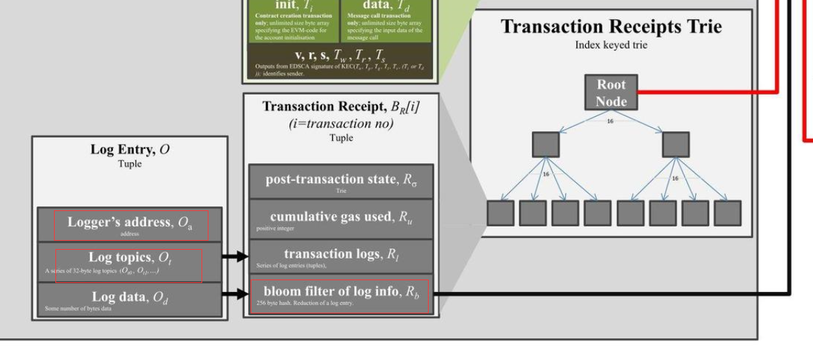
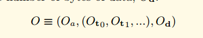
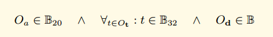
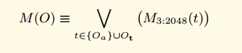
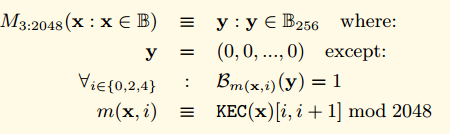
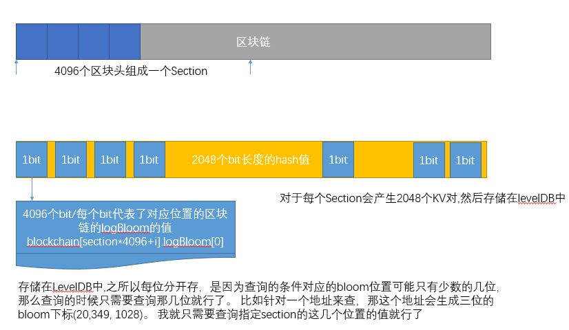

## 以太坊的布隆过滤器
以太坊的区块头中包含了一个叫做logsBloom的区域。 这个区域存储了当前区块中所有的收据的日志的布隆过滤器，一共是2048个bit。也就是256个字节。

而我们的一个交易的收据包含了很多的日志记录。 每个日志记录包含了 合约的地址， 多个Topic。 而在我们的收据中也存在一个布隆过滤器，这个布隆过滤器记录了所有的日志记录的信息。



如果我们看黄皮书里面对日志记录的形式化定义。

O代表我们的日志记录，Oa代表logger的地址，Oto,Ot1代表日志的Topics， Od代表时间。



Oa是20个字节，Ot是32个字节，Od是很多字节



我们定义了一个布隆过滤器函数M，用来把一个日志对象转换成256字节的hash



M3:2045是一个特别的函数，用来设置2048个bit位中的三位为1。 具体的方法请参考下面的公式。



对于任意的输入值，首先求他的KEC输出， 然后通过取KEC输出的 [0,1] [2,3],[4,5] 这几位的值 对2048取模， 得到三个值， 这三个值就是输出的2048中需要置位的下标。 也就是说对于任何一个输入，如果它对应的三个下标的值不都为1，那么它肯定不在这个区块中。 当如如果对应的三位都为1，也不能说明一定在这个区块中。 这就是布隆过滤器的特性。

收据中的布隆过滤器就是所有的日志的布隆过滤器输出的并集。

同时区块头中的logBloom，就是所有的收据的布隆过滤器的并集。

## ChainIndexer 和 BloomIndexer
最开始看到ChainIndexer，不是很明白是什么功能。 其实从名字中可以看到，是Chain的索引。 在 eth中我们有看到BloomIndexer,这个就是布隆过滤器的索引。

在我们的协议中提供了查找指定Log的功能。

用户可以通过传递下面的参数来查找指定的Log,开始的区块号，结束的区块号， 根据合约 Addresses指定的地址过滤，根据指定的Topics来过滤。
```go
// FilterCriteria represents a request to create a new filter.
// Same as ethereum.FilterQuery but with UnmarshalJSON() method.
type FilterCriteria ethereum.FilterQuery

// FilterQuery contains options for contract log filtering.
type FilterQuery struct {
    BlockHash *common.Hash     // used by eth_getLogs, return logs only from block with this hash
    FromBlock *big.Int         // beginning of the queried range, nil means genesis block
    ToBlock   *big.Int         // end of the range, nil means latest block
    Addresses []common.Address // restricts matches to events created by specific contracts
    
    // The Topic list restricts matches to particular event topics. Each event has a list
    // of topics. Topics matches a prefix of that list. An empty element slice matches any
    // topic. Non-empty elements represent an alternative that matches any of the
    // contained topics.
    //
    // Examples:
    // {} or nil          matches any topic list
    // {{A}}              matches topic A in first position
    // {{}, {B}}          matches any topic in first position AND B in second position
    // {{A}, {B}}         matches topic A in first position AND B in second position
    // {{A, B}, {C, D}}   matches topic (A OR B) in first position AND (C OR D) in second position
    Topics [][]common.Hash
}
```

如果开始和结束之间间隔很大，那么如果直接依次检索每个区块头的logBloom区域是比较低效的。 因为每个区块头都是分开存储的， 可能需要非常多的磁盘随机访问。

所以以太坊协议在本地维护了一套索引，用来加速这个过程。

大致原理是。 每4096个区块称为一个Section，一个Section里面的logBloom会存储在一起。对于每个Section, 用一个二维数据，A[2048][4096]来存储。 第一维2048代表了bloom过滤器的长度2048个字节。 第二维4096代表了一个Section里面的所有区块，每一个位置按照顺序代表了其中的一个区块。
- A[0][0]=blockchain[section*4096+0].logBloom[0],
- A[0][1]=blockchain[section*4096+1].logBloom[0],
- A[0][4096]=blockchain[section*4096+1].logBloom[0],
- A[1][0]=blockchain[section*4096+0].logBloom[1],
- A[1][1024]=blockchain[section*4096+1024].logBloom[1],
- A[2047][1]=blockchain[section*4096+1].logBloom[2047],

如果Section填充完毕，那么会写成2048个KV。



## bloombit.go 代码分析
这个代码相对不是很独立，如果单独看这个代码，有点摸不着头脑的感觉， 因为它只是实现了一些接口，具体的处理逻辑并不在这里，而是在core里面。 不过这里我先结合之前讲到的信息分析一下。 后续更详细的逻辑在分析core的代码的时候再详细分析。

服务线程startBloomHandlers这个方法是为了响应具体的查询请求， 给定指定的Section和bit来从levelDB里面查询然后返回出去。 单独看这里有点摸不着头脑。 这个方法的调用比较复杂。 涉及到core里面的很多逻辑。 这里先不细说了，知道有这个方法就行了。
```go
// Retrieval表示对于给定的位(bit)，以及给定的获取元素数量，
// 对检索任务分配的请求，或对此类请求的响应。它还可以将实际结果设置为用作传递数据结构。
// contest和error字段由轻客户端用于在管道的某个路径上遇到错误时提前终止匹配。
type Retrieval struct {
    Bit      uint
    Sections []uint64
    Bitsets  [][]byte
    
    Context context.Context
    Error   error
}

// startBloomHandlers启动一批goroutine，从可能的一系列过滤器中接收布隆过滤器数据库检索，
// 并提供数据以满足需求。
func (eth *Ethereum) startBloomHandlers(sectionSize uint64) {
	for i := 0; i < bloomServiceThreads; i++ {
		go func() {
			for {
				select {
				case <-eth.closeBloomHandler:
					return

				case request := <-eth.bloomRequests:
					task := <-request
					task.Bitsets = make([][]byte, len(task.Sections))
					for i, section := range task.Sections {
						head := rawdb.ReadCanonicalHash(eth.chainDb, (section+1)*sectionSize-1)
						if compVector, err := rawdb.ReadBloomBits(eth.chainDb, task.Bit, section, head); err == nil {
							if blob, err := bitutil.DecompressBytes(compVector, int(sectionSize/8)); err == nil {
								task.Bitsets[i] = blob
							} else {
								task.Error = err
							}
						} else {
							task.Error = err
						}
					}
					request <- task
				}
			}
		}()
	}
}
```

## 数据结构
BloomIndexer对象主要用户构建索引的过程，是core.ChainIndexer的一个接口实现，所以只实现了一些必须的接口。对于创建索引的逻辑还在core.ChainIndexer里面。
```go
// BloomIndexer实现了core.ChainIndexer，用于为以太坊头布隆过滤器构建旋转的布隆位索引，
// 从而实现了极快的过滤功能。
type BloomIndexer struct {
    size    uint64               // 正在生成布隆位(bloombits)的部分大小
    db      ethdb.Database       // 数据库实例用于写入索引数据和元数据
    gen     *bloombits.Generator // 生成器用于旋转布隆位以创建布隆索引
    section uint64               // Section是当前正在处理的部分编号
    head    common.Hash          // Head是最后一个处理的头的哈希值
}

// NewBloomIndexer返回一个链索引器，用于为规范链生成布隆位数据，以实现快速日志过滤。
func NewBloomIndexer(db ethdb.Database, size, confirms uint64) *ChainIndexer {
    backend := &BloomIndexer{
    db:   db,
    size: size,
    }
    table := rawdb.NewTable(db, string(rawdb.BloomBitsIndexPrefix))
    
    return NewChainIndexer(db, table, backend, size, confirms, bloomThrottling, "bloombits")
}
```

Reset实现了ChainIndexerBackend的方法，启动一个新的section
```go
// Reset实现了core.ChainIndexerBackend，用于启动一个新的布隆位索引部分。
func (b *BloomIndexer) Reset(ctx context.Context, section uint64, lastSectionHead common.Hash) error {
	gen, err := bloombits.NewGenerator(uint(b.size))
	b.gen, b.section, b.head = gen, section, common.Hash{}
	return err
}
```

Process实现了ChainIndexerBackend， 增加一个新的区块头到index
```go
// Process实现了core.ChainIndexerBackend，将新的头部布隆过滤器添加到索引中。
func (b *BloomIndexer) Process(ctx context.Context, header *types.Header) error {
	b.gen.AddBloom(uint(header.Number.Uint64()-b.section*b.size), header.Bloom)
	b.head = header.Hash()
	return nil
}
```

Commit方法实现了ChainIndexerBackend，持久化并写入数据库。
```go
// Commit实现了core.ChainIndexerBackend，完成布隆位部分的处理，并将其写入数据库。
func (b *BloomIndexer) Commit() error {
	batch := b.db.NewBatchWithSize((int(b.size) / 8) * types.BloomBitLength)
	for i := 0; i < types.BloomBitLength; i++ {
		bits, err := b.gen.Bitset(uint(i))
		if err != nil {
			return err
		}
		rawdb.WriteBloomBits(batch, uint(i), b.section, b.head, bitutil.CompressBytes(bits))
	}
	return batch.Write()
}
```

## filter/api.go 源码分析
eth/filter 包 包含了给用户提供过滤的功能，用户可以通过调用对交易或者区块进行过滤，然后持续的获取结果，如果5分钟没有操作，这个过滤器会被删除。

过滤器的结构：
```go
// filter是一个辅助结构，用于保存过滤器类型和与事件系统中关联的订阅的元信息。
type filter struct {
	typ      Type
	deadline *time.Timer // filter is inactive when deadline triggers
	hashes   []common.Hash
	fullTx   bool
	txs      []*types.Transaction
	crit     FilterCriteria
	logs     []*types.Log
	s        *Subscription // associated subscription in event system
}
```

构造方法
```go
// FilterAPI提供创建和管理过滤器的支持。
// 这将允许外部客户端检索与以太坊协议相关的各种信息，如区块、交易和日志。
type FilterAPI struct {
	sys       *FilterSystem
	events    *EventSystem
	filtersMu sync.Mutex
	filters   map[rpc.ID]*filter
	timeout   time.Duration
}

// NewFilterAPI返回一个新的FilterAPI实例。
func NewFilterAPI(system *FilterSystem, lightMode bool) *FilterAPI {
	api := &FilterAPI{
		sys:     system,
		events:  NewEventSystem(system, lightMode),
		filters: make(map[rpc.ID]*filter),
		timeout: system.cfg.Timeout,
	}
	go api.timeoutLoop(system.cfg.Timeout)

	return api
}
```

## 超时检查
```go
// timeoutLoop按照设置的超时间隔运行，并删除最近未使用的过滤器。在API创建时启动。
func (api *FilterAPI) timeoutLoop(timeout time.Duration) {
	var toUninstall []*Subscription
	ticker := time.NewTicker(timeout)
	defer ticker.Stop()
	for {
		<-ticker.C
		api.filtersMu.Lock()
		for id, f := range api.filters {
			select {
			case <-f.deadline.C:
				toUninstall = append(toUninstall, f.s)
				delete(api.filters, id)
			default:
				continue
			}
		}
		api.filtersMu.Unlock()

		// 取消订阅在锁之外进行处理，以避免以下场景：
		// 事件循环尝试向仍处于活动状态的过滤器广播事件，而取消订阅正在等待处理卸载请求。
		for _, s := range toUninstall {
			s.Unsubscribe()
		}
		toUninstall = nil
	}
}
```

`NewPendingTransactionFilter`用来创建一个`PendingTransactionFilter`。 这种方式是用来给那种无法创建长连接的通道使用的(比如HTTP), 如果对于可以建立长链接的通道(比如WebSocket)可以使用rpc提供的发送订阅模式来处理，就不用持续的轮询了
```go
// NewPendingTransactionFilter创建一个过滤器，该过滤器在交易进入待处理状态时获取待处理交易。
// 它是过滤器包的一部分，因为该过滤器可以通过`eth_getFilterChanges`轮询方法使用，
// 该方法也用于日志过滤器。
func (api *FilterAPI) NewPendingTransactionFilter(fullTx *bool) rpc.ID {
	var (
		pendingTxs   = make(chan []*types.Transaction)
		pendingTxSub = api.events.SubscribePendingTxs(pendingTxs)
	)

	api.filtersMu.Lock()
	api.filters[pendingTxSub.ID] = &filter{typ: PendingTransactionsSubscription, fullTx: fullTx != nil && *fullTx, deadline: time.NewTimer(api.timeout), txs: make([]*types.Transaction, 0), s: pendingTxSub}
	api.filtersMu.Unlock()

	go func() {
		for {
			select {
			case pTx := <-pendingTxs:
				api.filtersMu.Lock()
				if f, found := api.filters[pendingTxSub.ID]; found {
					f.txs = append(f.txs, pTx...)
				}
				api.filtersMu.Unlock()
			case <-pendingTxSub.Err():
				api.filtersMu.Lock()
				delete(api.filters, pendingTxSub.ID)
				api.filtersMu.Unlock()
				return
			}
		}
	}()

	return pendingTxSub.ID
}
```
> 本方法通过web3.js调用，调用方法如下：
> ```js
> var filter = web3.eth.filter('pending');
> ```
> pending表示监听正在pending的区块。

轮询: GetFilterChanges
```go
// GetFilterChanges根据给定的ID返回自上次调用以来过滤器的日志。
// 这可以用于轮询。对于待处理的交易和区块过滤器，结果是[]common.Hash。
// (待处理)日志过滤器返回[]Log。
func (api *FilterAPI) GetFilterChanges(id rpc.ID) (interface{}, error) {
	api.filtersMu.Lock()
	defer api.filtersMu.Unlock()

	chainConfig := api.sys.backend.ChainConfig()
	latest := api.sys.backend.CurrentHeader()

	if f, found := api.filters[id]; found {
		if !f.deadline.Stop() {
			// 计时器已过期，但在超时循环中尚未删除过滤器，接收计时器值并重置计时器。
			<-f.deadline.C
		}
		f.deadline.Reset(api.timeout)

		switch f.typ {
		case BlocksSubscription:
			hashes := f.hashes
			f.hashes = nil
			return returnHashes(hashes), nil
		case PendingTransactionsSubscription:
			if f.fullTx {
				txs := make([]*ethapi.RPCTransaction, 0, len(f.txs))
				for _, tx := range f.txs {
					txs = append(txs, ethapi.NewRPCPendingTransaction(tx, latest, chainConfig))
				}
				f.txs = nil
				return txs, nil
			} else {
				hashes := make([]common.Hash, 0, len(f.txs))
				for _, tx := range f.txs {
					hashes = append(hashes, tx.Hash())
				}
				f.txs = nil
				return hashes, nil
			}
		case LogsSubscription, MinedAndPendingLogsSubscription:
			logs := f.logs
			f.logs = nil
			return returnLogs(logs), nil
		}
	}

	return []interface{}{}, errFilterNotFound
}
```
> 没找到调用的地方

对于可以建立长连接的通道，可以直接使用rpc的发送订阅模式， 这样客户端就可以直接接收到过滤信息，不用调用轮询的方式了。 可以看到这种模式下面并没有添加到filters这个容器，也没有超时管理了。也就是说支持两种模式。
```go
// NewPendingTransactions创建一个订阅，每当一个交易进入交易池时触发。
// 如果fullTx为true，则完整的交易将发送给客户端，否则只发送哈希。
func (api *FilterAPI) NewPendingTransactions(ctx context.Context, fullTx *bool) (*rpc.Subscription, error) {
	notifier, supported := rpc.NotifierFromContext(ctx)
	if !supported {
		return &rpc.Subscription{}, rpc.ErrNotificationsUnsupported
	}

	rpcSub := notifier.CreateSubscription()

	go func() {
		txs := make(chan []*types.Transaction, 128)
		pendingTxSub := api.events.SubscribePendingTxs(txs)
		chainConfig := api.sys.backend.ChainConfig()

		for {
			select {
			case txs := <-txs:
				// 为保持原始行为，在每个通知中只发送单个交易哈希。
				// TODO(rjl493456442) Send a batch of tx hashes in one notification
				latest := api.sys.backend.CurrentHeader()
				for _, tx := range txs {
					if fullTx != nil && *fullTx {
						rpcTx := ethapi.NewRPCPendingTransaction(tx, latest, chainConfig)
						notifier.Notify(rpcSub.ID, rpcTx)
					} else {
						notifier.Notify(rpcSub.ID, tx.Hash())
					}
				}
			case <-rpcSub.Err():
				pendingTxSub.Unsubscribe()
				return
			case <-notifier.Closed():
				pendingTxSub.Unsubscribe()
				return
			}
		}
	}()

	return rpcSub, nil
}
```

日志过滤功能，根据FilterCriteria指定的参数，来对日志进行过滤，开始区块，结束区块，地址和Topics，这里面引入了一个新的对象filter
```go
// GetLogs返回与给定参数匹配且存储在状态中的日志。
func (api *FilterAPI) GetLogs(ctx context.Context, crit FilterCriteria) ([]*types.Log, error) {
	var filter *Filter
	if crit.BlockHash != nil {
		// 请求块过滤器，构建一个单次过滤器。
		filter = api.sys.NewBlockFilter(*crit.BlockHash, crit.Addresses, crit.Topics)
	} else {
		// 将RPC块编号转换为内部表示形式。
		begin := rpc.LatestBlockNumber.Int64()
		if crit.FromBlock != nil {
			begin = crit.FromBlock.Int64()
		}
		end := rpc.LatestBlockNumber.Int64()
		if crit.ToBlock != nil {
			end = crit.ToBlock.Int64()
		}
		// 构建范围过滤器。
		filter = api.sys.NewRangeFilter(begin, end, crit.Addresses, crit.Topics)
	}
	// 运行过滤器并返回所有日志。
	logs, err := filter.Logs(ctx)
	if err != nil {
		return nil, err
	}
	return returnLogs(logs), err
}
```

## filter.go
fiter.go里面定义了一个Filter对象。这个对象主要用来根据 区块的BloomIndexer和布隆过滤器等来执行日志的过滤功能。

### 数据结构
```go
// 后端， 这个后端其实是在core里面实现的。 布隆过滤器的主要算法在core里面实现了。
type Backend interface {
    ChainDb() ethdb.Database
    HeaderByNumber(ctx context.Context, blockNr rpc.BlockNumber) (*types.Header, error)
    HeaderByHash(ctx context.Context, blockHash common.Hash) (*types.Header, error)
    GetBody(ctx context.Context, hash common.Hash, number rpc.BlockNumber) (*types.Body, error)
    GetReceipts(ctx context.Context, blockHash common.Hash) (types.Receipts, error)
    GetLogs(ctx context.Context, blockHash common.Hash, number uint64) ([][]*types.Log, error)
    PendingBlockAndReceipts() (*types.Block, types.Receipts)

    CurrentHeader() *types.Header
    ChainConfig() *params.ChainConfig
    SubscribeNewTxsEvent(chan<- core.NewTxsEvent) event.Subscription
    SubscribeChainEvent(ch chan<- core.ChainEvent) event.Subscription
    SubscribeRemovedLogsEvent(ch chan<- core.RemovedLogsEvent) event.Subscription
    SubscribeLogsEvent(ch chan<- []*types.Log) event.Subscription
    SubscribePendingLogsEvent(ch chan<- []*types.Log) event.Subscription

    BloomStatus() (uint64, uint64)
    ServiceFilter(ctx context.Context, session *bloombits.MatcherSession)
}

// FilterSystem holds resources shared by all filters.
type FilterSystem struct {
    backend   Backend
    logsCache *lru.Cache[common.Hash, *logCacheElem]
    cfg       *Config
}

// Filter can be used to retrieve and filter logs.
type Filter struct {
	sys *FilterSystem

	addresses []common.Address
	topics    [][]common.Hash

	block      *common.Hash // Block hash if filtering a single block
	begin, end int64        // Range interval if filtering multiple blocks

	matcher *bloombits.Matcher
}
```

构造函数把address和topic都加入到filters容器。然后构建了一个bloombits.NewMatcher(size, filters)。这个函数在core里面实现， 暂时不会讲解。
```go
// NewRangeFilter creates a new filter which uses a bloom filter on blocks to
// figure out whether a particular block is interesting or not.
func (sys *FilterSystem) NewRangeFilter(begin, end int64, addresses []common.Address, topics [][]common.Hash) *Filter {
    // Flatten the address and topic filter clauses into a single bloombits filter
    // system. Since the bloombits are not positional, nil topics are permitted,
    // which get flattened into a nil byte slice.
    var filters [][][]byte
    if len(addresses) > 0 {
        filter := make([][]byte, len(addresses))
        for i, address := range addresses {
            filter[i] = address.Bytes()
        }
        filters = append(filters, filter)
    }
    for _, topicList := range topics {
        filter := make([][]byte, len(topicList))
        for i, topic := range topicList {
            filter[i] = topic.Bytes()
        }
        filters = append(filters, filter)
    }
    size, _ := sys.backend.BloomStatus()
    
    // Create a generic filter and convert it into a range filter
    filter := newFilter(sys, addresses, topics)
    
    filter.matcher = bloombits.NewMatcher(size, filters)
    filter.begin = begin
    filter.end = end
    
    return filter
}
// newFilter creates a generic filter that can either filter based on a block hash,
// or based on range queries. The search criteria needs to be explicitly set.
func newFilter(sys *FilterSystem, addresses []common.Address, topics [][]common.Hash) *Filter {
	return &Filter{
		sys:       sys,
		addresses: addresses,
		topics:    topics,
	}
}
```

Logs 执行过滤
```go
// Logs searches the blockchain for matching log entries, returning all from the
// first block that contains matches, updating the start of the filter accordingly.
func (f *Filter) Logs(ctx context.Context) ([]*types.Log, error) {
	// If we're doing singleton block filtering, execute and return
	if f.block != nil {
		header, err := f.sys.backend.HeaderByHash(ctx, *f.block)
		if err != nil {
			return nil, err
		}
		if header == nil {
			return nil, errors.New("unknown block")
		}
		return f.blockLogs(ctx, header)
	}

	var (
		beginPending = f.begin == rpc.PendingBlockNumber.Int64()
		endPending   = f.end == rpc.PendingBlockNumber.Int64()
	)

	// special case for pending logs
	if beginPending && !endPending {
		return nil, errors.New("invalid block range")
	}

	// Short-cut if all we care about is pending logs
	if beginPending && endPending {
		return f.pendingLogs(), nil
	}

	resolveSpecial := func(number int64) (int64, error) {
		var hdr *types.Header
		switch number {
		case rpc.LatestBlockNumber.Int64(), rpc.PendingBlockNumber.Int64():
			// we should return head here since we've already captured
			// that we need to get the pending logs in the pending boolean above
			hdr, _ = f.sys.backend.HeaderByNumber(ctx, rpc.LatestBlockNumber)
			if hdr == nil {
				return 0, errors.New("latest header not found")
			}
		case rpc.FinalizedBlockNumber.Int64():
			hdr, _ = f.sys.backend.HeaderByNumber(ctx, rpc.FinalizedBlockNumber)
			if hdr == nil {
				return 0, errors.New("finalized header not found")
			}
		case rpc.SafeBlockNumber.Int64():
			hdr, _ = f.sys.backend.HeaderByNumber(ctx, rpc.SafeBlockNumber)
			if hdr == nil {
				return 0, errors.New("safe header not found")
			}
		default:
			return number, nil
		}
		return hdr.Number.Int64(), nil
	}

	var err error
	// range query need to resolve the special begin/end block number
	if f.begin, err = resolveSpecial(f.begin); err != nil {
		return nil, err
	}
	if f.end, err = resolveSpecial(f.end); err != nil {
		return nil, err
	}

	logChan, errChan := f.rangeLogsAsync(ctx)
	var logs []*types.Log
	for {
		select {
		case log := <-logChan:
			logs = append(logs, log)
		case err := <-errChan:
			if err != nil {
				// if an error occurs during extraction, we do return the extracted data
				return logs, err
			}
			// Append the pending ones
			if endPending {
				pendingLogs := f.pendingLogs()
				logs = append(logs, pendingLogs...)
			}
			return logs, nil
		}
	}
}
```

索引搜索
```go
// indexedLogs returns the logs matching the filter criteria based on the bloom
// bits indexed available locally or via the network.
func (f *Filter) indexedLogs(ctx context.Context, end uint64, logChan chan *types.Log) error {
	// Create a matcher session and request servicing from the backend
	matches := make(chan uint64, 64)

	session, err := f.matcher.Start(ctx, uint64(f.begin), end, matches)
	if err != nil {
		return err
	}
	defer session.Close()

	f.sys.backend.ServiceFilter(ctx, session)

	for {
		select {
		case number, ok := <-matches:
			// Abort if all matches have been fulfilled
			if !ok {
				err := session.Error()
				if err == nil {
					f.begin = int64(end) + 1
				}
				return err
			}
			f.begin = int64(number) + 1

			// Retrieve the suggested block and pull any truly matching logs
			header, err := f.sys.backend.HeaderByNumber(ctx, rpc.BlockNumber(number))
			if header == nil || err != nil {
				return err
			}
			found, err := f.checkMatches(ctx, header)
			if err != nil {
				return err
			}
			for _, log := range found {
				logChan <- log
			}

		case <-ctx.Done():
			return ctx.Err()
		}
	}
}
```

checkMatches,拿到所有的收据，并从收据中拿到所有的日志。 执行filterLogs方法。
```go
// checkMatches checks if the receipts belonging to the given header contain any log events that
// match the filter criteria. This function is called when the bloom filter signals a potential match.
// skipFilter signals all logs of the given block are requested.
func (f *Filter) checkMatches(ctx context.Context, header *types.Header) ([]*types.Log, error) {
	hash := header.Hash()
	// Logs in cache are partially filled with context data
	// such as tx index, block hash, etc.
	// Notably tx hash is NOT filled in because it needs
	// access to block body data.
	cached, err := f.sys.cachedLogElem(ctx, hash, header.Number.Uint64())
	if err != nil {
		return nil, err
	}
	logs := filterLogs(cached.logs, nil, nil, f.addresses, f.topics)
	if len(logs) == 0 {
		return nil, nil
	}
	// Most backends will deliver un-derived logs, but check nevertheless.
	if len(logs) > 0 && logs[0].TxHash != (common.Hash{}) {
		return logs, nil
	}

	body, err := f.sys.cachedGetBody(ctx, cached, hash, header.Number.Uint64())
	if err != nil {
		return nil, err
	}
	for i, log := range logs {
		// Copy log not to modify cache elements
		logcopy := *log
		logcopy.TxHash = body.Transactions[logcopy.TxIndex].Hash()
		logs[i] = &logcopy
	}
	return logs, nil
}
```

filterLogs这个方法从给定的logs里面找到能够匹配上的,并返回。
```go
// filterLogs creates a slice of logs matching the given criteria.
func filterLogs(logs []*types.Log, fromBlock, toBlock *big.Int, addresses []common.Address, topics [][]common.Hash) []*types.Log {
	var ret []*types.Log
Logs:
	for _, log := range logs {
		if fromBlock != nil && fromBlock.Int64() >= 0 && fromBlock.Uint64() > log.BlockNumber {
			continue
		}
		if toBlock != nil && toBlock.Int64() >= 0 && toBlock.Uint64() < log.BlockNumber {
			continue
		}

		if len(addresses) > 0 && !includes(addresses, log.Address) {
			continue
		}
		// If the to filtered topics is greater than the amount of topics in logs, skip.
		if len(topics) > len(log.Topics) {
			continue
		}
		for i, sub := range topics {
			match := len(sub) == 0 // empty rule set == wildcard
			for _, topic := range sub {
				if log.Topics[i] == topic {
					match = true
					break
				}
			}
			if !match {
				continue Logs
			}
		}
		ret = append(ret, log)
	}
	return ret
}
```

unindexedLogs,非索引查询，循环遍历所有的区块。 首先用区块里面的header.Bloom来看是否有可能存在，如果有可能存在， 再使用checkMatches来检索所有的匹配。
```go
// unindexedLogs returns the logs matching the filter criteria based on raw block
// iteration and bloom matching.
func (f *Filter) unindexedLogs(ctx context.Context, end uint64, logChan chan *types.Log) error {
	for ; f.begin <= int64(end); f.begin++ {
		header, err := f.sys.backend.HeaderByNumber(ctx, rpc.BlockNumber(f.begin))
		if header == nil || err != nil {
			return err
		}
		found, err := f.blockLogs(ctx, header)
		if err != nil {
			return err
		}
		for _, log := range found {
			select {
			case logChan <- log:
			case <-ctx.Done():
				return ctx.Err()
			}
		}
	}
	return nil
}
```

## 总结
filter源码包主要实现了两个功能，
- 提供了 发布订阅模式的filter RPC。用来给rpc客户端提供实时的交易，区块，日志等的过滤
- 提供了 基于bloomIndexer的日志过滤模式，这种模式下，可以快速的对大量区块执行布隆过滤操作。 还提供了历史的日志的过滤操作。