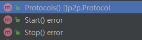

~~node中的服务的定义， eth其实就是实现了一个服务。~~  
原来的`Service`接口相关功能合入了结构体`Ethereum`中，其实现了原来`Service`接口中的四个方法：




go ethereum 的eth目录是以太坊服务的实现。 以太坊协议是通过`cmd/util/flags.go`的Register方法注入的
```go
// RegisterEthService将一个以太坊客户端添加到堆栈中。
// 第二个返回值是完整节点实例，如果节点以轻客户端方式运行，则可能为nil。
func RegisterEthService(stack *node.Node, cfg *ethconfig.Config) (ethapi.Backend, *eth.Ethereum) {
	if cfg.SyncMode == downloader.LightSync {
		backend, err := les.New(stack, cfg)
		if err != nil {
			Fatalf("Failed to register the Ethereum service: %v", err)
		}
		stack.RegisterAPIs(tracers.APIs(backend.ApiBackend))
		if err := lescatalyst.Register(stack, backend); err != nil {
			Fatalf("Failed to register the Engine API service: %v", err)
		}
		return backend.ApiBackend, nil
	}
	backend, err := eth.New(stack, cfg)
	if err != nil {
		Fatalf("Failed to register the Ethereum service: %v", err)
	}
	if cfg.LightServ > 0 {
		_, err := les.NewLesServer(stack, backend, cfg)
		if err != nil {
			Fatalf("Failed to create the LES server: %v", err)
		}
	}
	if err := ethcatalyst.Register(stack, backend); err != nil {
		Fatalf("Failed to register the Engine API service: %v", err)
	}
	stack.RegisterAPIs(tracers.APIs(backend.APIBackend))
	return backend.APIBackend, backend
}
```

以太坊协议的数据结构
```go
// eth/backend.go
// Ethereum实现了以太坊完整节点服务。
type Ethereum struct {
	config *ethconfig.Config

	// Handlers
	txPool *txpool.TxPool

	blockchain         *core.BlockChain
	handler            *handler
	ethDialCandidates  enode.Iterator
	snapDialCandidates enode.Iterator
	merger             *consensus.Merger

	// DB interfaces
	chainDb ethdb.Database // Block chain database

	eventMux       *event.TypeMux
	engine         consensus.Engine
	accountManager *accounts.Manager

	bloomRequests     chan chan *bloombits.Retrieval // 接收布隆数据检索请求的通道。
	bloomIndexer      *core.ChainIndexer             // 布隆索引器在区块导入期间操作。
	closeBloomHandler chan struct{}

	APIBackend *EthAPIBackend

	miner     *miner.Miner
	gasPrice  *big.Int
	etherbase common.Address

	networkID     uint64
	netRPCService *ethapi.NetAPI

	p2pServer *p2p.Server

	lock sync.RWMutex // 保护可变字段（例如，燃料价格和以太坊基础地址）。

	shutdownTracker *shutdowncheck.ShutdownTracker // 跟踪节点是否以及何时非正常关闭。
}
```

以太坊协议的创建New. 暂时先不涉及core的内容。 只是大概介绍一下。 core里面的内容后续会分析。
```go
// eth/backend.go
// New创建一个新的以太坊对象（包括常见以太坊对象的初始化）。
func New(stack *node.Node, config *ethconfig.Config) (*Ethereum, error) {
	// 确保配置值是兼容和合理的。
	if config.SyncMode == downloader.LightSync {
		return nil, errors.New("can't run eth.Ethereum in light sync mode, use les.LightEthereum")
	}
	if !config.SyncMode.IsValid() {
		return nil, fmt.Errorf("invalid sync mode %d", config.SyncMode)
	}
	if config.Miner.GasPrice == nil || config.Miner.GasPrice.Cmp(common.Big0) <= 0 {
		log.Warn("Sanitizing invalid miner gas price", "provided", config.Miner.GasPrice, "updated", ethconfig.Defaults.Miner.GasPrice)
		config.Miner.GasPrice = new(big.Int).Set(ethconfig.Defaults.Miner.GasPrice)
	}
	if config.NoPruning && config.TrieDirtyCache > 0 {
		if config.SnapshotCache > 0 {
			config.TrieCleanCache += config.TrieDirtyCache * 3 / 5
			config.SnapshotCache += config.TrieDirtyCache * 2 / 5
		} else {
			config.TrieCleanCache += config.TrieDirtyCache
		}
		config.TrieDirtyCache = 0
	}
	log.Info("Allocated trie memory caches", "clean", common.StorageSize(config.TrieCleanCache)*1024*1024, "dirty", common.StorageSize(config.TrieDirtyCache)*1024*1024)

	// 组装以太坊对象。
	chainDb, err := stack.OpenDatabaseWithFreezer("chaindata", config.DatabaseCache, config.DatabaseHandles, config.DatabaseFreezer, "eth/db/chaindata/", false)
	if err != nil {
		return nil, err
	}
	if err := pruner.RecoverPruning(stack.ResolvePath(""), chainDb, stack.ResolvePath(config.TrieCleanCacheJournal)); err != nil {
		log.Error("Failed to recover state", "error", err)
	}
	// 将与挖矿相关的配置转移到ethash配置中。
	chainConfig, err := core.LoadChainConfig(chainDb, config.Genesis)
	if err != nil {
		return nil, err
	}
	engine, err := ethconfig.CreateConsensusEngine(chainConfig, chainDb)
	if err != nil {
		return nil, err
	}
	eth := &Ethereum{
		config:            config,
		merger:            consensus.NewMerger(chainDb),
		chainDb:           chainDb,
		eventMux:          stack.EventMux(),
		accountManager:    stack.AccountManager(),
		engine:            engine,
		closeBloomHandler: make(chan struct{}),
		networkID:         config.NetworkId,
		gasPrice:          config.Miner.GasPrice,
		etherbase:         config.Miner.Etherbase,
		bloomRequests:     make(chan chan *bloombits.Retrieval),
		bloomIndexer:      core.NewBloomIndexer(chainDb, params.BloomBitsBlocks, params.BloomConfirms),
		p2pServer:         stack.Server(),
		shutdownTracker:   shutdowncheck.NewShutdownTracker(chainDb),
	}

	bcVersion := rawdb.ReadDatabaseVersion(chainDb)
	var dbVer = "<nil>"
	if bcVersion != nil {
		dbVer = fmt.Sprintf("%d", *bcVersion)
	}
	log.Info("Initialising Ethereum protocol", "network", config.NetworkId, "dbversion", dbVer)

	if !config.SkipBcVersionCheck {
		if bcVersion != nil && *bcVersion > core.BlockChainVersion {
			return nil, fmt.Errorf("database version is v%d, Geth %s only supports v%d", *bcVersion, params.VersionWithMeta, core.BlockChainVersion)
		} else if bcVersion == nil || *bcVersion < core.BlockChainVersion {
			if bcVersion != nil { // only print warning on upgrade, not on init
				log.Warn("Upgrade blockchain database version", "from", dbVer, "to", core.BlockChainVersion)
			}
			rawdb.WriteDatabaseVersion(chainDb, core.BlockChainVersion)
		}
	}
	var (
		vmConfig = vm.Config{
			EnablePreimageRecording: config.EnablePreimageRecording,
		}
		cacheConfig = &core.CacheConfig{
			TrieCleanLimit:      config.TrieCleanCache,
			TrieCleanJournal:    stack.ResolvePath(config.TrieCleanCacheJournal),
			TrieCleanRejournal:  config.TrieCleanCacheRejournal,
			TrieCleanNoPrefetch: config.NoPrefetch,
			TrieDirtyLimit:      config.TrieDirtyCache,
			TrieDirtyDisabled:   config.NoPruning,
			TrieTimeLimit:       config.TrieTimeout,
			SnapshotLimit:       config.SnapshotCache,
			Preimages:           config.Preimages,
		}
	)
	// 使用提供的设置覆盖链配置。
	var overrides core.ChainOverrides
	if config.OverrideCancun != nil {
		overrides.OverrideCancun = config.OverrideCancun
	}
	eth.blockchain, err = core.NewBlockChain(chainDb, cacheConfig, config.Genesis, &overrides, eth.engine, vmConfig, eth.shouldPreserve, &config.TxLookupLimit)
	if err != nil {
		return nil, err
	}
	eth.bloomIndexer.Start(eth.blockchain)

	if config.TxPool.Journal != "" {
		config.TxPool.Journal = stack.ResolvePath(config.TxPool.Journal)
	}
	legacyPool := legacypool.New(config.TxPool, eth.blockchain)

	eth.txPool, err = txpool.New(new(big.Int).SetUint64(config.TxPool.PriceLimit), eth.blockchain, []txpool.SubPool{legacyPool})
	if err != nil {
		return nil, err
	}
	// 允许下载器在快速同步期间使用trie缓存配额。
	cacheLimit := cacheConfig.TrieCleanLimit + cacheConfig.TrieDirtyLimit + cacheConfig.SnapshotLimit
	if eth.handler, err = newHandler(&handlerConfig{
		Database:       chainDb,
		Chain:          eth.blockchain,
		TxPool:         eth.txPool,
		Merger:         eth.merger,
		Network:        config.NetworkId,
		Sync:           config.SyncMode,
		BloomCache:     uint64(cacheLimit),
		EventMux:       eth.eventMux,
		RequiredBlocks: config.RequiredBlocks,
	}); err != nil {
		return nil, err
	}

	eth.miner = miner.New(eth, &config.Miner, eth.blockchain.Config(), eth.EventMux(), eth.engine, eth.isLocalBlock)
	eth.miner.SetExtra(makeExtraData(config.Miner.ExtraData))

	eth.APIBackend = &EthAPIBackend{stack.Config().ExtRPCEnabled(), stack.Config().AllowUnprotectedTxs, eth, nil}
	if eth.APIBackend.allowUnprotectedTxs {
		log.Info("Unprotected transactions allowed")
	}
	gpoParams := config.GPO
	if gpoParams.Default == nil {
		gpoParams.Default = config.Miner.GasPrice
	}
	eth.APIBackend.gpo = gasprice.NewOracle(eth.APIBackend, gpoParams)

	// 设置DNS发现迭代器。
	dnsclient := dnsdisc.NewClient(dnsdisc.Config{})
	eth.ethDialCandidates, err = dnsclient.NewIterator(eth.config.EthDiscoveryURLs...)
	if err != nil {
		return nil, err
	}
	eth.snapDialCandidates, err = dnsclient.NewIterator(eth.config.SnapDiscoveryURLs...)
	if err != nil {
		return nil, err
	}

	// Start the RPC service
	eth.netRPCService = ethapi.NewNetAPI(eth.p2pServer, config.NetworkId)

	// Register the backend on the node
	stack.RegisterAPIs(eth.APIs())
	stack.RegisterProtocols(eth.Protocols())
	stack.RegisterLifecycle(eth)

	// 成功启动；推送一个标记并检查之前的非干净关闭。
	eth.shutdownTracker.MarkStartup()

	return eth, nil
}
```

ApiBackend 定义在 api_backend.go文件中。 封装了一些函数。
```go
// EthAPIBackend实现了ethapi.Backend和tracers.Backend接口，用于完整节点。
type EthAPIBackend struct {
	extRPCEnabled       bool
	allowUnprotectedTxs bool
	eth                 *Ethereum
	gpo                 *gasprice.Oracle
}

// ChainConfig returns the active chain configuration.
func (b *EthAPIBackend) ChainConfig() *params.ChainConfig {
return b.eth.blockchain.Config()
}

func (b *EthAPIBackend) CurrentBlock() *types.Header {
return b.eth.blockchain.CurrentBlock()
}

func (b *EthAPIBackend) SetHead(number uint64) {
b.eth.handler.downloader.Cancel()
b.eth.blockchain.SetHead(number)
}
```

New方法中除了core中的一些方法， 有一个~~ProtocolManager~~的对象在以太坊协议中比较重要， 以太坊本来是一个协议。~~ProtocolManager~~中又可以管理多个以太坊的子协议。
> ProtocolManager已被删除，现在用的是handler
```go
// newHandler返回一个用于所有以太坊链管理协议的处理程序。
func newHandler(config *handlerConfig) (*handler, error) {
	// 使用基本字段创建协议管理器。
	if config.EventMux == nil {
		config.EventMux = new(event.TypeMux) // Nicety initialization for tests
	}
	h := &handler{
		networkID:      config.Network,
		forkFilter:     forkid.NewFilter(config.Chain),
		eventMux:       config.EventMux,
		database:       config.Database,
		txpool:         config.TxPool,
		chain:          config.Chain,
		peers:          newPeerSet(),
		merger:         config.Merger,
		requiredBlocks: config.RequiredBlocks,
		quitSync:       make(chan struct{}),
	}
	if config.Sync == downloader.FullSync {
		// 数据库似乎为空，因为当前区块是创世区块。然而，快照区块已经超过了创世区块，因此在某个时间点上启用了快照同步。可能发生这种情况的情形有：
		// * 如果用户手动（或通过错误的区块）将快照同步节点回滚到同步点以下。
		// * 上一次快照同步尚未完成，而用户此次指定了完整同步。但是我们没有任何最近的完整同步状态。在这些情况下，重新启用快照同步是安全的。
		fullBlock, snapBlock := h.chain.CurrentBlock(), h.chain.CurrentSnapBlock()
		if fullBlock.Number.Uint64() == 0 && snapBlock.Number.Uint64() > 0 {
			h.snapSync.Store(true)
			log.Warn("Switch sync mode from full sync to snap sync")
		}
	} else {
		if h.chain.CurrentBlock().Number.Uint64() > 0 {
			// 如果数据库不为空，打印警告日志以运行快照同步。
			log.Warn("Switch sync mode from snap sync to full sync")
		} else {
			// 如果已请求快照同步且数据库为空，允许执行快照同步。
			h.snapSync.Store(true)
		}
	}
	// 如果同步成功，传递一个回调函数，以便在可能的情况下禁用快照同步模式并启用交易传播。
	success := func() {
		// 如果我们正在运行快照同步并且它已经完成，禁止在下一个同步周期中再次进行快照同步。
		if h.snapSync.Load() {
			log.Info("Snap sync complete, auto disabling")
			h.snapSync.Store(false)
		}
		// 如果我们成功完成了一个同步周期，接受来自网络的交易。
		h.acceptTxs.Store(true)
	}
	// 构建下载器（长时间同步）。
	h.downloader = downloader.New(config.Database, h.eventMux, h.chain, nil, h.removePeer, success)
	if ttd := h.chain.Config().TerminalTotalDifficulty; ttd != nil {
		if h.chain.Config().TerminalTotalDifficultyPassed {
			log.Info("Chain post-merge, sync via beacon client")
		} else {
			head := h.chain.CurrentBlock()
			if td := h.chain.GetTd(head.Hash(), head.Number.Uint64()); td.Cmp(ttd) >= 0 {
				log.Info("Chain post-TTD, sync via beacon client")
			} else {
				log.Warn("Chain pre-merge, sync via PoW (ensure beacon client is ready)")
			}
		}
	} else if h.chain.Config().TerminalTotalDifficultyPassed {
		log.Error("Chain configured post-merge, but without TTD. Are you debugging sync?")
	}
	// 构建获取器（短时间同步）。
	validator := func(header *types.Header) error {
		// 在过渡后，应禁用所有块获取器活动。打印警告日志。
		if h.merger.PoSFinalized() {
			log.Warn("Unexpected validation activity", "hash", header.Hash(), "number", header.Number)
			return errors.New("unexpected behavior after transition")
		}
		// 首先，在任何情况下都应拒绝所有PoS风格的区块头。
		// 无论链是否完成过渡，PoS区块头应仅来自可信的共识层，而不是P2P网络。
		if beacon, ok := h.chain.Engine().(*beacon.Beacon); ok {
			if beacon.IsPoSHeader(header) {
				return errors.New("unexpected post-merge header")
			}
		}
		return h.chain.Engine().VerifyHeader(h.chain, header)
	}
	heighter := func() uint64 {
		return h.chain.CurrentBlock().Number.Uint64()
	}
	inserter := func(blocks types.Blocks) (int, error) {
		// 在过渡后，应禁用所有块获取器活动。打印警告日志。
		if h.merger.PoSFinalized() {
			var ctx []interface{}
			ctx = append(ctx, "blocks", len(blocks))
			if len(blocks) > 0 {
				ctx = append(ctx, "firsthash", blocks[0].Hash())
				ctx = append(ctx, "firstnumber", blocks[0].Number())
				ctx = append(ctx, "lasthash", blocks[len(blocks)-1].Hash())
				ctx = append(ctx, "lastnumber", blocks[len(blocks)-1].Number())
			}
			log.Warn("Unexpected insertion activity", ctx...)
			return 0, errors.New("unexpected behavior after transition")
		}
		// 如果正在运行快照同步，则拒绝导入异常区块。
		// 在启动新网络时，这是一个问题，因为正在进行快照同步的矿工可能不会接受彼此的区块，直到重新启动。
		// 不幸的是，我们还没有找到一种方式让节点单方面决定网络是否是新的。
		// 如果我们找到解决方案，应该解决这个问题。
		if h.snapSync.Load() {
			log.Warn("Snap syncing, discarded propagated block", "number", blocks[0].Number(), "hash", blocks[0].Hash())
			return 0, nil
		}
		if h.merger.TDDReached() {
			// 在过渡期之后，来自P2P网络的区块被视为不可信。
			// 理论上，在开始过渡期时应完全禁用区块八卦（gossip）。
			// 但为了处理共识层中的过渡边界重组，仍然接受传统区块，但仅适用于终端POW（工作量证明）区块。
			// 详细规范请参考：https://github.com/ethereum/EIPs/blob/master/EIPS/eip-3675.md#halt-the-importing-of-pow-blocks
			for i, block := range blocks {
				ptd := h.chain.GetTd(block.ParentHash(), block.NumberU64()-1)
				if ptd == nil {
					return 0, nil
				}
				td := new(big.Int).Add(ptd, block.Difficulty())
				if !h.chain.Config().IsTerminalPoWBlock(ptd, td) {
					log.Info("Filtered out non-termimal pow block", "number", block.NumberU64(), "hash", block.Hash())
					return 0, nil
				}
				if err := h.chain.InsertBlockWithoutSetHead(block); err != nil {
					return i, err
				}
			}
			return 0, nil
		}
		n, err := h.chain.InsertChain(blocks)
		if err == nil {
			h.acceptTxs.Store(true) // 在任何获取器导入时标记初始同步完成。
		}
		return n, err
	}
	h.blockFetcher = fetcher.NewBlockFetcher(false, nil, h.chain.GetBlockByHash, validator, h.BroadcastBlock, heighter, nil, inserter, h.removePeer)

	fetchTx := func(peer string, hashes []common.Hash) error {
		p := h.peers.peer(peer)
		if p == nil {
			return errors.New("unknown peer")
		}
		return p.RequestTxs(hashes)
	}
	addTxs := func(txs []*txpool.Transaction) []error {
		return h.txpool.Add(txs, false, false)
	}
	h.txFetcher = fetcher.NewTxFetcher(h.txpool.Has, addTxs, fetchTx)
	h.chainSync = newChainSyncer(h)
	return h, nil
}
```

服务的APIs()方法会返回服务暴露的RPC方法。（注意区分rpc中的`apis()`）
```go
// APIs返回以太坊包提供的RPC服务集合。
// 注意，其中一些服务可能需要移动到其他地方。
func (s *Ethereum) APIs() []rpc.API {
	apis := ethapi.GetAPIs(s.APIBackend)

	// 追加由共识引擎明确公开的任何API。
	apis = append(apis, s.engine.APIs(s.BlockChain())...)

	// 追加所有本地API并返回。
	return append(apis, []rpc.API{
		{
			Namespace: "eth",
			Service:   NewEthereumAPI(s),
		}, {
			Namespace: "miner",
			Service:   NewMinerAPI(s),
		}, {
			Namespace: "eth",
			Service:   downloader.NewDownloaderAPI(s.handler.downloader, s.eventMux),
		}, {
			Namespace: "admin",
			Service:   NewAdminAPI(s),
		}, {
			Namespace: "debug",
			Service:   NewDebugAPI(s),
		}, {
			Namespace: "net",
			Service:   s.netRPCService,
		},
	}...)
}
```

服务的Protocols方法会返回服务提供了那些p2p的Protocol。 返回协议管理器里面的所有SubProtocols. 如果有lesServer那么还提供lesServer的Protocol。可以看到。所有的网络功能都是通过Protocol的方式提供出来的。
```go
// Protocols返回当前配置的所有网络协议以供启动。
func (s *Ethereum) Protocols() []p2p.Protocol {
	protos := eth.MakeProtocols((*ethHandler)(s.handler), s.networkID, s.ethDialCandidates)
	if s.config.SnapshotCache > 0 {
		protos = append(protos, snap.MakeProtocols((*snapHandler)(s.handler), s.snapDialCandidates)...)
	}
	return protos
}
```

Ethereum服务在创建之后，会被调用服务的Start方法。下面我们来看看Start方法
```go
// Start实现了node.Lifecycle接口，启动了以太坊协议实现所需的所有内部goroutine。
func (s *Ethereum) Start() error {
	eth.StartENRUpdater(s.blockchain, s.p2pServer.LocalNode())

	// Start the bloom bits servicing goroutines
	s.startBloomHandlers(params.BloomBitsBlocks)

	// Regularly update shutdown marker
	s.shutdownTracker.Start()

	// Figure out a max peers count based on the server limits
	maxPeers := s.p2pServer.MaxPeers
	if s.config.LightServ > 0 {
		if s.config.LightPeers >= s.p2pServer.MaxPeers {
			return fmt.Errorf("invalid peer config: light peer count (%d) >= total peer count (%d)", s.config.LightPeers, s.p2pServer.MaxPeers)
		}
		maxPeers -= s.config.LightPeers
	}
	// Start the networking layer and the light server if requested
	s.handler.Start(maxPeers)
	return nil
}
```


