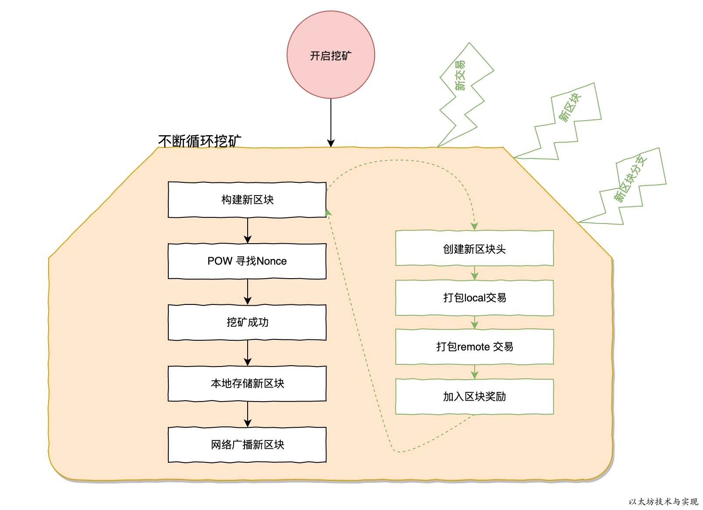
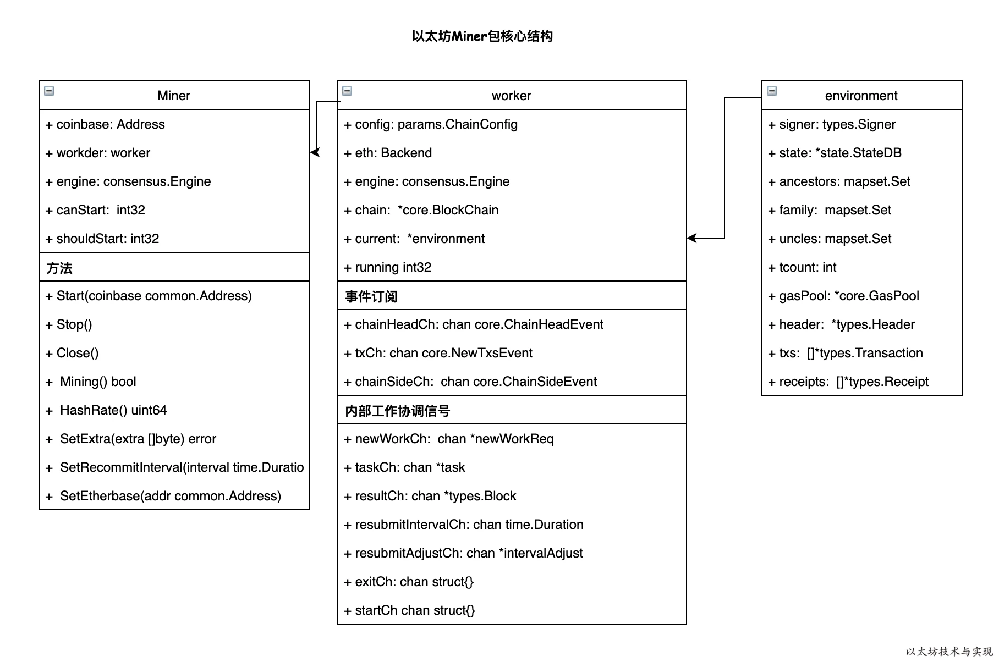
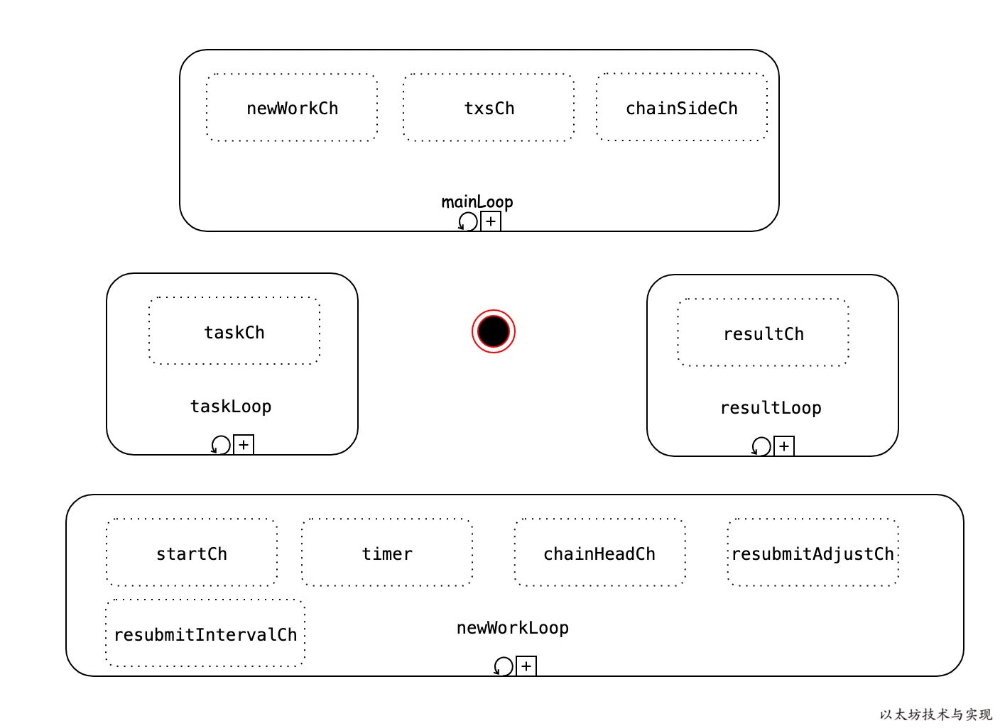

## ~~agent.go~~
~~agent 是具体执行挖矿的对象。 它执行的流程就是，接受计算好了的区块头， 计算mixhash和nonce， 把挖矿好的区块头返回。~~

~~构造CpuAgent, 一般情况下不会使用CPU来进行挖矿，一般来说挖矿都是使用的专门的GPU进行挖矿， GPU挖矿的代码不会在这里体现~~

> agent.go在当前版本已被删除，需要重新研究一下代码

## ~~remote_agent~~
~~remote_agent 提供了一套RPC接口，可以实现远程矿工进行采矿的功能。 比如我有一个矿机，矿机内部没有运行以太坊节点，矿机首先从remote_agent获取当前的任务，然后进行挖矿计算，当挖矿完成后，提交计算结果，完成挖矿。~~

> agent.go在当前版本已被删除，需要重新研究一下代码

# 1. 挖矿
下图是以太坊挖矿的主要环节，一环扣一环，缺一不可。



以太坊 geth 项目中，关于挖矿逻辑，全部在 miner 包中，3个文件便清晰滴定义挖矿逻辑。所以，后面讲解挖矿业主要集中在这几个文件中。

## 开启挖矿
在以太坊控制台，只需要输入命令：miner.start()即可进开启实时挖矿。 能否能挖新新区，取决于交易池是否有交易和服务器性能。

## 构建新区块
挖矿过程实际就是创建一个符合共识的新区块过程。所以在开启挖矿后，矿工的第一件事情则是集中完成一个新区块的构建，为后续挖矿过程做准备。

## POW寻找Nonce
以太坊本是基于POW工作量证明的共识算法。在这里必须找出一个通过哈希计算，在约定时间内找出一个符合难度值的Nonce。找到相符的Nonce，表示进行了一定的工作量计算。 这是所有POW共识的区块链所必须经历的一个挖矿流程。

## 挖矿成功
并不是一定能成功找出Nonce。特别是在规定的时间内和别人已挖出该高度区块时。只有成功找出Nonce后，则可以大胆的告诉所有人，我已经挖出这个高度的区块了。可以理直气壮地将此区块保留到本地，并广播到整个网络。

## 本次存储新区块
一旦成功挖出新区块，则可以直接将其存储到本地。存储后，可以等待别人对他的认可度。一旦超过50%的节点认可后，大概率上你这个新区块将作为最长链的一部分。

## 网络广播新区块
如何让别人能快速认可你的区块，所以需要在第一时间将区块广播到网络中。抢先于别人一秒，将增大新区块的被认可度。

# 2. 以太坊挖矿架构设计
以太坊 geth 项目中，关于挖矿逻辑，全部在 miner 包中，仅用3个文件便清晰滴定义挖矿逻辑。上一篇文章中，可以看到挖矿的主要环节也就几个。但是如何协商每个环节的处理，却在于架构设计。本文先同大家讲解以太坊关于挖矿的架构设计。



> 当前版本有所变化

上图是以太坊 Miner 包中关于挖矿的核心结构。对外部仅仅开放了 Miner 对象，注意：
1. 任何对挖矿的操作均通过 Miner 对象操作
2. 实际挖矿细节全部在 worker 实例中实现
3. 将关键核心数据存储在 environment 中。

外部只需通过调用 Start、Stop 即可完成启动和停止挖矿。当然也可修改一些挖矿参数，如区块头中的可自定义数据 Extra，以及随时调用 SetEtherebase 修改矿工地址 coinbase。

这个的核心全部在 worker 中，worker 是一个工作管理器。订阅了 blockchain 的三个事件，分别监听
1. 新区块事件 chainHeadeCh
2. 新分叉链事件 chainSideCh
3. 新交易事件txCh
4. 以及定义了内部一系列的信号，如 newWork 信号、task信号等。根据信号，执行不同的工作，在各种信号综合作用下协同作业。

在创建worker 时，将在 worker 内开启四个 goroutine 来分别监听不同信号。



首先是 mainLoop ，将监听 newWork 、tx、chainSide 信号。

- newWork:表示将开始挖采下一个新区块。这个信号在需要重新挖矿时发出，而此信号来自于 newWorkLoop 。当收到newWork信号，矿工将立刻将当前区块作为父区块，来挖下一个区块。

- 当收到来自交易池的tx信号时，如果已经是挖矿中，则可以忽略这些交易。因为交易一样会被矿工从交易池主动拿取。如果尚未开始挖矿，则有机会将交易暂时提交，并更新到state中。

同样，当 blockchain 发送变化（新区块）时，而自己当下的挖掘块中仅有极少的叔块，此时允许不再处理交易，而是直接将此叔块加入，立刻提交当前挖掘块。

newWorkLoop 负责根据不同情况来抉择是否需要终止当前工作，或者开始新一个区块挖掘。有以下几种情况将会终止当前工作，开始新区块挖掘。
1. 接收到 start 信号，表示需要开始挖矿。
2. 接收到 chainHeadCh 新区块信号，表示已经有新区块出现。你所处理的交易或者区块高度都极有可能重复，需要终止当下工作，立即开始新一轮挖矿。
3. timer计时器，默认每三秒检查一次是否有新交易需要处理。如果有则需要重新开始挖矿。以便将加高的交易优先打包到区块中。

在 newWorkLoop 中还有一个辅助信号，resubmitAdjustCh 和 resubmitIntervalCh。运行外部修改timer计时器的时钟。resubmitAdjustCh是根据历史情况重新计算一个合理的间隔时间。而resubmitIntervalCh则允许外部，实时通过 Miner 实例方法 SetRecommitInterval 修改间隔时间。

上面是在控制何时挖矿，而 `taskLoop` 和 `resultLoop` 则不同。`taskLoop` 是在监听任务。任务是指包含了新区块内容的任务，表示可以将此新区块进行PoW计算。一旦接受到新任务，则立即将此任务进行PoW工作量计算，寻找符合要求的Nonce。一旦计算完成，把任务和计算结果作为一项结果数据告知 `resultLoop` 。由resultLoop 完成区块的最后工作，即将计算结构和区块基本数据组合成一个符合共识算法的区块。完成区块最后的数据存储和网络广播。

同时，在挖矿时将当下的挖矿工作的过程信息记录在 environment 中，打包区块时只需要从当前的environment中获取实时数据，或者快照数据。

采用goroutine下使用 channel 作为信号，以太坊 miner 完成一个激活挖矿到最终挖矿成功的整个逻辑。上面的讲解不涉及细节，只是让大家对挖矿有一个整体了解。为后续的各环节详解做准备。                   

# 3. 启动挖矿
挖矿模块只通过 Miner 实例对外提供数据访问。可以通过多种途径开启挖矿服务。程序运行时已经将 Miner 实例化，并进入等待挖矿状态，随时可以启动挖矿。

## 挖矿参数
矿工可以根据矿机的服务器性能，来定制化挖矿参数。下面是一份 geth 关于挖矿的运行时参数清单，全部定义在 `cmd/utils/flags.go` 文件中。

| 参数              | 默认值         | 用途  |
| ----------------- | -------------- | -------------------- |
| --mine            | false          | 是否自动开启挖矿        |
| --miner.threads   | 0              | 挖矿时可用并行PoW计算的协程（轻量级线程）数。<br>兼容过时参数 —minerthreads。 |
| --miner.notify    | 空             | 挖出新块时用于通知远程服务的任意数量的远程服务地址。<br>是用 `,`分割的多个远程服务器地址。<br>如：”http://api.miner.com,http://api2.miner.com“ |
| --miner.noverify  | false          | 是否禁用区块的PoW工作量校验。   |
| --miner.gasprice  | 1000000000 wei | 矿工可接受的交易Gas价格，<br>低于此GasPrice的交易将被拒绝写入交易池和不会被矿工打包到区块。 |
| --miner.gastarget | 8000000 gas    | 动态计算新区块燃料上限（gaslimit）的下限值。<br>兼容过时参数 —targetgaslimit。 |
| --miner.gaslimit  | 8000000 gas    | 动态技术新区块燃料上限的上限值。    |
| --miner.etherbase | 第一个账户     | 用于接收挖矿奖励的账户地址，<br>默认是本地钱包中的第一个账户地址。 |
| --miner.extradata | geth版本号     | 允许矿工自定义写入区块头的额外数据。  |
| --miner.recommit  | 3s             | 重新开始挖掘新区块的时间间隔。<br>将自动放弃进行中的挖矿后，重新开始一次新区块挖矿。 |
| --minerthreads    |                | *已过时*   |
| —targetgaslimit   |                | *已过时*    |
| --gasprice        |                | *已过时*    |

可以通过执行程序 `geth` 来查看参数。

    geth -h |grep "mine"

## 实例化Miner
geth 程序运行时已经将 Miner 实例化，只需等待命令开启挖矿。
```go
// eth/backend.go:233
func New(stack *node.Node, config *ethconfig.Config) (*Ethereum, error) {
    ...
    
    eth.miner = miner.New(eth, &config.Miner, eth.blockchain.Config(), eth.EventMux(), eth.engine, eth.isLocalBlock)
    eth.miner.SetExtra(makeExtraData(config.Miner.ExtraData))
	
    ...
}
```

从上可看出，在实例化 miner 时所用到的配置项只有4项。实例化后，便可通过 API 操作 Miner。

Miner API 分 public 和 private。挖矿属于隐私，不得让其他人任意修改。因此挖矿API全部定义在 Private 中，公共部分只有 Mining()。

## 启动挖矿
geth 运行时默认不开启挖矿。如果用户需要启动挖矿，则可以通过以下几种方式启动挖矿。

### 参数方式自动开启挖矿
使用参数 —mine，可以在启动程序时默认开启挖矿。下面我们用 geth 在开发者模式启动挖矿为例：

    geth --dev --mine

启动后，可以看到默认情况下已开启挖矿。开发者模式下已经挖出了一个高度为1的空块。

当参数加入了 `--mine` 参数表示启用挖矿，此时将根据输入个各项挖矿相关的参数启动挖矿服务。
```go
// cmd/geth/main.go:410
// startNode函数启动系统节点和所有注册的协议，之后解锁任何请求的账户，并启动RPC/IPC接口和矿工。
func startNode(ctx *cli.Context, stack *node.Node, backend ethapi.Backend, isConsole bool) {
	...

	// 如果启用了辅助服务，则开始运行 
    if ctx.Bool(utils.MiningEnabledFlag.Name) || ctx.Bool(utils.DeveloperFlag.Name) {
        // 只有在运行完整的以太坊节点时，挖矿才有意义
        if ctx.String(utils.SyncModeFlag.Name) == "light" {
            utils.Fatalf("轻客户端不支持挖矿")
        }
        ethBackend, ok := backend.(*eth.EthAPIBackend)
        if !ok {
            utils.Fatalf("以太坊服务未运行")
        }
        // 将燃气价格设置为命令行界面上的限制，并开始挖矿
        gasprice := flags.GlobalBig(ctx, utils.MinerGasPriceFlag.Name)
        ethBackend.TxPool().SetGasTip(gasprice)
        if err := ethBackend.StartMining(); err != nil {
            utils.Fatalf("无法启动挖矿：%v", err)
        }
    }
	
	...
}
```

启动 geth 过程是，如果启用挖矿`--mine`或者属于开发者模式`—dev`，则将启动挖矿。

在启动挖矿之前，还需要获取 `—miner.gasprice` 实时应用到交易池中。同时也需要指定将允许使用多少协程来并行参与PoW计算。然后开启挖矿，如果开启挖矿失败则终止程序运行并打印错误信息。

### 控制台命令启动挖矿
在实例化Miner后，已经将 miner 的操作API化。因此我们可以在 geth 的控制台中输入Start命令启动挖矿。

调用API `miner_start` 将使用给定的挖矿计算线程数来开启挖矿。下面表格是调用 API 的几种方式。

| 客户端  | 调用方式                                            |
| ------- | --------------------------------------------------- |
| Go      | `miner.Start(threads *rpc.HexNumber) (bool, error)` |
| Console | `miner.start(number)`                               |
| RPC     | `{"method": "miner_start", "params": [number]}`     |

首先，我们进入 geth 的 JavaScript 控制台，后输入命令miner.start(1)来启动挖矿。

    geth --maxpeers=0 console

启动挖矿后，将开始出新区块。

### RPC API 启动挖矿
因为 API 已支持开启挖矿，如上文所述，可以直接调用 RPC  `{"method": "miner_start", "params": [number]}` 来启动挖矿。实际上在控制台所执行的 `miner.start(1)`，则相对于 `{"method": "miner_start", "params": [1]}`。

如，启动 geth 时开启RPC。
```sh
geth --maxpeer 0 --rpc --rpcapi --rpcport 8080 "miner,admin,eth" console
```

开启后，则可以直接调用API，开启挖矿服务。
```shell
curl -d '{"id":1,"method": "miner_start", "params": [1]}' http://127.0.0.1:8080
```

## 挖矿启动细节
不管何种方式启动挖矿，最终都是通过调用 miner 对象的 Start 方法来启动挖矿。不过在开启挖矿前，geth 还处理了额外内容。

当你通过控制台或者 RPC API 调用启动挖矿命令后，在程序都将引导到方法`func (s *Ethereum) StartMining(threads int) error `。
```go
// StartMining 启动矿工并指定CPU线程数量。
// 如果矿工已经在运行，此方法会调整允许使用的线程数量，并更新交易池所需的最低价格。
func (s *Ethereum) StartMining() error {
	// 如果矿工没有在运行，则进行初始化
	if !s.IsMining() {
		// 将初始价格传播到交易池
		s.lock.RLock()
		price := s.gasPrice
		s.lock.RUnlock()
		s.txPool.SetGasTip(price)

		// 配置本地挖矿地址
		eb, err := s.Etherbase()
		if err != nil {
			log.Error("无法在没有以太坊基地址的情况下开始挖矿", "err", err)
			return fmt.Errorf("缺少以太坊基地址：%v", err)
		}
		var cli *clique.Clique
		if c, ok := s.engine.(*clique.Clique); ok {
			cli = c
		} else if cl, ok := s.engine.(*beacon.Beacon); ok {
			if c, ok := cl.InnerEngine().(*clique.Clique); ok {
				cli = c
			}
		}
		if cli != nil {
			wallet, err := s.accountManager.Find(accounts.Account{Address: eb})
			if wallet == nil || err != nil {
				log.Error("本地不存在以太坊基地址账户", "err", err)
				return fmt.Errorf("缺少签名器：%v", err)
			}
			cli.Authorize(eb, wallet.SignData)
		}
		// 如果挖矿已经开始，我们可以禁用交易拒绝机制，以加快同步时间。
		s.handler.acceptTxs.Store(true)

		go s.miner.Start()
	}
	return nil
}

// StopMining终止挖矿操作，包括共识引擎级别和区块创建级别。
func (s *Ethereum) StopMining() {
    // 更新共识引擎中的线程数
    type threaded interface {
        SetThreads(threads int)
    }
    if th, ok := s.engine.(threaded); ok {
        th.SetThreads(-1)
    }
    // 停止区块创建本身
    s.miner.Stop()
}
```

在此方法中，首先看挖矿的共识引擎是否支持设置协程数❶，如果支持，将更新此共识引擎参数 ❷。接着，如果已经是在挖矿中，则忽略启动，否则将开启挖矿 ❸。在启动前，需要确定两项配置：交易GasPrice下限❹，和挖矿奖励接收账户（矿工账户地址）❺。

这里对于 clique.Clique 共识引擎（PoA 权限共识），进行了特殊处理，需要从钱包中查找对于挖矿账户❻。在进行挖矿时不再是进行PoW计算，而是使用认可的账户进行区块签名❼即可。

可能由于一些原因，不允许接收网络交易。因此，在挖矿前将允许接收网络交易❽。随即，开始在挖矿账户下开启挖矿❾。此时，已经进入了miner实例的 Start 方法。

```go
// miner/miner.go:168
func (miner *Miner) Start() {
	miner.startCh <- struct{}{}
}

// miner/worker.go:356
// start将运行状态设置为1，并触发新的工作提交。
func (w *worker) start() {
    w.running.Store(true)
    w.startCh <- struct{}{}
}
```

存储coinbase 账户后⑩，有可能因为正在同步数据，此时将不允许启动挖矿⑪。如果能够启动挖矿，则立即开启worker 让其开始干活。只需要发送一个开启挖矿信号，worker 将会被自动触发挖矿工作。

## Worker Start 信号
对 worker 发送 start 信号后，该信号将进入 startCh chain中。一旦获得信号，则立即重新开始commit新区块，重新开始干活。
```go
// miner/worker.go:441
// newWorkLoop是一个独立的goroutine，在接收到事件后提交新的密封工作。
func (w *worker) newWorkLoop(recommit time.Duration) {
	...

	for {
        select {
        case <-w.startCh:
            clearPending(w.chain.CurrentBlock().Number.Uint64())
            timestamp = time.Now().Unix()
            commit(commitInterruptNewHead)
        ...
        }
	}
	
	...
}
```


