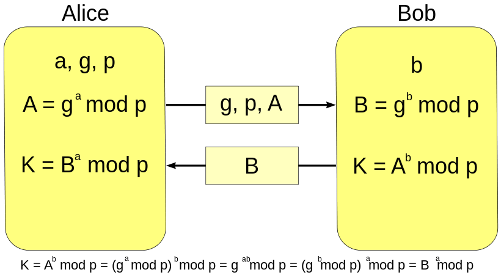
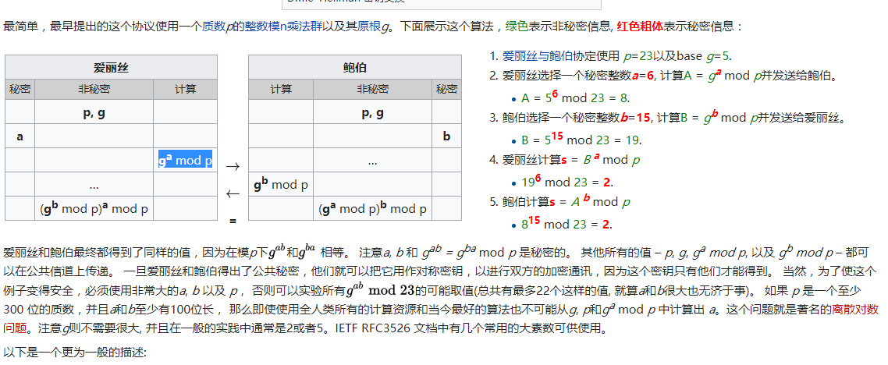
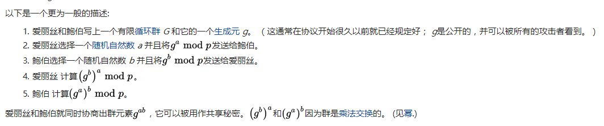

## RLPx Encryption(RLPx加密)
之前介绍的discover节点发现协议， 因为承载的数据不是很重要，基本是明文传输的。

每一个节点会开启两个同样的端口，一个是UDP端口，用来节点发现，一个是TCP端口，用来承载业务数据。 UDP的端口和TCP的端口的端口号是同样的。 这样只要通过UDP发现了端口，就等于可以用TCP来连接到对应的端口。

RLPx协议就定义了TCP链接的加密过程。

RLPx使用了(Perfect Forward Secrecy), 简单来说。 链接的两方生成生成随机的私钥，通过随机的私钥得到公钥。 然后双方交换各自的公钥， 这样双方都可以通过自己随机的私钥和对方的公钥来生成一个同样的共享密钥(shared-secret)。后续的通讯使用这个共享密钥作为对称加密算法的密钥。这样来说。如果有一天一方的私钥被泄露，也只会影响泄露之后的消息的安全性， 对于之前的通讯是安全的(因为通讯的密钥是随机生成的，用完后就消失了)。

### 前向安全性(引用自维基百科)
前向安全或前向保密（英语：Forward Secrecy，缩写：FS），有时也被称为完美前向安全[1]（英语：Perfect Forward Secrecy，缩写：PFS），是密码学中通讯协议的安全属性，指的是长期使用的主密钥泄漏不会导致过去的会话密钥泄漏。[2]前向安全能够保护过去进行的通讯不受密码或密钥在未来暴露的威胁。[3]如果系统具有前向安全性，就可以保证万一密码或密钥在某个时刻不慎泄露，过去已经进行的通讯依然是安全，不会受到任何影响，即使系统遭到主动攻击也是如此。

### 迪菲-赫尔曼密钥交换
迪菲-赫尔曼密钥交换（英语：Diffie–Hellman key exchange，缩写为D-H） 是一种安全协议。它可以让双方在完全没有对方任何预先信息的条件下通过不安全信道创建起一个密钥。这个密钥可以在后续的通讯中作为对称密钥来加密通讯内容。公钥交换的概念最早由瑞夫·墨克（Ralph C. Merkle）提出，而这个密钥交换方法，由惠特菲尔德·迪菲（Bailey Whitfield Diffie）和马丁·赫尔曼（Martin Edward Hellman）在1976年首次发表。马丁·赫尔曼曾主张这个密钥交换方法，应被称为迪菲-赫尔曼-墨克密钥交换（英语：Diffie–Hellman–Merkle key exchange）。n
- 迪菲－赫尔曼密钥交换的同义词包括:
- 迪菲－赫尔曼密钥协商
- 迪菲－赫尔曼密钥创建
- 指数密钥交换
- 迪菲－赫尔曼协议

虽然迪菲－赫尔曼密钥交换本身是一个匿名（无认证）的密钥交换协议，它却是很多认证协议的基础，并且被用来提供传输层安全协议的短暂模式中的完备的前向安全性。

#### 描述
迪菲－赫尔曼通过公共信道交换一个信息，就可以创建一个可以用于在公共信道上安全通信的共享秘密（shared secret）。 以下解释它的过程（包括算法的数学部分）：



最简单，最早提出的这个协议使用一个质数p的整数模n乘法群以及其原根g。下面展示这个算法，绿色表示非秘密信息, 红色粗体表示秘密信息：





## p2p/rlpx/rlpx.go源码解读
这个文件实现了RLPx的链路协议。

链接联系的大致流程如下：
1. doEncHandshake() 通过这个方法来完成交换密钥，创建加密信道的流程。如果失败，那么链接关闭。
2. doProtoHandshake() 这个方法来进行协议特性之间的协商，比如双方的协议版本，是否支持Snappy加密方式等操作。

链接经过这两次处理之后，就算建立起来了。因为TCP是流式的协议。所有RLPx协议定义了分帧的方式。所有的数据都可以理解为一个接一个的rlpxFrame。 rlpx的读写都是通过rlpxFrameRW对象来进行处理。

### doEncHandshake
链接的发起者被称为initiator。链接的被动接受者被成为receiver。 这两种模式下处理的流程是不同的。完成握手后。 生成了一个sec.可以理解为拿到了对称加密的密钥。 然后创建了一个newRLPXFrameRW帧读写器。完成加密信道的创建过程。
```go
func (t *rlpxTransport) doEncHandshake(prv *ecdsa.PrivateKey) (*ecdsa.PublicKey, error) {
	t.conn.SetDeadline(time.Now().Add(handshakeTimeout))
	return t.conn.Handshake(prv)
}

// Handshake 执行握手操作。在从连接中写入或读取任何数据之前，必须调用此函数。
func (c *Conn) Handshake(prv *ecdsa.PrivateKey) (*ecdsa.PublicKey, error) {
    var (
        sec Secrets
        err error
        h   handshakeState
    )
    if c.dialDest != nil {
        sec, err = h.runInitiator(c.conn, prv, c.dialDest)
    } else {
        sec, err = h.runRecipient(c.conn, prv)
    }
    if err != nil {
        return nil, err
    }
    c.InitWithSecrets(sec)
    c.session.rbuf = h.rbuf
    c.session.wbuf = h.wbuf
    return sec.remote, err
}
```

### runInitiator
首先看看链接的发起者的操作。首先通过`makeAuthMsg`创建了authMsg。 然后通过网络发送给对端。然后通过`readMsg`读取对端的回应。 最后调用secrets创建了共享秘密。
```go
// runInitiator 在 conn 上协商会话令牌。它应该在连接的拨号方调用。
// prv 是本地客户端的私钥。
func (h *handshakeState) runInitiator(conn io.ReadWriter, prv *ecdsa.PrivateKey, remote *ecdsa.PublicKey) (s Secrets, err error) {
	h.initiator = true
	h.remote = ecies.ImportECDSAPublic(remote)

	authMsg, err := h.makeAuthMsg(prv)
	if err != nil {
		return s, err
	}
	authPacket, err := h.sealEIP8(authMsg)
	if err != nil {
		return s, err
	}
    
	// 发送给对端
	if _, err = conn.Write(authPacket); err != nil {
		return s, err
	}

	// 读取对端回应
	authRespMsg := new(authRespV4)
	authRespPacket, err := h.readMsg(authRespMsg, prv, conn)
	if err != nil {
		return s, err
	}
	if err := h.handleAuthResp(authRespMsg); err != nil {
		return s, err
	}
    // 创建共享秘密
	return h.secrets(authPacket, authRespPacket)
}
```

#### makeAuthMsg
这个方法创建了initiator的handshake message。 首先对端的公钥可以通过对端的ID来获取。所以对端的公钥对于发起连接的人来说是知道的。 但是对于被连接的人来说，对端的公钥应该是不知道的。
```go
// makeAuthMsg 创建发起方握手消息。
func (h *handshakeState) makeAuthMsg(prv *ecdsa.PrivateKey) (*authMsgV4, error) {
	// Generate random initiator nonce.
	// 生成一个随机的初始值
	h.initNonce = make([]byte, shaLen)
	_, err := rand.Read(h.initNonce)
	if err != nil {
		return nil, err
	}
	
	// Generate random keypair to for ECDH.
	// 生成一个随机的私钥
	h.randomPrivKey, err = ecies.GenerateKey(rand.Reader, crypto.S256(), nil)
	if err != nil {
		return nil, err
	}

	// 对已知消息进行签名：static-shared-secret ^ nonce
	// 返回静态共享密钥，即本地和远程静态节点密钥之间的密钥协商结果。
	token, err := h.staticSharedSecret(prv)
	if err != nil {
		return nil, err
	}
	signed := xor(token, h.initNonce)
	// Sign 函数计算一个 ECDSA 签名。
	signature, err := crypto.Sign(signed, h.randomPrivKey.ExportECDSA())
	if err != nil {
		return nil, err
	}

	msg := new(authMsgV4)
	copy(msg.Signature[:], signature)
	copy(msg.InitiatorPubkey[:], crypto.FromECDSAPub(&prv.PublicKey)[1:])
	copy(msg.Nonce[:], h.initNonce)
	msg.Version = 4
	return msg, nil
}
```
> crypto.Sign(signed, h.randomPrivKey.ExportECDSA())：  
> Sign 函数计算一个 ECDSA 签名，该函数容易受到已知明文攻击，可能泄露用于签名的私钥信息。调用者必须意识到给定的摘要不能由对手选择。常见的解决方案是`在计算签名之前对任何输入进行哈希处理`。 生成的签名采用 [R || S || V] 格式，其中 V 为 0 或 1。

#### sealEIP8
这个方法是一个组包方法，对msg进行rlp的编码。 填充一些数据。 然后使用对方的公钥把数据进行加密。 这意味着只有对方的私钥才能解密这段信息。
```go
// sealEIP8 encrypts a handshake message.
func (h *handshakeState) sealEIP8(msg interface{}) ([]byte, error) {
	h.wbuf.reset()

	// Write the message plaintext.
	if err := rlp.Encode(&h.wbuf, msg); err != nil {
		return nil, err
	}
	// 使用随机数量的数据进行填充。填充的数量至少需要100字节，以使消息与 EIP-8 之前的握手区分开来。
	h.wbuf.appendZero(mrand.Intn(100) + 100)

	prefix := make([]byte, 2)
	binary.BigEndian.PutUint16(prefix, uint16(len(h.wbuf.data)+eciesOverhead))

	enc, err := ecies.Encrypt(rand.Reader, h.remote, h.wbuf.data, nil, prefix)
	return append(prefix, enc...), err
}
```
> Encrypt(rand io.Reader, pub *PublicKey, m, s1, s2 []byte)：  
> Encrypt 使用 SEC 1, 5.1 中指定的 ECIES 进行消息加密。 s1 和 s2 包含的共享信息不是结果密文的一部分。s1 被输入到密钥派生中，s2 被输入到 MAC 中。如果不使用共享信息参数，则应将其设置为 nil。

#### readMsg
这个方法会从两个地方调用。 一个是在`runInitiator`，一个就是在`runRecipient`。 这个方法比较简单。 首先用一种格式尝试解码。如果不行就换另外一种。应该是一种兼容性的设置。 基本上就是使用自己的私钥进行解码然后调用rlp解码成结构体。 结构体的描述就是下面的`authRespV4`,里面最重要的就是对端的随机公钥。 双方通过自己的私钥和对端的随机公钥可以得到一样的共享秘密。 而这个共享秘密是第三方拿不到的。
```go
// RLPx v4 handshake response (defined in EIP-8).
type authRespV4 struct {
    RandomPubkey [pubLen]byte
    Nonce        [shaLen]byte
    Version      uint
    
    // Ignore additional fields (forward-compatibility)
    Rest []rlp.RawValue `rlp:"tail"`
}

// readMsg 读取加密的握手消息，并将其解码为 msg。
func (h *handshakeState) readMsg(msg interface{}, prv *ecdsa.PrivateKey, r io.Reader) ([]byte, error) {
    h.rbuf.reset()
    h.rbuf.grow(512)
    
    // Read the size prefix.
    prefix, err := h.rbuf.read(r, 2)
    if err != nil {
        return nil, err
    }
    size := binary.BigEndian.Uint16(prefix)
    
    // Read the handshake packet.
    packet, err := h.rbuf.read(r, int(size))
    if err != nil {
        return nil, err
    }
    dec, err := ecies.ImportECDSA(prv).Decrypt(packet, nil, prefix)
    if err != nil {
        return nil, err
    }
    // 无法在这里使用rlp.DecodeBytes，因为它会拒绝尾随数据（前向兼容性）。
    s := rlp.NewStream(bytes.NewReader(dec), 0)
    err = s.Decode(msg)
    return h.rbuf.data[:len(prefix)+len(packet)], err
}
```

#### handleAuthResp
这个方法非常简单。
```go
func (h *handshakeState) handleAuthResp(msg *authRespV4) (err error) {
	h.respNonce = msg.Nonce[:]
	h.remoteRandomPub, err = importPublicKey(msg.RandomPubkey[:])
	return err
}
```

最后是secrets函数，这个函数是在handshake完成之后调用。它通过自己的随机私钥和对端的公钥来生成一个共享秘密,这个共享秘密是瞬时的(只在当前这个链接中存在)。所以当有一天私钥被破解。 之前的消息还是安全的。
```go
// 在握手完成后调用secrets。它从握手值中提取连接密钥。
func (h *handshakeState) secrets(auth, authResp []byte) (Secrets, error) {
	ecdheSecret, err := h.randomPrivKey.GenerateShared(h.remoteRandomPub, sskLen, sskLen)
	if err != nil {
		return Secrets{}, err
	}

	// derive base secrets from ephemeral key agreement
	sharedSecret := crypto.Keccak256(ecdheSecret, crypto.Keccak256(h.respNonce, h.initNonce))
	aesSecret := crypto.Keccak256(ecdheSecret, sharedSecret)
	s := Secrets{
		remote: h.remote.ExportECDSA(),
		AES:    aesSecret,
		MAC:    crypto.Keccak256(ecdheSecret, aesSecret),
	}

	// setup sha3 instances for the MACs
	mac1 := sha3.NewLegacyKeccak256()
	mac1.Write(xor(s.MAC, h.respNonce))
	mac1.Write(auth)
	mac2 := sha3.NewLegacyKeccak256()
	mac2.Write(xor(s.MAC, h.initNonce))
	mac2.Write(authResp)
	if h.initiator {
		s.EgressMAC, s.IngressMAC = mac1, mac2
	} else {
		s.EgressMAC, s.IngressMAC = mac2, mac1
	}

	return s, nil
}
```

### runRecipient
`runRecipient`函数和`runInitiator`的内容大致相同。 但是顺序有些不一样。
```go
// runRecipient在conn上协商会话令牌。
// 它应该在连接的监听端调用。prv是本地客户端的私钥。
func (h *handshakeState) runRecipient(conn io.ReadWriter, prv *ecdsa.PrivateKey) (s Secrets, err error) {
	authMsg := new(authMsgV4)
	authPacket, err := h.readMsg(authMsg, prv, conn)
	if err != nil {
		return s, err
	}
	if err := h.handleAuthMsg(authMsg, prv); err != nil {
		return s, err
	}

	authRespMsg, err := h.makeAuthResp()
	if err != nil {
		return s, err
	}
	authRespPacket, err := h.sealEIP8(authRespMsg)
	if err != nil {
		return s, err
	}
	if _, err = conn.Write(authRespPacket); err != nil {
		return s, err
	}

	return h.secrets(authPacket, authRespPacket)
}
```

### doProtoHandshake
这个方法比较简单， 加密信道已经创建完毕。 我们看到这里只是约定了是否使用Snappy加密然后就退出了。
```go
func (t *rlpxTransport) doProtoHandshake(our *protoHandshake) (their *protoHandshake, err error) {
	// 并发地编写我们的握手，我们更倾向于返回握手读取错误。
	// 如果远程方以有效的原因提前断开了我们的连接，
	// 我们应该将其作为错误返回，以便在其他地方进行跟踪。
	werr := make(chan error, 1)
	go func() { werr <- Send(t, handshakeMsg, our) }()
	if their, err = readProtocolHandshake(t); err != nil {
		<-werr // make sure the write terminates too
		return nil, err
	}
	if err := <-werr; err != nil {
		return nil, fmt.Errorf("write error: %v", err)
	}
	// If the protocol version supports Snappy encoding, upgrade immediately
	t.conn.SetSnappy(their.Version >= snappyProtocolVersion)

	return their, nil
}
```
