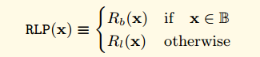
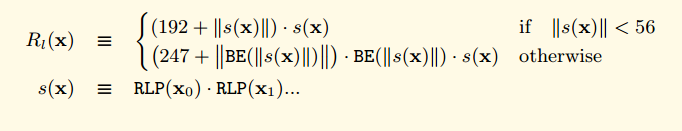
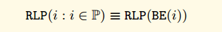

RLP是Recursive Length Prefix的简写。是以太坊中的序列化方法，以太坊的所有对象都会使用RLP方法序列化为字节数组。这里我希望先从黄皮书来形式化上了解RLP方法， 然后通过代码来分析实际的实现。

## 黄皮书的形式化定义
我们定义了集合  T。 T由下面的公式进行定义


上图中的O代表所有byte的集合， 那么B代表了所有可能的字节数组，L代表了不只一个单一节点的树形结构(比如结构体，或者是树节点的分支节点， 非叶子节点)， T代表了所有的字节数组和树形结构的组合。

我们使用两个子函数来定义RLP函数，这两个子函数分别处理上面说到的两种结构(L或者B).



对于所有B类型的字节数组。我们定义了如下的处理规则。

- 如果字节数组只包含一个字节，而且这个字节的大小小于128，那么不对数据进行处理，处理结果就是原数据
- 如果字节数组的长度小于56，那么处理结果就等于在原始数据前面加上（128+字节数据的长度)的前缀。
- 如果不是上面两种情况，那么处理结果就等于在原始数据前面加上原始数据长度的大端表示，然后在前面加上（183 + 原始数据大端表示的长度)

下面使用公式化的语言来表示


> 什么是大端法与小端法  
> 大端法与小端法是一个表示程序对象字节排列顺序的规则，我们举例说明：  
> 假设有一个int类型的变量，位于地址0x200处，它的十六进制值为0x12345678
> 12是最高有效位，78是最低有效位
> 大端表示法:
> ```
> 0x200	0x201	0x202	0x203
> 12		34		56		78
> ```
>
> 最高有效位在前
> 小端表示法：
> ```
> 0x200	0x201	0x202	0x203
> 78	56		34		12
> ```

### **一些数学符号的解释**

- $||x||$ 代表了求x的长度
- $(a)·(b,c)·(d,e) = (a,b,c,d,e)$ 代表了concat的操作，也就是字符串的相加操作。 "hello "+"world" = "hello world"
- $BE(x)$ 函数其实是去掉了前导0的大端模式。  比如4个字节的整形0x1234用大端模式来表示是 00 00 12 34 那么用BE函数处理之后返回的其实是  12 34. 开头的多余的00被去掉了。
- ^ 符号代表并且的含义。
- $\equiv$形式的等号代表恒等的意思

对于所有的其他类型(树形结构)， 我们定义如下的处理规则

首先我们对树形结构里面的每一个元素使用RLP处理，然后再把这些结果concat连接起来。

- 如果连接后的字节长度小于56， 那么我们就在连接后的结果前面加上(192 + 连接后的长度)，组成最终的结果。
- 如果连接后的字节长度大于等于56， 那么我们就在连接后的结果前面先加上连接后的长度的大端模式，然后在前面加上(247 + 连接后长度的大端模式的长度)

下面使用公式化的语言来表示， 发现用公式阐述得清楚一点。


可以看到上面是一个递归的定义， 在求取$s(x)$的过程中又调用了RLP方法，这样使得RLP能够处理递归的数据结构。


如果使用RLP处理标量数据，RLP只能够用来处理正整数。 RLP只能处理大端模式处理后的整数。 也就是说如果是一个整数x，那么先使用$BE(x)$函数来把x转换成最简大端模式(去掉了开头的00),然后把$BE(x)$的结果当成是字节数组来进行编码。

如果用公式来表示就是下图。



当解析RLP数据的时候。如果刚好需要解析整形数据， 这个时候遇到了前导00， 这个时候需要当作异常情况经行处理。

### **总结**
RLP把所有的数据看成两类数据的组合， 一类是字节数组， 一类是类似于List的数据结构。 我理解这两类基本包含了所有的数据结构。 比如用得比较多的struct。 可以看成是一个很多不同类型的字段组成的List

> $\forall$：全称量词、全称命题  
> $\in$：属于  
> $\bigcup$：集合的并运算、全集  
> $\bigcap$：集合的交运算  
> $\equiv$：恒等于  
> $\bigwedge$：命题的“合取”（“与”）运算、等于集合

## **RLP源码解析**
RLP的源码不是很多， 主要分了三个文件
```
decode.go			    rlp解码器，把RLP数据解码为go的数据结构
decode_tail_test.go		解码器测试代码
decode_test.go			解码器测试代码	
doc.go				    文档代码
encode.go			    rlp编码器，把GO的数据结构序列化为RLP数据结构（字节数组）
encode_test.go			编码器测试
encode_example_test.go
raw.go				    未解码的RLP数据
raw_test.go
typecache.go			类型缓存， 类型缓存记录了类型->(编码器|解码器)的内容。
```

### **如何根据类型找到对应的编码器和解码器 typecache.go**
在C++或者Java等支持重载的语言中，可以通过不同的类型重载同一个函数名称来实现方法针对不同类型的分派,也可以通过泛型来实现函数的分派。
```
string encode(int);
string encode(long);
string encode(struct test*)
```

但是GO语言本身不支持重载， 也没有泛型，所以函数的分派就需要自己实现了。 typecache.go主要是实现这个目的， 通过自身的类型来快速的找到自己的编码器函数和解码器函数。

我们首先看看核心数据结构
```go
// typeinfo 是类型缓存中的一个条目
// 存储了编码器和解码器函数
type typeinfo struct {
	decoder    decoder
	decoderErr error // error from makeDecoder
	writer     writer
	writerErr  error // error from makeWriter
}

// typekey 是 typeCache 中类型的键。它包括结构标签，因为它们可能会生成不同的解码器
type typekey struct {
	reflect.Type
	rlpstruct.Tags
}

type typeCache struct {
	cur atomic.Value

	// This lock synchronizes writers.
	mu   sync.Mutex                     // 读写锁，用来在多线程的时候保护typeCache这个Map
	next map[typekey]*typeinfo          // 核心数据结构，保存了类型->编解码器函数
}
```

可以看到核心数据结构就是typeCache， 其中的Map的key是类型，value是对应的编码和解码器。

下面是用户如何获取编码器和解码器的函数：
```go
func (c *typeCache) generate(typ reflect.Type, tags rlpstruct.Tags) *typeinfo {
	c.mu.Lock() // 加锁保护
	defer c.mu.Unlock()

    // 将传入的typ和tags封装为typekey类型
	cur := c.cur.Load().(map[typekey]*typeinfo) // 类型断言还是其他语法糖？
    // 成功获取到typ对应的编解码函数则直接返回
	if info := cur[typekey{typ, tags}]; info != nil {
		return info
	}

	// Copy cur to next.
	c.next = make(map[typekey]*typeinfo, len(cur)+1)
	for k, v := range cur {
		c.next[k] = v
	}

	// Generate.
	info := c.infoWhileGenerating(typ, tags)

	// next -> cur
    // 编解码不在typeCache中，需要创建该typ对应的编解码函数
	c.cur.Store(c.next)
	c.next = nil
	return info
}
```


