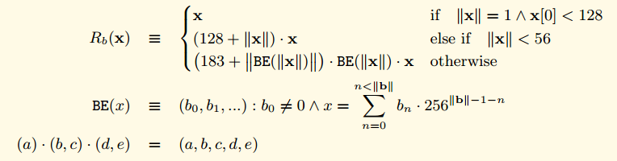

RLP是Recursive Length Prefix的简写。是以太坊中的序列化方法，以太坊的所有对象都会使用RLP方法序列化为字节数组。这里我希望先从黄皮书来形式化上了解RLP方法， 然后通过代码来分析实际的实现。

## 黄皮书的形式化定义
我们定义了集合  T。 T由下面的公式进行定义

上图中的O代表所有byte的集合， 那么B代表了所有可能的字节数组，L代表了不只一个单一节点的树形结构(比如结构体，或者是树节点的分支节点， 非叶子节点)， T代表了所有的字节数组和树形结构的组合。

我们使用两个子函数来定义RLP函数，这两个子函数分别处理上面说到的两种结构(L或者B).

对于所有B类型的字节数组。我们定义了如下的处理规则。

- 如果字节数组只包含一个字节，而且这个字节的大小小于128，那么不对数据进行处理，处理结果就是原数据
- 如果字节数组的长度小于56，那么处理结果就等于在原始数据前面加上（128+字节数据的长度)的前缀。
- 如果不是上面两种情况，那么处理结果就等于在原始数据前面加上原始数据长度的大端表示，然后在前面加上（183 + 原始数据大端表示的长度)

下面使用公式化的语言来表示

**一些数学符号的解释**

- ||x|| 代表了求x的长度
- (a).（b,c).(d,e) = (a,b,c,d,e) 代表了concat的操作，也就是字符串的相加操作。 "hello "+"world" = "hello world"
- BE(x)函数其实是去掉了前导0的大端模式。  比如4个字节的整形0x1234用大端模式来表示是 00 00 12 34 那么用BE函数处理之后返回的其实是  12 34. 开头的多余的00被去掉了。
- ^ 符号代表并且的含义。
- "三"形式的等号代表恒等的意思

对于所有的其他类型(树形结构)， 我们定义如下的处理规则

首先我们对树形结构里面的每一个元素使用RLP处理，然后再把这些结果concat连接起来。

- 如果连接后的字节长度小于56， 那么我们就在连接后的结果前面加上(192 + 连接后的长度)，组成最终的结果。
- 如果连接后的字节长度大于等于56， 那么我们就在连接后的结果前面先加上连接后的长度的大端模式，然后在前面加上(247 + 连接后长度的大端模式的长度)

下面使用公式化的语言来表示， 发现用公式阐述得清楚一点。

可以看到上面是一个递归的定义， 在求取s(x)的过程中又调用了RLP方法，这样使得RLP能够处理递归的数据结构。

如果使用RLP处理标量数据，RLP只能够用来处理正整数。 RLP只能处理大端模式处理后的整数。 也就是说如果是一个整数x，那么先使用BE(x)函数来把x转换成最简大端模式(去掉了开头的00),然后把BE(x)的结果当成是字节数组来进行编码。

如果用公式来表示就是下图。

当解析RLP数据的时候。如果刚好需要解析整形数据， 这个时候遇到了前导00， 这个时候需要当作异常情况经行处理。

**总结**
RLP把所有的数据看成两类数据的组合， 一类是字节数组， 一类是类似于List的数据结构。 我理解这两类基本包含了所有的数据结构。 比如用得比较多的struct。 可以看成是一个很多不同类型的字段组成的List
