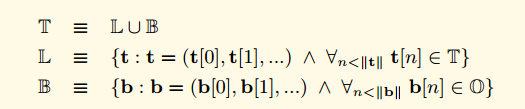

RLP是Recursive Length Prefix的简写。是以太坊中的序列化方法，以太坊的所有对象都会使用RLP方法序列化为字节数组。这里我希望先从黄皮书来形式化上了解RLP方法， 然后通过代码来分析实际的实现。

## 黄皮书的形式化定义
我们定义了集合  T。 T由下面的公式进行定义



上图中的O代表所有byte的集合， 那么B代表了所有可能的字节数组，L代表了不只一个单一节点的树形结构(比如结构体，或者是树节点的分支节点， 非叶子节点)， T代表了所有的字节数组和树形结构的组合。

我们使用两个子函数来定义RLP函数，这两个子函数分别处理上面说到的两种结构(L或者B).


对于所有B类型的字节数组。我们定义了如下的处理规则。

- 如果字节数组只包含一个字节，而且这个字节的大小小于128，那么不对数据进行处理，处理结果就是原数据
- 如果字节数组的长度小于56，那么处理结果就等于在原始数据前面加上（128+字节数据的长度)的前缀。
- 如果不是上面两种情况，那么处理结果就等于在原始数据前面加上原始数据长度的大端表示，然后在前面加上（183 + 原始数据大端表示的长度)

下面使用公式化的语言来表示


> 什么是大端法与小端法  
> 大端法与小端法是一个表示程序对象字节排列顺序的规则，我们举例说明：  
> 假设有一个int类型的变量，位于地址0x200处，它的十六进制值为0x12345678
> 12是最高有效位，78是最低有效位
> 大端表示法:
> ```
> 0x200	0x201	0x202	0x203
> 12		34		56		78
> ```
>
> 最高有效位在前
> 小端表示法：
> ```
> 0x200	0x201	0x202	0x203
> 78	56		34		12
> ```

### **一些数学符号的解释**

- $||x||$ 代表了求x的长度
- $(a)·(b,c)·(d,e) = (a,b,c,d,e)$ 代表了concat的操作，也就是字符串的相加操作。 "hello "+"world" = "hello world"
- $BE(x)$ 函数其实是去掉了前导0的大端模式。  比如4个字节的整形0x1234用大端模式来表示是 00 00 12 34 那么用BE函数处理之后返回的其实是  12 34. 开头的多余的00被去掉了。
- ^ 符号代表并且的含义。
- $\equiv$形式的等号代表恒等的意思

对于所有的其他类型(树形结构)， 我们定义如下的处理规则

首先我们对树形结构里面的每一个元素使用RLP处理，然后再把这些结果concat连接起来。

- 如果连接后的字节长度小于56， 那么我们就在连接后的结果前面加上(192 + 连接后的长度)，组成最终的结果。
- 如果连接后的字节长度大于等于56， 那么我们就在连接后的结果前面先加上连接后的长度的大端模式，然后在前面加上(247 + 连接后长度的大端模式的长度)

下面使用公式化的语言来表示， 发现用公式阐述得清楚一点。


可以看到上面是一个递归的定义， 在求取$s(x)$的过程中又调用了RLP方法，这样使得RLP能够处理递归的数据结构。


如果使用RLP处理标量数据，RLP只能够用来处理正整数。 RLP只能处理大端模式处理后的整数。 也就是说如果是一个整数x，那么先使用$BE(x)$函数来把x转换成最简大端模式(去掉了开头的00),然后把$BE(x)$的结果当成是字节数组来进行编码。

如果用公式来表示就是下图。


当解析RLP数据的时候。如果刚好需要解析整形数据， 这个时候遇到了前导00， 这个时候需要当作异常情况经行处理。

### **总结**
RLP把所有的数据看成两类数据的组合， 一类是字节数组， 一类是类似于List的数据结构。 我理解这两类基本包含了所有的数据结构。 比如用得比较多的struct。 可以看成是一个很多不同类型的字段组成的List

> $\forall$：全称量词、全称命题  
> $\in$：属于  
> $\bigcup$：集合的并运算、全集  
> $\bigcap$：集合的交运算  
> $\equiv$：恒等于  
> $\bigwedge$：命题的“合取”（“与”）运算、等于集合

## **RLP源码解析**
RLP的源码不是很多， 主要分了三个文件
```
decode.go			    rlp解码器，把RLP数据解码为go的数据结构
decode_tail_test.go		解码器测试代码
decode_test.go			解码器测试代码	
doc.go				    文档代码
encode.go			    rlp编码器，把GO的数据结构序列化为RLP数据结构（字节数组）
encode_test.go			编码器测试
encode_example_test.go
raw.go				    未解码的RLP数据
raw_test.go
typecache.go			类型缓存， 类型缓存记录了类型->(编码器|解码器)的内容。
```

### **如何根据类型找到对应的编码器和解码器 typecache.go**
在C++或者Java等支持重载的语言中，可以通过不同的类型重载同一个函数名称来实现方法针对不同类型的分派,也可以通过泛型来实现函数的分派。
```
string encode(int);
string encode(long);
string encode(struct test*)
```

但是GO语言本身不支持重载， 也没有泛型，所以函数的分派就需要自己实现了。 typecache.go主要是实现这个目的， 通过自身的类型来快速的找到自己的编码器函数和解码器函数。

我们首先看看核心数据结构
```go
// typeinfo 是类型缓存中的一个条目
// 存储了编码器和解码器函数
type typeinfo struct {
	decoder    decoder
	decoderErr error // error from makeDecoder
	writer     writer
	writerErr  error // error from makeWriter
}

// typekey 是 typeCache 中类型的键。它包括结构标签，因为它们可能会生成不同的解码器
type typekey struct {
	reflect.Type
	rlpstruct.Tags
}

type typeCache struct {
	cur atomic.Value

	// This lock synchronizes writers.
	mu   sync.Mutex                     // 读写锁，用来在多线程的时候保护typeCache这个Map
	next map[typekey]*typeinfo          // 核心数据结构，保存了类型->编解码器函数
}
```

可以看到核心数据结构就是typeCache， 其中的Map的key是类型，value是对应的编码和解码器。

下面是用户如何获取编码器和解码器的函数：
```go
// 获取编码器和解码器的函数
func (c *typeCache) info(typ reflect.Type) *typeinfo {
    key := typekey{Type: typ}
    // 从typeCache获取
    if info := c.cur.Load().(map[typekey]*typeinfo)[key]; info != nil {
        return info
    }
    
    // 编解码不在typeCache中，需要创建该typ对应的编解码函数
    return c.generate(typ, rlpstruct.Tags{})
}

// 新建typ对应的编解码函数
func (c *typeCache) generate(typ reflect.Type, tags rlpstruct.Tags) *typeinfo {
	c.mu.Lock() // 加锁保护
	defer c.mu.Unlock()

    // 将传入的typ和tags封装为typekey类型
	cur := c.cur.Load().(map[typekey]*typeinfo) // 类型断言还是其他语法糖？
    // 其他的线程可能已经创建成功了， 那么我们直接获取到信息然后返回
	if info := cur[typekey{typ, tags}]; info != nil {
		return info
	}

	// Copy cur to next.
	c.next = make(map[typekey]*typeinfo, len(cur)+1)
	for k, v := range cur {
		c.next[k] = v
	}

	// Generate.
	info := c.infoWhileGenerating(typ, tags)

	// next -> cur
    // 编解码不在typeCache中，需要创建该typ对应的编解码函数
	c.cur.Store(c.next)
	c.next = nil
	return info
}
```

`infoWhileGenerating`是生成对应类型的编解码器函数
```go
func (c *typeCache) infoWhileGenerating(typ reflect.Type, tags rlpstruct.Tags) *typeinfo {
	key := typekey{typ, tags}
	if info := c.next[key]; info != nil {
		return info
	}
	// 在生成之前将一个虚拟值放入缓存中。如果生成器尝试查找自身，它将获得虚拟值并且不会递归调用自身。
	info := new(typeinfo)
	c.next[key] = info
	info.generate(typ, tags)
	return info
}

func (i *typeinfo) generate(typ reflect.Type, tags rlpstruct.Tags) {
	i.decoder, i.decoderErr = makeDecoder(typ, tags)
	i.writer, i.writerErr = makeWriter(typ, tags)
}
```

`makeDecoder`的处理逻辑和`makeWriter`的处理逻辑大致差不多， 这里我只贴出makeWriter的处理逻辑，
```go
// makeWriter 为给定的类型创建一个写入器函数。
func makeWriter(typ reflect.Type, ts rlpstruct.Tags) (writer, error) {
	kind := typ.Kind()
	switch {
	case typ == rawValueType:
		return writeRawValue, nil
	case typ.AssignableTo(reflect.PtrTo(bigInt)):
		return writeBigIntPtr, nil
	case typ.AssignableTo(bigInt):
		return writeBigIntNoPtr, nil
	case typ == reflect.PtrTo(u256Int):
		return writeU256IntPtr, nil
	case typ == u256Int:
		return writeU256IntNoPtr, nil
	case kind == reflect.Ptr:
		return makePtrWriter(typ, ts)
	case reflect.PtrTo(typ).Implements(encoderInterface):
		return makeEncoderWriter(typ), nil
	case isUint(kind):
		return writeUint, nil
	case kind == reflect.Bool:
		return writeBool, nil
	case kind == reflect.String:
		return writeString, nil
	case kind == reflect.Slice && isByte(typ.Elem()):
		return writeBytes, nil
	case kind == reflect.Array && isByte(typ.Elem()):
		return makeByteArrayWriter(typ), nil
	case kind == reflect.Slice || kind == reflect.Array:
		return makeSliceWriter(typ, ts)
	case kind == reflect.Struct:
		return makeStructWriter(typ)
	case kind == reflect.Interface:
		return writeInterface, nil
	default:
		return nil, fmt.Errorf("rlp: type %v is not RLP-serializable", typ)
	}
}
```

可以看到就是一个switch case,根据类型来分配不同的处理函数。 这个处理逻辑还是很简单的。针对简单类型很简单，根据黄皮书上面的描述来处理即可。 不过对于结构体类型的处理还是挺有意思的，而且这部分详细的处理逻辑在黄皮书上面也是找不到的。
```go
type field struct {
	index    int
	info     *typeinfo
	optional bool
}

func makeStructWriter(typ reflect.Type) (writer, error) {
	fields, err := structFields(typ) // 解析结构体类型中所有公共字段的 typeinfo。
	if err != nil {
		return nil, err
	}
	for _, f := range fields {
        // f是field结构，f.info是typeinfo的指针
        // 这里意思是如果结构体中某一种type的typeinfo报错了，直接返回
		if f.info.writerErr != nil {
			return nil, structFieldError{typ, f.index, f.info.writerErr}
		}
	}

	var writer writer
	firstOptionalField := firstOptionalField(fields) // 返回具有“optional”标签的第一个字段的索引。
	if firstOptionalField == len(fields) {
		// 这是没有任何可选字段的结构体的写入器函数。
		writer = func(val reflect.Value, w *encBuffer) error {
			lh := w.list()
			for _, f := range fields {
				if err := f.info.writer(val.Field(f.index), w); err != nil {
					return err
				}
			}
			w.listEnd(lh)
			return nil
		}
	} else {
		// 如果有任何可选字段，写入器需要执行额外的检查来确定输出列表的长度。
		writer = func(val reflect.Value, w *encBuffer) error {
			lastField := len(fields) - 1
			for ; lastField >= firstOptionalField; lastField-- {
				if !val.Field(fields[lastField].index).IsZero() {
					break
				}
			}
			lh := w.list()
			for i := 0; i <= lastField; i++ {
				if err := fields[i].info.writer(val.Field(fields[i].index), w); err != nil {
					return err
				}
			}
			w.listEnd(lh)
			return nil
		}
	}
	return writer, nil
}
```

这个函数定义了结构体的编码方式，通过structFields方法得到了所有的字段的编码器，然后返回一个方法，这个方法遍历所有的字段，每个字段调用其编码器方法。
```go
// 解析结构体类型中所有公共字段的 typeinfo。
func structFields(typ reflect.Type) (fields []field, err error) {
	// 将字段转换为 rlpstruct.Field。
	var allStructFields []rlpstruct.Field
	for i := 0; i < typ.NumField(); i++ {
		rf := typ.Field(i)
		allStructFields = append(allStructFields, rlpstruct.Field{
			Name:     rf.Name,
			Index:    i,
			Exported: rf.PkgPath == "",
			Tag:      string(rf.Tag),
			Type:     *rtypeToStructType(rf.Type, nil),
		})
	}

	// 过滤/验证字段。
	structFields, structTags, err := rlpstruct.ProcessFields(allStructFields)
	if err != nil {
		if tagErr, ok := err.(rlpstruct.TagError); ok {
			tagErr.StructType = typ.String()
			return nil, tagErr
		}
		return nil, err
	}

	// 解析typeinfo.
	for i, sf := range structFields {
		typ := typ.Field(sf.Index).Type
		tags := structTags[i]
		info := theTC.infoWhileGenerating(typ, tags)
		fields = append(fields, field{sf.Index, info, tags.Optional})
	}
	return fields, nil
}
```

structFields函数遍历所有的字段，然后针对每一个字段调用`infoWhileGenerating`。 可以看到这是一个递归的调用过程。 上面的代码中有一个需要注意的是`rf.PkgPath == ""`，这个用于判断字段是否是导出字段， 所谓的导出字段就是说以大写字母开头命令的字段。

> TODO：这里需要学习一下go的反射？

### **编码器 encode.go**
首先定义了空字符串和空List的值，分别是 `0x80`和`0xC0`。 注意，整形的0值的对应值也是`0x80`。这个在黄皮书上面是没有看到有定义的。 然后定义了一个接口类型给别的类型实现 EncodeRLP
```go
var (
	// 常见的编码值。在实现 EncodeRLP 时很有用。

	// EmptyString 是空字符串的编码。
	EmptyString = []byte{0x80}
	// EmptyList 是空列表的编码。
	EmptyList = []byte{0xC0}
)

// Encoder 由需要自定义编码规则或想要编码私有字段的类型实现。
type Encoder interface {
    // EncodeRLP 应该将其接收器的 RLP 编码写入 w。如果实现是指针方法，则也可以对空指针调用。
    //
    // 实现应该生成有效的RLP。目前写入的数据没有被验证，但未来的版本可能会进行验证。 
    // 建议仅写入一个值，但也允许写入多个值或不写入任何值。
    EncodeRLP(io.Writer) error
}
```

然后定义了一个最重要的方法， 大部分的EncodeRLP方法都是直接调用了这个方法Encode方法。  
这个方法首先获取了一个`*encBuffer`对象。 然后调用这个对象的`encode`方法。`encode`方法中，首先获取了对象的反射类型，根据反射类型获取它的编码器，然后调用编码器的writer方法。 这个就跟上面谈到的typeCache联系到一起了。
```go
// Encode函数将val的RLP编码写入w。请注意，Encode函数在某些情况下可能会执行许多小写操作。建议将w设置为缓冲。
//
// 请查看编码规则的包级文档。
func Encode(w io.Writer, val interface{}) error {
	// Optimization: reuse *encBuffer when called by EncodeRLP.
	if buf := encBufferFromWriter(w); buf != nil {
		return buf.encode(val)
	}

	buf := getEncBuffer()
	defer encBufferPool.Put(buf)
	if err := buf.encode(val); err != nil {
		return err
	}
	return buf.writeTo(w)
}

func (buf *encBuffer) encode(val interface{}) error {
    rval := reflect.ValueOf(val)
    writer, err := cachedWriter(rval.Type())
    if err != nil {
		return err
    }
    return writer(rval, buf)
}
```

#### encBuffer的介绍
`encBuffer`出现在Encode方法，和很多Writer方法中。顾名思义，这个是在encode的过程中充当buffer的作用。下面先看看`encBuffer`的定义。
```go
type encBuffer struct {
	str     []byte     // 字符串数据，包含除列表标题以外的所有内容
	lheads  []listhead // 所有列表标题
	lhsize  int        // 所有编码列表标题的大小之和
	sizebuf [9]byte    // 用于无符号整数编码的辅助缓冲区
}

type listhead struct {
    offset int // 列表标题在字符串数据中的索引
    size   int // 编码数据的总大小（包括列表标题）
}
```

从注释可以看到， str字段包含了所有的内容，除了列表的头部。 列表的头部记录在lheads字段中。 lhsize字段记录了lheads的长度， sizebuf是9个字节大小的辅助buffer，专门用来处理uint的编码的。 listhead由两个字段组成， offset字段记录了列表数据在str字段的哪个位置， size字段记录了包含列表头的编码后的数据的总长度。可以看到下面的图。


对于普通的类型，比如字符串，整形，bool型等数据，就是直接往str字段里面填充就行了。 但是对于结构体类型的处理， 就需要特殊的处理方式了。可以看看上面提到过的makeStructWriter方法。

`makeStructWriter`函数的代码中体现了处理结构体数据的特殊处理方法，就是首先调用`w.list()`方法，处理完毕之后再调用`listEnd(lh)`方法。采用这种方式的原因是我们在刚开始处理结构体的时候，并不知道处理后的结构体的长度有多长，因为需要根据结构体的长度来决定头的处理方式(回忆一下黄皮书里面结构体的处理方式)，所以我们在处理前记录好str的位置，然后开始处理每个字段，处理完之后在看一下str的数据增加了多少就知道处理后的结构体长度有多长了。

```go
// list函数将一个新的列表标题添加到标题栈中，并返回该标题的索引。
// 在对列表内容进行编码后，请使用该索引调用listEnd函数。
func (buf *encBuffer) list() int {
	buf.lheads = append(buf.lheads, listhead{offset: len(buf.str), size: buf.lhsize})
	return len(buf.lheads) - 1
}

func (buf *encBuffer) listEnd(index int) {
	lh := &buf.lheads[index]
	lh.size = buf.size() - lh.offset - lh.size // lh.size记录了list开始的时候的队列头应该占用的长度w.size()返回的是str的长度加上lhsize
    if lh.size < 56 {
		buf.lhsize++ // length encoded into kind tag
	} else {
		buf.lhsize += 1 + intsize(uint64(lh.size))
	}
}

func (buf *encBuffer) size() int {
    return len(buf.str) + buf.lhsize
}
```

然后我们可以看看encbuf最后的处理逻辑，会对listhead进行处理，组装成完整的RLP数据
```go
func (w *encbuf) toBytes() []byte {
	out := make([]byte, w.size())
	strpos := 0
	pos := 0
	for _, head := range w.lheads {
		// write string data before header
		n := copy(out[pos:], w.str[strpos:head.offset])
		pos += n
		strpos += n
		// write the header
		enc := head.encode(out[pos:])
		pos += len(enc)
	}
	// copy string data after the last list header
	copy(out[pos:], w.str[strpos:])
	return out
}
```
> 没找到这部分代码以及调用的地方

#### writer介绍
剩下的流程其实比较简单了。 就是根据黄皮书针把每种不同的数据填充到encbuf里面去。
```go
func writeRawValue(val reflect.Value, w *encBuffer) error {
    w.str = append(w.str, val.Bytes()...)
    return nil
}

func writeString(val reflect.Value, w *encBuffer) error {
    s := val.String()
    if len(s) == 1 && s[0] <= 0x7f {
        // fits single byte, no string header
        w.str = append(w.str, s[0])
    } else {
        w.encodeStringHeader(len(s))
        w.str = append(w.str, s...)
    }
    return nil
}
```

### **解码器 decode.go**
解码器的大致流程和编码器差不多，理解了编码器的大致流程，也就知道了解码器的大致流程。
```go
// Decode函数对一个值进行解码，并将结果存储到val指向的值中。请参阅Decode函数的文档以了解解码规则。
func (s *Stream) Decode(val interface{}) error {
	if val == nil {
		return errDecodeIntoNil
	}
	rval := reflect.ValueOf(val)
	rtyp := rval.Type()
	if rtyp.Kind() != reflect.Ptr {
		return errNoPointer
	}
	if rval.IsNil() {
		return errDecodeIntoNil
	}
	decoder, err := cachedDecoder(rtyp.Elem())
	if err != nil {
		return err
	}

	err = decoder(s, rval.Elem())
	if decErr, ok := err.(*decodeError); ok && len(decErr.ctx) > 0 {
		// Add decode target type to error so context has more meaning.
		decErr.ctx = append(decErr.ctx, fmt.Sprint("(", rtyp.Elem(), ")"))
	}
	return err
}

func makeDecoder(typ reflect.Type, tags rlpstruct.Tags) (dec decoder, err error) {
    kind := typ.Kind()
    switch {
    case typ == rawValueType:
        return decodeRawValue, nil
    case typ.AssignableTo(reflect.PtrTo(bigInt)):
        return decodeBigInt, nil
    case typ.AssignableTo(bigInt):
        return decodeBigIntNoPtr, nil
    case typ == reflect.PtrTo(u256Int):
        return decodeU256, nil
    case typ == u256Int:
        return decodeU256NoPtr, nil
    case kind == reflect.Ptr:
        return makePtrDecoder(typ, tags)
    case reflect.PtrTo(typ).Implements(decoderInterface):
        return decodeDecoder, nil
    case isUint(kind):
        return decodeUint, nil
    case kind == reflect.Bool:
        return decodeBool, nil
    case kind == reflect.String:
        return decodeString, nil
    case kind == reflect.Slice || kind == reflect.Array:
        return makeListDecoder(typ, tags)
    case kind == reflect.Struct:
        return makeStructDecoder(typ)
    case kind == reflect.Interface:
        return decodeInterface, nil
    default:
        return nil, fmt.Errorf("rlp: type %v is not RLP-serializable", typ)
    }
}
```

我们同样通过结构体类型的解码过程来查看具体的解码过程。跟编码过程差不多，首先通过`structFields`获取需要解码的所有字段，然后每个字段进行解码。 跟编码过程差不多有一个`List()`和`ListEnd()`的操作，不过这里的处理流程和编码过程不一样，后续章节会详细介绍。
```go
func makeStructDecoder(typ reflect.Type) (decoder, error) {
	fields, err := structFields(typ)
	if err != nil {
		return nil, err
	}
	for _, f := range fields {
		if f.info.decoderErr != nil {
			return nil, structFieldError{typ, f.index, f.info.decoderErr}
		}
	}
	dec := func(s *Stream, val reflect.Value) (err error) {
		if _, err := s.List(); err != nil {
			return wrapStreamError(err, typ)
		}
		for i, f := range fields {
			err := f.info.decoder(s, val.Field(f.index))
			if err == EOL {
				if f.optional {
					// The field is optional, so reaching the end of the list before
					// reaching the last field is acceptable. All remaining undecoded
					// fields are zeroed.
					zeroFields(val, fields[i:])
					break
				}
				return &decodeError{msg: "too few elements", typ: typ}
			} else if err != nil {
				return addErrorContext(err, "."+typ.Field(f.index).Name)
			}
		}
		return wrapStreamError(s.ListEnd(), typ)
	}
	return dec, nil
}
```

下面在看<font color="pink">字符串的解码过程</font>，因为不同长度的字符串有不同方式的编码，我们可以通过前缀的不同来获取字符串的类型， 这里我们通过`s.Kind()`方法获取当前需要解析的类型和长度，如果是Byte类型，那么直接返回Byte的值， 如果是String类型那么读取指定长度的值然后返回。 这就是kind()方法的用途。
```go
// TODO:为什么调用decodeString的时候没有传递参数：因为这里是函数作为返回结果
func decodeString(s *Stream, val reflect.Value) error {
	b, err := s.Bytes()
	if err != nil {
		return wrapStreamError(err, val.Type())
	}
	val.SetString(string(b))
	return nil
}

// Bytes函数读取一个RLP字符串并将其内容作为字节切片返回。如果输入不包含RLP字符串，则返回的错误将是ErrExpectedString。
func (s *Stream) Bytes() ([]byte, error) {
    kind, size, err := s.Kind()
    if err != nil {
        return nil, err
    }
    switch kind {
    case Byte:
        s.kind = -1 // rearm Kind
        return []byte{s.byteval}, nil
    case String:
        b := make([]byte, size)
        if err = s.readFull(b); err != nil {
            return nil, err
        }
        if size == 1 && b[0] < 128 {
            return nil, ErrCanonSize
        }
        return b, nil
    default:
        return nil, ErrExpectedString
    }
}
```

#### Stream 结构分析
解码器的其他代码和编码器的结构差不多， 但是有一个特殊的结构是编码器里面没有的。那就是`Stream`。 这个是用来读取用流式的方式来解码RLP的一个辅助类。 前面我们讲到了大致的解码流程就是首先通过`Kind()`方法获取需要解码的对象的类型和长度,然后根据长度和类型进行数据的解码。 那么我们如何处理结构体的字段又是结构体的数据呢， 回忆我们对结构体进行处理的时候，首先调用`s.List()`方法，然后对每个字段进行解码，最后调用`s.ListEnd()`方法。 技巧就在这两个方法里面， 下面我们看看这两个方法。
```go
type Stream struct {
	r ByteReader

	remaining uint64   // 从r中剩余要读取的字节数
	size      uint64   // 值的大小
	kinderr   error    // 上次读取的错误
	stack     []uint64 // 列表大小
	uintbuf   [32]byte // 整数解码的辅助缓冲区
	kind      Kind     // 下一个值的类型
	byteval   byte     // 类型标记中单字节的值
	limited   bool     // 输入限制是否生效的标志
}
```

~~Stream的`List()`方法，当调用List方法的时候。我们先调用Kind方法获取类型和长度，如果类型不匹配那么就抛出错误，然后我们把一个listpos对象压入到堆栈，这个对象是关键。 这个对象的pos字段记录了当前这个list已经读取了多少字节的数据， 所以刚开始的时候肯定是0. size字段记录了这个list对象一共需要读取多少字节数据。这样我在处理后续的每一个字段的时候，每读取一些字节，就会增加pos这个字段的值，处理到最后会对比pos字段和size字段是否相等，如果不相等，那么会抛出异常。~~
```go
// List函数开始解码一个RLP列表。如果输入不包含列表，则返回的错误将是ErrExpectedList。当到达列表的结尾时，任何Stream操作都将返回EOL。
func (s *Stream) List() (size uint64, err error) {
	kind, size, err := s.Kind()
	if err != nil {
		return 0, err
	}
	if kind != List {
		return 0, ErrExpectedList
	}

	// 在将新大小推入堆栈之前，从外部列表中减去内部列表的大小。这样可以确保在匹配的ListEnd调用之后，剩余的外部列表大小将是正确的。
	// listLimit函数返回最内层列表中剩余的数据量。
	if inList, limit := s.listLimit(); inList {
		s.stack[len(s.stack)-1] = limit - size
	}
	s.stack = append(s.stack, size)
	s.kind = -1
	s.size = 0
	return size, nil
}
```

~~`Stream的`ListEnd()`方法，如果当前读取的数据数量pos不等于声明的数据长度size，抛出异常，然后对堆栈进行pop操作，如果当前堆栈不为空，那么就在堆栈的栈顶的pos加上当前处理完毕的数据长度(用来处理这种情况--结构体的字段又是结构体， 这种递归的结构~~
```go
// ListEnd函数返回到封闭的列表中。输入阅读器必须位于列表的末尾。
func (s *Stream) ListEnd() error {
	// 确保当前列表中没有剩余的数据。
	if inList, listLimit := s.listLimit(); !inList {
		return errNotInList
	} else if listLimit > 0 {
		return errNotAtEOL
	}
	s.stack = s.stack[:len(s.stack)-1] // pop
	s.kind = -1
	s.size = 0
	return nil
}
```


