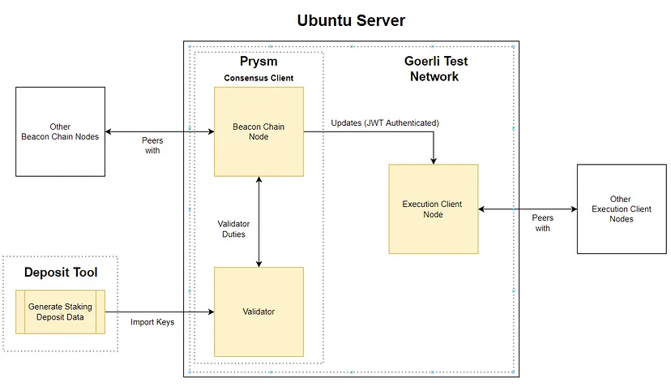

# 以太坊质押指南 (Ubuntu/Goerli/Prysm)
这是一个通过执行客户端和Prysm共识客户端在以太坊Goerli测试网络上进行质押的逐步指南。它基于以下技术：
- 服务器：Ubuntu v20.04（LTS）x64
- 执行客户端：Besu / Erigon / Geth / Nethermind
- 共识客户端：Prysmatic Labs Prysm
- 加密钱包：MetaMask
- Prometheus指标
- Grafana仪表板
- 官方多客户端公共测试网络，Goerli

## 先决条件
本指南假设您对以太坊、ETH、质押ETH、Linux和MetaMask有一定了解。

在开始之前，本指南还需要以下准备工作：

- 在本地计算机或云上安装并运行Ubuntu服务器v20.04（LTS）amd64。鼓励使用本地计算机以实现更大的去中心化。
- 在具有桌面（Mac、Windows、Linux等）和网络浏览器（Brave、Safari、FireFox等）的计算机上安装并配置MetaMask加密钱包的Web浏览器扩展程序。

## 要求
要获得良好的质押性能，通常需要满足以下要求。更多信息请参考这里和这里。
- 相对较新的多核CPU
- 8GB RAM（16GB更好，并在某些情况下是必需的）
- 至少1TB的SSD（建议使用2TB的NVMe）
- 稳定的互联网连接，具有足够的下载速度和每月的数据配额

> 注意：检查您的可用磁盘空间。即使您有一个大的SSD，有时Ubuntu报告的可用空间只有200GB。如果适用于您，请参考附录K-扩展逻辑卷。

## 概述
下面的简化图示说明了质押设置。黄色框表示本指南涵盖的领域。

共识客户端（以前称为Eth2客户端）是为执行客户端提供PoS共识机制的软件。它包括Beacon链节点和验证器。

执行客户端（以前称为Eth1客户端）是负责各种以太坊网络操作的软件，例如从内存池中选择/执行交易。

> 注意：为了成功质押，需要同时使用共识客户端和执行客户端。

