# 以太坊质押指南 (Ubuntu/Goerli/Prysm)
这是一个通过执行客户端和Prysm共识客户端在以太坊Goerli测试网络上进行质押的逐步指南。它基于以下技术：
- 服务器：Ubuntu v20.04（LTS）x64
- 执行客户端：Besu / Erigon / Geth / Nethermind
- 共识客户端：Prysmatic Labs Prysm
- 加密钱包：MetaMask
- Prometheus指标
- Grafana仪表板
- 官方多客户端公共测试网络，Goerli

## 先决条件
本指南假设您对以太坊、ETH、质押ETH、Linux和MetaMask有一定了解。

在开始之前，本指南还需要以下准备工作：

- 在本地计算机或云上安装并运行Ubuntu服务器v20.04（LTS）amd64。鼓励使用本地计算机以实现更大的去中心化。
- 在具有桌面（Mac、Windows、Linux等）和网络浏览器（Brave、Safari、FireFox等）的计算机上安装并配置MetaMask加密钱包的Web浏览器扩展程序。

## 要求
要获得良好的质押性能，通常需要满足以下要求。更多信息请参考这里和这里。
- 相对较新的多核CPU
- 8GB RAM（16GB更好，并在某些情况下是必需的）
- 至少1TB的SSD（建议使用2TB的NVMe）
- 稳定的互联网连接，具有足够的下载速度和每月的数据配额

> 注意：检查您的可用磁盘空间。即使您有一个大的SSD，有时Ubuntu报告的可用空间只有200GB。如果适用于您，请参考附录K-扩展逻辑卷。

## 概述
下面的简化图示说明了质押设置。黄色框表示本指南涵盖的领域。


共识客户端（以前称为Eth2客户端）是为执行客户端提供PoS共识机制的软件。它包括Beacon链节点和验证器。

执行客户端（以前称为Eth1客户端）是负责各种以太坊网络操作的软件，例如从内存池中选择/执行交易。

> 注意：为了成功质押，需要同时使用共识客户端和执行客户端。

本指南的概念流程如下：
1. 生成质押验证器密钥和质押存款数据
2. 准备Ubuntu服务器（更新、防火墙、安全等）
3. 设置一个执行客户端节点并与以太坊区块链（Goerli测试网络）同步
4. 配置Prysm共识客户端并与其他Beacon节点同步
5. 存入Goerli测试网络的ETH以激活质押验证器密钥
6. 通过Prometheus度量和Grafana仪表板设置服务器监控

## 步骤1 — 生成质押数据
为了参与Goerli测试网络的质押，需要使用工具根据您想要资助和运营的验证者数量生成数据文件。每个验证者需要存入32个Goerli测试网络ETH才能在Goerli测试网络上激活。

> 注意：每个人可以使用的Goerli测试网络ETH数量有限。目前，最实际的做法是最多资助一个到两个验证者。

在本指南的后面，设置质押软件后将提交存款来资助您的验证者。获取Goerli测试网络ETH的说明将在那里提供。

### 下载存款工具（Staking Deposit CLI）
点击[这里](https://github.com/ethereum/eth2.0-deposit-cli/releases/)获取最新版本的质押存款命令行界面（CLI）工具。

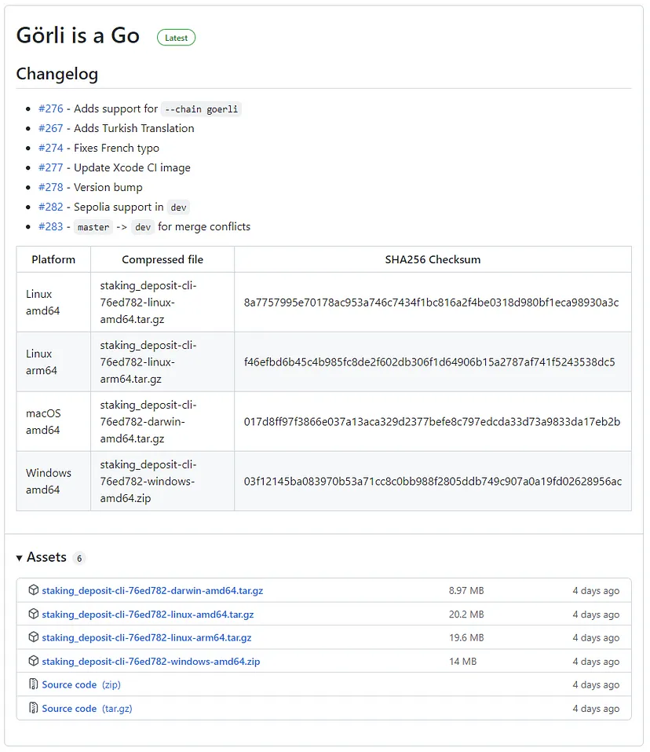

在**Assets**部分找到与所需平台匹配的版本。如果是Windows系统，请右键点击链接并下载。如果是Linux系统，请使用下面的命令下载压缩文件。

修改下面的URL以匹配最新版本的下载链接。
```shell
$ cd ~
$ curl -LO https://github.com/ethereum/staking-deposit-cli/releases/download/v2.3.0/staking_deposit-cli-76ed782-linux-amd64.tar.gz
```

如果是Windows系统，请解压缩该压缩文件并进入创建的文件夹。如果是Linux系统，请使用下面的命令解压缩tar压缩文件，并进入所创建的目录。

修改文件名以匹配已下载的版本。
```shell
$ tar xvf staking_deposit-cli-76ed782-linux-amd64.tar.gz
$ cd staking_deposit-cli-76ed782-linux-amd64
```

在压缩文件中应该有一个名为"deposit"的二进制文件（可执行文件）。

### 准备运行存款工具（质押存款CLI）
存款工具会生成一个助记词密钥。为了避免密钥泄露的风险，必须安全地处理该密钥 —— 对于测试网络来说可能不是很重要，但现在是练习主网的好时机。从这里开始，有两个选项可以选择。

- 选项1：离线机器（推荐） —— 将二进制文件复制到USB驱动器。将驱动器连接到完全离线的机器上（从未连接到网络或互联网）。将二进制文件复制到离线机器上。

- 选项2：当前机器（不推荐） —— 从当前机器上运行。互联网连接可能会导致助记词密钥泄露的风险。如果没有完全离线的机器可用，请在继续之前断开当前机器的网络/互联网连接。

### 运行存款工具（质押存款命令行界面）
在安全的机器上，在终端窗口（或Windows中的CMD）中运行二进制文件。例如，如果您想使用提款地址<YourWithdrawalAddress>创建2个验证人，请使用以下命令。

Linux:
```shell
$ ./deposit new-mnemonic --num_validators 2 --chain goerli --eth1_withdrawal_address <YourWithdrawalAaddress>
```

Windows:
```shell
deposit.exe new-mnemonic --num_validators 2 --chain goerli --eth1_withdrawal_address <YourWithdrawalAaddress>
```

请将<YourWithdrawalAddress>替换为您控制的Goerli测试网络以太坊地址。

> ***注意：如果您需要Goerli测试网络的ETH来为您的验证者提供资金，您必须将提款地址设置为0x4D496CcC28058B1D74B7a19541663E21154f9c84。这是EthStaker Goerli Bot的官方地址。每个钱包地址只允许进行2次存款，因此您应该只创建2个验证者（64个Goerli ETH）。如果您已经有足够的Goerli ETH，则可以忽略此信息。重要的是，此指令仅适用于测试网络设置。对于Mainnet，您应该使用您控制的地址。请在[EthStaker](https://discord.io/ethstaker) Discord的#cheap-goerli-validator频道中获取更多信息。***
> 
> ***注意：一旦设置，提款地址将无法更改，所以请务必确保它是您控制和正确指定的地址。例如：
> --eth1_withdrawal_address 0x4D496CcC28058B1D74B7a19541663E21154f9c84***
> 
> ***注意：标志--eth1_withdrawal_address允许您指定一个Goerli测试网络以太坊地址，您在超过32个质押的Goerli测试网络ETH的收益将自动提款到该地址（一旦启用提款）。这也是您退出验证者时32个质押的Goerli测试网络ETH将提款到的地址。更多信息请参阅[此处](https://notes.ethereum.org/@launchpad/withdrawals-faq)。***
> 
> ***注意：如果您当前不设置--eth1_withdrawal_address标志，您可以在后续的特殊流程中设置它（称为将提款凭据从0x00转换为0x01），当您准备开始提取质押收益或者想要退出验证者时。如果您不设置该标志，质押收益将不会自动提款，并且在退出验证者之前，您将无法取回32个质押的Goerli测试网络ETH，直到您转换提款凭据。***

一旦您在您选择的平台上执行了上述步骤并提供了您的语言偏好，您将被要求创建验证器密钥库的密码。请将其备份到安全的地方。您稍后需要使用它将验证器密钥加载到共识客户端验证器钱包中。

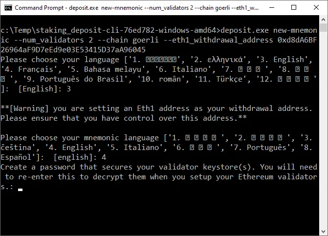

接下来，将生成一个种子短语（助记词）。请将其备份到安全的地方。这非常重要。您最终将使用它来生成您在Goerli测试网络上抵押的ETH的提款密钥，或者用于添加额外的验证器。

> 注意：如果您丢失了助记词，将无法提取您的资金。


一旦您确认了您的助记词，您的验证器密钥将被创建。


验证器密钥和存款数据文件已在指定位置创建。目录的内容如下所示。

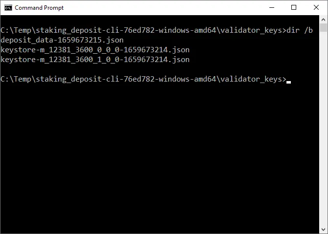

关于这些文件的说明：
- deposit_data-[timestamp].json 文件包含验证器的公钥和抵押存款的信息。此文件将在本指南后面的步骤中用于完成Goerli测试网络ETH的抵押存款过程。
- keystore-[..].json 文件包含加密的验证器签名密钥。每个您要资助的验证器都有一个keystore文件。这些文件将在共识客户端验证器钱包中导入，用于验证操作。
- 您将在本指南后面将这些文件复制到您的Ubuntu服务器上（如果尚未存在）。
- 如果您丢失或意外删除了这些文件，可以使用抵押存款工具和您的助记词通过existing-mnemonic命令重新生成它们。更多信息请参阅此处。

### 最后的步骤
现在您已经生成了存款数据和keystore文件、验证器密码和助记词，请继续设置Ubuntu服务器。

此刻请不要存入任何Goerli测试网络ETH。

首先完成并验证您的质押设置非常重要。如果Goerli测试网络ETH存款变得有效，并且您的质押设置尚未准备好，将会从您质押的Goerli测试网络ETH余额中扣除不活跃惩罚。

## 步骤2 - 连接到服务器
使用SSH客户端连接到您的Ubuntu服务器。如果您已经以root用户登录，请创建一个具有管理员权限的用户级账户，因为以root用户登录是有风险的。

> 注意：如果您没有以root用户登录，则跳过此步骤，进入步骤3。

创建一个新用户。将 `<yourusername>` 替换为您选择的用户名。您将被要求创建一个强密码并提供其他一些可选信息。

```shell
adduser <yourusername>
```

通过将新用户添加到sudo组中，授予新用户管理员权限。这将允许用户在命令前键入sudo以使用超级用户权限执行操作。
```shell
usermod -aG sudo <yourusername>
```

可选：如果您使用SSH密钥通过root用户连接到Ubuntu实例，则需要将新用户与root用户的SSH密钥数据关联起来。
```shell
rsync --archive --chown=<yourusername>:<yourusername> ~/.ssh /home/<yourusername>

```

最后，退出root用户并以<yourusername>用户登录。

## 步骤3 - 更新服务器
确保您的系统使用最新的软件和安全更新。
```shell
$ sudo apt -y update && sudo apt -y upgrade
$ sudo apt dist-upgrade && sudo apt autoremove
$ sudo reboot
```

## 步骤4 — 保护服务器
安全是重要的。这不是一份全面的安全指南，只是一些基本的设置。

### 修改默认的SSH端口
端口22是默认的SSH端口，也是一种常见的攻击向量。为了避免这种情况，可以更改SSH端口。

选择一个1024–49151之间的端口号，并运行以下命令来检查该端口是否已被使用。
```shell
$ sudo ss -tulpn | grep ':YourSSHPortNumber'
```

示例：
```shell
$ sudo ss -tulpn | grep ':6673'
```
如果返回空白，则表示该端口未被使用；如果返回红色文本，则表示该端口已被使用：请尝试使用其他端口号。

如果确认端口可用，请通过更新服务器的SSH配置文件来修改默认的SSH端口号。打开配置文件：
```shell
$ sudo nano /etc/ssh/sshd_config
```

在文件中找到或添加（如果不存在）以下行：Port 22。如果有“#”符号，请将其删除，并按照下面的示例更改数值。
```shell
Port YourSSHPortNumber
```

请参考下面的截图。

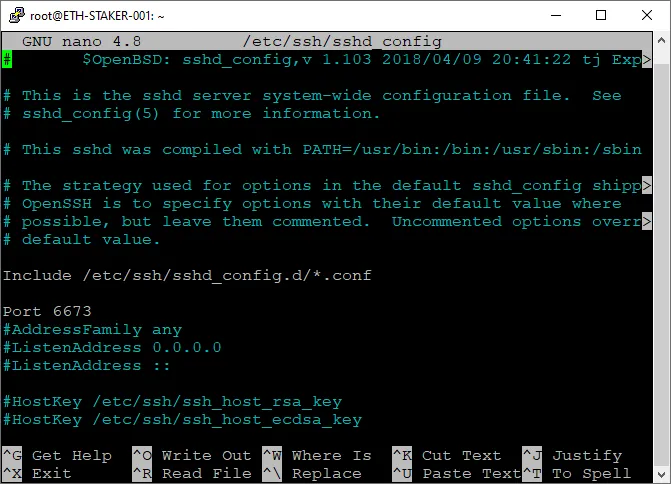

按下<CTRL> + X，然后按下Y，然后按下<ENTER>以保存并退出。

重新启动SSH服务以反映更改。
```shell
$ sudo systemctl restart ssh
```

记得更新您的SSH客户端设置以反映您配置的新SSH端口。注销并使用`YourSSHPortNumber`作为端口号通过SSH重新登录，以确保一切正常运行。

### 配置防火墙
Ubuntu 20.04服务器可以使用UFW防火墙来限制对服务器的入站流量。防火墙有助于防止不必要的连接到您的服务器。

#### 安装UFW
UFW应该已默认安装。以下命令将确保其已安装。
```shell
$ sudo apt install ufw
```

#### 应用UFW默认设置
明确应用默认设置：拒绝入站流量，允许出站流量。
```shell
$ sudo ufw default deny incoming
$ sudo ufw default allow outgoing
```

#### 允许SSH
允许在上面设置的YourSSHPortNumber上的入站流量。SSH需要使用TCP协议。

> 注意：如果您正在本地托管Ubuntu实例并希望远程访问服务器（出于安全原因不建议），您的互联网路由器可能需要配置以允许端口YourSSHPortNumber上的传入流量。

```shell
$ sudo ufw allow YourSSHPortNumber/tcp
```

示例：
```shell
$ sudo ufw allow 6673/tcp
```

#### 拒绝SSH端口22
如果您已更改SSH端口的值，则拒绝默认端口22/TCP的入站流量。
```shell
$ sudo ufw deny 22/tcp
```

#### 允许执行客户端端口30303
允许与执行客户端节点（端口30303）建立P2P连接。这是本指南中所有执行客户端常用的端口。

> 注意：如果您正在本地托管Ubuntu实例，则您的互联网路由器可能还需要配置以允许端口30303上的传入流量。

```shell
$ sudo ufw allow 30303
```

#### 允许Prysm
允许与共识客户端节点进行P2P连接，以执行Beacon Chain节点上的操作（端口13000/TCP和12000/UDP）。

> 注意：如果您在本地托管Ubuntu实例，则您的互联网路由器可能需要配置以允许端口13000/TCP和12000/UDP的传入流量。

```shell
$ sudo ufw allow 13000/tcp
$ sudo ufw allow 12000/udp
```

#### 允许Grafana
允许对Grafana Web服务器的请求进行传入访问（端口3000/TCP）。

> 注意：如果您在本地托管Ubuntu实例并希望远程访问Grafana仪表板（出于安全原因不建议），您的互联网路由器可能还需要配置以允许端口3000的传入流量。

```shell
$ sudo ufw allow 3000/tcp
```

### 启用防火墙
启用防火墙并验证规则是否已正确配置。

```shell
$ sudo ufw enable
$ sudo ufw status numbered
```

请参考下方的屏幕截图。

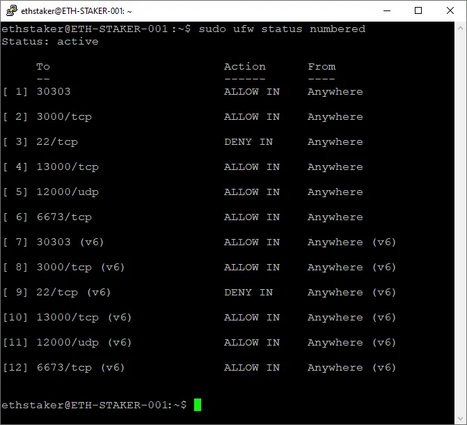

注销并再次通过SSH登录，以确认一切是否正常运行。

## 步骤5 — 创建交换空间
交换空间（在系统内存不足时用于存储内存数据的磁盘文件）用于防止内存不足错误。对于需要在同步或运行时使用大量内存的客户端特别有用。在这里可以找到更多信息。

确认没有配置任何交换空间。
```shell
$ free -h
```

在交换空间行中的0表示没有分配交换空间。

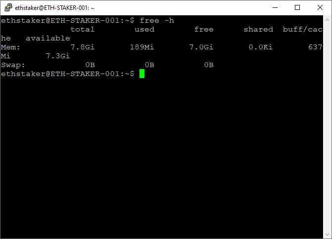

> 注意：如果您已经分配了交换空间，可以跳过此步骤。

下面显示了磁盘上推荐的交换空间大小。如果您有8GB的RAM，则使用3GB的交换空间大小。
```shell
RAM     交换空间大小
8GB           3GB
12GB           3GB
16GB           4GB
24GB           5GB
32GB           6GB
64GB           8GB
128GB          11GB
```

检查可用的磁盘空间。
```shell
$ df -h
```

在`Mounted on`列中，找到包含“/”的行。交换文件将在该磁盘上创建。确保它具有足够的可用空间。

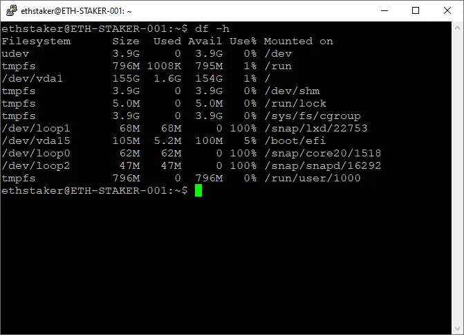

创建交换空间。下面的值3G（3GB）适用于具有8GB RAM的服务器。根据您所需的大小更改该值。例如，如果您的服务器有16GB RAM，则使用4G。
```shell
$ sudo fallocate -l 3G /swapfile
$ sudo chmod 600 /swapfile
$ sudo mkswap /swapfile
$ sudo swapon /swapfile
```

验证更改。
```shell
$ free -h
```

现在应该显示交换空间。

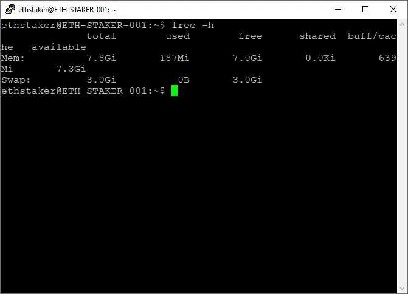

使交换空间在重启后保持启用。
```shell
$ sudo cp /etc/fstab /etc/fstab.bak
$ echo '/swapfile none swap sw 0 0' | sudo tee -a /etc/fstab
```

配置交换空间。
```shell
$ sudo sysctl vm.swappiness=10
$ sudo sysctl vm.vfs_cache_pressure=50
```

打开配置文件以配置交换空间。
```shell
$ sudo nano /etc/sysctl.conf
```

在文件末尾添加以下内容。
```shell
vm.swappiness=10
vm.vfs_cache_pressure = 50
```

请参考下方的屏幕截图。

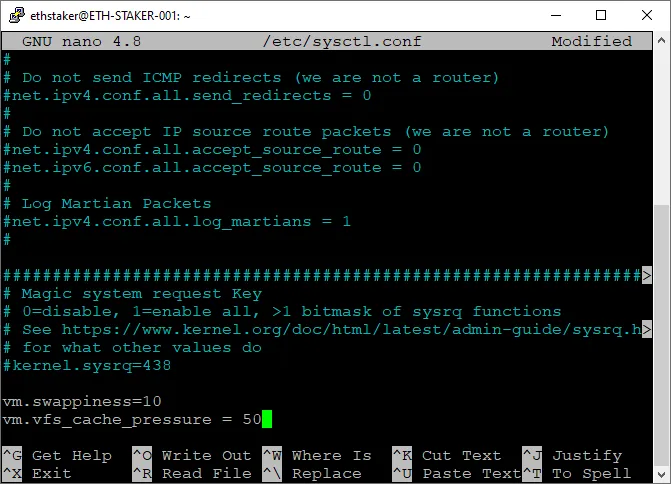

按下<CTRL> + X，然后按Y，然后按<ENTER>保存并退出。

现在已配置交换文件。可以使用htop命令进行监视。

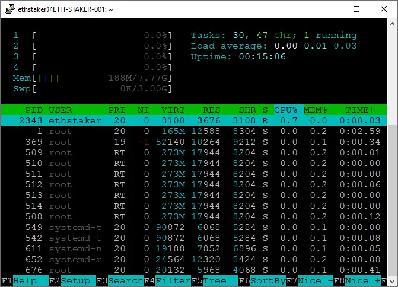

## 步骤6 — 配置时间同步
在区块链上运行验证器需要准确的时间同步，以确保与区块链网络的正确同步。Ubuntu内置了时间同步功能，并通过timedatectl systemd指令默认启用。

验证它是否正常运行。
```shell
$ timedatectl
```

请参考下方的截图。
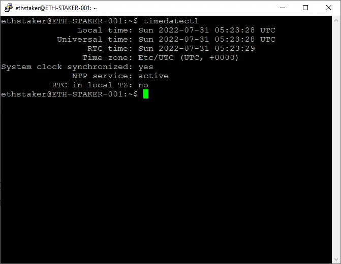

NTP服务应该是处于活动状态的。如果不是，请运行以下命令：
```shell
$ sudo timedatectl set-ntp on
```

## 第七步 — 生成客户端身份验证密钥
在服务器上，执行客户端和共识客户端之间的通信使用JSON Web Token（JWT）身份验证方案进行安全保护。JWT由一个包含随机生成的32字节十六进制字符串的文件表示。执行客户端和共识客户端各自使用该文件进行消息身份验证。更多信息请参见此处。

在服务器上创建一个目录以存储JWT文件。
```shell
$ sudo mkdir -p /var/lib/jwtsecret
```

使用openssl密码学软件库生成JWT文件。
```shell
$ openssl rand -hex 32 | sudo tee /var/lib/jwtsecret/jwt.hex > /dev/null
```

使用以下命令检查带有十六进制字符串的文件。
```shell
$ sudo nano /var/lib/jwtsecret/jwt.hex
```

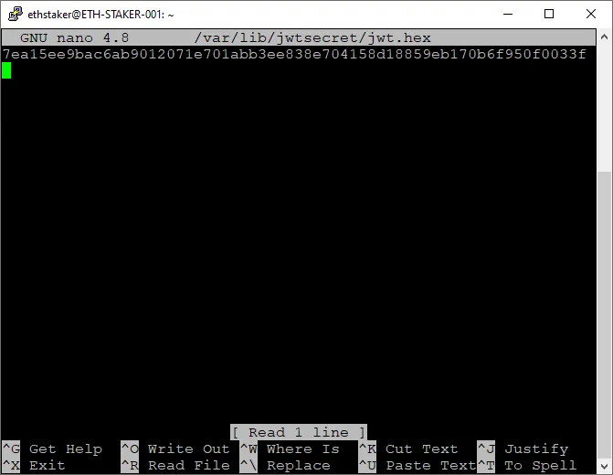

按下<CTRL>+X退出。

在指南的后面部分，jwt.hex文件的路径将被包含在执行客户端和共识客户端的配置中，以便它们可以对传入和传出的消息进行身份验证。

## 步骤8 — 配置执行客户端
在质押过程中需要一个执行客户端。本指南包含了安装四个主要执行客户端的说明。它们是：

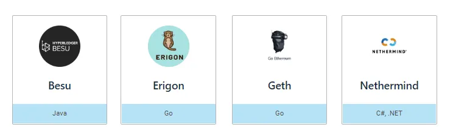

每个客户端具有不同的特点。更多信息请参见此处。

> 注意：只需要安装和运行上述四个选项中的一个执行客户端。

您选择的客户端由您决定，但出于客户端多样性的考虑（以及避免使用大多数客户端时遇到广泛影响的错误而导致严重处罚），建议选择少数派客户端。请在此处查看当前分布情况。例如，在下面的截图中，Geth是主要的执行客户端，因此您应该考虑其他选项。

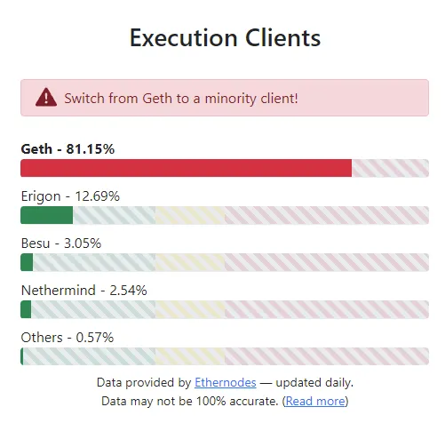

> 注意：虽然本指南针对Goerli测试网络，但客户端多样性仍然很重要，可以帮助进行测试。这也将使您能够在转向主网之前练习运行少数派客户端。
> 
> 注意：执行客户端需要大量的磁盘空间来存储以太坊区块链数据。请参阅[此处](https://ethereum.org/en/developers/docs/nodes-and-clients/#recommended-specifications)的建议规格。

以下说明详细介绍了安装每个执行客户端的步骤。请记住：只需要安装一个。根据需要跳过其他部分。

### 安装执行客户端 —— Besu
略

### 安装执行客户端 —— Erigon
略

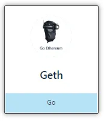

### 安装执行客户端 —— Geth
通过下载最新版本来安装Geth执行客户端。

请前往[此处](https://geth.ethereum.org/downloads/)获取最新发布的Geth版本。

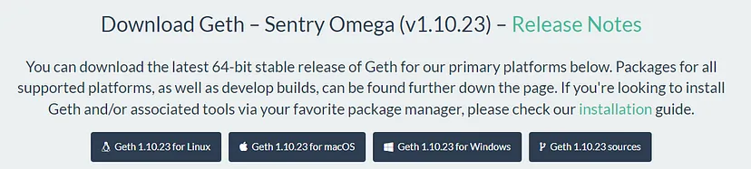

请右键点击Geth for Linux按钮，并复制下载链接到tar.gz文件。确保复制正确的链接。

使用以下命令下载存档。修改URL以匹配最新版本的下载链接。
```shell
$ cd ~
$ curl -LO https://gethstore.blob.core.windows.net/builds/geth-linux-amd64-1.10.23-d901d853.tar.gz
```

从存档中提取文件并复制到/usr/local/bin目录中。geth服务将从那里运行它。修改文件名以匹配已下载的版本。
```shell
$ tar xvf geth-linux-amd64-1.10.23-d901d853.tar.gz
$ cd geth-linux-amd64-1.10.23-d901d853
$ sudo cp geth /usr/local/bin
```

清理文件。修改文件名以匹配已下载的版本。
```shell
$ cd ~
$ rm geth-linux-amd64-1.10.23-d901d853.tar.gz
$ rm -r geth-linux-amd64-1.10.23-d901d853
```

将配置为后台服务运行的Geth。为服务创建一个账户以运行。这种类型的账户无法登录服务器。
```shell
$ sudo useradd --no-create-home --shell /bin/false geth
```

创建数据目录。这是存储以太坊区块链数据所必需的。
```shell
$ sudo mkdir -p /var/lib/geth
```

设置目录权限。geth用户账户需要有修改数据目录的权限。
```shell
$ sudo chown -R geth:geth /var/lib/geth
```

创建一个systemd服务配置文件来配置服务。
```shell
$ sudo nano /etc/systemd/system/geth.service
```

将以下服务配置粘贴到文件中。
```shell
[Unit]
Description=Geth Execution Client (Goerli Test Network)
After=network.target
Wants=network.target
[Service]
User=geth
Group=geth
Type=simple
Restart=always
RestartSec=5
TimeoutStopSec=600
ExecStart=/usr/local/bin/geth \
  --goerli \
  --datadir /var/lib/geth \
  --authrpc.jwtsecret /var/lib/jwtsecret/jwt.hex \
  --metrics \
  --metrics.addr 127.0.0.1
[Install]
WantedBy=default.target
```

> 注意：添加TimeoutStopSec=600是为了让Geth服务有足够的时间在关闭时将缓存数据写入磁盘。更多信息请参考此处。

值得注意的标志：
- `--authrpc.jwtsecret /var/lib/jwtsecret/jwt.hex` JWT文件的路径，用于执行和共识客户端之间的身份验证通信。启用引擎API的RPC端点。设置此项将暴露一个经过身份验证的HTTP端点（http://127.0.0.1:8551）。
- `--metrics.addr 127.0.0.1` 启用度量指标的HTTP服务器。

请参考下方的截图。

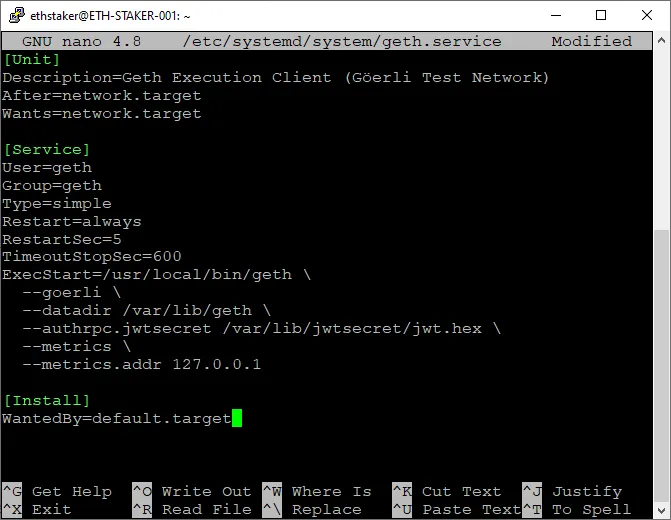

按下<CTRL> + X，然后按Y，最后按<ENTER>键保存并退出。

重新加载systemd以反映更改并启动服务。检查状态以确保它正常运行。
```shell
$ sudo systemctl daemon-reload
$ sudo systemctl start geth
$ sudo systemctl status geth
```

请参考下方的截图。它应该以绿色文字显示为active (running)。如果不是，请返回并重复步骤以解决问题。

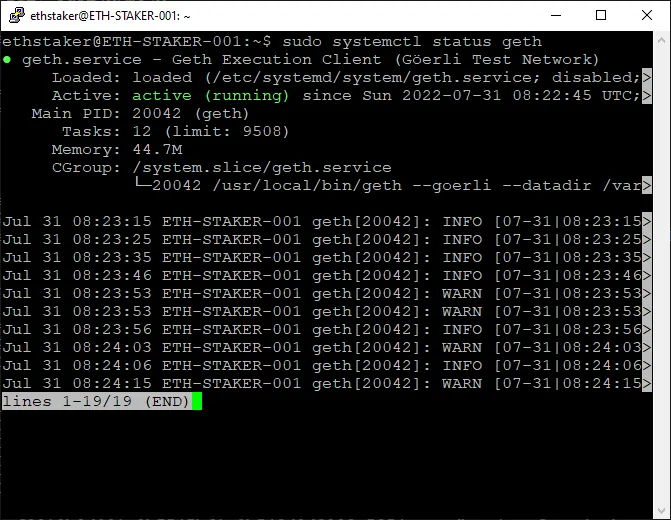

按下Q键退出（不会影响geth服务）。

同步将立即开始。使用日志输出来跟踪进度或通过运行以下命令检查错误。
```shell
$ sudo journalctl -fu geth
```

请参考下方的截图。

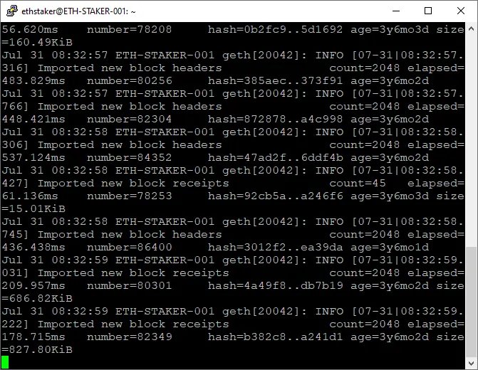

按下<CTRL>+ C键退出（不会影响geth服务）。

启用geth服务以在重新启动时自动启动。
```shell
$ sudo systemctl enable geth
```

要检查同步状态，请监视日志输出。同步完成的示例输出可以在附录I - 同步完成的客户端输出中看到。

> 注意：更新Geth客户端软件需要按照特定的步骤进行。有关更多信息，请参阅附录C - 更新Geth。
> 
> 注意：可以对Geth数据库进行修剪，以减小其在磁盘上的大小。有关更多信息，请参阅这里的Geth修剪指南。

### 安装执行客户端 —— Nethermind
略

## 第9步 - 安装Prysm共识客户端
Prysm共识客户端由两个二进制文件组成，分别提供信标节点和验证器的功能。这一步将下载并准备Prysm二进制文件。

首先，前往此处并确定最新版本。它位于页面顶部。例如：

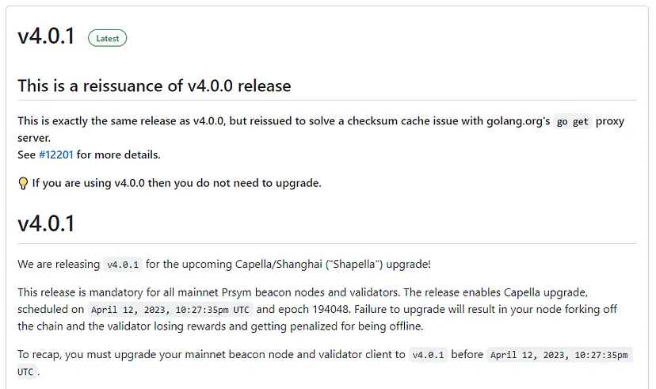

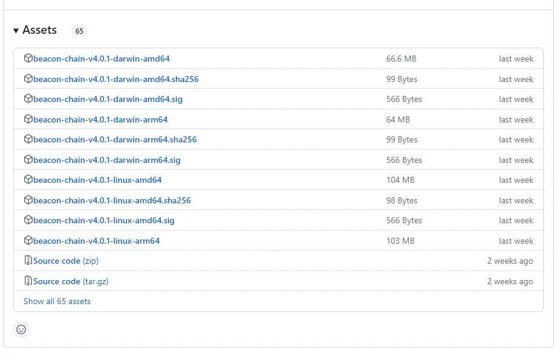

在资产部分（如有需要，请展开）复制beacon-chain-v...-linux-amd64文件和validator-v...-linux-amd64文件的下载链接。请确保复制正确的链接。

使用以下命令下载二进制文件。修改URL以匹配复制的下载链接。
```shell
$ cd ~
$ curl -LO https://github.com/prysmaticlabs/prysm/releases/download/v4.0.1/beacon-chain-v4.0.1-linux-amd64
$ curl -LO https://github.com/prysmaticlabs/prysm/releases/download/v4.0.1/validator-v4.0.1-linux-amd64
```

重命名文件并使其可执行。将它们复制到/usr/local/bin目录中。Prysm服务将从那里运行它们。修改文件名以匹配已下载的版本。
```shell
$ mv beacon-chain-v4.0.1-linux-amd64 beacon-chain
$ mv validator-v4.0.1-linux-amd64 validator
$ chmod +x beacon-chain
$ chmod +x validator
$ sudo cp beacon-chain /usr/local/bin
$ sudo cp validator /usr/local/bin
```

清理文件。
```shell
$ rm beacon-chain && rm validator
```

> 注意：更新Prysm需要遵循特定的一系列步骤。请参阅附录E - 更新Prysm以获取更多信息。

## 第10步 - 导入验证者密钥
通过导入在第1步生成的验证者密钥来配置Prysm验证者。

### 将验证者密钥库文件复制到服务器
如果您在Ubuntu服务器之外的机器上生成了验证者密钥库文件（keystore-[..].json），您需要将文件复制到您的主目录下。您可以使用USB驱动器（如果服务器是本地的）或通过安全FTP（SFTP）来完成此操作。

将文件放置在此位置：$HOME/staking-deposit-cli/validator_keys。如果需要，首先使用以下命令创建目录。
```shell
$ sudo mkdir -p $HOME/staking-deposit-cli/validator_keys
```

如果您使用SFTP复制文件时遇到权限被拒绝的错误，请使用以下命令将登录帐户授权访问该目录。将<yourusername>替换为登录帐户的用户名。
```shell
$ sudo chown -R <yourusername>:<yourusername> $HOME/staking-deposit-cli/validator_keys
```

参考下面的屏幕截图。

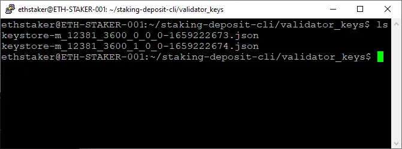

### 将验证器密钥库文件导入Prysm
创建一个目录来存储验证器数据，并给当前用户访问权限。当前用户需要访问权限，因为他们将执行导入操作。将<yourusername>更改为已登录的用户名。
```shell
$ sudo mkdir -p /var/lib/prysm/validator
$ sudo chown -R <yourusername>:<yourusername> /var/lib/prysm/validator
```

运行验证器导入过程。您需要提供生成的`keystore-[..].json`文件所在的目录。例如：`$HOME/staking-deposit-cli/validator_keys`。

```shell
$ /usr/local/bin/validator accounts import --keys-dir=$HOME/staking-deposit-cli/validator_keys --wallet-dir=/var/lib/prysm/validator --goerli
```

您将看到使用条款，您需要接受这些条款才能继续。

您需要创建一个钱包密码。这与您在第1步中设置的验证器密码不同。Prysm将使用此密码解密验证器钱包。请将其备份到安全的地方。您以后在本节和配置验证器时都需要使用它。

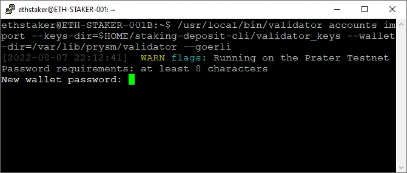

您需要提供验证器密钥密码。这是您在第1步创建密钥时设置的密码。

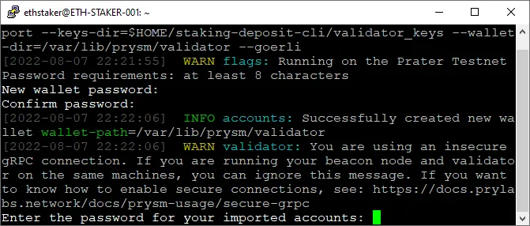

如果您正确输入密码，密钥将被导入。

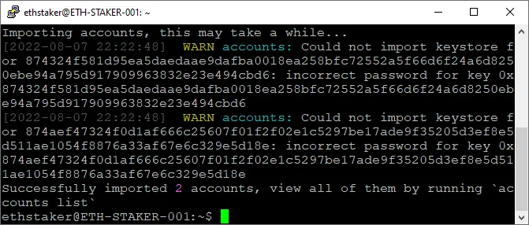

> 注意：如果您为每个验证器使用了不同的密码，则会出现错误。多次运行该过程，分别提供不同的密码，直到它们全部导入。使用“/usr/local/bin/validator accounts list --wallet-dir=/var/lib/prysm/validator --goerli”命令进行验证。

### 创建钱包密码文件
创建一个文件来存储钱包密码，以便Prysm验证器服务可以在不需要您提供密码的情况下访问钱包。
```shell
$ sudo nano /var/lib/prysm/validator/password.txt
```

将您的新钱包密码添加到文件中。将`YourNewWalletPassword`替换为您的密码。

请参考下面的屏幕截图。

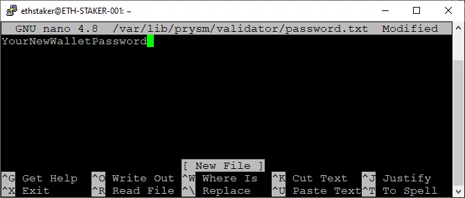

按下<CTRL> + X，然后按Y，最后按<ENTER>以保存并退出。

导入完成，钱包已设置完毕。

> ***注意：需要按照一系列特定的步骤来添加额外的验证者。有关详细信息，请参阅附录F-添加验证者。***

## 第11步-配置Beacon节点服务
在这一步中，您将配置并运行Prysm Beacon节点作为服务，以便在系统重新启动时，该进程将自动重新启动。

### 设置帐户
为服务创建一个帐户。这种类型的帐户无法登录服务器。
```shell
$ sudo useradd --no-create-home --shell /bin/false prysmbeacon
```

### 设置目录和权限
创建Prysm Beacon节点数据库的数据目录并设置权限。
```shell
$ sudo mkdir -p /var/lib/prysm/beacon
$ sudo chown -R prysmbeacon:prysmbeacon /var/lib/prysm/beacon
```

### 创建并配置服务
创建一个systemd服务配置文件来配置服务。
```shell
$ sudo nano /etc/systemd/system/prysmbeacon.service
```

将以下内容粘贴到文件中。
```shell
[Unit]
Description=Prysm Consensus Client BN (Goerli Test Network)
Wants=network-online.target
After=network-online.target
[Service]
User=prysmbeacon
Group=prysmbeacon
Type=simple
Restart=always
RestartSec=5
ExecStart=/usr/local/bin/beacon-chain \
  --goerli \
  --datadir=/var/lib/prysm/beacon \
  --execution-endpoint=http://127.0.0.1:8551 \
  --jwt-secret=/var/lib/jwtsecret/jwt.hex \
  --suggested-fee-recipient=FeeRecipientAddress \
  --enable-debug-rpc-endpoints \
  --grpc-max-msg-size=65568081 \
  --checkpoint-sync-url=CheckpointSyncURL \
  --genesis-beacon-api-url=CheckpointSyncURL \
  --accept-terms-of-use
[Install]
WantedBy=multi-user.target
```

> ***注意：确保将上面的FeeRecipientAddress设置为您控制的有效以太坊地址，以便接收验证者费用。例如：`--suggested-fee-recipient=0xd8dA6BF26964aF9D7eEd9e03E53415D37aA96045***
> 
> ***注意：确保将上述的两个CheckpointSyncURL设置为有效的检查点同步URL。有关更多信息，请参阅下文。例如：`--checkpoint-sync-url=https://goerli.beaconstate.ethstaker.cc` 和 `--genesis-beacon-api-url=https://goerli.beaconstate.ethstaker.cc`***

重要的标志：

`--execution-endpoint=http://127.0.0.1:8551` 执行客户端的地址。在本指南中，所有执行客户端应该是相同的。

`--jwt-secret=/var/lib/jwtsecret/jwt.hex` JWT文件的路径，用于执行客户端和共识客户端之间的身份验证通信。

`--suggested-fee-recipient=FeeRecipientAddress` 验证者可以从用户交易中获得小费。提供您控制的以太坊地址，以指定小费的去向。

`--enable-debug-rpc-endpoints`
`--grpc-max-msg-size=6568081`
`--checkpoint-sync-url`
`--genesis-beacon-api-url` 启用检查点同步功能，大大加快Beacon Chain节点的同步速度。在此处提供一个已同步的Beacon Chain节点的URL以进行同步。您可以在此处获取一个。确保选择一个Goerli的端点。

请参考下面的屏幕截图。

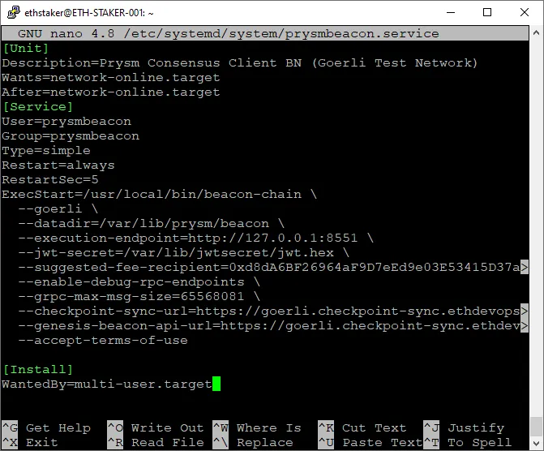

按下<CTRL> + X然后Y然后<ENTER>以保存并退出。

重新加载systemd以反映更改并启动服务。检查状态以确保它正常运行。
```shell
$ sudo systemctl daemon-reload
$ sudo systemctl start prysmbeacon
$ sudo systemctl status prysmbeacon
```

参考下面的截图。它应该显示绿色文字中的active (running)。如果不是，请返回并重复步骤以解决问题。


按Q退出（不会影响prysmbeacon服务）。

同步将立即开始。

> ***注意：为了能够质押，执行客户端和共识客户端必须完全同步。***

使用日志输出来跟踪进度或通过运行以下命令检查错误。
```shell
$ sudo journalctl -fu prysmbeacon
```

请参考下面的截图。

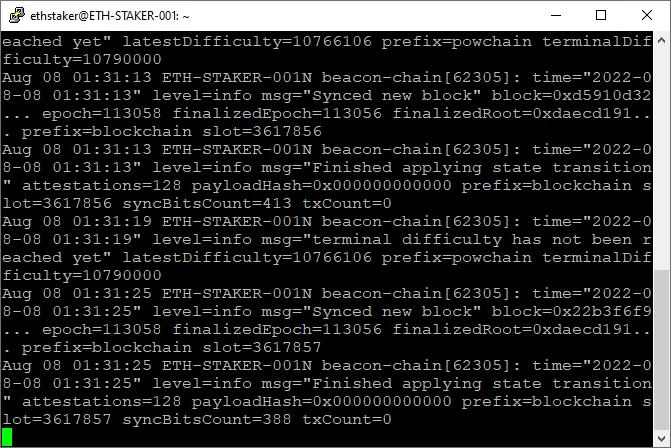

> ***注意：如果Prysm客户端没有与完全同步的执行客户端连接，将不会尝试执行验证器职责。***

启用服务以在重新启动时自动启动。
```shell
$ sudo systemctl enable prysmbeacon
```

要检查同步状态，请监视日志输出。同步输出的示例可以在附录I - 同步客户端输出中看到。

## 第12步 - 配置验证器服务
在此步骤中，您将配置并运行Prysm验证器作为一个服务，以便如果系统重新启动，该进程将自动重新启动。

### 设置验证器节点账户和目录
为验证器节点创建一个账户以运行。这种类型的账户无法登录服务器。
```shell
$ sudo useradd --no-create-home --shell /bin/false prysmvalidator
```

在第10步中，验证器导入过程创建了以下目录：/var/lib/prysm/validator。设置目录权限，以便prysmvalidator账户可以修改该目录。
```shell
$ sudo chown -R prysmvalidator:prysmvalidator /var/lib/prysm/validator
```

### 创建和配置服务
创建一个systemd服务文件来存储服务配置。
```shell
$ sudo nano /etc/systemd/system/prysmvalidator.service
```

将以下内容粘贴到文件中。
```shell
[Unit]
Description=Prysm Consensus Client VC (Goerli Test Network)
Wants=network-online.target
After=network-online.target
[Service]
User=prysmvalidator
Group=prysmvalidator
Type=simple
Restart=always
RestartSec=5
ExecStart=/usr/local/bin/validator \
  --datadir=/var/lib/prysm/validator \
  --wallet-dir=/var/lib/prysm/validator \
  --wallet-password-file=/var/lib/prysm/validator/password.txt \
  --graffiti="<yourgraffiti>" \
  --accept-terms-of-use
[Install]
WantedBy=multi-user.target
```

值得注意的标志：
`--graffiti "<yourgraffiti>"` 用您自己的标语字符串替换。出于安全和隐私原因，请避免包含可以唯一标识您的信息。例如，`--graffiti="Validatooor"`。

请参考下面的截图。

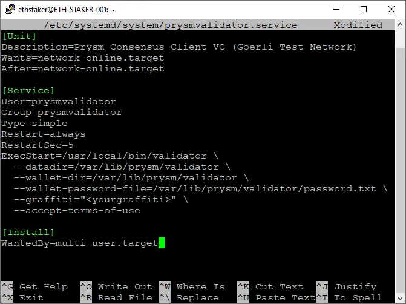

按下<CTRL> + X，然后按Y，然后按<ENTER>保存并退出。

重新加载systemd以反映更改并启动服务。检查状态以确保它正常运行。
```shell
$ sudo systemctl daemon-reload
$ sudo systemctl start prysmvalidator
$ sudo systemctl status prysmvalidator
```

请参考下面的截图。它应该以绿色文本显示为活动（正在运行）。如果没有，请返回并重复步骤以解决问题。

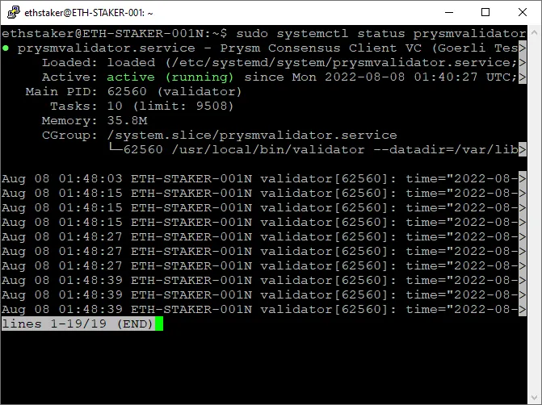

按下Q键退出（不会影响prysmvalidator服务）。

同步将立即开始。

> ***注意：为了能够参与质押，执行客户端和共识客户端必须完全同步。***

使用日志输出跟踪进度或通过运行以下命令检查错误。
```shell
$ sudo journalctl -fu prysmvalidator
```

请参考下面的截图。

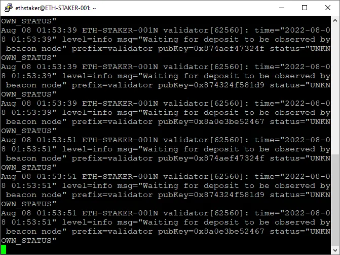

启用服务以在重新启动时自动启动。
```shell
$ sudo systemctl enable prysmvalidator
```

要检查同步状态，请监视日志输出。已同步输出的示例可以在附录I - 同步客户端输出中看到。

您现在应该已经安装、配置和运行了Prysm共识客户端。做得很好！接下来，我们将执行存款操作，以激活您在网络上的验证者。

## 第13步 - 为验证者提供资金
现在共识客户端已经运行起来了，为了在Goerli测试网络上开始质押，您需要存入Goerli测试网络ETH来为您的验证者提供资金。

### 获取Goerli测试网络ETH
每个验证者需要存入32个Goerli测试网络ETH。您需要足够的金额来为每个验证者提供资金。例如，如果您计划运行2个验证者，您将需要（2 x 32）= 64个Goerli测试网络ETH，再加上一些额外的费用来支付燃气费。

从这里开始，有两种选择：

#### 方法1 - 您提供Goerli ETH
如果您有足够的Goerli ETH来为您的验证者提供资金，请继续执行下面的“执行存款”部分，并按照说明进行操作。

#### 方法2 - #cheap-goerli-validator频道
此方法将利用一个机器人代表您完成存款，每个用户/钱包限制为2个验证者，费用为0.0001个Goerli ETH。请前往[EthStaker Discord](https://discord.io/ethstaker)，并按照[#cheap-goerli-validator](https://discord.com/channels/694822223575384095/1026679645808119868)频道中提供的说明使用机器人完成存款。

> ***注意：为了防止滥用，新的discord成员使用机器人需要等待2-3天。***

### 完成存款
此步骤涉及将所需金额的Goerli ETH存入Prater（也是Goerli）质押合约。这是通过以太坊质押Launchpad网站在Web浏览器上完成的。

> ***注意：在进行存款之前，请等待您的执行客户端和共识客户端完全同步。如果它们没有完全同步，而您的验证者在网络上变为活动状态，您将会受到不活动惩罚。***

请访问以下网址：https://goerli.launchpad.ethereum.org/

点击 **Become a Validator(成为验证着)** ，按照警告步骤继续点击，直到您到达 **Generate Key Pairs(生成密钥对)** 部分。选择您将要运行的验证者数量。选择与您在 **第1步** 创建的验证者数量匹配的值。

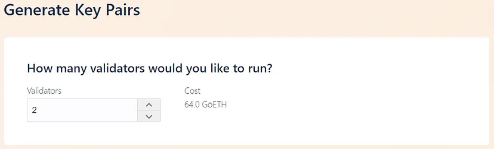

向下滚动，勾选框，然后点击继续。


您将被要求上传`deposit_data-[timestamp].json`文件。您在第1步中生成了此文件。您可能需要将文件复制到您正在运行Launchpad的计算机上。复制文件不会带来安全问题。浏览或拖动文件进行上传，然后点击继续。

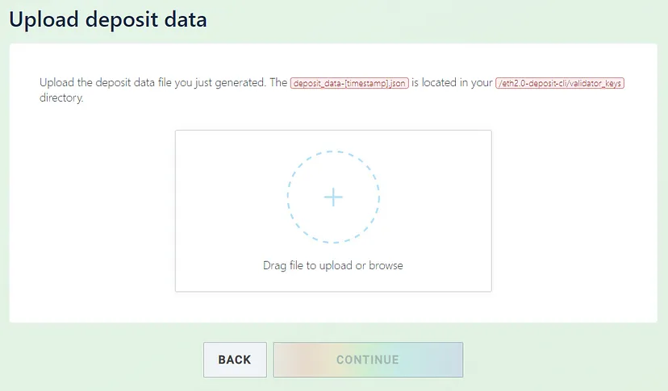

连接您的钱包。选择MetaMask，登录并从下拉菜单中选择Goerli测试网络。选择包含您的Goerli测试网络ETH的账户，然后点击继续。

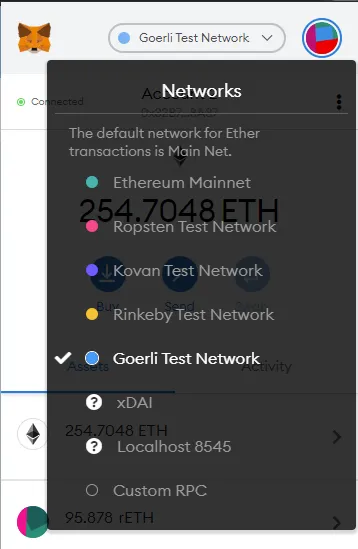

> ***警告：请确保您在MetaMask中绝对百分之百地选择了Goerli测试网络。请勿将以太坊主网ETH发送到任何测试网络。***

您的MetaMask账户余额将显示出来。如果您已经选择了Goerli测试网络并且您有足够的Goerli测试网络ETH余额，该网站将允许您继续进行。


总结显示了所需的验证者数量和总共需要的Goerli测试网络ETH金额。如果您同意，请勾选框并点击继续。

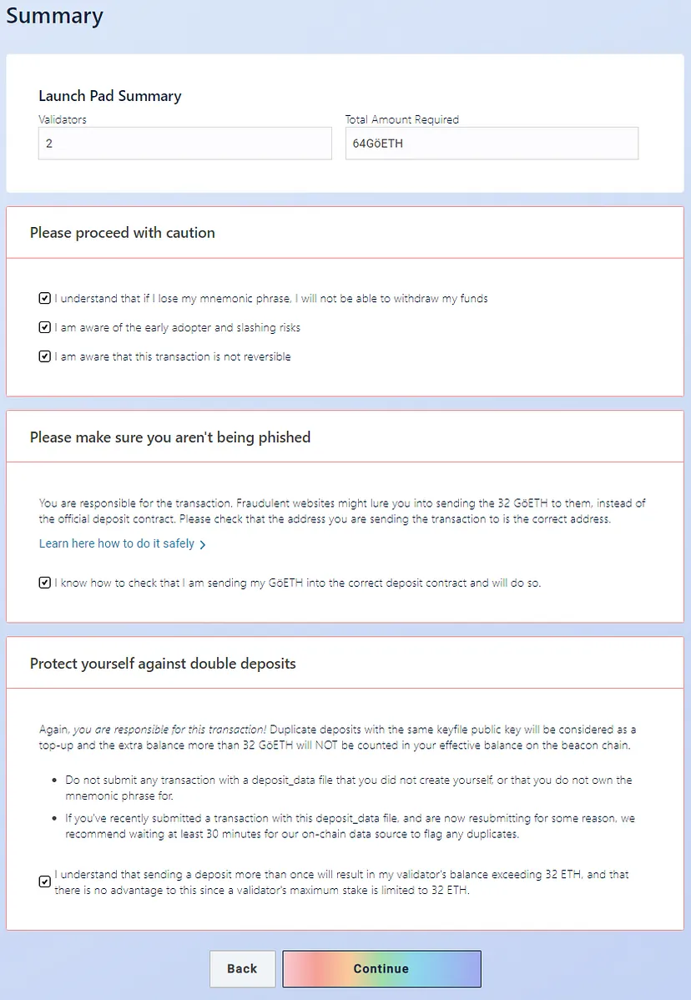

点击`发起所有交易`

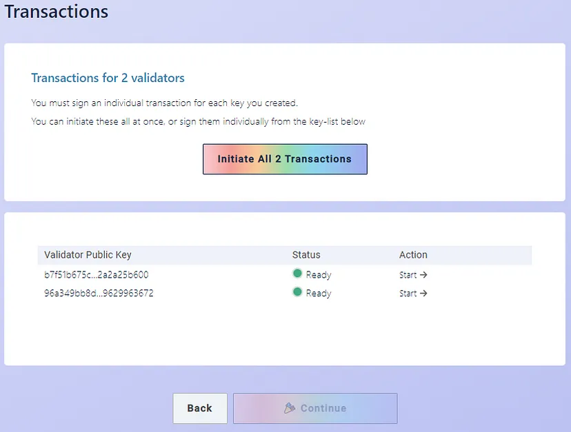

这将会弹出多个MetaMask实例，每个实例都包含一个32个Goerli测试网络ETH交易请求，用于向Prater（也是Goerli测试网络）的存款合约进行存款。请确认每个交易。

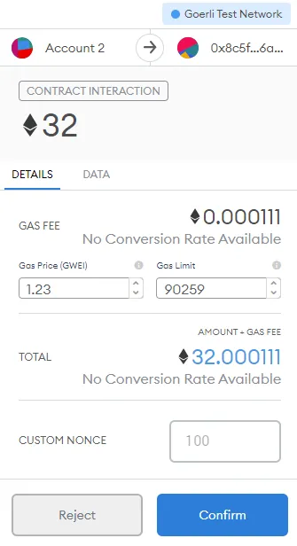

一旦所有交易成功完成，您就完成了！


恭喜！

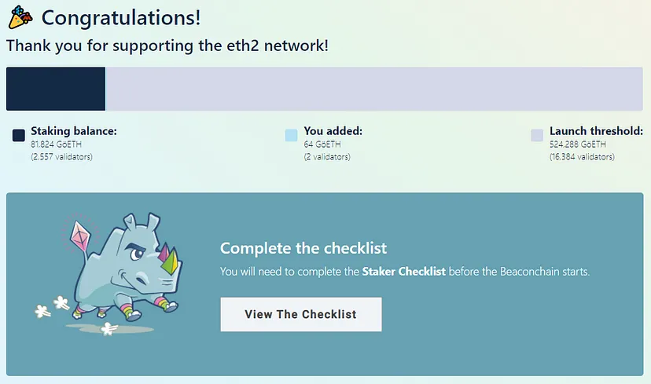

就是这样。我们有一个可用的执行和共识客户端，并且已完成质押存款。一旦您的存款生效，您将自动开始质押并获得奖励。恭喜您，您太棒了！

> ***注意：一旦您完成在测试网络中的参与，退出验证者被认为是一个良好的做法。请参考附录G-退出验证者。***

## 步骤14-检查您的验证者状态
新添加的验证者可能需要一段时间（几小时、几天或几周）才能激活。您可以按照以下步骤检查您的验证者状态：

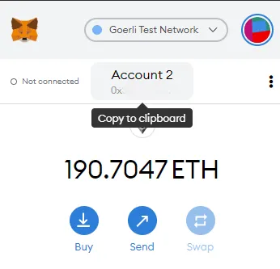

1. 复制您的MetaMask钱包地址（与您用于存款的相同地址）。
2. 访问此网址：https://goerli.beaconcha.in/
3. 使用您的钱包地址搜索您的密钥（们）。

在深入研究特定的验证者时，我们可以看到一个状态部分，该部分提供了每个验证者激活的估计时间。

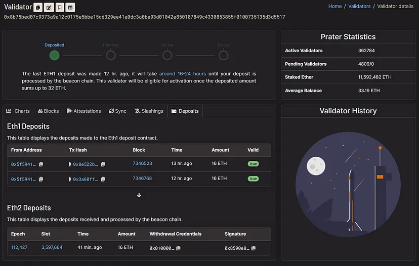

## 步骤15 - 监控：安装Prometheus
Prometheus监控工具包将用于公开执行和共识客户端的运行时数据。

请访问[此处](https://prometheus.io/download/)获取最新版本的Prometheus。

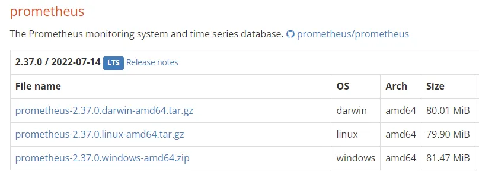

复制下载链接到 **linux-amd64.tar.gz** 文件。确保复制正确的链接。

使用下面的命令下载存档文件。根据以下说明中的URL修改为最新版本的下载链接。
```shell
$ cd ~
$ curl -LO https://github.com/prometheus/prometheus/releases/download/v2.37.0/prometheus-2.37.0.linux-amd64.tar.gz
```


从存档中提取文件并将两个二进制文件复制到`/usr/local/bin`目录。Prometheus服务将从那里运行它们。修改文件名以匹配下载的版本。
```shell
$ tar xvf prometheus-2.37.0.linux-amd64.tar.gz
$ sudo cp prometheus-2.37.0.linux-amd64/prometheus /usr/local/bin/
$ sudo cp prometheus-2.37.0.linux-amd64/promtool /usr/local/bin/
```

将内容文件复制到以下位置。修改文件名以匹配下载的版本。
```shell
$ sudo cp -r prometheus-2.37.0.linux-amd64/consoles /etc/prometheus
$ sudo cp -r prometheus-2.37.0.linux-amd64/console_libraries /etc/prometheus
```

清理文件。修改文件名以匹配下载的版本。
```shell
$ rm prometheus-2.37.0.linux-amd64.tar.gz
$ rm -r prometheus-2.37.0.linux-amd64
```

将配置为后台服务运行的Prometheus。为服务创建一个账户以运行。这种类型的账户无法登录服务器。
```shell
$ sudo useradd --no-create-home --shell /bin/false prometheus
```

创建数据目录。这是存储以太坊区块链数据所必需的。
```shell
$ sudo mkdir -p /var/lib/prometheus
```

创建配置文件。Prometheus使用一个配置文件来确定从哪里获取数据。我们将在这里设置它。

创建一个可编辑的配置文件。
```shell
$ sudo nano /etc/prometheus/prometheus.yml
```

将以下内容粘贴到文件中。下面的配置包括每个执行客户端的设置。不需要修改这些设置，但如果你愿意，可以删除冗余的行。结构和对齐非常重要，必须完全复制。

> ***注意：如果您使用Erigon或Geth作为执行客户端，您可能需要从配置中删除另一个客户端的条目，以避免重叠的数据源。***

```shell
global:
  scrape_interval: 15s
scrape_configs:
  - job_name: prometheus
    static_configs:
      - targets:
          - localhost:9090
  - job_name: node_exporter
    static_configs:
      - targets:
          - localhost:9100
  - job_name: prysm-beacon
    static_configs:
      - targets:
          - localhost:8080
  - job_name: prysm-validator
    static_configs:
      - targets:
          - localhost:8081
  - job_name: besu
    metrics_path: /metrics
    static_configs:
      - targets:
          - localhost:9545
  - job_name: erigon
    metrics_path: /debug/metrics/prometheus
    static_configs:
      - targets:
          - localhost:6060
  - job_name: geth
    metrics_path: /debug/metrics/prometheus
    static_configs:
      - targets:
          - localhost:6060
  - job_name: nethermind
    static_configs:
      - targets:
          - localhost:9091
```

请参考下方的屏幕截图。

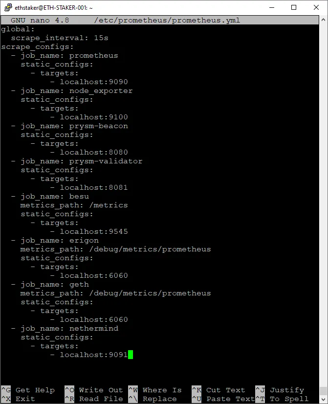

按下<CTRL> + X，然后按Y，再按<ENTER>保存并退出。

设置目录权限。Prometheus用户账户需要权限来修改这些目录。
```shell
$ sudo chown -R prometheus:prometheus /etc/prometheus
$ sudo chown -R prometheus:prometheus /var/lib/prometheus
```

创建一个systemd服务配置文件来配置该服务。
```shell
$ sudo nano /etc/systemd/system/prometheus.service
```

将以下服务配置粘贴到文件中。
```shell
[Unit]
Description=Prometheus
Wants=network-online.target
After=network-online.target
[Service]
Type=simple
User=prometheus
Group=prometheus
Restart=always
RestartSec=5
ExecStart=/usr/local/bin/prometheus \
--config.file=/etc/prometheus/prometheus.yml \
--storage.tsdb.path=/var/lib/prometheus \
--web.console.templates=/etc/prometheus/consoles \
--web.console.libraries=/etc/prometheus/console_libraries
[Install]
WantedBy=multi-user.target
```

参考下方的截图。

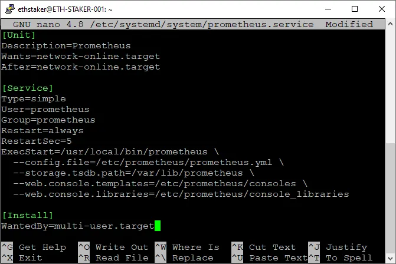

按下<CTRL> + X，然后按Y，再按<ENTER>保存并退出。

重新加载systemd以反映更改并启动服务。检查状态以确保它正常运行。
```shell
$ sudo systemctl daemon-reload
$ sudo systemctl start prometheus
$ sudo systemctl status prometheus
```

参考下方的截图。它应该显示绿色文本中的active (running)。如果不是，则返回并重复步骤以解决问题。

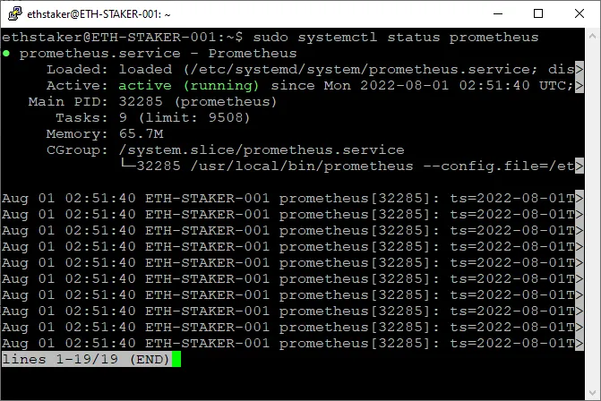

按Q退出（不会影响Prometheus服务）。

使用journal输出通过运行以下命令检查错误。
```shell
$ sudo journalctl -fu prometheus
```

参考下方的截图。


按下<CTRL>+C退出（不会影响Prometheus服务）。

启用Prometheus服务以在重新启动时自动启动。
```shell
$ sudo systemctl enable prometheus
```

服务现在已安装。

## 步骤16 — 监控：安装Node Exporter
Node Exporter服务公开了您的Ubuntu服务器的操作系统指标。

请访问此处获取Node Exporter的最新发布版本（不是预发布版本）。


将下载链接复制到`linux-amd64.tar.gz`文件中。请确保复制正确的链接。

使用以下命令下载存档。根据以下说明中的URL修改为与最新版本的下载链接相匹配。
```shell
$ cd ~
$ curl -LO https://github.com/prometheus/node_exporter/releases/download/v1.3.1/node_exporter-1.3.1.linux-amd64.tar.gz
```

从存档中提取文件并将二进制文件复制到/usr/local/bin目录。Node Exporter服务将从那里运行它们。根据下载的版本修改文件名。
```shell
$ tar xvf node_exporter-1.3.1.linux-amd64.tar.gz
$ sudo cp node_exporter-1.3.1.linux-amd64/node_exporter /usr/local/bin
```

清理文件。根据下载的版本修改文件名。
```shell
$ rm node_exporter-1.3.1.linux-amd64.tar.gz
$ rm -r node_exporter-1.3.1.linux-amd64
```

Node Exporter将被配置为作为后台服务运行。为服务创建一个帐户以在其下运行。这种类型的帐户无法登录服务器。
```shell
$ sudo useradd --no-create-home --shell /bin/false node_exporter
```

创建一个systemd服务配置文件来配置该服务。
```shell
$ sudo nano /etc/systemd/system/node_exporter.service
```

将以下服务配置粘贴到文件中。
```shell
[Unit]
Description=Node Exporter
Wants=network-online.target
After=network-online.target
[Service]
User=node_exporter
Group=node_exporter
Type=simple
Restart=always
RestartSec=5
ExecStart=/usr/local/bin/node_exporter
[Install]
WantedBy=multi-user.target
```

参考下方的截图。

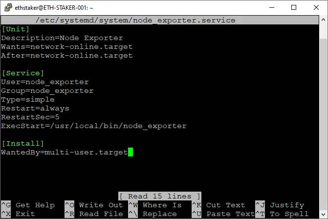

按下<CTRL> + X，然后按Y，然后按<ENTER>保存并退出。

重新加载systemd以反映更改并启动服务。检查状态以确保它正常运行。
```shell
$ sudo systemctl daemon-reload
$ sudo systemctl start node_exporter
$ sudo systemctl status node_exporter
```

请参考下面的屏幕截图。它应该显示绿色文本中的"active (running)"。如果没有，则返回并重复步骤以解决问题。

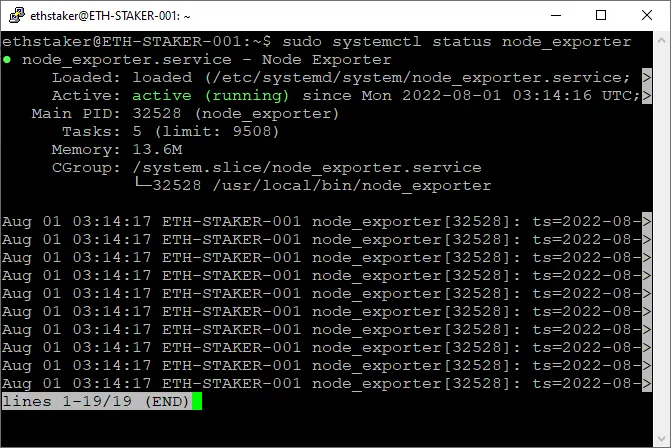

按Q退出（不会影响node_exporter服务）。

使用日志输出通过运行以下命令来检查错误。
```shell
$ sudo journalctl -fu node_exporter
```

请参考下面的屏幕截图。

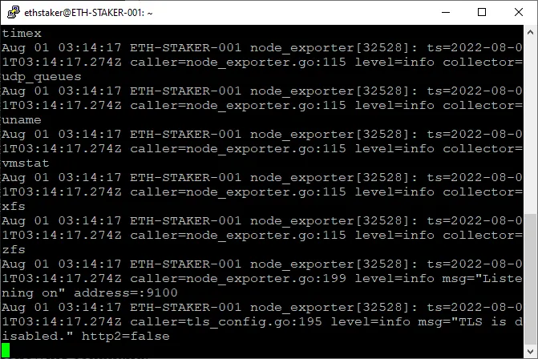

按下<CTRL>+C退出（不会影响node_exporter服务）。

启用node_exporter服务以在重新启动时自动启动。
```shell
$ sudo systemctl enable node_exporter
```

服务已安装。

## 第17步 - 监控：安装Grafana
Grafana提供报告仪表板功能。让我们安装并配置一个仪表板。

下载Grafana的GPG密钥并将其添加到APT源中。
```shell
$ wget -q -O - https://packages.grafana.com/gpg.key | sudo apt-key add -
$ sudo add-apt-repository "deb https://packages.grafana.com/oss/deb stable main"
```

刷新apt缓存。
```shell
$ sudo apt update
```

确保从存储库中安装了Grafana。
```shell
$ apt-cache policy grafana
```

输出应该如下所示：
```shell
grafana:
  Installed: (none)
  Candidate: 9.0.5
  Version table:
     9.0.5 500
        500 https://packages.grafana.com/oss/deb stable/main amd64     
  Packages
     9.0.4 500
        500 https://packages.grafana.com/oss/deb stable/main amd64 
...
```

验证顶部的版本与此处显示的最新版本是否匹配。然后继续安装。
```shell
$ sudo apt install -y grafana
```

启动Grafana服务器并检查状态以确保它正常运行。
```shell
$ sudo systemctl start grafana-server
$ sudo systemctl status grafana-server
```

请参考下面的屏幕截图。它应该显示绿色文本中的"active (running)"。如果没有，则返回并重复步骤以解决问题。


按Q退出（不会影响grafana-server服务）。

使用日志输出通过运行以下命令来检查错误。
```shell
$ sudo journalctl -fu grafana-server
```

请参考下面的屏幕截图。


按下<CTRL>+C退出（不会影响grafana-server服务）。

启用grafana-server服务以在重新启动时自动启动。
```shell
$ sudo systemctl enable grafana-server
```

### 配置Grafana登录
做得很好！现在您已经完成了一切，可以在浏览器中访问`http://<yourserverip>:3000/`，应该会出现Grafana登录界面。

输入admin作为用户名和密码。它会提示您更改密码，您应该确实这样做。

### 配置Grafana数据源
让我们配置一个数据源。将鼠标移动到左侧菜单栏底部的齿轮图标上。将弹出一个菜单 - 选择数据源。或者，直接导航到此处：`http://<yourserverip>:3000/datasources`

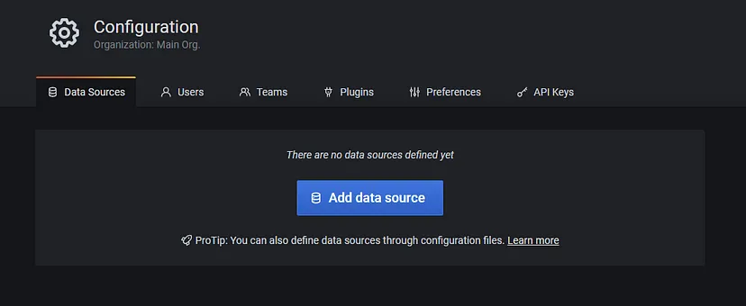

点击"Add data source"，然后选择"Prometheus"。输入"http://localhost:9090"作为URL，然后点击"Save and Test"。

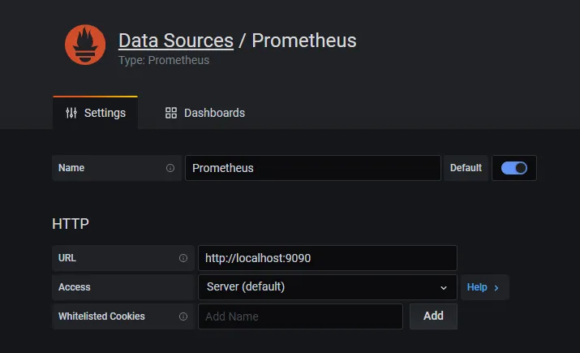

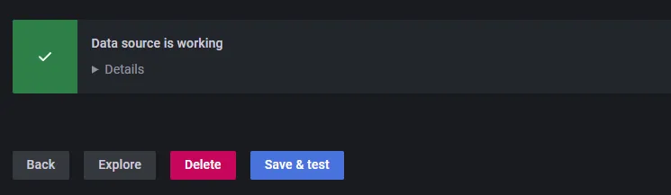


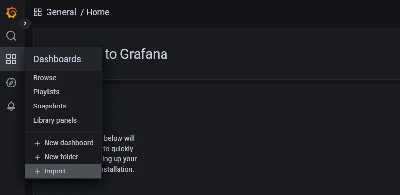


