## 运行环境/工具
### 运行环境
阿里云ECS服务器，配置如下
1. 4核(vCPU) 16 GiB
2. Ubuntu  20.04 64位
3. 系统盘1400G
4. 带宽 8Mbps

开通时长一周，花费386.49元

### 使用工具
- 执行客户端：Geth
- 信标客户端：Prysm
- 远程连接：XShell

## 步骤 1：连接到服务器
```shell
adduser wtno
usermod -aG sudo wtno
rsync --archive --chown=wtno:wtno ~/.ssh /home/wtno
```
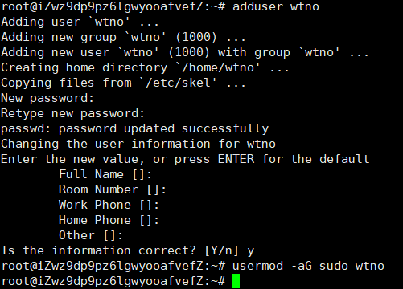

## 步骤 2：更新服务器
```shell
sudo apt -y update && sudo apt -y upgrade
```

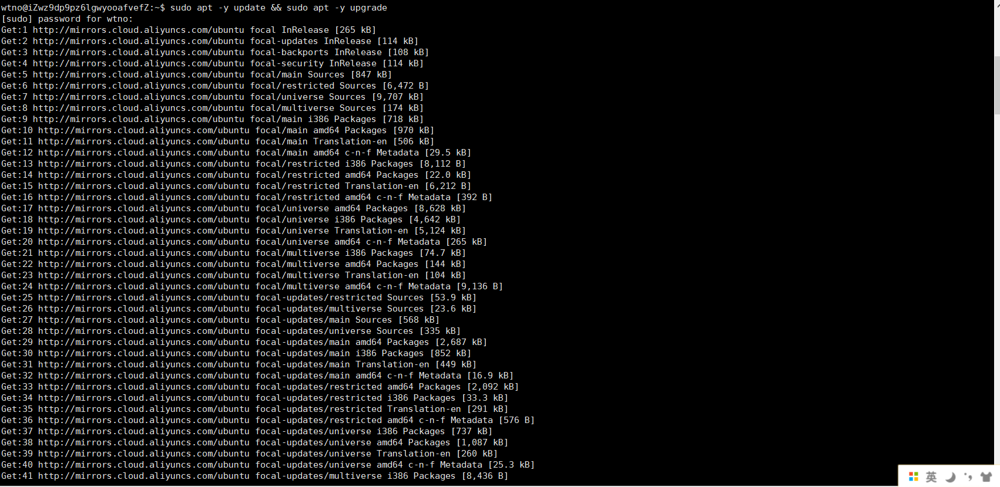

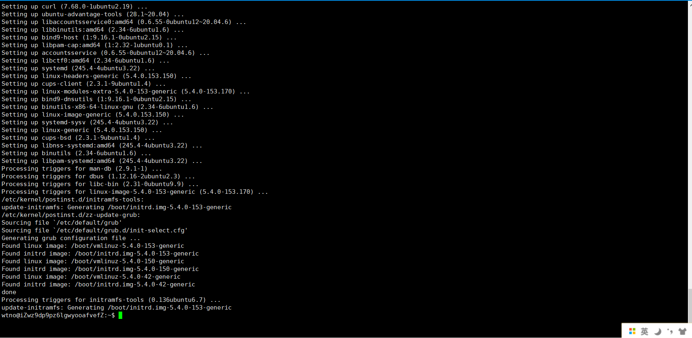

```shell
sudo apt dist-upgrade && sudo apt autoremove
```

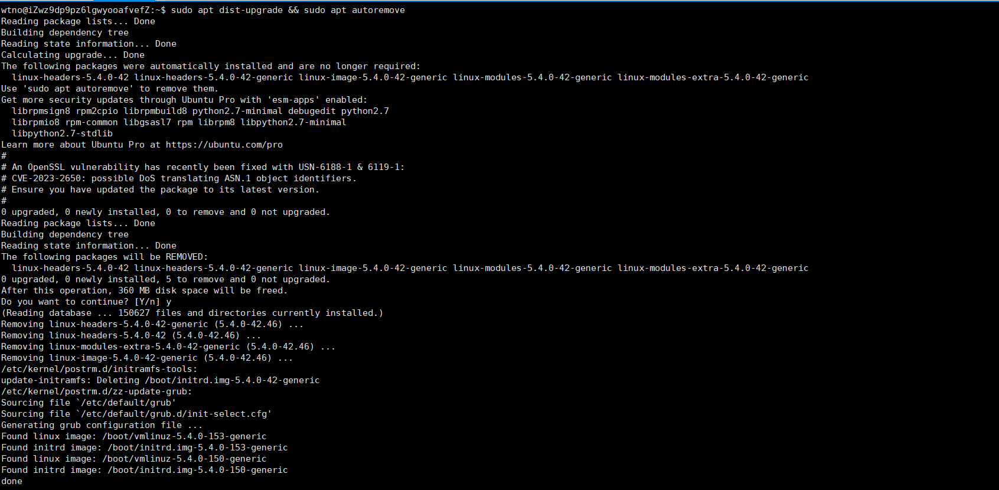

重启
```shell
sudo reboot
```

## 步骤3：保护服务器
### 修改默认的SSH端口
跳过

### 配置防火墙
```shell
$ sudo apt install ufw
$ sudo ufw default deny incoming
$ sudo ufw default allow outgoing
$ sudo ufw allow 22/tcp
$ sudo ufw allow 30303
$ sudo ufw allow 13000/tcp
$ sudo ufw allow 12000/udp
$ sudo ufw allow 3000/tcp
$ sudo ufw enable
$ sudo ufw status numbered
```

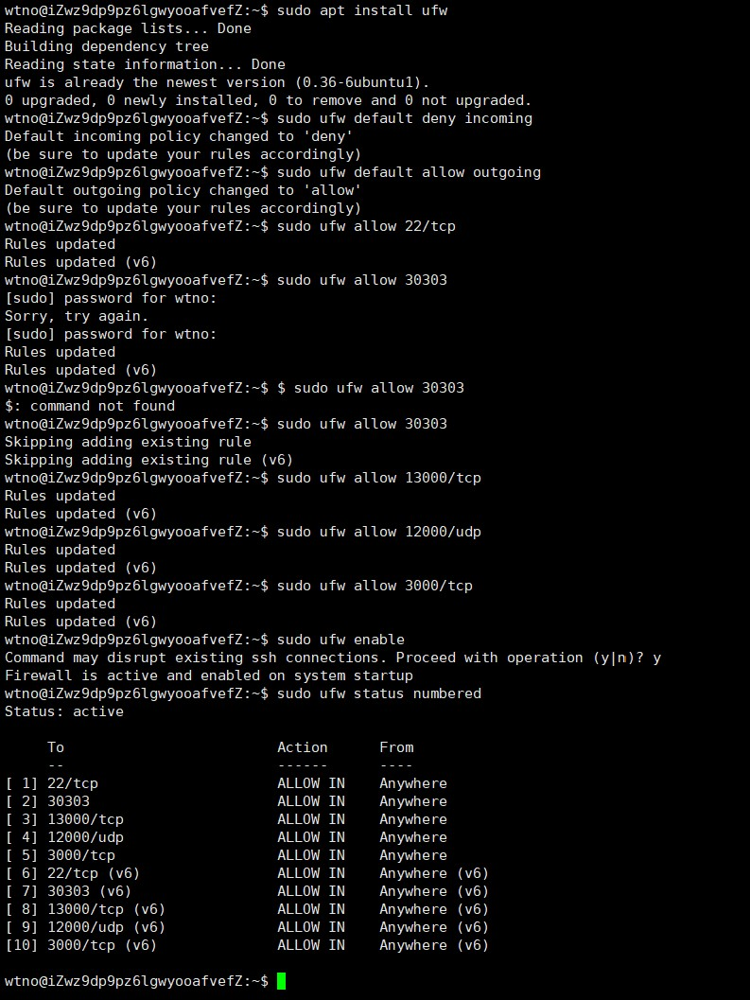


## 步骤4：创建交换空间
```shell
sudo fallocate -l 4G /swapfile
sudo chmod 600 /swapfile
sudo mkswap /swapfile
sudo swapon /swapfile

sudo cp /etc/fstab /etc/fstab.bak
echo '/swapfile none swap sw 0 0' | sudo tee -a /etc/fstab

sudo sysctl vm.swappiness=10
sudo sysctl vm.vfs_cache_pressure=50

sudo nano /etc/sysctl.conf
```

在文件末尾添加
```shell
vm.swappiness=10
vm.vfs_cache_pressure = 50
```

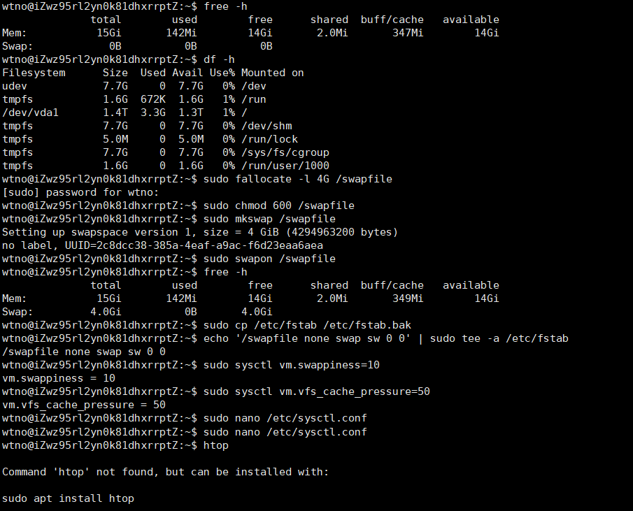

## 步骤5：配置时间同步
```shell
timedatectl #验证它是否正常运行。
```
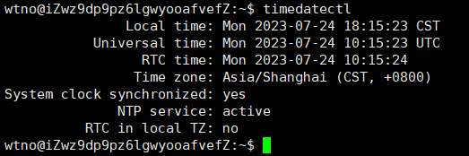

## 步骤6：生成客户端身份验证密钥
```shell
$ sudo mkdir -p /var/lib/jwtsecret
$ openssl rand -hex 32 | sudo tee /var/lib/jwtsecret/jwt.hex > /dev/null
$ sudo nano /var/lib/jwtsecret/jwt.hex #然后按 CTRL + X 退出
```

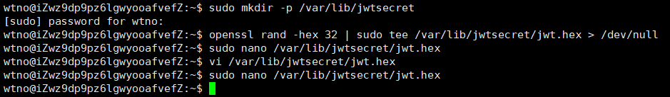

## 步骤7：配置执行客户端Geth
```shell
cd ~
curl -LO https://gethstore.blob.core.windows.net/builds/geth-linux-amd64-1.12.0-e501b3b0.tar.gz

tar xvf geth-linux-amd64-1.12.0-e501b3b0.tar.gz
cd geth-linux-amd64-1.12.0-e501b3b0
sudo cp geth /usr/local/bin

cd ~
rm geth-linux-amd64-1.12.0-e501b3b0.tar.gz
rm -r geth-linux-amd64-1.12.0-e501b3b0

sudo useradd --no-create-home --shell /bin/false geth

sudo mkdir -p /var/lib/geth

sudo chown -R geth:geth /var/lib/geth

sudo nano /etc/systemd/system/geth.service
```

粘贴到文件中
```shell
[Unit]
Description=Geth Execution Client (Goerli Test Network)
After=network.target
Wants=network.target
[Service]
User=geth
Group=geth
Type=simple
Restart=always
RestartSec=5
TimeoutStopSec=600
ExecStart=/usr/local/bin/geth \
  --goerli \
  --datadir /var/lib/geth \
  --authrpc.jwtsecret /var/lib/jwtsecret/jwt.hex \
  --metrics \
  --metrics.addr 127.0.0.1
[Install]
WantedBy=default.target
```

保存后退出，继续执行
```shell
$ sudo systemctl daemon-reload
$ sudo systemctl start geth
$ sudo systemctl status geth
```

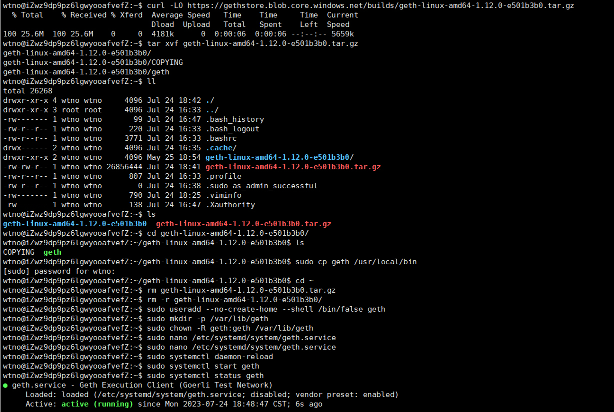

开始同步
```shell
sudo journalctl -fu geth

sudo systemctl enable geth #启用geth服务以在重新启动时自动启动。
```

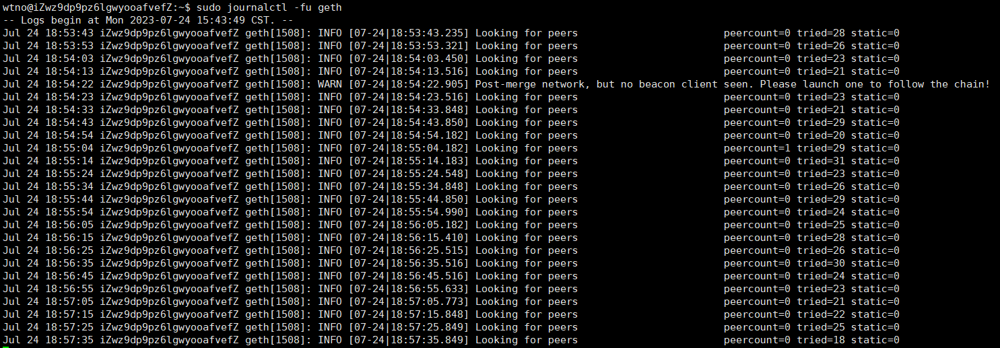

TODO:还是找不到对等节点

## 步骤8：安装Prysm共识客户端
```shell
cd ~
curl -LO https://github.com/prysmaticlabs/prysm/releases/download/v4.0.7/beacon-chain-v4.0.7-linux-amd64
curl -LO https://github.com/prysmaticlabs/prysm/releases/download/v4.0.7/validator-v4.0.7-linux-amd64

mv beacon-chain-v4.0.7-linux-amd64 beacon-chain
mv validator-v4.0.7-linux-amd64 validator
chmod +x beacon-chain
chmod +x validator
sudo cp beacon-chain /usr/local/bin
sudo cp validator /usr/local/bin

rm beacon-chain && rm validator
```

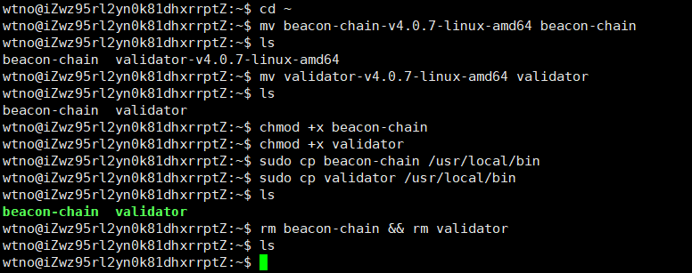

## 步骤9：生成质押数据
```shell
#下载存款工具
cd ~
curl -LO https://github.com/ethereum/staking-deposit-cli/releases/download/v2.3.0/staking_deposit-cli-76ed782-linux-amd64.tar.gz

tar xvf staking_deposit-cli-76ed782-linux-amd64.tar.gz
cd staking_deposit-cli-76ed782-linux-amd64
```

运行存款工具
```shell
./deposit new-mnemonic --num_validators 2 --chain goerli --eth1_withdrawal_address 0x4D496CcC28058B1D74B7a19541663E21154f9c84
```

然后按照教程生成助记词和密钥


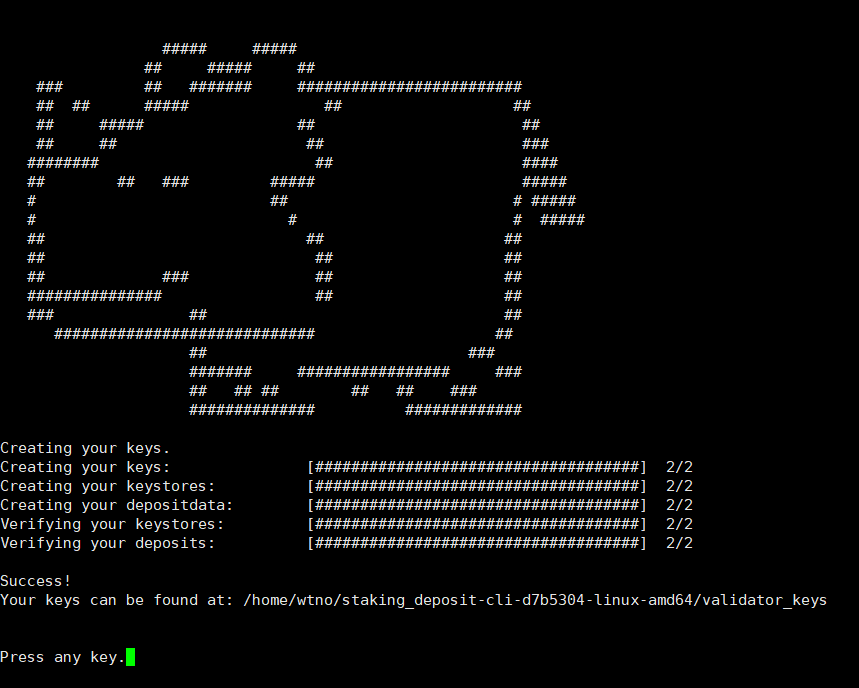

## 步骤10：导入验证者密钥
```shell
# 将验证器密钥库文件导入Prysm
sudo mkdir -p /var/lib/prysm/validator
sudo chown -R wtno:wtno /var/lib/prysm/validator

/usr/local/bin/validator accounts import --keys-dir=$HOME/staking_deposit-cli-d7b5304-linux-amd64/validator_keys --wallet-dir=/var/lib/prysm/validator --goerli
```

接下来按照教程创建一个钱包密码，输入验证器密码，导入密钥

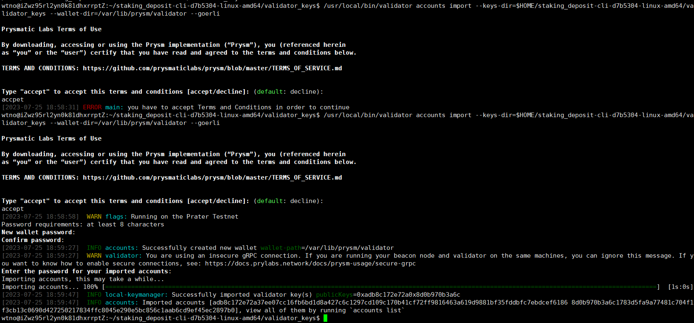

创建钱包密码文件
```shell
sudo nano /var/lib/prysm/validator/password.txt
```
略过不截图

## 步骤11：配置Beacon节点服务
```shell
sudo mkdir -p /var/lib/prysm/beacon
sudo chown -R prysmbeacon:prysmbeacon /var/lib/prysm/beacon

sudo nano /etc/systemd/system/prysmbeacon.service
```

将以下内容粘贴到文件中。
```shell
[Unit]
Description=Prysm Consensus Client BN (Goerli Test Network)
Wants=network-online.target
After=network-online.target

[Service]
User=prysmbeacon
Group=prysmbeacon
Type=simple
Restart=always
RestartSec=5
ExecStart=/usr/local/bin/beacon-chain \
  --goerli \
  --datadir=/var/lib/prysm/beacon \
  --execution-endpoint=http://127.0.0.1:8551 \
  --jwt-secret=/var/lib/jwtsecret/jwt.hex \
  --suggested-fee-recipient=0x5Bc4d6760C24Eb7939d3D28A380ADd2EAfFc55d5 \
  --enable-debug-rpc-endpoints \
  --grpc-max-msg-size=65568081 \
  --checkpoint-sync-url=https://prater-checkpoint-sync.stakely.io \
  --genesis-beacon-api-url=https://prater-checkpoint-sync.stakely.io \
  --accept-terms-of-use

[Install]
WantedBy=multi-user.target
```

重新加载systemd以反映更改并启动服务。检查状态以确保它正常运行。
```shell
sudo systemctl daemon-reload
sudo systemctl start prysmbeacon
sudo systemctl status prysmbeacon

sudo journalctl -fu prysmbeacon
```

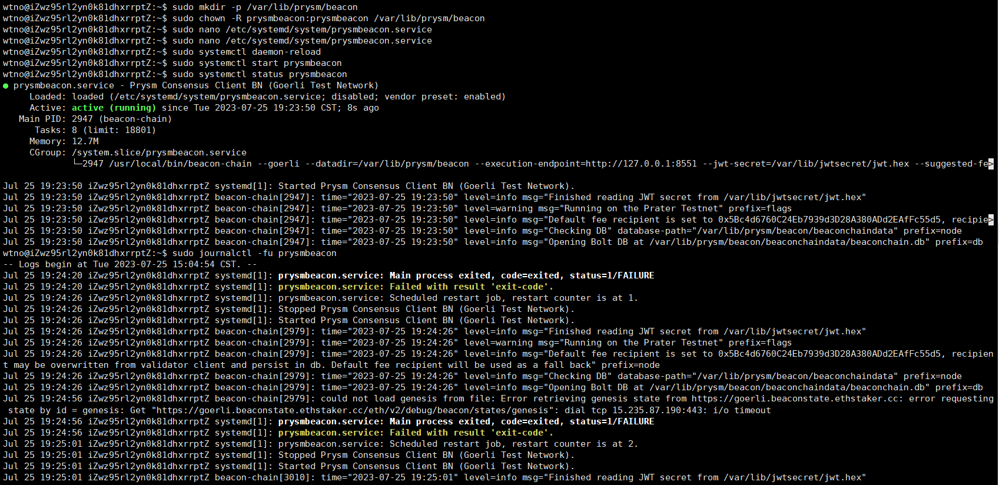

## 步骤12：配置验证器服务
```shell
$ sudo useradd --no-create-home --shell /bin/false prysmvalidator
$ sudo chown -R prysmvalidator:prysmvalidator /var/lib/prysm/validator
$ sudo nano /etc/systemd/system/prysmvalidator.service
```

将以下文件粘贴进去
```shell
[Unit]
Description=Prysm Consensus Client VC (Goerli Test Network)
Wants=network-online.target
After=network-online.target
[Service]
User=prysmvalidator
Group=prysmvalidator
Type=simple
Restart=always
RestartSec=5
ExecStart=/usr/local/bin/validator \
  --datadir=/var/lib/prysm/validator \
  --wallet-dir=/var/lib/prysm/validator \
  --wallet-password-file=/var/lib/prysm/validator/password.txt \
  --graffiti="wtnowtno" \
  --accept-terms-of-use
[Install]
WantedBy=multi-user.target
```

继续执行
```shell
sudo systemctl daemon-reload
sudo systemctl start prysmvalidator
sudo systemctl status prysmvalidator

sudo journalctl -fu prysmvalidator

sudo systemctl enable prysmvalidator
```

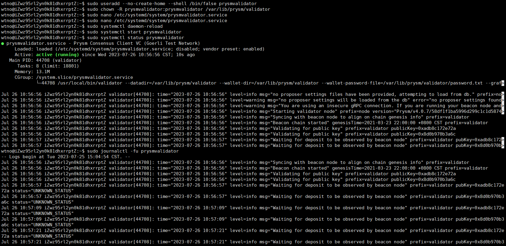

## 步骤12：为验证者提供资金
在`cheap-goerli-validator`输入`cheap-goerli-deposit`命令，会发出仅自己可见的信息，根据提示完成操作
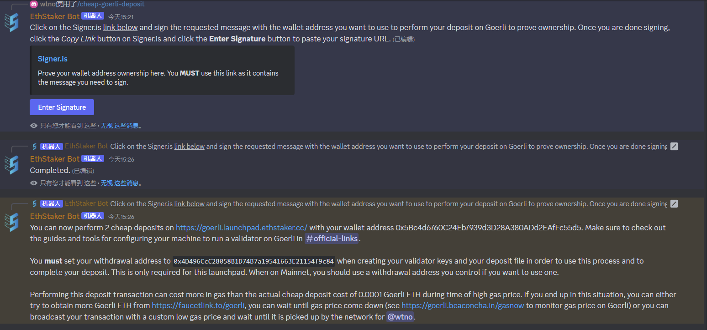
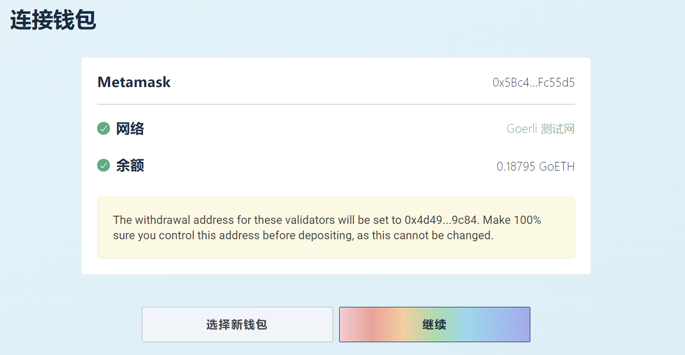
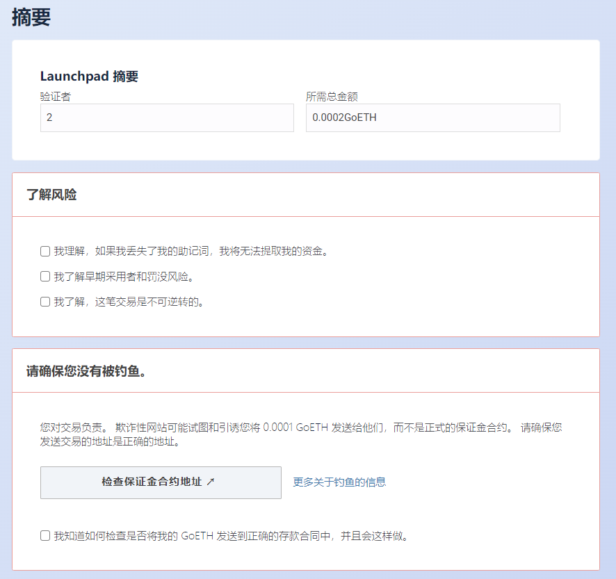
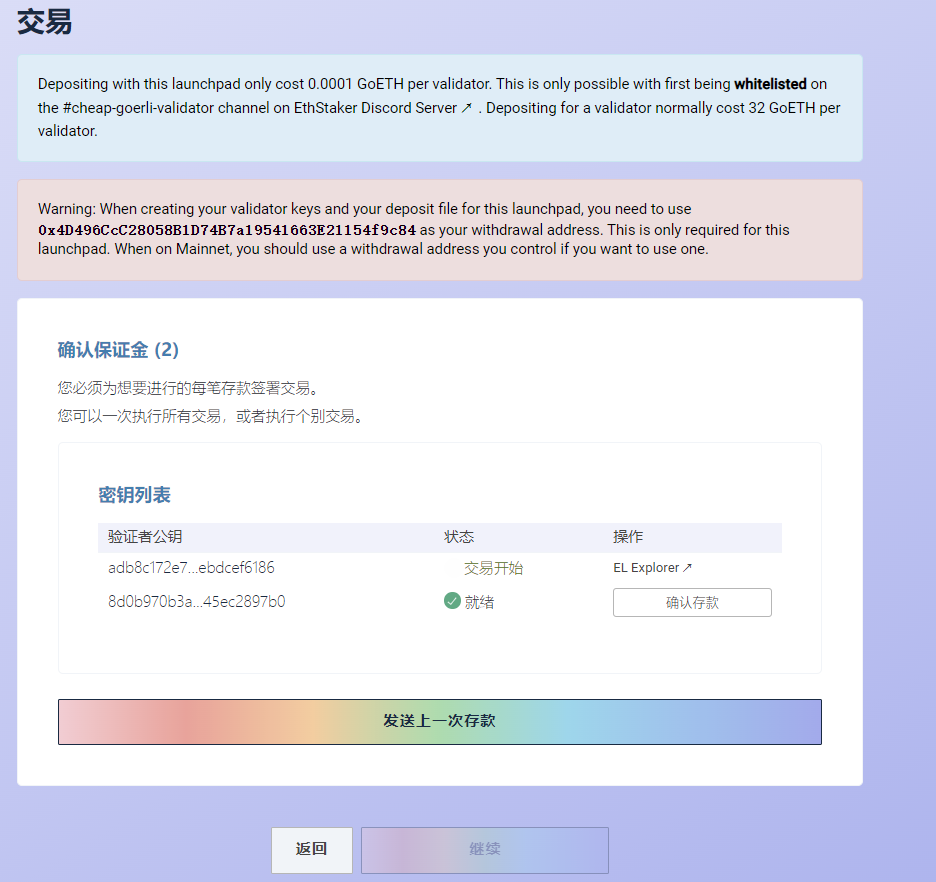


完成后还是不知道有没有问题

## 步骤14：检查您的验证者状态
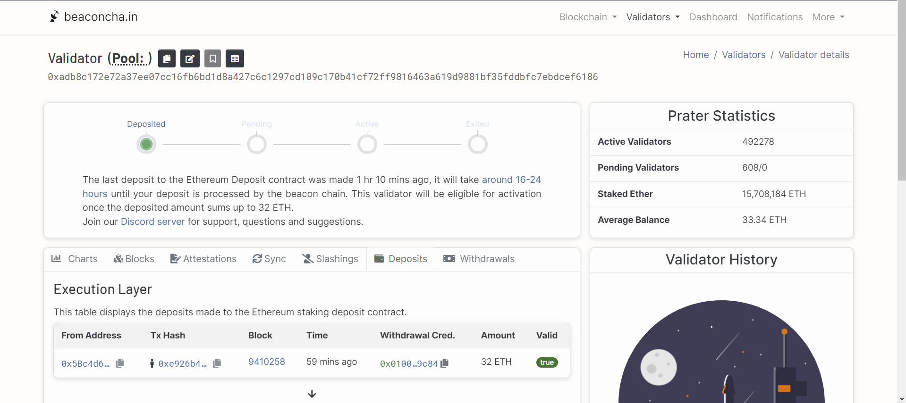

目前状态：
- Geth：一直在同步
- prysmbeacon：一直在警告
    ```shell
    Jul 26 16:45:22 iZwz95rl2yn0k81dhxrrptZ beacon-chain[44589]: time="2023-07-26 16:45:22" level=warning msg="Not connected to ETH1. Cannot determine validator ETH1 deposit block number" prefix="rpc/validator"
    Jul 26 16:45:22 iZwz95rl2yn0k81dhxrrptZ beacon-chain[44589]: time="2023-07-26 16:45:22" level=warning msg="Not connected to ETH1. Cannot determine validator ETH1 deposit block number" prefix="rpc/validator"
    Jul 26 16:45:26 iZwz95rl2yn0k81dhxrrptZ beacon-chain[44589]: time="2023-07-26 16:45:26" level=info msg="Called new payload with optimistic block" payloadBlockHash=0x02f6dd2b65f0 prefix=blockchain slot=6154427
    Jul 26 16:45:26 iZwz95rl2yn0k81dhxrrptZ beacon-chain[44589]: time="2023-07-26 16:45:26" level=info msg="Called fork choice updated with optimistic block" finalizedPayloadBlockHash=0xca7556449bdf headPayloadBlockHash=0x02f6dd2b65f0 headSlot=6154427 prefix=blockchain
    Jul 26 16:45:26 iZwz95rl2yn0k81dhxrrptZ beacon-chain[44589]: time="2023-07-26 16:45:26" level=info msg="Synced new block" block=0xacf7ee58... epoch=192325 finalizedEpoch=192323 finalizedRoot=0xcadbd30d... prefix=blockchain slot=6154427
    Jul 26 16:45:26 iZwz95rl2yn0k81dhxrrptZ beacon-chain[44589]: time="2023-07-26 16:45:26" level=info msg="Finished applying state transition" attestations=128 payloadHash=0x02f6dd2b65f0 prefix=blockchain slot=6154427 syncBitsCount=389 txCount=73
    Jul 26 16:45:34 iZwz95rl2yn0k81dhxrrptZ beacon-chain[44589]: time="2023-07-26 16:45:34" level=warning msg="Not connected to ETH1. Cannot determine validator ETH1 deposit block number" prefix="rpc/validator"
    Jul 26 16:45:34 iZwz95rl2yn0k81dhxrrptZ beacon-chain[44589]: time="2023-07-26 16:45:34" level=warning msg="Not connected to ETH1. Cannot determine validator ETH1 deposit block number" prefix="rpc/validator"
    Jul 26 16:45:37 iZwz95rl2yn0k81dhxrrptZ beacon-chain[44589]: time="2023-07-26 16:45:37" level=info msg="Called new payload with optimistic block" payloadBlockHash=0xb7fcc1a99024 prefix=blockchain slot=6154428
    Jul 26 16:45:37 iZwz95rl2yn0k81dhxrrptZ beacon-chain[44589]: time="2023-07-26 16:45:37" level=info msg="Called fork choice updated with optimistic block" finalizedPayloadBlockHash=0xca7556449bdf headPayloadBlockHash=0xb7fcc1a99024 headSlot=6154428 prefix=blockchain
    Jul 26 16:45:37 iZwz95rl2yn0k81dhxrrptZ beacon-chain[44589]: time="2023-07-26 16:45:37" level=info msg="Synced new block" block=0x9d4b247b... epoch=192325 finalizedEpoch=192323 finalizedRoot=0xcadbd30d... prefix=blockchain slot=6154428
    Jul 26 16:45:37 iZwz95rl2yn0k81dhxrrptZ beacon-chain[44589]: time="2023-07-26 16:45:37" level=info msg="Finished applying state transition" attestations=128 payloadHash=0xb7fcc1a99024 prefix=blockchain slot=6154428 syncBitsCount=388 txCount=17
    Jul 26 16:45:46 iZwz95rl2yn0k81dhxrrptZ beacon-chain[44589]: time="2023-07-26 16:45:46" level=warning msg="Not connected to ETH1. Cannot determine validator ETH1 deposit block number" prefix="rpc/validator"
    Jul 26 16:45:46 iZwz95rl2yn0k81dhxrrptZ beacon-chain[44589]: time="2023-07-26 16:45:46" level=warning msg="Not connected to ETH1. Cannot determine validator ETH1 deposit block number" prefix="rpc/validator"
    Jul 26 16:45:48 iZwz95rl2yn0k81dhxrrptZ beacon-chain[44589]: time="2023-07-26 16:45:48" level=info msg="Peer summary" activePeers=44 inbound=0 outbound=44 prefix=p2p
    Jul 26 16:45:49 iZwz95rl2yn0k81dhxrrptZ beacon-chain[44589]: time="2023-07-26 16:45:49" level=info msg="Called new payload with optimistic block" payloadBlockHash=0xbab1d806bdb8 prefix=blockchain slot=6154429
    Jul 26 16:45:49 iZwz95rl2yn0k81dhxrrptZ beacon-chain[44589]: time="2023-07-26 16:45:49" level=info msg="Called fork choice updated with optimistic block" finalizedPayloadBlockHash=0xca7556449bdf headPayloadBlockHash=0xbab1d806bdb8 headSlot=6154429 prefix=blockchain
    Jul 26 16:45:49 iZwz95rl2yn0k81dhxrrptZ beacon-chain[44589]: time="2023-07-26 16:45:49" level=info msg="Synced new block" block=0x3aa0d127... epoch=192325 finalizedEpoch=192323 finalizedRoot=0xcadbd30d... prefix=blockchain slot=6154429
    Jul 26 16:45:49 iZwz95rl2yn0k81dhxrrptZ beacon-chain[44589]: time="2023-07-26 16:45:49" level=info msg="Finished applying state transition" attestations=128 payloadHash=0xbab1d806bdb8 prefix=blockchain slot=6154429 syncBitsCount=382 txCount=118
    Jul 26 16:45:58 iZwz95rl2yn0k81dhxrrptZ beacon-chain[44589]: time="2023-07-26 16:45:58" level=warning msg="Not connected to ETH1. Cannot determine validator ETH1 deposit block number" prefix="rpc/validator"
    Jul 26 16:45:58 iZwz95rl2yn0k81dhxrrptZ beacon-chain[44589]: time="2023-07-26 16:45:58" level=warning msg="Not connected to ETH1. Cannot determine validator ETH1 deposit block number" prefix="rpc/validator"
    Jul 26 16:46:00 iZwz95rl2yn0k81dhxrrptZ beacon-chain[44589]: time="2023-07-26 16:46:00" level=info msg="Called new payload with optimistic block" payloadBlockHash=0x83af5cd788bd prefix=blockchain slot=6154430
    Jul 26 16:46:00 iZwz95rl2yn0k81dhxrrptZ beacon-chain[44589]: time="2023-07-26 16:46:00" level=info msg="Called fork choice updated with optimistic block" finalizedPayloadBlockHash=0xca7556449bdf headPayloadBlockHash=0x83af5cd788bd headSlot=6154430 prefix=blockchain
    Jul 26 16:46:00 iZwz95rl2yn0k81dhxrrptZ beacon-chain[44589]: time="2023-07-26 16:46:00" level=info msg="Synced new block" block=0x60075679... epoch=192325 finalizedEpoch=192323 finalizedRoot=0xcadbd30d... prefix=blockchain slot=6154430
    Jul 26 16:46:00 iZwz95rl2yn0k81dhxrrptZ beacon-chain[44589]: time="2023-07-26 16:46:00" level=info msg="Finished applying state transition" attestations=128 payloadHash=0x83af5cd788bd prefix=blockchain slot=6154430 syncBitsCount=380 txCount=73
    Jul 26 16:46:10 iZwz95rl2yn0k81dhxrrptZ beacon-chain[44589]: time="2023-07-26 16:46:10" level=warning msg="Not connected to ETH1. Cannot determine validator ETH1 deposit block number" prefix="rpc/validator"
    Jul 26 16:46:10 iZwz95rl2yn0k81dhxrrptZ beacon-chain[44589]: time="2023-07-26 16:46:10" level=warning msg="Not connected to ETH1. Cannot determine validator ETH1 deposit block number" prefix="rpc/validator"
    Jul 26 16:46:14 iZwz95rl2yn0k81dhxrrptZ beacon-chain[44589]: time="2023-07-26 16:46:14" level=info msg="Called new payload with optimistic block" payloadBlockHash=0x9b5f0fe2d565 prefix=blockchain slot=6154431
    Jul 26 16:46:14 iZwz95rl2yn0k81dhxrrptZ beacon-chain[44589]: time="2023-07-26 16:46:14" level=info msg="Called fork choice updated with optimistic block" finalizedPayloadBlockHash=0xca7556449bdf headPayloadBlockHash=0x9b5f0fe2d565 headSlot=6154431 prefix=blockchain
    Jul 26 16:46:15 iZwz95rl2yn0k81dhxrrptZ beacon-chain[44589]: time="2023-07-26 16:46:15" level=info msg="Synced new block" block=0x533a1aa8... epoch=192325 finalizedEpoch=192323 finalizedRoot=0xcadbd30d... prefix=blockchain slot=6154431
    Jul 26 16:46:15 iZwz95rl2yn0k81dhxrrptZ beacon-chain[44589]: time="2023-07-26 16:46:15" level=info msg="Finished applying state transition" attestations=128 payloadHash=0x9b5f0fe2d565 prefix=blockchain slot=6154431 syncBitsCount=385 txCount=49
    ```
- prysmvalidator：输出
    ```shell
    Jul 26 16:47:35 iZwz95rl2yn0k81dhxrrptZ validator[44708]: time="2023-07-26 16:47:35" level=info msg="Waiting for deposit to be observed by beacon node" prefix=validator pubKey=0xadb8c172e72a status="UNKNOWN_STATUS"
    Jul 26 16:47:35 iZwz95rl2yn0k81dhxrrptZ validator[44708]: time="2023-07-26 16:47:35" level=info msg="Waiting for deposit to be observed by beacon node" prefix=validator pubKey=0x8d0b970b3a6c status="UNKNOWN_STATUS"
    ```

还需要再观察一下是否有什么变化

### 当前客户端变化
prysmbeacon客户端不再告警：`"Not connected to ETH1. Cannot determine validator ETH1 deposit block number"`，输出如下：

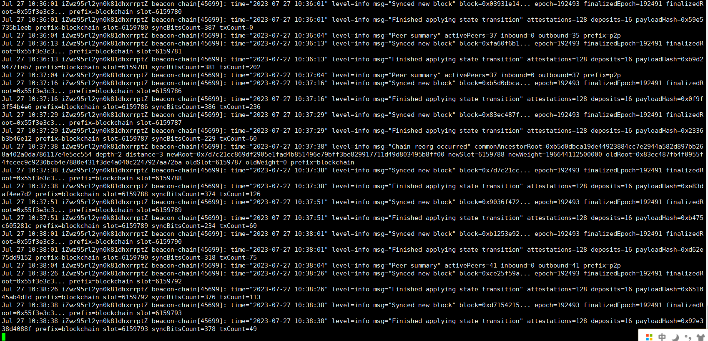

Geth输出如下：

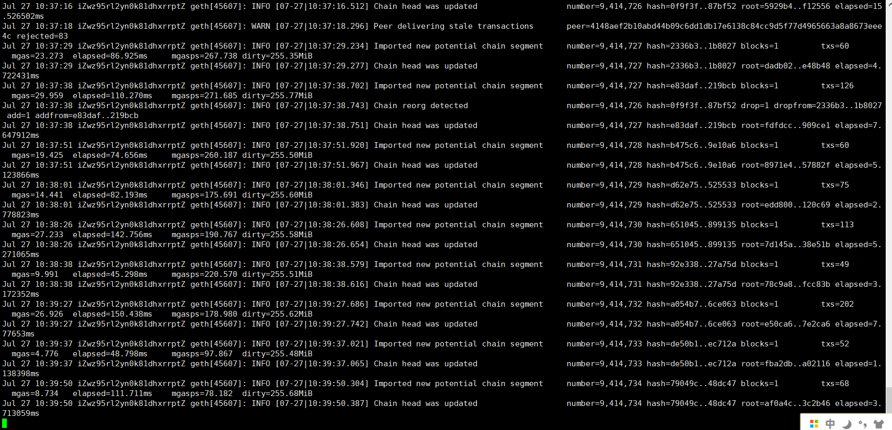

prysmvalidator在输出：`"Jul 27 10:44:26 iZwz95rl2yn0k81dhxrrptZ validator[44708]: time="2023-07-27 10:44:26" level=info msg="Waiting to be assigned activation epoch" expectedWaitingTime=4h28m48s index=528134 positionInActivationQueue=287 prefix=validator pubKey=0xadb8c172e72a status=PENDING
"`，更早时候还是在等待deposit，出现变化可能是因为：

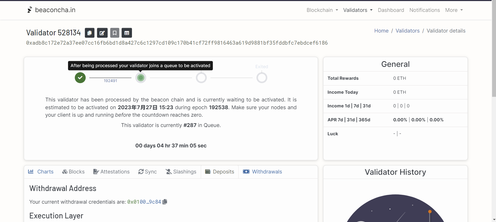

上面显示：这个验证器已经被信标链处理，并目前正在等待激活。预计在2023年7月27日15:23，在第192538个时期激活。请确保在倒计时归零之前您的节点和客户端正常运行。

## 步骤15：监控：安装Prometheus
```shell
cd ~
curl -LO https://github.com/prometheus/prometheus/releases/download/v2.46.0/prometheus-2.46.0.linux-amd64.tar.gz

tar xvf prometheus-2.46.0.linux-amd64.tar.gz
sudo cp prometheus-2.46.0.linux-amd64/prometheus /usr/local/bin/
sudo cp prometheus-2.46.0.linux-amd64/promtool /usr/local/bin/

sudo cp -r prometheus-2.46.0.linux-amd64/consoles /etc/prometheus
sudo cp -r prometheus-2.46.0.linux-amd64/console_libraries /etc/prometheus

rm prometheus-2.46.0.linux-amd64.tar.gz
rm -r prometheus-2.46.0.linux-amd64

sudo useradd --no-create-home --shell /bin/false prometheus
sudo mkdir -p /var/lib/prometheus
sudo nano /etc/prometheus/prometheus.yml
```

将以下内容粘贴进去
```shell
global:
  scrape_interval: 15s
scrape_configs:
  - job_name: prometheus
    static_configs:
      - targets:
          - localhost:9090
  - job_name: node_exporter
    static_configs:
      - targets:
          - localhost:9100
  - job_name: prysm-beacon
    static_configs:
      - targets:
          - localhost:8080
  - job_name: prysm-validator
    static_configs:
      - targets:
          - localhost:8081
  - job_name: besu
    metrics_path: /metrics
    static_configs:
      - targets:
          - localhost:9545
  - job_name: geth
    metrics_path: /debug/metrics/prometheus
    static_configs:
      - targets:
          - localhost:6060
  - job_name: nethermind
    static_configs:
      - targets:
          - localhost:9091
```

继续执行
```shell
sudo chown -R prometheus:prometheus /etc/prometheus
sudo chown -R prometheus:prometheus /var/lib/prometheus

sudo nano /etc/systemd/system/prometheus.service
```

粘贴以下内容
```shell
[Unit]
Description=Prometheus
Wants=network-online.target
After=network-online.target
[Service]
Type=simple
User=prometheus
Group=prometheus
Restart=always
RestartSec=5
ExecStart=/usr/local/bin/prometheus \
--config.file=/etc/prometheus/prometheus.yml \
--storage.tsdb.path=/var/lib/prometheus \
--web.console.templates=/etc/prometheus/consoles \
--web.console.libraries=/etc/prometheus/console_libraries
[Install]
WantedBy=multi-user.target
```

继续执行
```shell
sudo systemctl daemon-reload
sudo systemctl start prometheus
sudo systemctl status prometheus

sudo journalctl -fu prometheus

sudo systemctl enable prometheus
```

运行结果如下：

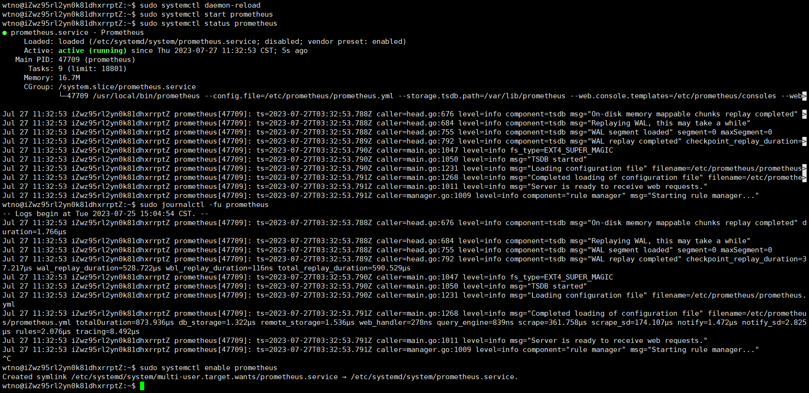

## 步骤16：监控：安装Node Exporter
```shell
cd ~
curl -LO https://github.com/prometheus/node_exporter/releases/download/v1.6.1/node_exporter-1.6.1.linux-amd64.tar.gz

tar xvf node_exporter-1.6.1.linux-amd64.tar.gz
sudo cp node_exporter-1.6.1.linux-amd64/node_exporter /usr/local/bin

rm node_exporter-1.6.1.linux-amd64.tar.gz
rm -r node_exporter-1.6.1.linux-amd64

sudo useradd --no-create-home --shell /bin/false node_exporter

sudo nano /etc/systemd/system/node_exporter.service
```

将以下内容粘贴进去
```shell
[Unit]
Description=Node Exporter
Wants=network-online.target
After=network-online.target
[Service]
User=node_exporter
Group=node_exporter
Type=simple
Restart=always
RestartSec=5
ExecStart=/usr/local/bin/node_exporter
[Install]
WantedBy=multi-user.target
```

继续执行
```shell
sudo systemctl daemon-reload
sudo systemctl start node_exporter
sudo systemctl status node_exporter

sudo journalctl -fu node_exporter

sudo systemctl enable node_exporter
```

执行结果如下：


