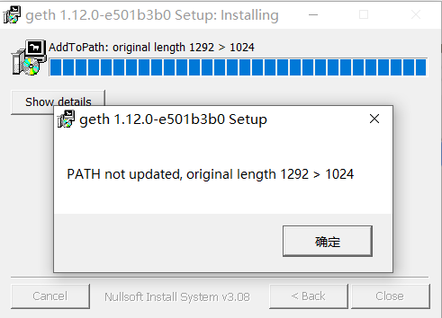
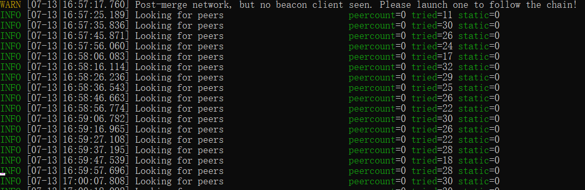
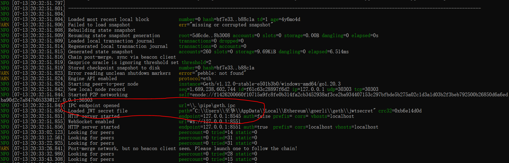
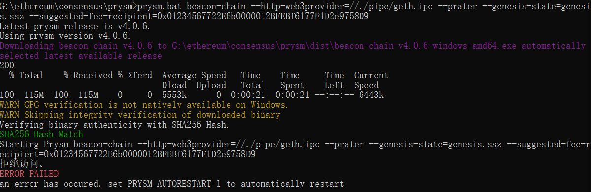
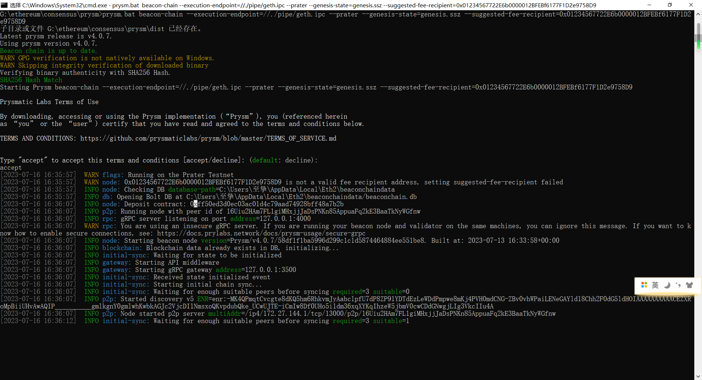

### 安装geth出现以下错误

解决方法：手动添加geth的安装目录到系统变量Path

### 运行命令 geth --goerli --http --http.api eth,net,engine,admin 
出现以下问题

问题原因：当 Geth 在合并后权益证明网络上没有共识客户端的情况下运行时，会发出上述消息。 由于以太坊转向权益证明，仅靠 Geth 不足以跟踪链，因为共识逻辑现在由称为共识客户端的单独软件实现。 缺少共识客户端时会显示此日志消息。

###  运行 `curl https://raw.githubusercontent.com/prysmaticlabs/prysm/master/prysm.bat --output prysm.bat` 出现以下错误：

    Could not resolve host: raw.githubusercontent.com

解决方法：修改hosts文件，加入以下映射
185.199.108.133 raw.githubusercontent.com

### 运行 `curl https://raw.githubusercontent.com/prysmaticlabs/prysm/master/prysm.bat --output prysm.bat` 出现以下错误：

    Recv failure: Connection was reset

解决方法：关闭VPN

### 步骤4中的命令<your.ipc>应该替换为什么
启动geth时输出如下

将<your.ipc>替换为geth.ipc后成功启动

### 使用Prysm运行信标节点报错，如上图所示
解决方法：之前报错的原因好像是因为被拦截了

### Prysm运行信标节点报错 `flag provided but not defined: -http-web3provider`

解决方法：将命令中的`--http-web3provider`修改为`--execution-endpoint`

运行结果如下：

