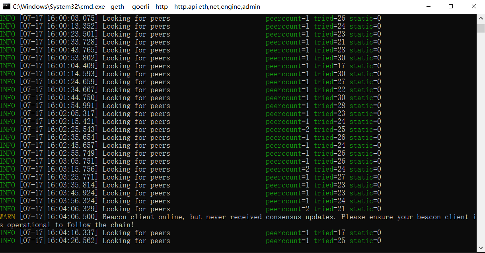
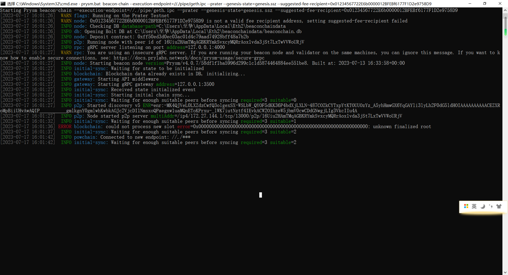
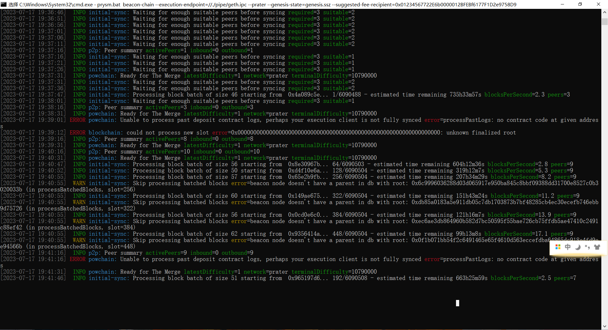
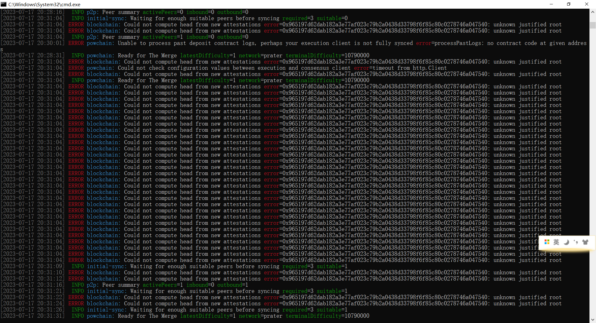
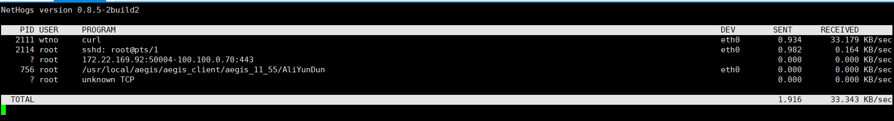

### 安装geth出现以下错误


解决方法：手动添加geth的安装目录到系统变量Path

### 运行命令 geth --goerli --http --http.api eth,net,engine,admin 
出现以下问题


问题原因：当 Geth 在合并后权益证明网络上没有共识客户端的情况下运行时，会发出上述消息。 由于以太坊转向权益证明，仅靠 Geth 不足以跟踪链，因为共识逻辑现在由称为共识客户端的单独软件实现。 缺少共识客户端时会显示此日志消息。

###  运行 `curl https://raw.githubusercontent.com/prysmaticlabs/prysm/master/prysm.bat --output prysm.bat` 出现以下错误：

    Could not resolve host: raw.githubusercontent.com

解决方法：修改hosts文件，加入以下映射
185.199.108.133 raw.githubusercontent.com

### 运行 `curl https://raw.githubusercontent.com/prysmaticlabs/prysm/master/prysm.bat --output prysm.bat` 出现以下错误：

    Recv failure: Connection was reset

解决方法：关闭VPN

### 步骤4中的命令<your.ipc>应该替换为什么
启动geth时输出如下


将<your.ipc>替换为geth.ipc后成功启动


### 使用Prysm运行信标节点报错，如上图所示
解决方法：之前报错的原因好像是因为被拦截了

### Prysm运行信标节点报错 `flag provided but not defined: -http-web3provider`


解决方法：将命令中的`--http-web3provider`修改为`--execution-endpoint`

运行结果如下：


### 关闭VPN后运行结果有所不同



### Geth 根本无法连接到对等点
造成这种情况的常见原因有：
- 当地时间可能不正确。参与以太坊网络需要精确的时钟。可以使用sudo ntpdate -s time.nist.gov等命令重新同步本地时钟（这将根据操作系统而有所不同）。
- 某些防火墙配置可以禁止 UDP 流量。可以使用控制台上的静态节点功能或admin.addPeer()手动配置连接。
- 在轻量模式下运行 Geth通常会导致连接问题，因为运行轻量服务器的节点很少。除了将 Geth 退出光照模式之外，没有简单的解决办法。请注意，轻型模式目前不适用于权益证明网络。
- Geth 所连接的公共测试网络可能已被弃用，或者活动节点数量较少且难以找到。在这种情况下，最好的措施是切换到替代测试网络。

没找到解决办法

### 修改了一下geth启动命令，指定了datadir，如下
```shell
geth --goerli --http --http.api eth,net,engine,admin --datadir d:\EthereumData
```

### prysm启动后有了新的输出内容，如下


### prysm报错


### 云服务器下载速度巨慢


解决办法：下载到本地使用Xftp上传到服务器

### prysmbeacon日志中报错
```shell
Jul 25 19:24:56 iZwz95rl2yn0k81dhxrrptZ beacon-chain[2979]: could not load genesis from file: Error retrieving genesis state from https://goerli.beaconstate.ethstaker.cc: error requesting state by id = genesis: Get "https://goerli.beaconstate.ethstaker.cc/eth/v2/debug/beacon/states/genesis": dial tcp 15.235.87.190:443: i/o timeout
Jul 25 19:24:56 iZwz95rl2yn0k81dhxrrptZ systemd[1]: prysmbeacon.service: Main process exited, code=exited, status=1/FAILURE
Jul 25 19:24:56 iZwz95rl2yn0k81dhxrrptZ systemd[1]: prysmbeacon.service: Failed with result 'exit-code'.

```


